<nav id="quick" style="position:fixed;top:150px;right:100px;width:200px;height:auto;overflow:hidden;z-index:999;background-color:rgba(255,255,255,0.75);">
	<label for="chap1" style="color:black;font-size:28px;">1. sts 설치</label>
	<input type="radio" name="chap" id="chap1" style="display:none;">
	<ul class="menu">
		<li><a href="#1-1" style="color:black;font-size:20px;text-decoration:none;">1-1. sts 다운로드 및 설치</a></li>
		<li><a href="#1-2" style="color:black;font-size:20px;text-decoration:none;">1-2. Lombok 설치</a></li>
		<li><a href="#1-3" style="color:black;font-size:20px;text-decoration:none;">1-3. sts 설정</a></li>
		<li><a href="#1-4" style="color:black;font-size:20px;text-decoration:none;">1-4. Dynamic Web Project 를 Maven Project로 변환하기</a></li>
		<li><a href="#1-5" style="color:black;font-size:20px;text-decoration:none;">1-5. 프로젝트 환경 설정하기</a></li>
		<li><a href="#1-6" style="color:black;font-size:20px;text-decoration:none;">1-6. sts에 Spring Legacy Project 템플릿 추가하기</a></li>
		<li><a href="#1-7" style="color:black;font-size:20px;text-decoration:none;">1-7. sts에서 Spring Legacy Project 바로 추가하기</a></li>
		<li><a href="#1-8" style="color:black;font-size:20px;text-decoration:none;">1-8. Spring Legacy Project 환경 설정하기</a></li>
	</ul>
	<hr>
	<label for="chap2" style="color:black;font-size:28px;">2. 애플리케이션 개발</label>
	<input type="radio" name="chap" id="chap2" style="display:none;">
	<ul class="menu">
		<li><a href="#2-1" style="color:black;font-size:20px;text-decoration:none;">2-1. 애플리케이션 설정하기</a></li>
		<li><a href="#2-2" style="color:black;font-size:20px;text-decoration:none;">2-2. 영속 계층 개발작업하기</a></li>
		<li><a href="#2-3" style="color:black;font-size:20px;text-decoration:none;">2-3. Service 작성하기</a></li>
		<li><a href="#2-4" style="color:black;font-size:20px;text-decoration:none;">2-4. Controller 작성하기</a></li>
		<li><a href="#2-5" style="color:black;font-size:20px;text-decoration:none;">2-5. View(jsp) 작성하기</a></li>
	</ul>	
</nav>

<div id="1"></div>

# 1. sts 설치

<div id="1-1"> <a href="#quick">목차로</a> </div>

## 1-1. sts 다운로드 및 설치

**(1) 다운로드 페이지로 이동** ☞ [sts다운로드링크](https://github.com/spring-attic/toolsuite-distribution/wiki/Spring-Tool-Suite-3)


**(2) 아래와 같은 화면이 나올 때까지 스크롤합니다.**


<br>


<br>

**(3) 압축 파일을 원하는 폴더로 이동후에 이름을 sts.zip으로 변경하고, 아래 그림과 같이 진행합니다.**


<br>

**(4) 압축풀기가 끝나면 아래 그림과 같이 \sts\sts-bundle\sts-3.9.18RELEASE 폴더로 이동합니다.**


<br><br>

<div id="1-2"><a href="#quick">목차로</a></div>

## 1-2. Lombok 설치

<span style="color:red;font-weight:bold;font-size:24px">※ Lombok을 활용하면, DTO 클래스에 getter/setter/toString/Constructor 의 정의가 필요 없게 되어 프로젝트 진행시 개발 시간을 단축시킬 수 있습니다.</span> 

**(1) DTO 생성을 위한 Lombok.jar를 설치하기 위해 mvnrepository 페이지로 이동합니다.**


<br>

**(2) Lombok을 검색하여 찾아 해당 카테고리를 클릭하고, 상세 페이지로 이동합니다.**


<br>

**(3) Lombok의 Archive 목록에서 원하는 버전을 클릭하여 선택합니다.**


<br>

**(4) jar 파일을 다운로드합니다.**


<br>

**(5) download 폴더로 이동하여 다운로드된 lombok-1.18.22.jar파일을 찾아 파일의 이름을 lombok.jar로 변경합니다.**


<br>

**(6) lombok.jar 파일을 잘라내기하여 sts가 설치된 폴더로 붙여넣기 합니다.**

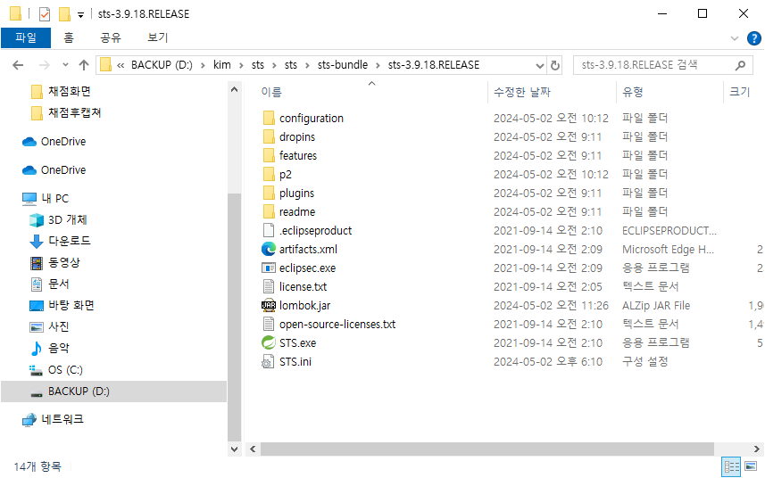

<br>

**(7) cmd(명령 프롬프트)를 관리자모드로 실행합니다.**


<br>

**(8) 해당 디렉토리로 이동 후에 java의 jar 명령으로 lombok.jar의 압축을 풀면서 실행을 시킵니다.**


<br>

**(9) lombok 설치 화면에서 [Specify location] 버튼을 클릭합니다.**


<br>

**(10) sts가 설치된 디렉토리 및 STS.exe 파일의 경로를 지정합니다.**


<br>

**(11) 경로지정이 끝나면 설치를 진행합니다.**


<br>

**(12) 설치가 모두 마치면, Lombok 설치를 종료합니다.**


<br><br><br>

<div id="1-3"><a href="#quick">목차로</a></div>

## 1-3. sts 설정

**(1) sts의 바로가기 아이콘을 바탕화면에 만들어 실행합니다.**


<br>

**(2) 프로젝트의 디렉토리인 워크스페이스 디렉토리를 지정합니다.**


<br>

**(3) Dash 보드 패널을 닫습니다.**


<br>

**(4) [Windows]-[Properties] 메뉴를 통하여 환경 설정 화면으로 이동합니다.**


<span style="color:red;font-weight:bold;font-size:24px">※ 워크스페이스를 변경시에는 환경 설정을 다시 해야합니다.</span> 

<br>

**(5) 워크스페이스의 인코딩을 설정합니다.**


<br>

**(6) 자바 컴파일러를 설정합니다.**


<br>

**(7) JRE를 설정합니다.**


<br>

**(8) CSS의 인코딩 방식을 설정합니다.**


<br>

**(9) HTML의 인코딩 방식을 설정합니다.**


<br>

**(10) JSP의 인코딩 방식을 설정합니다.**


<br>

**(11) JSP 템플릿을 수정하도록 합니다.**

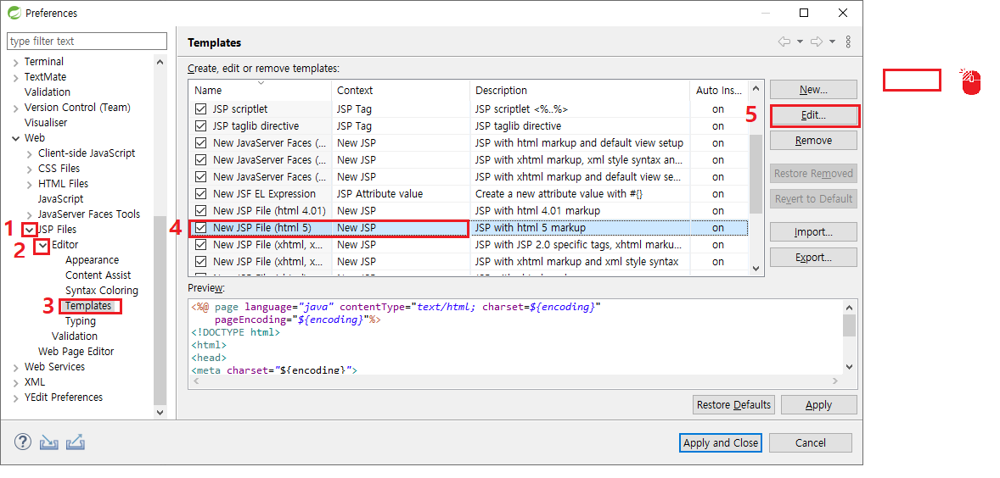

<span style="color:red;font-weight:bold;font-size:24px">※ JSP 템플릿을 수정하게 되면, 매번 번거롭게 하는 일들을 줄일 수가 있습니다.</span> 

<br>

**(12) JSP 템플릿의 내용을 수정합니다.** 


아래는 템플릿에 추가할 내용입니다.

```html
    <meta name="viewport" content="width=device-width, initial-scale=1.0">
    <meta name="title" content="애플리케이션 제목">
    <meta name="application-name" content="애플리케이션 이름">
    <meta name="author" content="애플리케이션 제작자 이름">
    <meta name="description" content="애플리케이션 설명">
    <meta name="keywords" content="애플리케이션 검색어 열거">
    <meta property="og:url" content="애플리케이션 URL" />
    <meta property="og:type" content="website" />
    <meta property="og:title" content="애플리케이션 제목" />
    <meta property="og:description" content="애플리케이션 설명" />
    <meta property="og:image" content="애플리케이션 메인 이미지 경로" />
```

<br>

**(13) Server 를 설정합니다.**


<br>

**(14) 사용할 Server로 Tomcat Server 를 지정합니다.**

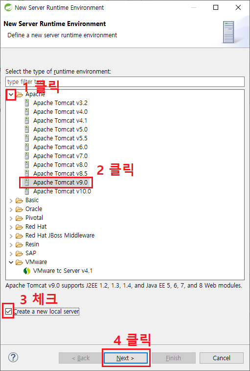

<span style="color:red;font-weight:bold;font-size:24px">※ Create a new local server 항목을 체크하지 않으면, Servers 패널에 나타나지 않으니 꼭 체크해 두시기 바랍니다.</span> 

<br>

**(15) 기존에 설치된 tomcat 9을 Server 로 지정합니다.**


<br>

**만약, tomcat이 설치되지 않았다면, 아래 작업을 먼저 진행하고, (15)번 작업을 진행하시기 바랍니다.**

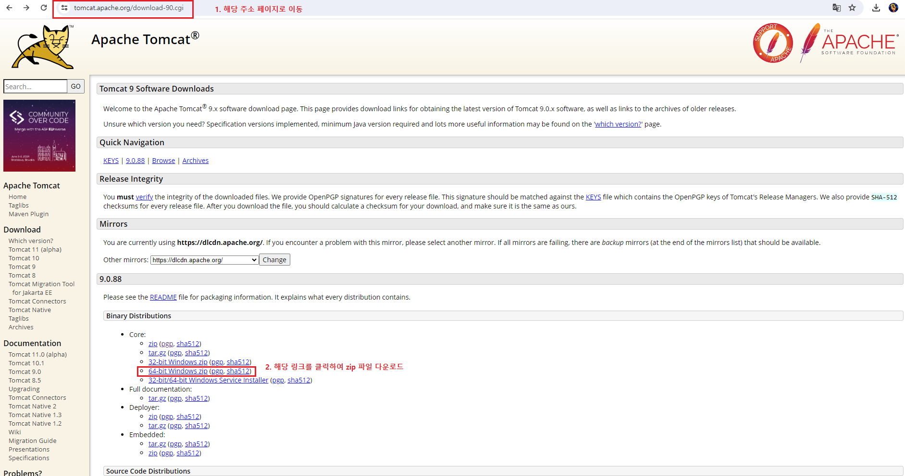

**아파치톰캣 다운로드 페이지** [TOMCAT9](https://tomcat.apache.org/download-90.cgi)

**다운로드 받은 apache-tomcat-9.0.88-windows-x64.zip 파일을 원하는 곳으로 이동 후 압축을 해제합니다.**

<br>

**(16) 불필요한 VMWare Server를 제거하고, sts 설정을 종료합니다.**


<br><br><br>

<div id="1-4"><a href="#quick">목차로</a></div>

## 1-4. Dynamic Web Project 를 Maven Project로 변환하기

**(1) Dynamic Web Project 를 새롭게 추가합니다.**


<br>

**(2) Project 의 기본 정보를 입력하고 설정합니다.**

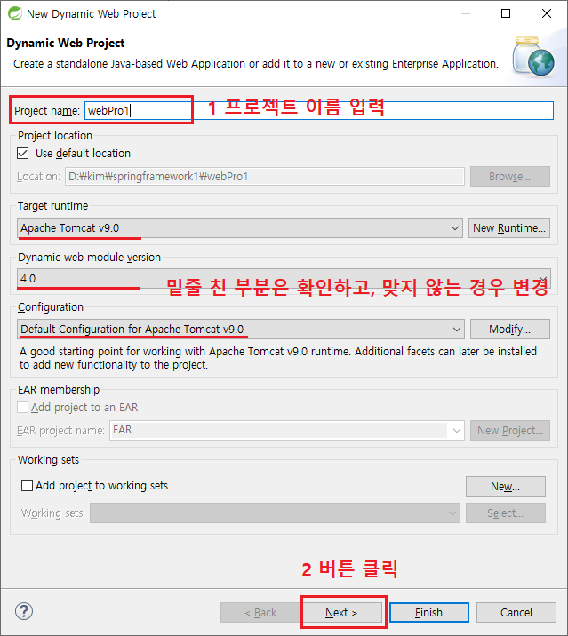

<br>

**(3) Project 에서 활용될 디렉토리 설정과 배포할 파일이 존재할 출력 디렉토리를 지정합니다.**


<br>

**(4) Project 에서 사용할 웹 모듈과 설정 방식을 지정합니다.**

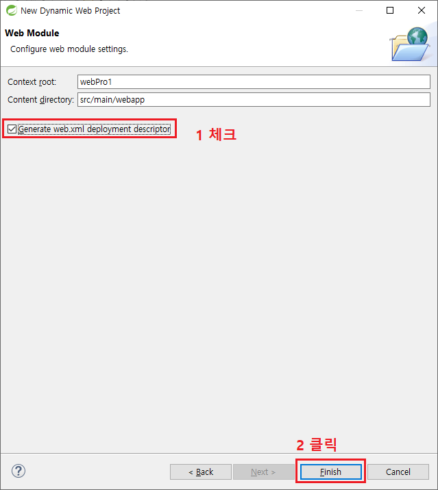

<span style="color:red;font-weight:bold;font-size:24px">※ Create web.xml deployment descriptor 항목을 체크하지 않으면, 수동으로 만드는 수고를 해야 하니 꼭 체크하시기 바랍니다.</span> 

<br>

**(5) sts에서 Dynamic Web Project를 추가하게 되면, JSP/Servlet 개발 환경에 적합한 화면으로 변경하겠다는 메시지가 출력됩니다.**


<br><br>

**(6) Dynamic Web Project를 Maven Project 로 변환합니다.**


<br>

**(7) Maven Project 로 변환시 프로젝트의 그룹아이디와 저작아이디 그리고, 패키징 방식 등을 지정합니다.**


<br><br><br>

<div id="1-5"><a href="#quick">목차로</a></div>

## 1-5. 프로젝트 환경 설정하기

**(1) 프로젝트 환경을 설정창을 불러옵니다.**


<br>

**(2) 프로젝트의 인코딩 방식을 지정합니다.**


<br>

**(3) 프로젝트에서 사용할 자바 컴파일러를 설정합니다.**


<br>

**(4) 프로젝트의 프론트엔드/백엔드 웹 환경을 설정합니다.**


<br>

**(5) 프로젝트에서 사용할 JRE 환경을 지정합니다.**


<br>

**(6) 프로젝트에서 사용할 JRE 환경을 불러옵니다.**


<br>

**(7) 프로젝트에서 사용할 JRE 환경을 선택합니다.**


<br>

**(8) 프로젝트에서 사용하지 않는 JRE 환경을 제거하고, 환경 설정을 종료합니다.**


<br>

**(9) 프로젝트 개발작업을 시작합니다.**


<span style="color:red;font-weight:bold;font-size:24px"> ※ 위와 같이 Dynamic Web Project에서 Spring Legacy Project 변환하여 작성하게 되면, 모두 수동 설정 작업을 해야 하므로, 상당히 설정에 너무 시간이 소요된다. 그래서 이번에는 아래 화면들은 Spring Legacy Project 직접 만드는 것이 편합니다.</span>

<br><br><br>

<div id="1-6"><a href="#quick">목차로</a></div>

## 1-6. sts에 Spring Legacy Project 템플릿 추가하기

<br>

**(1) Spring Legacy Project 를 새롭게 추가합니다.**


<br>

**(2) 현재는 Spring Legacy Project 템플릿이 없는 상황입니다.**

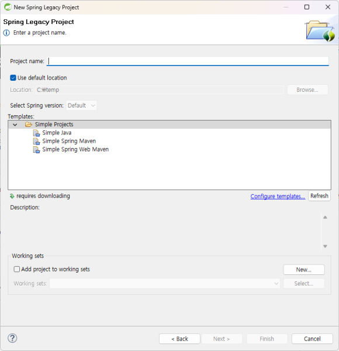

**(3) 새로운 템플릿 추가작업을 위해 sts를 종료합니다.**

<br>

### 그런데 위에서 본바와 같이 2024년 되자 sts에서 Spring Legacy Project 를 만들 수 있는 템플릿이 사라졌다. 그래서 별도의 템플릿 추가 작업을 진행하여 프로젝트를 생성해야 합니다.

<br>

**https-content.xml 다운로드 링크** ☞
<a href="https-content.xml" download>https-content.xml 다운로드 받기</a>

<br>

**(4) Spring Legacy Project 템플릿 추가 작업을 진행합니다.**


<br>

**(5) sts를 다시 재기동합니다.**

<br>

**(6) Spring Legacy Project 를 새롭게 추가합니다.**


<br>

**(7) 화면 처럼 없던 템플릿이 추가된 것을 확인합니다.**

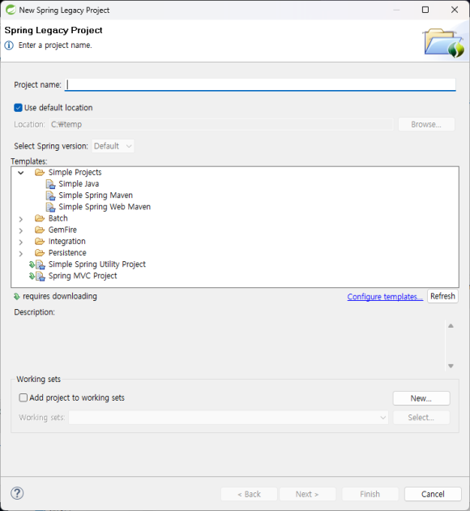

<br><br><br>

<div id="1-7"><a href="#quick">목차로</a></div>

## 1-7. sts에서 Spring Legacy Project 바로 추가하기

**(1) 메뉴에서 Spring Legacy Project를 새롭게 추가합니다.**


<br>

**(2) 프로젝트의 이름을 입력하고, Spring MVC Project를 선택합니다.**


<br>

**(3) 메시지 창에서 [Yes] 버튼을 누릅니다.**


<br>

**(4) 프로젝트의 이름을 확인하고, Spring MVC Project를 선택합니다.**


<br>

**(5) 메인 패키지의 이름을 입력합니다.**


<br>

**(6) 추가된 프로젝트의 내용을 상세하게 확인합니다.**


<br><br><br>

<div id="1-8"><a href="#quick">목차로</a></div>

## 1-8. Spring Legacy Project 환경 설정하기

**(1) 프로젝트 환경을 설정창을 불러옵니다.**


<br>

**(2) 프로젝트의 인코딩 방식을 지정합니다.**


<br>

**(3) 프로젝트에서 사용할 자바 컴파일러를 설정합니다.**


<br>

**(4) 프로젝트의 프론트엔드/백엔드 웹 환경을 설정합니다.**


<br>

**(5) 프로젝트에서 사용할 JRE 환경을 지정합니다.**


<br>

**(6) 프로젝트에서 사용할 JRE 환경을 불러옵니다.**


<br>

**(7) 프로젝트에서 사용할 JRE 환경을 선택합니다.**


<br>

**(8) 프로젝트에서 사용하지 않는 JRE 환경을 제거하고, 환경 설정을 종료합니다.**


<br><br><hr><br><br>

<div id="2"></div>

# 2. 애플리케이션 개발

<div id="2-1"><a href="#quick">목차로</a></div>

<br>

**주요 어노테이션 설명**

| 주요 어노테이션 | 설명 |
|---------------|-------------------------------------------------------------------------------|
| @Controller | 해당 클래스가 웹 어플리케이션 요청을 처리하는 컨트롤러임을 나타내는 어노테이션이다. |
| @Component | 스프링 IoC 컨테이너가 해당 클래스를 자동으로 빈으로 인식하고, 필요한 곳에 주입하거나 관리할 수 있게 하는 어노테이션이다. |
| @Service | 해당 클래스가 비즈니스 로직을 담당하는 서비스 계층 구성 요소임을 알려주는 어노테이션이다. |
| @Repository | 데이터 액세스 계층의 구성 요소를 다루는 어노테이션이다. |


## 2-1. 애플리케이션 설정하기

<div id="2-1-1"></div>

### 2-1-1. 프로젝트 관리자 역할을 하는 POM.xml 의존성 등록하기

**아래 화면과 같이 pom.xml 파일을 열고 작성을 완료하도록 합니다.**

#### 2-1-1-1. MySQL의 예


```xml
<project xmlns="http://maven.apache.org/POM/4.0.0" xmlns:xsi="http://www.w3.org/2001/XMLSchema-instance" 
	xsi:schemaLocation="http://maven.apache.org/POM/4.0.0 https://maven.apache.org/xsd/maven-4.0.0.xsd">
  <modelVersion>4.0.0</modelVersion>
  <groupId>com.spring1</groupId>
  <artifactId>myapp</artifactId>
  <version>0.0.1-SNAPSHOT</version>
  <packaging>war</packaging>
  <properties>
  	<java-version>11</java-version>
  	<org.springframework-version>5.0.8.RELEASE</org.springframework-version>
  	<org.aspectj-version>1.8.10</org.aspectj-version>
  	<org.slf4j-version>1.7.25</org.slf4j-version>
  </properties>
  <dependencies>
		<dependency>
			<groupId>org.springframework</groupId>
			<artifactId>spring-context</artifactId>
			<version>${org.springframework-version}</version>
			<exclusions>
				<!-- Exclude Commons Logging in favor of SLF4j -->
				<exclusion>
					<groupId>commons-logging</groupId>
					<artifactId>commons-logging</artifactId>
				 </exclusion>
			</exclusions>
		</dependency>
		<dependency>
			<groupId>org.springframework</groupId>
			<artifactId>spring-webmvc</artifactId>
			<version>${org.springframework-version}</version>
		</dependency>
				
		<!-- AspectJ : 관점지향형(AOP) 기능 제공 라이브러리 -->
		<dependency>
			<groupId>org.aspectj</groupId>
			<artifactId>aspectjrt</artifactId>
			<version>${org.aspectj-version}</version>
		</dependency>	
		
		<!-- Logging : 모든 자원의 접속 로그를 기록하는 라이브러리 -->
		<dependency>
			<groupId>org.slf4j</groupId>
			<artifactId>slf4j-api</artifactId>
			<version>${org.slf4j-version}</version>
		</dependency>
		<dependency>
			<groupId>org.slf4j</groupId>
			<artifactId>jcl-over-slf4j</artifactId>
			<version>${org.slf4j-version}</version>
			<scope>runtime</scope>
		</dependency>
		<dependency>
			<groupId>org.slf4j</groupId>
			<artifactId>slf4j-log4j12</artifactId>
			<version>${org.slf4j-version}</version>
			<scope>runtime</scope>
		</dependency>
		<dependency>
			<groupId>log4j</groupId>
			<artifactId>log4j</artifactId>
			<version>1.2.15</version>
			<exclusions>
				<exclusion>
					<groupId>javax.mail</groupId>
					<artifactId>mail</artifactId>
				</exclusion>
				<exclusion>
					<groupId>javax.jms</groupId>
					<artifactId>jms</artifactId>
				</exclusion>
				<exclusion>
					<groupId>com.sun.jdmk</groupId>
					<artifactId>jmxtools</artifactId>
				</exclusion>
				<exclusion>
					<groupId>com.sun.jmx</groupId>
					<artifactId>jmxri</artifactId>
				</exclusion>
			</exclusions>
			<scope>runtime</scope>
		</dependency>

		<!-- @Inject : 의존성 주입 라이브러리 -->
		<dependency>
			<groupId>javax.inject</groupId>
			<artifactId>javax.inject</artifactId>
			<version>1</version>
		</dependency>
		
		<!-- JSP/Servlet 라이브러리 -->
		<dependency>
		    <groupId>javax.servlet</groupId>
		    <artifactId>javax.servlet-api</artifactId>
		    <version>4.0.1</version>
		    <scope>provided</scope>
		</dependency>
		<dependency>
			<groupId>javax.servlet.jsp</groupId>
			<artifactId>jsp-api</artifactId>
			<version>2.1</version>
			<scope>provided</scope>
		</dependency>
		<dependency>
			<groupId>javax.servlet</groupId>
			<artifactId>jstl</artifactId>
			<version>1.2</version>
		</dependency>
		
		<!-- Test : junit 테스트 라이브러리 -->
		<dependency>
			<groupId>junit</groupId>
			<artifactId>junit</artifactId>
			<version>4.13</version>
			<scope>test</scope>
		</dependency>  
		  
		<!--  스프링 테스트 라이브러리 추가 -->
		<dependency>
			<groupId>org.springframework</groupId>
			<artifactId>spring-test</artifactId>
			<version>5.0.8.RELEASE</version>
		</dependency>
		
		<!-- war 배포 및 패키징 라이브러리 추가 -->
		<dependency>
			<groupId>org.apache.maven.plugins</groupId>
			<artifactId>maven-war-plugin</artifactId>
			<version>3.2.0</version>
		</dependency>    
		
		<!--  getter, setter, constructer를 자동 생성해주는 라이브러리 -->
		<dependency>
		    <groupId>org.projectlombok</groupId>
		    <artifactId>lombok</artifactId>
		    <version>1.18.22</version>
		    <scope>provided</scope>
		</dependency>

		<!--  log4jdbc-log4j2-jdbc4 : DB 접속로그를 기록하는 라이브러리 -->
		<dependency>
		    <groupId>org.bgee.log4jdbc-log4j2</groupId>
		    <artifactId>log4jdbc-log4j2-jdbc4</artifactId>
		    <version>1.16</version>
		</dependency>
		
				
		<!-- 스프링 트랜잭션 라이브러리 -->
		<dependency>
		    <groupId>org.springframework</groupId>
		    <artifactId>spring-tx</artifactId>
		    <version>${org.springframework-version}</version>
		</dependency>
		
		<!-- 스프링 jdbc 라이브러리 -->
		<dependency>
		    <groupId>org.springframework</groupId>
		    <artifactId>spring-jdbc</artifactId>
		    <version>${org.springframework-version}</version>
		</dependency>
		
		<!-- commons-dbcp : 자바 웹 DB 연결 공용 라이브러리 -->
		<dependency>
		    <groupId>commons-dbcp</groupId>
		    <artifactId>commons-dbcp</artifactId>
		    <version>1.4</version>
		</dependency>
		
		<!--  오라클 jdbc 라이브러리 -->
<!-- 		<dependency>
		    <groupId>com.oracle.database.jdbc</groupId>
		    <artifactId>ojdbc11</artifactId>
		    <version>21.1.0.0</version>
		</dependency> -->
		
		<!-- MySQL jdbc 라이브러리 -->
 		<dependency>
		    <groupId>mysql</groupId>
		    <artifactId>mysql-connector-java</artifactId>
		    <version>8.0.31</version>
		</dependency>

		<!-- MariaDB jdbc 라이브러리 -->
<!-- 		<dependency>
		    <groupId>org.mariadb.jdbc</groupId>
		    <artifactId>mariadb-java-client</artifactId>
		    <version>3.1.0</version>
		</dependency> -->

		<!-- SQL 구문을 XML로 쉽게 구현하기 위한 MyBatis 라이브러리 -->
		<dependency>
		    <groupId>org.mybatis</groupId>
		    <artifactId>mybatis</artifactId>
		    <version>3.4.0</version>
		</dependency>
		
		<dependency>
		    <groupId>org.mybatis</groupId>
		    <artifactId>mybatis-spring</artifactId>
		    <version>1.3.2</version>
		</dependency>
		
		<!-- 구글 JSON -->
		<dependency>
		    <groupId>com.google.code.gson</groupId>
		    <artifactId>gson</artifactId>
		    <version>2.7</version>
		</dependency>
		<dependency>
		    <groupId>org.jsoup</groupId>
		    <artifactId>jsoup</artifactId>
		    <version>1.12.1</version>
		</dependency>
		<dependency>
		    <groupId>org.json</groupId>
		    <artifactId>json</artifactId>
		    <version>20200518</version>
		</dependency>
		
		<!-- jackson 라이브러리 -->
		<dependency>
		    <groupId>com.fasterxml.jackson.core</groupId>
		    <artifactId>jackson-databind</artifactId>
		    <version>2.9.4</version>
		</dependency>
		
		<dependency>
		    <groupId>org.codehaus.jackson</groupId>
		    <artifactId>jackson-mapper-asl</artifactId>
		    <version>1.9.13</version>
		</dependency>
		
				<!-- 파일 첨부 및 업로드 라이브러리 -->		
		<dependency>
		    <groupId>commons-fileupload</groupId>
		    <artifactId>commons-fileupload</artifactId>
		    <version>1.3.2</version>
		</dependency>
		<dependency>
			<groupId>commons-io</groupId>
			<artifactId>commons-io</artifactId>
			<version>2.4</version>
		</dependency>
		<!--  이미지 편집 라이브러리 -->
		<dependency>
		    <groupId>org.imgscalr</groupId>
		    <artifactId>imgscalr-lib</artifactId>
		    <version>4.0</version>
		</dependency>
		
		<!-- 자바 이메일 기본 라이브러리 -->
		<dependency>
		    <groupId>javax.mail</groupId>
		    <artifactId>javax.mail-api</artifactId>
		    <version>1.4.7</version>
		</dependency>
		
		<!-- 이메일 및 자원에 대한 외부 송출 라이브러리 -->
		<dependency>
		    <groupId>org.springframework</groupId>
		    <artifactId>spring-context-support</artifactId>
		    <version>${org.springframework-version}</version>
		</dependency>

		<!-- java의 validation 라이브러리 -->		
		<dependency>
		    <groupId>javax.validation</groupId>
		    <artifactId>validation-api</artifactId>
		    <version>2.0.1.Final</version>
		</dependency>
		<!-- 폼 검증을 애노테이션으로 검증하도록 하는 hibernate 라이브러리 -->
		<dependency>
		    <groupId>org.hibernate</groupId>
		    <artifactId>hibernate-annotations</artifactId>
		    <version>3.5.6-Final</version>
		</dependency> 
		<!--  hibernate Validator 라이브러리 -->
		<dependency>
		    <groupId>org.hibernate.validator</groupId>
		    <artifactId>hibernate-validator</artifactId>
		    <version>6.0.8.Final</version>
		</dependency>
		<dependency>
		    <groupId>javax.xml.bind</groupId>
		    <artifactId>jaxb-api</artifactId>
		    <version>2.3.0</version>
		</dependency>
  </dependencies>
  <build>
    <plugins>
        <plugin>
            <artifactId>maven-eclipse-plugin</artifactId>
            <version>2.9</version>
            <configuration>
                <additionalProjectnatures>
                    <projectnature>org.springframework.ide.eclipse.core.springnature</projectnature>
                </additionalProjectnatures>
                <additionalBuildcommands>
                    <buildcommand>org.springframework.ide.eclipse.core.springbuilder</buildcommand>
                </additionalBuildcommands>
                <downloadSources>true</downloadSources>
                <downloadJavadocs>true</downloadJavadocs>
            </configuration>
        </plugin>
        <plugin>
            <groupId>org.apache.maven.plugins</groupId>
            <artifactId>maven-compiler-plugin</artifactId>
            <version>2.5.1</version>
            <configuration>
                <source>11</source>
                <target>11</target>
                <compilerArgument>-Xlint:all</compilerArgument>
                <showWarnings>true</showWarnings>
                <showDeprecation>true</showDeprecation>
            </configuration>
        </plugin>
        <plugin>
            <groupId>org.codehaus.mojo</groupId>
            <artifactId>exec-maven-plugin</artifactId>
            <version>1.2.1</version>
            <configuration>
                <mainClass>org.test.int1.Main</mainClass>
            </configuration>
        </plugin>
    </plugins>
  </build>
</project>
```

<br><br>

<div id="2-1-2"><a href="#quick">목차로</a></div>

### 2-1-2. 웹 환경설정하기 - web.xml

**프로젝트이름\src\main\webapp\WEB-INF\web.xml 파일을 열고, 웹 컨테이너와 필터, 서블릿 요청 처리, 외부 자원 등을 어떻게 할지 전반적인 웹 환경을 설정합니다.**


```xml
<?xml version="1.0" encoding="UTF-8"?>
<web-app version="2.5" xmlns="http://java.sun.com/xml/ns/javaee"
	xmlns:xsi="http://www.w3.org/2001/XMLSchema-instance"
	xsi:schemaLocation="http://java.sun.com/xml/ns/javaee https://java.sun.com/xml/ns/javaee/web-app_2_5.xsd">

	<!-- 모든 서블릿과 필터가 공유하는 루트 스프링 컨테이너의 정의 : 외부 자원에 대한 환경 설정 -->
	<context-param>
		<param-name>contextConfigLocation</param-name>
		<param-value>/WEB-INF/spring/root-context.xml</param-value>
	</context-param>
	
	<!-- 모든 서블릿과 필터가 공유하는 Spring 컨테이너를 생성합니다. -->
	<listener>
		<listener-class>org.springframework.web.context.ContextLoaderListener</listener-class>
	</listener>

	<!-- 요청 처리 서블릿 설정 : 접근 권한 설정, 리소스 경로 설정-->
	<servlet>
		<servlet-name>appServlet</servlet-name>
		<servlet-class>org.springframework.web.servlet.DispatcherServlet</servlet-class>
		<init-param>
			<param-name>contextConfigLocation</param-name>
			<param-value>
				/WEB-INF/spring/appServlet/servlet-context.xml
			</param-value>
		</init-param>
		<load-on-startup>1</load-on-startup>
	</servlet>
		
	<servlet-mapping>
		<servlet-name>appServlet</servlet-name>
		<url-pattern>/</url-pattern>
	</servlet-mapping>

    <!-- 한글깨짐 방지 --> 
    <filter> 
        <filter-name>encodingFilter</filter-name> 
        <filter-class>org.springframework.web.filter.CharacterEncodingFilter</filter-class>
        <init-param> 
            <param-name>encoding</param-name>
            <param-value>UTF-8</param-value>
        </init-param>
    </filter>
    <filter-mapping>
        <filter-name>encodingFilter</filter-name>
        <url-pattern>/*</url-pattern>
    </filter-mapping>
</web-app>
```

<br><br>

<div id="2-1-3"><a href="#quick">목차로</a></div>

### 2-1-3. 외부 자원 환경설정하기 - root-context.xml

**프로젝트이름\\src\main\webapp\WEB-INF\spring\root-context.xml 파일을 열고, 외부 자원인 데이터베이스, 트랜잭션, 네트워크 등의 환경을 설정합니다.**

#### 2-1-3-1. MySQL의 예


```xml
<?xml version="1.0" encoding="UTF-8"?>
<beans xmlns="http://www.springframework.org/schema/beans"
	xmlns:xsi="http://www.w3.org/2001/XMLSchema-instance"
	xmlns:mybatis-spring="http://mybatis.org/schema/mybatis-spring"
	xmlns:context="http://www.springframework.org/schema/context"
	xmlns:aop="http://www.springframework.org/schema/aop"
	xmlns:jdbc="http://www.springframework.org/schema/jdbc"
	xmlns:tx="http://www.springframework.org/schema/tx"
	xsi:schemaLocation="http://www.springframework.org/schema/jdbc http://www.springframework.org/schema/jdbc/spring-jdbc-4.3.xsd
		http://mybatis.org/schema/mybatis-spring http://mybatis.org/schema/mybatis-spring-1.2.xsd
		http://www.springframework.org/schema/beans https://www.springframework.org/schema/beans/spring-beans.xsd
		http://www.springframework.org/schema/context http://www.springframework.org/schema/context/spring-context-4.3.xsd
		http://www.springframework.org/schema/aop http://www.springframework.org/schema/aop/spring-aop-4.3.xsd
		http://www.springframework.org/schema/tx http://www.springframework.org/schema/tx/spring-tx-4.3.xsd">
	
	<!-- Root Context: defines shared resources visible to all other web components -->
	<!-- 데이터베이스 설정 -->
	<!-- spring-jdbc-5.0.8.RELEASE.jar 안의 드라이버매니저 연결 -->
	<bean id="dataSource" class="org.springframework.jdbc.datasource.DriverManagerDataSource">
	<!-- 데이터 소스 및 드라이버 설정 : log4jdbc-log4j2-jdbc4-1.16.jar -->
		<property name="driverClassName" value="com.mysql.cj.jdbc.Driver"></property>
	<!-- 연결 url, 사용자 아이디, 비밀번호 설정  -->
		<property name="url" value="jdbc:mysql://localhost:3306/company?serverTimezone=UTC" />
		<property name="username" value="root" />
		<property name="password" value="1234"></property>
	</bean>
	<!-- sql을 대신할 my-batis 설정 : mybatis-spring-1.3.2.jar의 세션팩토리빈클래스 연결 -->
	<bean id="sqlSessionFactory" class="org.mybatis.spring.SqlSessionFactoryBean">
		<property name="dataSource" ref="dataSource" />
		<!-- mybatis 설정파일 등록-->
		<property name="configLocation" value="classpath:/mybatis-config.xml"></property>
		<!-- sql처럼 데이터베이스와 자바 클래스를 데이터 연관을 지어줄 파일 위치와 이름 지정 -->
		<property name="mapperLocations" value="classpath:mappers/**/*Mapper.xml"></property>
	</bean>	
	<!-- SqlSession 객체 주입 -->
	<bean id="sqlSession" class="org.mybatis.spring.SqlSessionTemplate" destroy-method="clearCache">
		<constructor-arg name="sqlSessionFactory" ref="sqlSessionFactory"></constructor-arg>
	</bean>
	
	<!-- 트랜잭션 및 DB 패키지 방안 및 각 종 로깅과 보안 설정 -->
	<bean id="transactionManager" class="org.springframework.jdbc.datasource.DataSourceTransactionManager">
		<property name="dataSource" ref="dataSource" />
	</bean>
		
	<!-- @Transactional 어노테이션 처리 -->
	<tx:annotation-driven transaction-manager="transactionManager" />
	
	<!-- naver/daum/google 메일 서버 설정 -->
	
</beans>
```

<br><br><br>

<div id="2-1-4"><a href="#quick">목차로</a></div>

### 2-1-4. 리소스 및 뷰 리졸버와 기본 패키지 설정하기 - servlet-context.xml

**프로젝트이름\src\main\webapp\WEB-INF\spring\appServlet\servlet-context.xml 파일을 열고, 외부 리소스의 접근 권한을 설정합니다.**


```xml
<?xml version="1.0" encoding="UTF-8"?>
<beans:beans xmlns="http://www.springframework.org/schema/mvc"
	xmlns:xsi="http://www.w3.org/2001/XMLSchema-instance"
	xmlns:beans="http://www.springframework.org/schema/beans"
	xmlns:context="http://www.springframework.org/schema/context"
	xsi:schemaLocation="http://www.springframework.org/schema/mvc https://www.springframework.org/schema/mvc/spring-mvc.xsd
		http://www.springframework.org/schema/beans https://www.springframework.org/schema/beans/spring-beans.xsd
		http://www.springframework.org/schema/context https://www.springframework.org/schema/context/spring-context.xsd">

	<!-- DispatcherServlet 의 요청 처리 인프라를 정의 -->
	
	<!-- Spring MVC @Controller 프로그래밍 모델을 활성화합니다. -->
	<annotation-driven />
	
	<!--  접근 자원에 대한 권한 설정 -->
	<!-- Handles HTTP GET requests for /resources/** by efficiently serving up static resources in the ${webappRoot}/resources directory -->
	<resources mapping="/resources/**" location="/resources/" />
	<resources mapping="/data/**" location="/data/" />
	
	<resources mapping="/include/**" location="/WEB-INF/views/include" />
	<resources mapping="/board/**" location="/WEB-INF/views/board" />
	<resources mapping="/member/**" location="/WEB-INF/views/member" />
	<resources mapping="/reservate/**" location="/WEB-INF/views/reservate" />
	<resources mapping="/qna/**" location="/WEB-INF/views/qna" />
	<resources mapping="/databank/**" location="/WEB-INF/views/databank" />
	<resources mapping="/util/**" location="/WEB-INF/views/util" />
	<resources mapping="/sample/**" location="/WEB-INF/views/sample" />
	<resources mapping="/check/**" location="/WEB-INF/views/check" />
	<resources mapping="/user/**" location="/WEB-INF/views/user" />
	<resources mapping="/free/**" location="/WEB-INF/views/free" />

	<!-- 리졸버에 대한 접두사와 접미사 설정 -->
	<!-- @Controller가 렌더링하기 위해 선택한 뷰를 /WEB-INF/views 디렉터리의 .jsp 리소스로 확인합니다. -->
	<beans:bean class="org.springframework.web.servlet.view.InternalResourceViewResolver">
		<beans:property name="prefix" value="/WEB-INF/views/" />
		<beans:property name="suffix" value=".jsp" />
	</beans:bean>
	
	<!-- 멀티파트 리졸버 설정 -->
	<beans:bean id="multipartResolver" class="org.springframework.web.multipart.commons.CommonsMultipartResolver">
		<beans:property name="maxUploadSize" value="10485760" /> <!-- 10mb 제한 -->
	</beans:bean>
	
	<!-- 멀티파트 업로드 디렉토리 지정 -->
	<beans:bean id="uploadPath" class="java.lang.String">
		<beans:constructor-arg value="D:\kim\springframework\spring1\src\main\webapp\resources\upload"></beans:constructor-arg>
	</beans:bean>
		
	<!-- 기본 메인 패키지 및 컨트롤러 패키지 설정 -->
	<context:component-scan base-package="com.spring1" />

</beans:beans>
```

<br>

**리소스 디렉토리 생성하기**


생성할 디렉토리 이름 목록

```
프로젝트이름\src\main\webapp\data
프로젝트이름\src\main\webapp\WEB-INF\views\include
프로젝트이름\src\main\webapp\WEB-INF\views\board
프로젝트이름\src\main\webapp\WEB-INF\views\member
프로젝트이름\src\main\webapp\WEB-INF\views\reservate
프로젝트이름\src\main\webapp\WEB-INF\views\qna
프로젝트이름\src\main\webapp\WEB-INF\views\databank
프로젝트이름\src\main\webapp\WEB-INF\views\util
프로젝트이름\src\main\webapp\WEB-INF\views\sample
프로젝트이름\src\main\webapp\WEB-INF\views\check
프로젝트이름\src\main\webapp\WEB-INF\views\user
프로젝트이름\src\main\webapp\WEB-INF\views\free
```

<br><br>

<div id="2-1-5"><a href="#quick">목차로</a></div>

### 2-1-5. SqlMapper 마이바티스 설정하기 - mybatis-config.xml

**프로젝트이름\src\main\resources\mybatis-config.xml 파일을 새로 생성하고, Mapper에 대한 내용을 설정하도록 합니다.**


```xml
<?xml version="1.0" encoding="UTF-8"?>
<!DOCTYPE configuration PUBLIC 
"-//mybatis.org//DTD Config 3.0//EN" 
"http://mybatis.org/dtd/mybatis-3-config.dtd">
<configuration>
	<typeAliases>
		<package name="com.spring1" />
	</typeAliases>
</configuration>
```

<br><br>

<div id="2-1-6"><a href="#quick">목차로</a></div>

### 2-1-6. logger 설정하기 - log4j.xml, log4jdbc.log4j2.properties, logback.xml

**프로젝트이름\src\main\resources\log4j.xml을 열고 어떤 객체에 대한 로그를 기록할지 설정하도록 합니다.**


```xml
<?xml version="1.0" encoding="UTF-8"?>
<!DOCTYPE log4j:configuration PUBLIC "-//APACHE//DTD LOG4J 1.2//EN" "log4j.dtd">
<log4j:configuration xmlns:log4j="http://jakarta.apache.org/log4j/">

	<!-- Appenders -->
	<appender name="console" class="org.apache.log4j.ConsoleAppender">
		<param name="Target" value="System.out" />
		<layout class="org.apache.log4j.PatternLayout">
			<param name="ConversionPattern" value="%-5p: %c - %m%n" />
		</layout>
	</appender>
	<!-- level의 지정가능한 value:FATAL<ERROR<WARN<INFO<DEBUG<TRACE -->
	<!-- FATAL : 심각한 시스템 이상 내용 표시 -->
	<!-- ERROR : 요청에 대한 문제 발생시 표시 -->
	<!-- WARN : 처리는 가능하지만 경고성 메시지 발신 표시 -->
	<!-- INFO : 정보성 메시지 표시 -->
	<!-- DEBUG : 실행 내용에 대한 설명을 표시 -->
	<!-- TRACE : 실행 내용이나 추적할 경로 등을 표시 -->
	<!-- Application Loggers -->
	<logger name="com.spring1.myapp">
		<level value="info" />
	</logger>
	
	<logger name="com.spring1.controller">
		<level value="info" />
	</logger>
	
	<logger name="com.spring1.dao">
		<level value="info" />
	</logger>

	<logger name="com.spring1.dto">
		<level value="info" />
	</logger>
	
	<logger name="com.spring1.service">
		<level value="info" />
	</logger>
	
	<!-- 3rdparty Loggers -->
	<logger name="org.springframework.core">
		<level value="info" />
	</logger>
	
	<logger name="org.springframework.beans">
		<level value="info" />
	</logger>
	
	<logger name="org.springframework.context">
		<level value="info" />
	</logger>

	<logger name="org.springframework.web">
		<level value="info" />
	</logger>

	<!-- Root Logger -->
	<root>
		<priority value="warn" />
		<appender-ref ref="console" />
	</root>
	
</log4j:configuration>

```

<br>

**프로젝트이름\src\main\resources\log4jdbc.log4j2.properties 파일을 새로 만들어 로거특성정보를 저장합니다.**


```properties
log4jdbc.spylogdelegator.name=net.sf.log4jdbc.log.slf4j.Slf4jSpyLogDelegator
```

<br>

**프로젝트이름\src\main\resources\logback.xml 파일을 작성하여 로그정보를 주기적으로 백업할 내용을 설정합니다.**


```xml
<?xml version="1.0" encoding="UTF-8"?>
<configuration>
    <!-- log4jdbc-log4j2 -->
	<logger name="jdbc.sqlonly"        level="DEBUG"/>
    <logger name="jdbc.sqltiming"      level="INFO"/>
    <logger name="jdbc.audit"          level="WARN"/>
    <logger name="jdbc.resultset"      level="ERROR"/>
    <logger name="jdbc.resultsettable" level="ERROR"/>
    <logger name="jdbc.connection"     level="INFO"/>
    
	<appender name="CONSOLE" class="ch.qos.logback.core.ConsoleAppender">
		<layout class="ch.qos.logback.classic.PatternLayout">
			<pattern>%d{HH:mm:ss.SSS} [%thread] %-4level [%logger.%method:%line]-
				%msg%n</pattern>
		</layout>
	</appender>

	<appender name="LOGFILE"
		class="ch.qos.logback.core.rolling.RollingFileAppender">
		<file>/WEB-INF/logback.log</file>
		<rollingPolicy class="ch.qos.logback.core.rolling.TimeBasedRollingPolicy">
			<fileNamePattern>logback.%d{yyyy-MM-dd}.log</fileNamePattern>
			<!-- 30일 지난 파일은 삭제한다. -->
			<maxHistory>30</maxHistory>
		</rollingPolicy>
		<encoder>
			<pattern>%d{yyyy-MM-dd HH:mm:ss.SSS} %-4level [%logger.%method:%line]
				- %msg %n</pattern>
		</encoder>
	</appender>

	<!-- 로그의 레벨( 지정된 로그 레벨 이상만 수집 ) : DEBUG < INFO < WARN < ERROR < FATAL -->
	<logger name="myweb" additivity="false">
		<level value="INFO" />
		<appender-ref ref="LOGFILE" />
		<appender-ref ref="CONSOLE" />
	</logger>

	<root>
		<level value="INFO" />
		<appender-ref ref="CONSOLE" />
	</root>

</configuration>
```

<br><br><br>

<div id="2-2"><a href="#quick">목차로</a></div>

## 2-2. 영속 계층 개발작업하기

<div id="2-2-1"><a href="#quick">목차로</a></div>

### 2-2-1. 테이블 정의와 더미 데이터 추가 작업

**MySQL Workbench 를 실행하고, MySQL을 접속한 후 샘플(sample) 테이블을 작성합니다.**

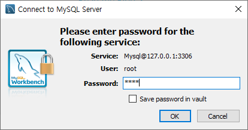

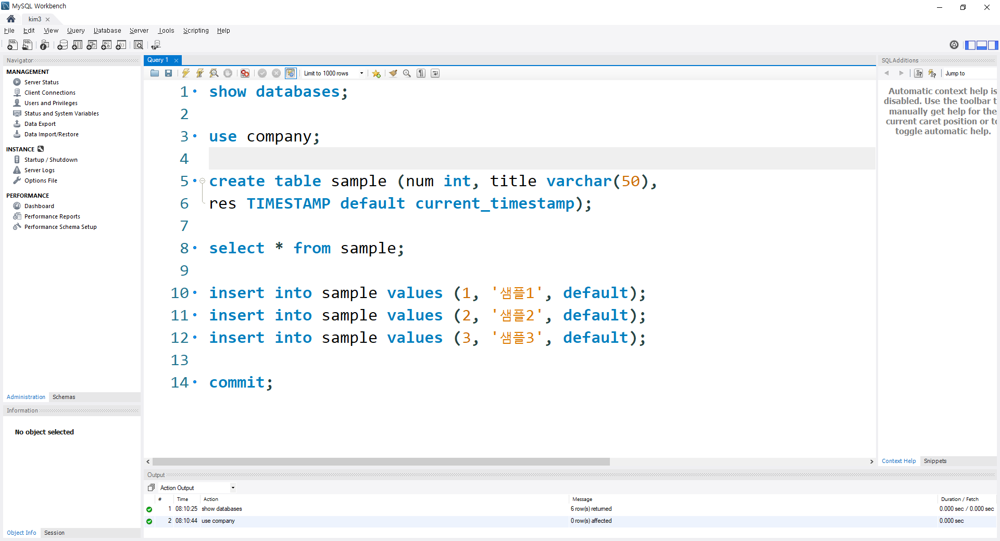

```sql
show databases;

use company;

create table sample (num int, title varchar(50), 
res TIMESTAMP default current_timestamp);

select * from sample;

insert into sample values (1, '샘플1', default);
insert into sample values (2, '샘플2', default);
insert into sample values (3, '샘플3', default);

commit;
```

<br><br>

<div id="2-2-2"><a href="#quick">목차로</a></div>

### 2-2-2. SqlMapper(MyBatis xml file) 작성하기

**프로젝트이름\src\main\resources\mappers\sampleMapper.xml 파일을 새로 생성하고, sample에 대한 sql 명령과 그에 해당하는 xml태그를 작성하도록 합니다.**


```xml
<?xml version="1.0" encoding="UTF-8"?>
<!DOCTYPE mapper PUBLIC 
"-//mybatis.org//DTD Mapper 3.0//EN" 
"http://mybatis.org/dtd/mybatis-3-mapper.dtd">
<mapper namespace="sample">
	<select id="getSampleList" resultType="com.spring1.dto.Sample">
		select * from sample
	</select>	
	<select id="getSample" resultType="com.spring1.dto.Sample">
		select * from sample where num=#{num}
	</select>	
	<insert id="insSample">
		insert into sample values (#{num}, #{title}, #{res})
	</insert>
	<update id="upSample">
		update sample set title=#{title} where num=#{num}
	</update>
	<delete id="delSample">
		delete from sample where num=#{num}
	</delete>
</mapper>
```

**프로젝트에 작성할 각종 패키지를 생성합니다.**


```
프로젝트이름\src\main\java\com\프로젝트이름\controller
프로젝트이름\src\main\java\com\프로젝트이름\dao
프로젝트이름\src\main\java\com\프로젝트이름\dto
프로젝트이름\src\main\java\com\프로젝트이름\myapp
프로젝트이름\src\main\java\com\프로젝트이름\service
프로젝트이름\src\main\java\com\프로젝트이름\test
프로젝트이름\src\main\java\com\프로젝트이름\util
```

<br><br>

<div id="2-2-3"><a href="#quick">목차로</a></div>

### 2-2-3. Repository(DAO) 작성하기

**프로젝트이름\src\main\java\com\프로젝트이름\dao\SampleDAO.java 작성**


```java
package com.spring1.dao;

import java.util.List;

import com.spring1.dto.Sample;

public interface SampleDAO {
	public List<Sample> getSampleList();
	public Sample getSample(int num);
	public void insSample(Sample sample);
	public void upSample(Sample sample);
	public void delSample(Sample sample);
}
```

<br>

**프로젝트이름\src\main\java\com\프로젝트이름\dao\SampleDAOImpl.java 작성**


```java
package com.spring1.dao;

import java.util.List;

import org.apache.ibatis.session.SqlSession;
import org.springframework.beans.factory.annotation.Autowired;
import org.springframework.stereotype.Repository;
import com.spring1.dto.Sample;

@Repository
public class SampleDAOImpl implements SampleDAO {

	@Autowired
	private SqlSession sqlSession;
	
	@Override
	public List<Sample> getSampleList() {
		return sqlSession.selectList("sample.getSampleList");
	}

	@Override
	public Sample getSample(int num) {
		return sqlSession.selectOne("sample.getSample", num);
	}

	@Override
	public void insSample(Sample sample) {
		sqlSession.insert("sample.insSample", sample);
	}

	@Override
	public void upSample(Sample sample) {
		sqlSession.update("sample.upSample", sample);		
	}

	@Override
	public void delSample(Sample sample) {
		sqlSession.delete("sample.delSample", sample);		
	}
}

```

<br><br>

<div id="2-3"><a href="#quick">목차로</a></div>

## 2-3. Service 작성하기

**프로젝트이름\src\main\java\com\프로젝트이름service\SampleService.java 작성**

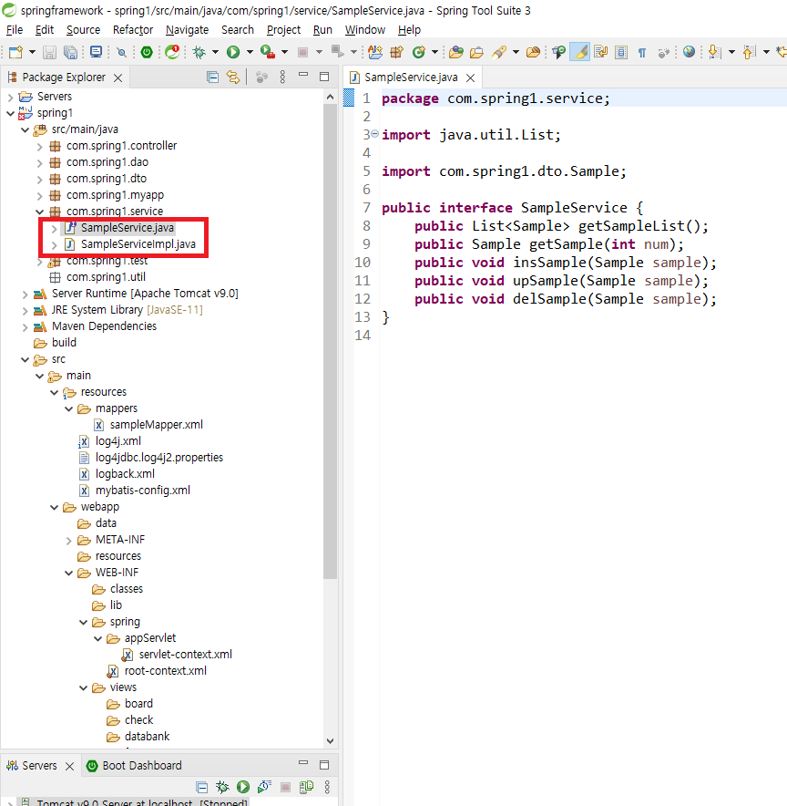

```java
package com.spring1.service;

import java.util.List;

import com.spring1.dto.Sample;

public interface SampleService {
	public List<Sample> getSampleList();
	public Sample getSample(int num);
	public void insSample(Sample sample);
	public void upSample(Sample sample);
	public void delSample(Sample sample);
}
```

<br>

**프로젝트이름\src\main\java\com\프로젝트이름\service\SampleServiceImpl.java 작성**


```java
package com.spring1.service;

import java.util.List;
import org.springframework.beans.factory.annotation.Autowired;
import org.springframework.stereotype.Service;

import com.spring1.dao.SampleDAO;
import com.spring1.dto.Sample;

@Service
public class SampleServiceImpl implements SampleService {

	@Autowired
	private SampleDAO sampleDAO;
	
	@Override
	public List<Sample> getSampleList() {
		return sampleDAO.getSampleList();
	}

	@Override
	public Sample getSample(int num) {
		return sampleDAO.getSample(num);
	}

	@Override
	public void insSample(Sample sample) {
		sampleDAO.insSample(sample);
	}

	@Override
	public void upSample(Sample sample) {
		sampleDAO.upSample(sample);		
	}

	@Override
	public void delSample(Sample sample) {
		sampleDAO.delSample(sample);		
	}	
}
```

<br><br>

<div id="2-4"><a href="#quick">목차로</a></div>

## 2-4. Controller 작성하기

**프로젝트이름\src\main\java\com\프로젝트이름\service\SampleController.java 작성**

```java
package com.spring1.controller;

import java.util.List;

import org.springframework.beans.factory.annotation.Autowired;
import org.springframework.stereotype.Controller;
import org.springframework.ui.Model;
import org.springframework.web.bind.annotation.GetMapping;
import org.springframework.web.bind.annotation.RequestMapping;

import com.spring1.dto.Sample;
import com.spring1.service.SampleService;

@Controller
@RequestMapping("/sample/")
public class SampleController {
	
	@Autowired
	private SampleService sampleService;
	
	@GetMapping("list.do")
	public String getSampleList(Model model) {
		List<Sample> list = sampleService.getSampleList();
		model.addAttribute("list", list);
		return "sample/sampleList";
	}
}
```

<br>

**프로젝트이름\src\main\java\com\spring1\myapp\HomeController.java 수정하기**


```java
package com.spring1.myapp;

import java.text.DateFormat;
import java.util.Date;
import java.util.Locale;

import org.slf4j.Logger;
import org.slf4j.LoggerFactory;
import org.springframework.stereotype.Controller;
import org.springframework.ui.Model;
import org.springframework.web.bind.annotation.RequestMapping;
import org.springframework.web.bind.annotation.RequestMethod;

@Controller
public class HomeController {
	
	private static final Logger log = LoggerFactory.getLogger(HomeController.class);
	//localhost:8091/spring1/ => /WEB-INF/views/home.jsp
	@RequestMapping(value = "/", method = RequestMethod.GET)
	public String home(Locale locale, Model model) {
		log.info("Welcome home~! The Client locale is {}.", locale);
		
		Date date = new Date();
		DateFormat dateFormat = DateFormat.getDateTimeInstance(DateFormat.LONG, DateFormat.LONG, locale);
		
		String formatDate = dateFormat.format(date);
		
		model.addAttribute("serverTime", formatDate);
		model.addAttribute("author", "김기태");
		model.addAttribute("company", "파람소프트");
		
		return "home";
	}
}
```

<br><br>

<div id="2-5"><a href="#quick">목차로</a></div>

## 2-5. View(jsp) 작성하기

**프로젝트이름\src\main\webapp\WEB-INF\views\home.jsp 수정하기**

```java
<%@ page language="java" contentType="text/html; charset=UTF-8"
    pageEncoding="UTF-8"%>
<%@ taglib uri="http://java.sun.com/jsp/jstl/core" prefix="c" %>
<%@ taglib prefix="c" uri="http://java.sun.com/jsp/jstl/core"  %>
<%@ taglib prefix="fmt" uri="http://java.sun.com/jsp/jstl/fmt" %>
<%@ taglib prefix="fn" uri = "http://java.sun.com/jsp/jstl/functions"%>
<c:set var="path2" value="${pageContext.request.contextPath }" />
<!DOCTYPE html>
<html>
<head>
<meta charset="UTF-8">
<title>메인 페이지</title>
</head>
<body>
	<h2>${serverTime }</h2>
	<h2>${author }</h2>
	<h2>${company }</h2>
	<hr>
	<a href="${path2 }/sample/list.do">샘플 목록</a>	
</body>
</html>
```

<br>

**프로젝트이름\src\main\webapp\WEB-INF\views\sample\sampleList.jsp 작성**


```java
<%@ page language="java" contentType="text/html; charset=UTF-8"
    pageEncoding="UTF-8"%>
<%@ taglib prefix="c" uri="http://java.sun.com/jsp/jstl/core"  %>
<%@ taglib prefix="fmt" uri="http://java.sun.com/jsp/jstl/fmt" %>
<%@ taglib prefix="fn" uri = "http://java.sun.com/jsp/jstl/functions"%>
<!DOCTYPE html>
<html>
<head>
<meta charset="UTF-8">
<title>샘플 목록</title>
</head>
<body>
	<c:forEach var="sample" items="${list}">
		<p>번호 : ${sample.num }</p>
		<p>제목 : ${sample.title }</p>
		<p>일시 : ${sample.res }</p>
		<hr>
	</c:forEach>
</body>
</html>
```