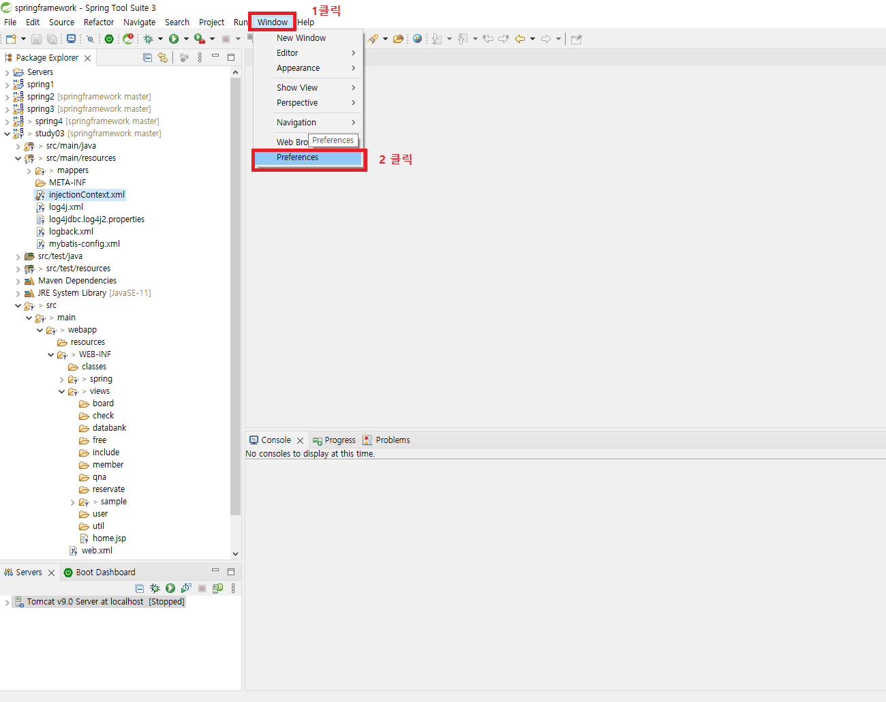
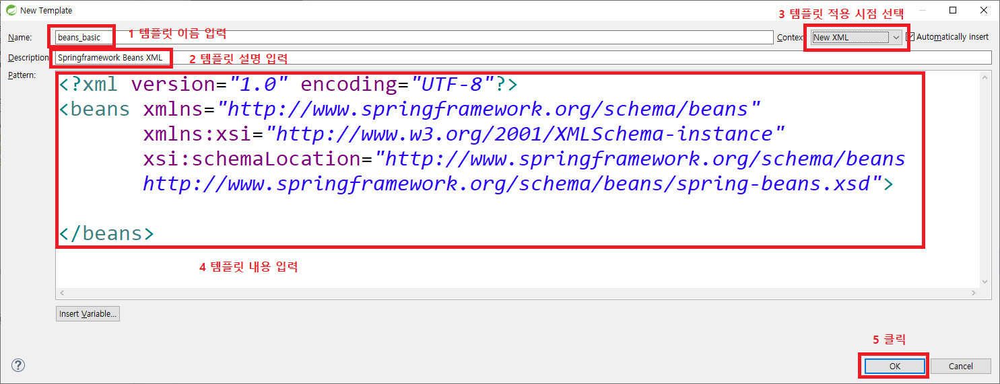
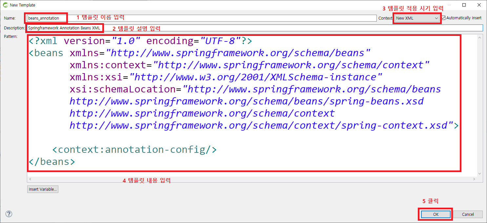
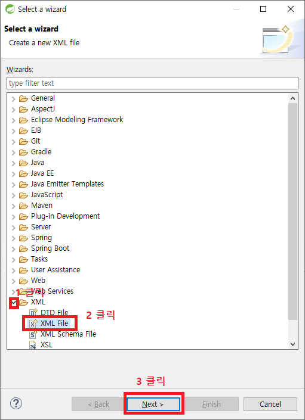
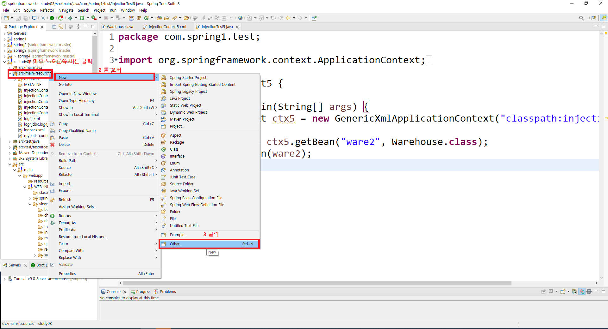
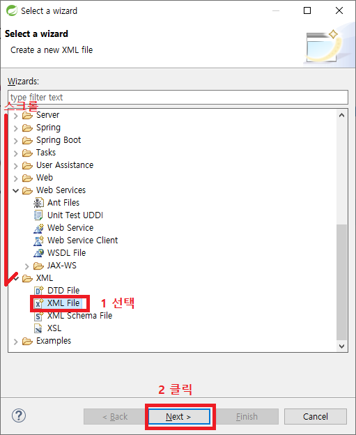
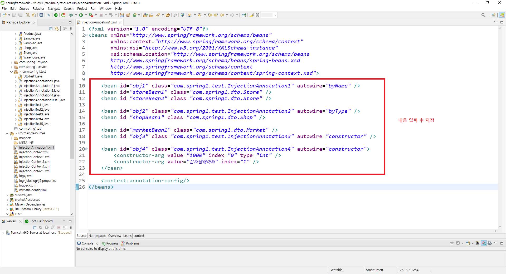
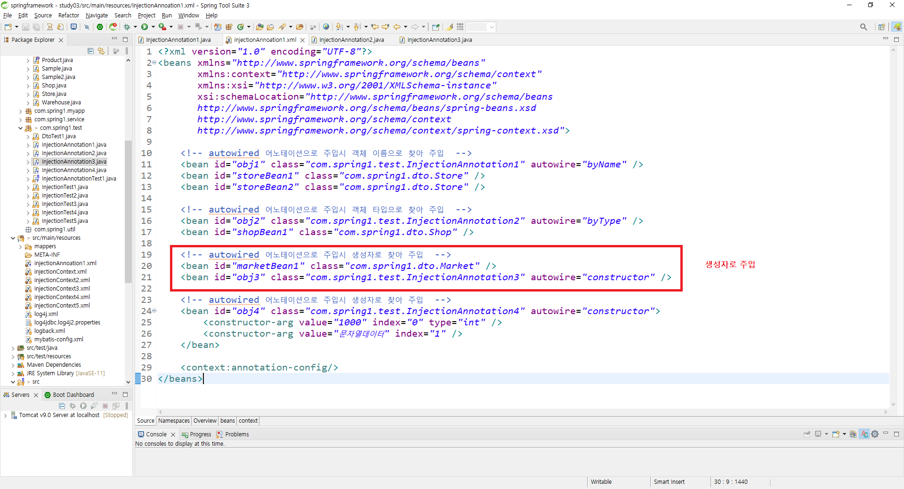
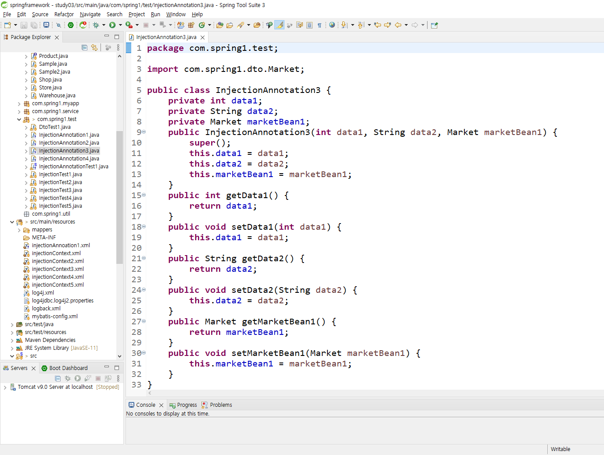
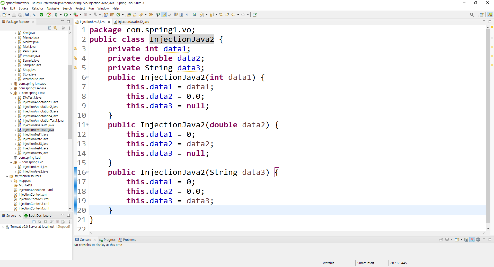

<nav id="quick" style="position:fixed;top:150px;right:100px;width:200px;height:auto;overflow:hidden;z-index:999;background-color:rgba(255,255,255,0.75);">
	<label for="chap3" style="color:black;font-size:28px;">3. DI (Dependency Injection)와 IoC(Invert Of Control)</label>
	<input type="radio" name="chap" id="chap3" style="display:none;">
	<ul class="menu">
		<li><a href="#3-1" style="color:black;font-size:20px;text-decoration:none;">3-1. 의존성 주입(Dependency Injection)</a></li>
		<li><a href="#3-2" style="color:black;font-size:20px;text-decoration:none;">3-2. 의존성 주입 방법</a></li>
		<li><a href="#3-3" style="color:black;font-size:20px;text-decoration:none;">3-3. 의존성 빈 설정 방법</a></li>
		<li><a href="#3-4" style="color:black;font-size:20px;text-decoration:none;">3-4. 스프링프레임워크의 DI와 IoC</a></li>
	</ul>
</nav>

<div id="3-1"><a href="#quick">목차로</a></div>

## 3-1. 의존성 주입(Dependency Injection)

```
의존성 주입(DI)은 스프링 프레임워크가 지원하는 핵심 기능 중 하나로서, 객체 사이의 의존관계가 
객체 자신이 아닌 외부에 의해 결정되는 디자인 패턴입니다. 스프링 IoC 컨테이너는 어떤 객체(A)가 
필요로 하는, 의존관계에 있는 다른 객체(B)를 직접 생성하여 A 객체로 주입(설정)하는 역할을 
담당합니다. 컴포넌트를 구성하는 객체의 생성과 의존관계의 연결 처리를 해당 객체가 아닌 컨테이너가 
대신하기 때문에 제어의 역전(Inversion of Control)이라고 합니다. 의존성 주입을 사용하면 종속성과 
결합도(coupling)가 낮아져 테스트가 용이해지고 재사용성, 유연성, 확장성을 향상시킬 수 있게 됩니다.
```

<br><br>

<div id="3-2"><a href="#quick">목차로</a></div>

## 3-2. 의존성 주입 방법

| 방법 | 설명 |
|-------------|------------------------------------------------------------|
| 생성자 주입<br>(Constructor Injection) | 생성자를 통해 의존관계를 주입하는 방법. <br> 생성자 호출 시점에 1회 호출되는 것이 보장된다. <br> 주입받은 객체가 변하지 않거나, 반드시 객체의 주입이 필요한 <br> 경우에 강제하기 위해 사용할 수 있다  |
| 필드 주입<br>(Feild Injection) | 필드의 선언시 @Autowired 의 애너테이션에 의해 주입되는 방법. <br> 재생성이 잘 되지 않아 현재는 가급적 사용하지 않는다.  |
| 수정자 주입<br>(Setter Injection) | 필드 값을 변경하는 setter 메소드를 통해서 의존 관계를 주입하는 방법. <br> 주입받는 객체가 변경될 가능성이 있는 경우에 사용할 수 있다. |

<br><br>

<div id="3-3"><a href="#quick">목차로</a></div>

## 3-3. 의존성 빈 설정 방법

| 방법 | 설명 |
|-------------|------------------------------------------------------------|
| XML 기반 설정 방식<br> (XML-based configuration)	| XML 파일을 사용하는 방법으로 <bean> 요소의 class 속성에 FQCN(Fully-Qualified Class Name)을 기술하면 빈이 정의된다. <constructor-arg>나 <property> 요소를 사용해 의존성을 주입한다.
| 자바 기반 설정 방식<br> (Java-based configuration) | 자바 클래스에 @Configuration 애너테이션을, 메서드에 @Bean 애너테이션을 사용해 빈을 정의하는 방법. 최근에는 스프링 기반 애플리케이션 개발에 자주 사용되고 특히 스프링 부트에서 이 방식을 많이 활용한다. |
| 애너테이션 기반 설정 방식 <br>(Annotation-based configuration) | @Component 같은 마커 애너테이션(Marker Annotation)이 부여된 클래스를 탐색해서(Component Scan) DI 컨테이너에 빈을 자동으로 등록하는 방법이다. |

<br><br>

<div id="3-3-1"><a href="#quick">목차로</a></div>

### 3-3-1. XML 주입 방법

#### 3-3-1-1. XML 템플릿 제작 방법




<br>

**기본 포맷 - 빈 등록 XML** 



```xml
<?xml version="1.0" encoding="UTF-8"?>
<beans xmlns="http://www.springframework.org/schema/beans"
       xmlns:xsi="http://www.w3.org/2001/XMLSchema-instance"
       xsi:schemaLocation="http://www.springframework.org/schema/beans http://www.springframework.org/schema/beans/spring-beans.xsd">

</beans>
```


<br>

**애노테이션 설정을 사용하기 위한 포맷**



```xml
<?xml version="1.0" encoding="UTF-8"?>
<beans xmlns="http://www.springframework.org/schema/beans"
       xmlns:context="http://www.springframework.org/schema/context"
       xmlns:xsi="http://www.w3.org/2001/XMLSchema-instance"
       xsi:schemaLocation="http://www.springframework.org/schema/beans http://www.springframework.org/schema/beans/spring-beans.xsd 
       http://www.springframework.org/schema/context http://www.springframework.org/schema/context/spring-context.xsd">

    <context:annotation-config/>
</beans>
```

<br>

**기본 XML 템플릿 수정**


```xml
<?xml version="1.0" encoding="UTF-8"?>
<beans xmlns="http://www.springframework.org/schema/beans"
       xmlns:xsi="http://www.w3.org/2001/XMLSchema-instance"
       xsi:schemaLocation="http://www.springframework.org/schema/beans http://www.springframework.org/schema/beans/spring-beans.xsd">

</beans>
```

<br><br>

#### 3-3-1-2. 기본 XML 주입 실습

**주입 작업 패턴**

인터페이스 생성 -> DTO 생성 -> 인터페이스를 멤버로 하는 DTO 생성 -> Beans xml 파일 작성 -> java 테스트 -> Controller/Service/DAO 에 적용

<br><br>

**빈 설정 예시**

```xml
<bean id="id" class="com.dto.BeanTest"></bean>
```

- id : 빈 이름(id) 설정 
- class : 빈 타입 설정
- scope : 빈의 scope 설정 (singleton/prototype)
- primary : true를 지정하여 같은 타입의 빈이 여러개 일때 우선적으로 사용할 빈 설정
- lazy-init : true를 지정하여 빈을 사용할 때 객체가 생성되도록 설정
- init-method : 빈 객체가 생성될때 호출할 메소드 설정
- destroy-method : 빈 객체가 소멸될때 호출할 메소드 설정
- autowire : 자동주입 설정 (no, byName, byType, constructor)

<br><br>

**/src/main/resources/injectionContext.xml 파일 작성**





```xml
<?xml version="1.0" encoding="UTF-8"?>
<beans xmlns="http://www.springframework.org/schema/beans"
	xmlns:xsi="http://www.w3.org/2001/XMLSchema-instance"
	xsi:schemaLocation="http://www.springframework.org/schema/beans 
	http://www.springframework.org/schema/beans/spring-beans.xsd">
	<!-- 빈 객체 생성 NoArgument -->
	<bean id="store1" class="com.spring1.dto.Store"></bean>
	
	<!--		Store store1 = new Store();	 -->
	
	<!-- 생성자 주입 : All Argument -->
	<bean id="store2" class="com.spring1.dto.Store">
		<constructor-arg name="storeNum" value="1"></constructor-arg>
		<constructor-arg name="storeName" value="HomePlus"></constructor-arg>
	</bean> 
	
	<!--		Store store2 = new Store(1, "HomePlus");	 -->
	
	<!-- 생성자(Constructor) 주입2 : All Argument - value -->
	<bean id="store3" class="com.spring1.dto.Store">
		<constructor-arg name="storeNum">
			<value>2</value>
		</constructor-arg>
		<constructor-arg name="storeName">
			<value>KingMart</value>
		</constructor-arg>
	</bean>
	
	<!--		Store store3 = new Store(2, "KingMart");	-->
	
	<!--  수정자 주입(setter injection) -->		
	<bean id="store4" class="com.spring1.dto.Store">
		<property name="storeNum" value="3"></property>
		<property name="storeName" value="EMart"></property>
	</bean>		
	
	<!--
		Store store4 = new Store();
		store4.setStoreNum(1);
		store4.setStoreName("HomePlus"); 
	 -->
</beans>
```

<br>

**src/main/java/com/spring1/test/InjectionTest1.java 파일 작성**


```java
package com.spring1.test;

import org.springframework.context.ApplicationContext;
import org.springframework.context.support.GenericXmlApplicationContext;

import com.spring1.dto.Store;

public class InjectionTest1 {
	public static void main(String[] args) {
		ApplicationContext ctx1 = new GenericXmlApplicationContext("classpath:injectionContext.xml");

		Store store1 = ctx1.getBean("store1", Store.class);
		System.out.println("store1"+store1.toString());
		
		Store store2 = ctx1.getBean("store2", Store.class);
		System.out.println("store2"+store2.toString());
		
		Store store3 = ctx1.getBean("store3", Store.class);
		System.out.println("store3"+store3.toString());
		
		Store store4 = ctx1.getBean("store4", Store.class);
		System.out.println("store4"+store4.toString());
	}
}
```


<br><br>

#### 3-3-1-3. 객체 주입 실습

**com.spring1.dto.Product 작성**

```java
package com.spring1.dto;

public interface Product {

}
```

<br>

**com.spring1.dto.Pencil 작성**

```java
package com.spring1.dto;

public class Pencil implements Product {
	private String proName;
	private int price;
	public Pencil() { }
	public Pencil(String proName, int price) {
		super();
		this.proName = proName;
		this.price = price;
	}
	@Override
	public String toString() {
		return "Pencil [proName=" + proName + ", price=" + price + "]";
	}
}
```

<br>

**com.spring1.dto.Shop 작성**

```java
package com.spring1.dto;

public class Shop {
	private String shopName;
	private Product product;
	public Shop() { }
	public Shop(String shopName, Product product) {
		super();
		this.shopName = shopName;
		this.product = product;
	}
	public String getShopName() {
		return shopName;
	}
	public void setShopName(String shopName) {
		this.shopName = shopName;
	}
	public Product getProduct() {
		return product;
	}
	public void setProduct(Product product) {
		this.product = product;
	}
	@Override
	public String toString() {
		return "Shop [shopName=" + shopName + ", product=" + product + "]";
	}
}
```

<br>

**/src/main/resources/injectionContext2.xml 작성**

```xml
<?xml version="1.0" encoding="UTF-8"?>
<beans xmlns="http://www.springframework.org/schema/beans"
       xmlns:xsi="http://www.w3.org/2001/XMLSchema-instance"
       xsi:schemaLocation="http://www.springframework.org/schema/beans 
       http://www.springframework.org/schema/beans/spring-beans.xsd">
	<bean id="pencil" class="com.spring1.dto.Pencil">
		<constructor-arg name="proName">
			<value>A001</value>
		</constructor-arg>
		<constructor-arg name="price" value="1000" />
	</bean>
	
	<!-- 생성자 주입 -->
	<bean id="shop1" class="com.spring1.dto.Shop">
		<constructor-arg name="shopName" value="Daeil"></constructor-arg>
		<constructor-arg name="product" ref="pencil"></constructor-arg>
	</bean>
	
	<!-- 수정자 주입 -->
	<bean id="shop2" class="com.spring1.dto.Shop">
		<property name="shopName" value="YoungPoong"></property>
		<property name="product" ref="pencil"></property>	
	</bean>
	
	<!-- 생성자 주입2 -->
	<bean id="shop3" class="com.spring1.dto.Shop">
		<constructor-arg name="shopName">
			<value>Kyobo</value>
		</constructor-arg>
		<constructor-arg name="product">
			<ref bean="pencil" />
		</constructor-arg>
	</bean>
</beans>
```

<br>

**com.spring1.test.InjectionTest2 작성**

```java
package com.spring1.test;

import org.springframework.context.ApplicationContext;
import org.springframework.context.support.GenericXmlApplicationContext;

import com.spring1.dto.Shop;

public class InjectionTest2 {

	public static void main(String[] args) {
	  ApplicationContext ctx2 = new GenericXmlApplicationContext("classpath:injectionContext2.xml");
		
 	  Shop shop1 = ctx2.getBean("shop1", Shop.class);
	  System.out.println(shop1.toString());
		
	  Shop shop2 = (Shop) ctx2.getBean("shop2", Shop.class);
	  System.out.println(shop2.toString());
		
	  Shop shop3 = (Shop) ctx2.getBean("shop3", Shop.class);
	  System.out.println(shop3.toString());
	}

}
```

<br><br>

#### 3-3-1-4. List 컬렉션 주입 실습

**com.spring1.dto.Goods 작성**

```java
package com.spring1.dto;

public interface Goods {

}
```

<br>

**com.spring1.dto.Chair 작성**

```java
package com.spring1.dto;

public class Chair implements Goods {
	private int price;

	public int getPrice() {
		return price;
	}

	public void setPrice(int price) {
		this.price = price;
	}

	@Override
	public String toString() {
		return "Chair [price=" + price + "]";
	}
	
}
```

<br> <a href="#quick">목차로</a> <br>

**com.spring1.dto.Desk 작성**

```java
package com.spring1.dto;

public class Desk implements Goods {
	private double size;

	public Desk(double size) {
		super();
		this.size = size;
	}

	@Override
	public String toString() {
		return "Desk [size=" + size + "]";
	}
	
}
```

<br>

**com.spring1.dto.Shop 작성**

```java
package com.spring1.dto;

public class Shop {
	private String shopName;
	private Product product;
	public Shop() { }
	public Shop(String shopName, Product product) {
		super();
		this.shopName = shopName;
		this.product = product;
	}
	public String getShopName() {
		return shopName;
	}
	public void setShopName(String shopName) {
		this.shopName = shopName;
	}
	public Product getProduct() {
		return product;
	}
	public void setProduct(Product product) {
		this.product = product;
	}
	@Override
	public String toString() {
		return "Shop [shopName=" + shopName + ", product=" + product + "]";
	}
}
```

<br>

**src/main/resources/injectionContext3.xml 작성**

```xml
<?xml version="1.0" encoding="UTF-8"?>
<beans xmlns="http://www.springframework.org/schema/beans"
       xmlns:xsi="http://www.w3.org/2001/XMLSchema-instance"
       xsi:schemaLocation="http://www.springframework.org/schema/beans http://www.springframework.org/schema/beans/spring-beans.xsd">
	<bean id="desk" class="com.spring1.dto.Desk">
		<constructor-arg name="size" value="10"></constructor-arg>
	</bean>
	<bean id="chair" class="com.spring1.dto.Chair">
		<property name="price" value="50000"></property>
	</bean>
	<bean id="market1" class="com.spring1.dto.Market">
		<property name="marketName" value="Sun"></property>
		<property name="goodsList">
			<list>
				<ref bean="chair" />
				<ref bean="desk" />
				<bean class="com.spring1.dto.Desk">
					<constructor-arg name="size" value="4"></constructor-arg>
				</bean>
			</list>
		</property>
	</bean>
	
</beans>
```

<br>

**com.spring1.test.InjectionTest3 작성**

```java
package com.spring1.test;

import org.springframework.context.ApplicationContext;
import org.springframework.context.support.GenericXmlApplicationContext;

import com.spring1.dto.Market;

public class InjectionTest3 {

	public static void main(String[] args) {
		ApplicationContext ctx3 = new GenericXmlApplicationContext("classpath:injectionContext3.xml");
		
		Market market1 = ctx3.getBean("market1", Market.class);
		System.out.println(market1);
	}

}
```

<br> <a href="#quick">목차로</a> <br><br>


#### 3-3-1-5. Set 컬렉션 주입 실습

**com.spring1.dto.Fruits 작성**

```java
package com.spring1.dto;

public interface Fruits {

}
```

<br>

com.spring1.dto.Apple 작성

```java
package com.spring1.dto;

public class Apple implements Fruits {
	private int price;
	public Apple() {}
	public Apple(int price) {
		super();
		this.price = price;
	}
	public int getPrice() {
		return price;
	}
	public void setPrice(int price) {
		this.price = price;
	}
	@Override
	public String toString() {
		return "Apple [price=" + price + "]";
	}
	
}
```

<br>

**com.spring1.dto.Cherry 작성**

```java
package com.spring1.dto;

public class Cherry implements Fruits{
	private double amount;
	public Cherry() { }
	public Cherry(double amount) {
		super();
		this.amount = amount;
	}
	public double getAmount() {
		return amount;
	}
	public void setAmount(double amount) {
		this.amount = amount;
	}
	@Override
	public String toString() {
		return "Cherry [amount=" + amount + "]";
	}
	
}
```

<br>

**com.spring1.dto.Kiwi 작성**

```java
package com.spring1.dto;

public class Kiwi implements Fruits {
	private int price;
	public Kiwi() { } 
	public Kiwi(int price) {
		super();
		this.price = price;
	}
	public int getPrice() {
		return price;
	}
	public void setPrice(int price) {
		this.price = price;
	}
	@Override
	public String toString() {
		return "Kiwi [price=" + price + "]";
	}
}
```

<br>

**com.spring1.dto.Mango 작성**

```java
package com.spring1.dto;

public class Mango implements Fruits{
	private int size;
	public Mango() {}
	public Mango(int size) {
		super();
		this.size = size;
	}
	public int getSize() {
		return size;
	}
	public void setSize(int size) {
		this.size = size;
	}
	@Override
	public String toString() {
		return "Mango [size=" + size + "]";
	}
}
```

<br>

**com.spring1.dto.Mart 작성**

```java
package com.spring1.dto;

import java.util.Set;

public class Mart {
	private String martName;
	private Set<Fruits> fr;
	public Mart() { }
	public Mart(String martName, Set<Fruits> fr) {
		super();
		this.martName = martName;
		this.fr = fr;
	}
	public String getMartName() {
		return martName;
	}
	public void setMartName(String martName) {
		this.martName = martName;
	}
	public Set<Fruits> getFr() {
		return fr;
	}
	public void setFr(Set<Fruits> fr) {
		this.fr = fr;
	}
	@Override
	public String toString() {
		return "Mart [martName=" + martName + ", frSet=" + fr + "]";
	}
	
}
```

<br>

**src/main/resources/injectionContext4.xml 작성**

```xml
<?xml version="1.0" encoding="UTF-8"?>
<beans xmlns="http://www.springframework.org/schema/beans"
       xmlns:xsi="http://www.w3.org/2001/XMLSchema-instance"
       xsi:schemaLocation="http://www.springframework.org/schema/beans http://www.springframework.org/schema/beans/spring-beans.xsd">

	<bean id="apple" class="com.spring1.dto.Apple">
		<constructor-arg name="price" value="5000" />
	</bean>
	<bean id="mango" class="com.spring1.dto.Mango">
		<constructor-arg name="size" value="400" />
	</bean>
	<bean id="cherry" class="com.spring1.dto.Cherry">
		<constructor-arg name="amount" value="900" />
	</bean>
	<bean id="mart1" class="com.spring1.dto.Mart">
		<property name="martName" value="bigMart" />
		<property name="fr">
			<set>
				<ref bean="apple"/>
				<ref bean="mango"/>
				<ref bean="cherry"/>
				<bean class="com.spring1.dto.Kiwi">
					<constructor-arg name="price" value="5000"></constructor-arg>
				</bean>
			</set>
		</property>
	</bean>
</beans>
```

<br>

**com.spring1.test.InjectionTest4 작성**

```java
package com.spring1.test;

import org.springframework.context.ApplicationContext;
import org.springframework.context.support.GenericXmlApplicationContext;

import com.spring1.dto.Mart;

public class InjectionTest4 {
	public static void main(String[] args) {
		ApplicationContext ctx4 = new GenericXmlApplicationContext("classpath:injectionContext4.xml");
		
		Mart mart1 = ctx4.getBean("mart1", Mart.class);
		System.out.println(mart1);
	}
}
```

<br><a href="#quick">목차로</a><br><br>

#### 3-3-1-6. Map 컬렉션 주입 실습

**com.spring1.dto.Warehouse 작성**

```java
package com.spring1.dto;

import java.util.Map;

public class Warehouse {
	private Map<String, Object> map;
	public Warehouse() {}
	public Warehouse(Map<String, Object> map) {
		super();
		this.map = map;
	}
	public Map<String, Object> getMap() {
		return map;
	}
	public void setMap(Map<String, Object> map) {
		this.map = map;
	}
	@Override
	public String toString() {
		return "Store [map=" + map + "]";
	}
}
```

<br>

**src/main/resources/injectionContext5.xml 작성**

```xml
<?xml version="1.0" encoding="UTF-8"?>
<beans xmlns="http://www.springframework.org/schema/beans"
       xmlns:xsi="http://www.w3.org/2001/XMLSchema-instance"
       xsi:schemaLocation="http://www.springframework.org/schema/beans http://www.springframework.org/schema/beans/spring-beans.xsd">

	<bean id="apple" class="com.spring1.dto.Apple">
		<constructor-arg name="price" value="5000" />
	</bean>
	<bean id="mango" class="com.spring1.dto.Mango">
		<constructor-arg name="size" value="400" />
	</bean>
	<bean id="cherry" class="com.spring1.dto.Cherry">
		<constructor-arg name="amount" value="900" />
	</bean>
	<bean id="ware2" class="com.spring1.dto.Warehouse">
		<property name="map">
			<map>
				<entry>
					<key><value>martName</value></key>
					<value>EMart</value>
				</entry>
				<entry key="no" value="1004" value-type="int"></entry>
				<entry>
					<key><value>apple</value></key>
					<ref bean="apple"/>
				</entry>
				<entry>
					<key><value>mango</value></key>
					<ref bean="mango"/>
				</entry>
				<entry>
					<key><value>cherry</value></key>
					<ref bean="cherry"/>
				</entry>
			</map>
		</property>
	</bean>
</beans>
```

<br>

**com.spring1.test.InjectionTest5 작성**

```java
package com.spring1.test;

import org.springframework.context.ApplicationContext;
import org.springframework.context.support.GenericXmlApplicationContext;

import com.spring1.dto.Warehouse;

public class InjectionTest5 {

	public static void main(String[] args) {
		ApplicationContext ctx5 = new GenericXmlApplicationContext("classpath:injectionContext5.xml");
		
		Warehouse ware2 = ctx5.getBean("ware2", Warehouse.class);
		System.out.println(ware2);
	}

}
```

<br><br><br>

<div id="3-3-2"><a href="#quick">목차로</a></div>

### 3-3-2. Annotaion 주입 방법








<br><br>

#### 3-3-2-1. 객체 이름으로 주입


**src/main/resources/injectionAnnotaion.xml 작성**

```xml
<?xml version="1.0" encoding="UTF-8"?>
<beans xmlns="http://www.springframework.org/schema/beans"
       xmlns:context="http://www.springframework.org/schema/context"
       xmlns:xsi="http://www.w3.org/2001/XMLSchema-instance"
       xsi:schemaLocation="http://www.springframework.org/schema/beans 
       http://www.springframework.org/schema/beans/spring-beans.xsd 
       http://www.springframework.org/schema/context 
       http://www.springframework.org/schema/context/spring-context.xsd">

	<!-- autowired 어노테이션으로 주입시 객체 이름으로 찾아 주입  -->
	<bean id="obj1" class="com.spring1.test.InjectionAnnotation1" autowire="byName" />
	<bean id="storeBean1" class="com.spring1.dto.Store" />
	<bean id="storeBean2" class="com.spring1.dto.Store" />

    <context:annotation-config/>
</beans>
```

<br>

**com.spring1.test.InjectionAnnotation1 작성**


```java
package com.spring1.test;

import com.spring1.dto.Store;

public class InjectionAnnotation1 {
	
	private Store storeBean1;
	private Store storeBean2;
	public Store getStoreBean1() {
		return storeBean1;
	}
	public void setStoreBean1(Store storeBean1) {
		this.storeBean1 = storeBean1;
	}
	public Store getStoreBean2() {
		return storeBean2;
	}
	public void setStoreBean2(Store storeBean2) {
		this.storeBean2 = storeBean2;
	}
}
```

<br><br>

#### 3-3-2-2. 객체 타입으로 주입


**src/main/resources/injectionAnnotaion.xml 에 내용 추가**

```xml
<?xml version="1.0" encoding="UTF-8"?>
<beans xmlns="http://www.springframework.org/schema/beans"
       xmlns:context="http://www.springframework.org/schema/context"
       xmlns:xsi="http://www.w3.org/2001/XMLSchema-instance"
       xsi:schemaLocation="http://www.springframework.org/schema/beans 
       http://www.springframework.org/schema/beans/spring-beans.xsd 
       http://www.springframework.org/schema/context 
       http://www.springframework.org/schema/context/spring-context.xsd">
	   
	<!-- autowired 어노테이션으로 주입시 객체 이름으로 찾아 주입  -->
	<bean id="obj1" class="com.spring1.test.InjectionAnnotation1" autowire="byName" />
	<bean id="storeBean1" class="com.spring1.dto.Store" />
	<bean id="storeBean2" class="com.spring1.dto.Store" />

	<!-- autowired 어노테이션으로 주입시 객체 타입으로 찾아 주입  -->
	<bean id="obj2" class="com.spring1.test.InjectionAnnotation2" autowire="byType" />
	<bean id="shopBean1" class="com.spring1.dto.Shop" />

    <context:annotation-config/>
</beans>
```

<br>


**com.spring1.test.InjectionAnnotation2 작성**


```java
package com.spring1.test;

import com.spring1.dto.Shop;

public class InjectionAnnotation2 {
	private Shop shopBean1;
	public Shop getShopBean1() {
		return shopBean1;
	}
	public void setShopBean1(Shop shopBean1) {
		this.shopBean1 = shopBean1;
	}
}
```

<br><br>

#### 3-3-2-3. 생성자로 주입



**src/main/resources/injectionAnnotaion.xml 에 내용 추가**

```xml
<?xml version="1.0" encoding="UTF-8"?>
<beans xmlns="http://www.springframework.org/schema/beans"
       xmlns:context="http://www.springframework.org/schema/context"
       xmlns:xsi="http://www.w3.org/2001/XMLSchema-instance"
       xsi:schemaLocation="http://www.springframework.org/schema/beans 
       http://www.springframework.org/schema/beans/spring-beans.xsd 
       http://www.springframework.org/schema/context 
       http://www.springframework.org/schema/context/spring-context.xsd">
	   
	<!-- autowired 어노테이션으로 주입시 객체 이름으로 찾아 주입  -->
	<bean id="obj1" class="com.spring1.test.InjectionAnnotation1" autowire="byName" />
	<bean id="storeBean1" class="com.spring1.dto.Store" />
	<bean id="storeBean2" class="com.spring1.dto.Store" />

	<!-- autowired 어노테이션으로 주입시 객체 타입으로 찾아 주입  -->
	<bean id="obj2" class="com.spring1.test.InjectionAnnotation2" autowire="byType" />
	<bean id="shopBean1" class="com.spring1.dto.Shop" />

	<!-- autowired 어노테이션으로 주입시 생성자로 찾아 주입  -->
	<bean id="marketBean1" class="com.spring1.dto.Market" />
	<bean id="obj3" class="com.spring1.test.InjectionAnnotation3" autowire="constructor" />

    <context:annotation-config/>
</beans>
```

<br>


**com.spring1.test.InjectionAnnotation3 작성**



```java
package com.spring1.test;

import com.spring1.dto.Market;

public class InjectionAnnotation3 {
	private int data1;
	private String data2;
	private Market marketBean1;
	public InjectionAnnotation3(int data1, String data2, Market marketBean1) {
		super();
		this.data1 = data1;
		this.data2 = data2;
		this.marketBean1 = marketBean1;
	}
	public int getData1() {
		return data1;
	}
	public void setData1(int data1) {
		this.data1 = data1;
	}
	public String getData2() {
		return data2;
	}
	public void setData2(String data2) {
		this.data2 = data2;
	}
	public Market getMarketBean1() {
		return marketBean1;
	}
	public void setMarketBean1(Market marketBean1) {
		this.marketBean1 = marketBean1;
	}
}
```

<br><br>

#### 3-3-2-4. 생성자로 주입 - 직접 필드 값 대입


**src/main/resources/injectionAnnotaion.xml 에 내용 추가**

```xml
<?xml version="1.0" encoding="UTF-8"?>
<beans xmlns="http://www.springframework.org/schema/beans"
       xmlns:context="http://www.springframework.org/schema/context"
       xmlns:xsi="http://www.w3.org/2001/XMLSchema-instance"
       xsi:schemaLocation="http://www.springframework.org/schema/beans 
       http://www.springframework.org/schema/beans/spring-beans.xsd 
       http://www.springframework.org/schema/context 
       http://www.springframework.org/schema/context/spring-context.xsd">
	   
	<!-- autowired 어노테이션으로 주입시 객체 이름으로 찾아 주입  -->
	<bean id="obj1" class="com.spring1.test.InjectionAnnotation1" autowire="byName" />
	<bean id="storeBean1" class="com.spring1.dto.Store" />
	<bean id="storeBean2" class="com.spring1.dto.Store" />

	<!-- autowired 어노테이션으로 주입시 객체 타입으로 찾아 주입  -->
	<bean id="obj2" class="com.spring1.test.InjectionAnnotation2" autowire="byType" />
	<bean id="shopBean1" class="com.spring1.dto.Shop" />

	<!-- autowired 어노테이션으로 주입시 생성자로 찾아 주입  -->
	<bean id="marketBean1" class="com.spring1.dto.Market" />
	<bean id="obj3" class="com.spring1.test.InjectionAnnotation3" autowire="constructor" />

	<!-- autowired 어노테이션으로 주입시 생성자로 찾아 주입  -->
	<bean id="obj4" class="com.spring1.test.InjectionAnnotation4" autowire="constructor">
		<constructor-arg value="1000" index="0" type="int" />
		<constructor-arg value="문자열데이터" index="1" />
	</bean>

    <context:annotation-config/>
</beans>
```

<br><a href="#quick">목차로</a><br>


**com.spring1.test.InjectionAnnotation4 작성**


```java
package com.spring1.test;

public class InjectionAnnotation4 {
	private int data1;
	private String data2;
	public InjectionAnnotation4(int data1, String data2) {
		super();
		this.data1 = data1;
		this.data2 = data2;
	}
	public int getData1() {
		return data1;
	}
	public void setData1(int data1) {
		this.data1 = data1;
	}
	public String getData2() {
		return data2;
	}
	public void setData2(String data2) {
		this.data2 = data2;
	}
}
```

<br><br>

#### 3-3-2-5. Autowired Annotation 주입 실습 

**com.spring1.test.InjectionAnnotationTest1 작성**


```java
package com.spring1.test;

import org.springframework.beans.factory.annotation.Autowired;
import org.springframework.stereotype.Service;

import com.spring1.dto.Market;
import com.spring1.dto.Shop;
import com.spring1.dto.Store;

@Service
public class InjectionAnnotationTest1 {

	@Autowired
	private InjectionAnnotation1 obj1;
	
	@Autowired
	private InjectionAnnotation2 obj2;
	
	@Autowired
	private InjectionAnnotation3 obj3;
	
	@Autowired
	private InjectionAnnotation4 obj4;

	public Store getStore() { return obj1.getStoreBean1();	}
	
	public Shop getShop() {	return obj2.getShopBean1();	}
	
	public Market getMarket() {	return obj3.getMarketBean1();	}
	
	public int getData1() {	return obj4.getData1();	}
}
```

<br><br><br>

<div id="3-3-3"><a href="#quick">목차로</a></div>

### 3-3-3. Java Code 주입 방법

#### 3-3-3-1. 객체 주입 실습1

**com.spring1.vo.InjectionJava1 작성**


```java
package com.spring1.vo;

import com.spring1.dto.Store;

public class InjectionJava1 {
	private Store store;

	public InjectionJava1(Store store) {
		super();
		this.store = store;
	}

	public Store getStore() {
		return store;
	}

	public void setStore(Store store) {
		this.store = store;
	}
}
```

<br><br>

**com.spring1.test.InjectionJavaTest1 작성**


```java
package com.spring1.test;

import org.springframework.beans.factory.annotation.Autowired;
import org.springframework.stereotype.Service;

import com.spring1.dto.Store;
import com.spring1.vo.InjectionJava1;

@Service
public class InjectionJavaTest1 {

	private InjectionJava1 injectionJava1;	//필드 주입

	//생성자(Constructor)로 주입
	@Autowired
	public InjectionJavaTest1(InjectionJava1 injectionJava1) {
		this.injectionJava1 = injectionJava1;
	}

	//수정자(setter) 주입
	@Autowired
	public void setInjectionJava1(InjectionJava1 injectionJava1) {
		this.injectionJava1 = injectionJava1;
	}

	public Store getStore() {
		return injectionJava1.getStore();
	}	
}
```

<br><br>


#### 3-3-3-2. 객체 주입 실습2

**com.spring1.vo.InjectionJava2 작성**



```java
package com.spring1.vo;
public class InjectionJava2 {
	private int data1;
	private double data2;
	private String data3;
	public InjectionJava2(int data1) {
		this.data1 = data1;
		this.data2 = 0.0;
		this.data3 = null;
	}
	public InjectionJava2(double data2) {
		this.data1 = 0;
		this.data2 = data2;
		this.data3 = null;
	}
	public InjectionJava2(String data3) {
		this.data1 = 0;
		this.data2 = 0.0;
		this.data3 = data3;
	}
}
```

<br>

**com.spring1.test.InjectionJavaTest2 작성**


```java
package com.spring1.test;

import org.springframework.beans.factory.annotation.Autowired;
import org.springframework.stereotype.Service;

import com.spring1.vo.InjectionJava2;

@Service
public class InjectionJavaTest2 {

	//필드 주입
	private InjectionJava2 java2;

	//생성자 주입
	@Autowired
	public InjectionJavaTest2(InjectionJava2 java2) {
		this.java2 = java2;
	}

	//수정자 주입
	@Autowired
	public void setJava2(InjectionJava2 java2) {
		this.java2 = java2;
	}
	
	public InjectionJava2 getJava2() {
		return java2;
	}	
}
```

<div id="3-4"><a href="#quick">목차로</a></div>

## 3-4. 스프링프레임워크의 DI와 IoC


<br><br>

<div id="3-4-1"><a href="#quick">목차로</a></div>

### 3-4-1. 의존성 주입(DI) 관련 어노테이션

| 어노테이션 | 설명 |
|-------------------|------------------------------------------------------------|
| @Autowired | 변수 위에 설정하여 해당 타입의 객체를 찾아서 자동으로 할당.<br>org.springframework.beans.factory.annotation.Autowired |
| @Qualifier | 특정 객체의 이름을 이용하여 의존성을 주입할 때 사용. <br> org.springframework.beans.factory.annotation.Qualifier |
| @Inject | @Autowired 똑같다(Java 제공 어노테이션) <br>javax.annotation.Inject |
| @Resource | 해당 타입의 객체를 찾아서 자동으로 할당하고, 객체를 이용해 의존성을 주입할 떄 사용.<br> (@Autowired와 @Qualifier의 기능을 결합한것)<br>javax.annotation.Resource |

<br>

**@Autowired 주입 실습**

```java
package com.spring1.test;

import org.springframework.beans.factory.annotation.Autowired;

import com.spring1.dao.SampleDAO;
import com.spring1.dao.SampleDAOImpl;

public class TestAutowired {
	
	@Autowired
	private SampleDAO sampleDAO;

	public TestAutowired() {
		this.sampleDAO = new SampleDAOImpl();
	}
}
```

<br><br>

**@Qualifier 주입 실습**

```java
package com.spring1.test;

import org.springframework.beans.factory.annotation.Autowired;
import org.springframework.beans.factory.annotation.Qualifier;

import com.spring1.dao.SampleDAO;
import com.spring1.dao.SampleDAOImpl;

public class TestQualifier {

	@Autowired
	@Qualifier("testDAO")
	private SampleDAO sampleDAO;
	
	public TestQualifier() {
		this.sampleDAO = new SampleDAOImpl();
	}
}
```

<br><br>

**Inject 주입 실습 전에 반드시 pom.xml에 먼저 annoation-api를 의존성 등록하기**

<br><br>

```xml
	...중략....
	<dependencies>
	...중략....
		<dependency>
		    <groupId>javax.annotation</groupId>
		    <artifactId>javax.annotation-api</artifactId>
		    <version>1.2</version>
		</dependency>
  </dependencies>
```
<br><br>

**@Inject 주입 실습**

```java
package com.spring1.test;

import javax.inject.Inject;

import com.spring1.dao.SampleDAO;
import com.spring1.dao.SampleDAOImpl;

public class TestInject {

	@Inject
	private SampleDAO sampleDAO; 
	
	public TestInject() {
		this.sampleDAO = new SampleDAOImpl();
	}
}
```

<br><br>

**@Resource 주입 실습**

```java
package com.spring1.test;

import javax.annotation.Resource;

import com.spring1.dao.SampleDAO;
import com.spring1.dao.SampleDAOImpl;

public class TestResource {
	
	@Resource(name="testDAO")
	private SampleDAO sampleDAO;
	
	public TestResource() {
		this.sampleDAO = new SampleDAOImpl();
	}
}
```

<br><hr><br>

# 4. Controller HTTP Request Mapping 연동

**RequestMapping 방식**

| 요청 방식 | 설명 |
|--------------|------------------------------------------------------------------------------|
| POST | 폼 데이터나 객체 단위 데이터를 전송할 때의 요청 방식으로 Insert 작업시 주로 사용 |
| GET | 특정 인터넷 주소인 쿼리스트링 안에 파라미터의 값을 포함하여 요청하는 방식으로 Select 작업시 주로 사용 |
| DELETE | 삭제할 대상의 데이터를 요청할 때 사용하며, Delete 작업시 주로 사용 |
| PUT | 레코드의 전체 항목에 대한 갱신을 요청할 때 사용하며, Update 작업시 주로 사용 |
| PATCH | 레코드의 일부 항목에 대한 갱신을 요청할 때 사용하며, Update 작업시 주로 사용 |


<br><br>

**RequestMapping Annotation**

| 어노테이션 | 설명 |
|--------------|----------------------------------------------------------------------------|
| @RequestMapping(value="", method=RequestMethod.방식) | value 에는 요청 주소를 기재하며, <br> method에는 요청 방식을 지정<br> POST, GET, DELETE, PUT, PATCH 지정 가능 |
| @GetMapping(value="") | 요청방식을 Get 방식으로만 지정 가능<br> value 키워드 없이 @GetMapping("요청주소") 와 같은 방법도 가능 |
| @PostMapping(value="") | 요청방식을 Post 방식으로만 지정 가능<br> value 키워드 없이 @PostMapping("요청주소") 와 같은 방법도 가능 |
| @DeleteMapping(value="") | 요청방식을 Delete 방식으로만 지정 가능<br> value 키워드 없이 @DeleteMapping("요청주소") 와 같은 방법도 가능 |
| @PutMapping(value="") | 요청방식을 Put 방식으로만 지정 가능<br> value 키워드 없이 @PutMapping("요청주소") 와 같은 방법도 가능 |
| @PatchMapping(value="") | 요청방식을 Delete 방식으로만 지정 가능<br> value 키워드 없이 @PatchMapping("요청주소") 와 같은 방법도 가능 |

<span style="font-size:32px;color:red;">DELETE, PUT, PATCH 실습은 5. HTTP Request Parameter Receive & Resolve 에서 실습하도록 하겠습니다.</span>

<br><br>

**@RequestMapping 기본문법**

```java
@RequestMapping(value = "/test", method = RequestMethod.GET) // POST, DELETE, PUT, PATCH 사용 가능
public void TestCase(HttpServletRequest request, HttpServletResponse response) {
   //처리구문
} 
```

<br><br>