<nav id="quick" style="position:fixed;top:150px;right:100px;width:200px;height:auto;overflow:hidden;z-index:999;background-color:rgba(255,255,255,0.75);">
	<label for="chap4" style="color:black;font-size:28px;">4. Controller HTTP Request Mapping 연동</label>
	<input type="radio" name="chap" id="chap4" style="display:none;">
	<ul class="menu">
		<li><a href="#4-1" style="color:black;font-size:20px;text-decoration:none;">4-1. RequestMapping 사용</a></li>
		<li><a href="#4-2" style="color:black;font-size:20px;text-decoration:none;">4-2. GetMapping 사용</a></li>
		<li><a href="#4-3" style="color:black;font-size:20px;text-decoration:none;">4-3. PostMapping 사용</a></li>
		<li><a href="#4-4" style="color:black;font-size:20px;text-decoration:none;">4-4. GetMapping/PostMapping 사용</a></li>
		<li><a href="#4-5" style="color:black;font-size:20px;text-decoration:none;">4-5. ObjectAid 로 클래스 다이어그램 작성하기</a></li>
	</ul>		
</nav>


<div id="4-1">

## 4-1. RequestMapping 사용하기

### 4-1-1. Controller에 @RequestMapping 지정

**src/main/resources/mappers/sampleMapper.xml 수정**

```xml
<?xml version="1.0" encoding="UTF-8"?>
<!DOCTYPE mapper PUBLIC 
"-//mybatis.org//DTD Mapper 3.0//EN" 
"http://mybatis.org/dtd/mybatis-3-mapper.dtd">
<mapper namespace="sample">
	<select id="getSampleList" resultType="com.spring1.dto.Sample">
		select * from sample
	</select>	
	<select id="getSample" resultType="com.spring1.dto.Sample">
		select * from sample where num=#{num}
	</select>
	<!-- 추가된 내용 -->
	<select id="maxNum" resultType="int">
		select num from (select * from sample order by num desc) where rownum=1
	</select>
	<!--  최근 마지막 번호(MySQL/MariaDB/PostGres) : select num from sample order by num desc limit 1; -->
	<insert id="insSample">
		insert into sample values (#{num}, #{title}, default)
	</insert>
	<update id="upSample">
		update sample set title=#{title} where num=#{num}
	</update>
	<delete id="delSample">
		delete from sample where num=#{num}
	</delete>
</mapper>
```

<br>

**com.spring1.dao.SampleDAO 수정**

```java
package com.spring1.dao;

import java.util.List;

import com.spring1.dto.Sample;

public interface SampleDAO {
	public List<Sample> getSampleList();
	public Sample getSample(int num);
	public int maxNum();	//추가된 내용
	public void insSample(Sample sample);
	public void upSample(Sample sample);
	public void delSample(Sample sample);
}
```

<br>

**com.spring1.dao.SampleDAOImpl 수정**

```java
package com.spring1.dao;

import java.util.List;

import org.apache.ibatis.session.SqlSession;
import org.springframework.beans.factory.annotation.Autowired;
import org.springframework.stereotype.Repository;

import com.spring1.dto.Sample;

@Repository
public class SampleDAOImpl implements SampleDAO {

	@Autowired
	private SqlSession sqlSession;
	
	@Override
	public List<Sample> getSampleList() {
		return sqlSession.selectList("sample.getSampleList");
	}

	@Override
	public Sample getSample(int num) {
		return sqlSession.selectOne("sample.getSample", num);
	}
	
	@Override
	public int maxNum() {	//추가된 내용
		return sqlSession.selectOne("sample.maxNum");
	}

	@Override
	public void insSample(Sample sample) {
		sqlSession.insert("sample.insSample", sample);
	}

	@Override
	public void upSample(Sample sample) {
		sqlSession.update("sample.upSample", sample);		
	}

	@Override
	public void delSample(Sample sample) {
		sqlSession.delete("sample.delSample", sample);		
	}
}
```

<br>

**com.spring1.dao.SampleService 수정**

```java
package com.spring1.service;

import java.util.List;

import com.spring1.dto.Sample;

public interface SampleService {
	public List<Sample> getSampleList();
	public Sample getSample(int num);
	public int maxNum();	//추가된 내용
	public void insSample(Sample sample);
	public void upSample(Sample sample);
	public void delSample(Sample sample);
}
```

<br>

**com.spring1.dao.SampleServiceImpl 수정**

```java
package com.spring1.service;

import java.util.List;

import org.springframework.beans.factory.annotation.Autowired;
import org.springframework.stereotype.Service;

import com.spring1.dao.SampleDAO;
import com.spring1.dto.Sample;

@Service
public class SampleServiceImpl implements SampleService {

	@Autowired
	private SampleDAO sampleDAO;
	
	@Override
	public List<Sample> getSampleList() {
		return sampleDAO.getSampleList();
	}

	@Override
	public Sample getSample(int num) {
		return sampleDAO.getSample(num);
	}

	
	@Override
	public int maxNum() {	//추가된 내용
		return sampleDAO.maxNum();
	}

	@Override
	public void insSample(Sample sample) {
		sampleDAO.insSample(sample);
	}

	@Override
	public void upSample(Sample sample) {
		sampleDAO.upSample(sample);		
	}

	@Override
	public void delSample(Sample sample) {
		sampleDAO.delSample(sample);		
	}	
}
```

<br>

**com.spring1.controller.TestController 작성**

```java
package com.spring1.controller;

import java.util.List;

import javax.servlet.http.HttpServletRequest;

import org.springframework.beans.factory.annotation.Autowired;
import org.springframework.stereotype.Controller;
import org.springframework.ui.Model;
import org.springframework.web.bind.annotation.GetMapping;
import org.springframework.web.bind.annotation.PostMapping;
import org.springframework.web.bind.annotation.RequestMapping;
import org.springframework.web.bind.annotation.RequestMethod;

import com.spring1.dto.Sample;
import com.spring1.service.SampleService;

@Controller
@RequestMapping("/test/")
public class TestController {
	
	@Autowired
	private SampleService sampleService;
	
	//추가된 코드
	@RequestMapping(value="testList.do", method = RequestMethod.GET)
	public String getTestList(Model model) {
		List<Sample> list = sampleService.getSampleList();
		model.addAttribute("list", list);
		model.addAttribute("mapper", "테스트 목록1");
		return "test/testList";
	}
}
```

<br><br>

### 4-1-2. View(jsp) Resolve 페이지 만들기

**src/main/webapp/WEB-INF/views/test/testList.jsp 작성**

```java
<%@ page language="java" contentType="text/html; charset=UTF-8"
    pageEncoding="UTF-8"%>
<%@ taglib prefix="c" uri="http://java.sun.com/jsp/jstl/core"  %>
<%@ taglib prefix="fmt" uri="http://java.sun.com/jsp/jstl/fmt" %>
<%@ taglib prefix="fn" uri = "http://java.sun.com/jsp/jstl/functions"%>
<c:set var="path2" value="${pageContext.request.contextPath }" />
<!DOCTYPE html>
<html>
<head>
<meta charset="UTF-8">
<title>테스트 목록</title>
</head>
<body>
	<h2>${mapper }</h2>
	<c:forEach var="test" items="${list}">
		<p>번호 : ${test.num }</p>
		<p>제목 : <a href="${path2}/test/getTest.do?num=${test.num }">${test.title }</a></p>
		<p>일시 : ${test.res }</p>
		<hr>
	</c:forEach>
	<br><hr><br>
	<a href="${path2 }/test/insTest.do">테스트 추가</a>
</body>
</html>
```

<br><br>

### 4-1-3. View(jsp) 요청 페이지 수정 및 만들기

**src/main/webapp/WEB-INF/views/home.jsp 작성 및 수정**

```java
<%@ page language="java" contentType="text/html; charset=UTF-8"
    pageEncoding="UTF-8"%>
<%@ taglib uri="http://java.sun.com/jsp/jstl/core" prefix="c" %>
<%@ taglib prefix="c" uri="http://java.sun.com/jsp/jstl/core"  %>
<%@ taglib prefix="fmt" uri="http://java.sun.com/jsp/jstl/fmt" %>
<%@ taglib prefix="fn" uri = "http://java.sun.com/jsp/jstl/functions"%>
<c:set var="path2" value="${pageContext.request.contextPath }" />
<!DOCTYPE html>
<html>
<head>
<meta charset="UTF-8">
<title>메인 페이지</title>
</head>
<body>
	<h2>${serverTime }</h2>
	<h2>${author }</h2>
	<h2>${company }</h2>
	<hr>
	<a href="${path2 }/sample/list.do">샘플 목록</a>
	<ul>
		<li><a href="${path2 }/test/testList.do">테스트 목록</a></li>
		<li><a href="${path2 }/test/testList2.do">테스트 목록2</a></li>
	</ul>	
</body>
</html>
```

<br><br><br>

<div id="4-2">

## 4-2. GetMapping 사용하기

### 4-2-1. Controller에 @GetMapping 지정

**com.spring1.controller.TestController 수정**

```java
package com.spring1.controller;

import java.util.List;

import javax.servlet.http.HttpServletRequest;

import org.springframework.beans.factory.annotation.Autowired;
import org.springframework.stereotype.Controller;
import org.springframework.ui.Model;
import org.springframework.web.bind.annotation.GetMapping;
import org.springframework.web.bind.annotation.PostMapping;
import org.springframework.web.bind.annotation.RequestMapping;
import org.springframework.web.bind.annotation.RequestMethod;

import com.spring1.dto.Sample;
import com.spring1.service.SampleService;

@Controller
@RequestMapping("/test/")
public class TestController {
	
	@Autowired
	private SampleService sampleService;
	
	@RequestMapping(value="testList.do", method = RequestMethod.GET)
	public String getTestList(Model model) {
		List<Sample> list = sampleService.getSampleList();
		model.addAttribute("list", list);
		model.addAttribute("mapper", "테스트 목록1");
		return "test/testList";
	}
	
	//추가된 코드
	@GetMapping("testList2.do")
	public String getTestList2(Model model) {
		List<Sample> list = sampleService.getSampleList();
		model.addAttribute("list", list);
		model.addAttribute("mapper", "테스트 목록2");
		return "test/testList";
	}
	
	//추가된 코드
	@GetMapping("getTest.do")
	public String getTest(HttpServletRequest request, Model model) {
		int num = Integer.parseInt(request.getParameter("num"));
		Sample sample = sampleService.getSample(num);
		model.addAttribute("test", sample);
		return "test/getTest";
	}
}
```

<br><br>

### 4-2-2. View(jsp) Resolve 페이지 만들기

**src/main/webapp/WEB-INF/views/test/getTest.jsp 작성**

```java
<%@ page language="java" contentType="text/html; charset=UTF-8"
    pageEncoding="UTF-8"%>
<%@ taglib prefix="c" uri="http://java.sun.com/jsp/jstl/core"  %>
<%@ taglib prefix="fmt" uri="http://java.sun.com/jsp/jstl/fmt" %>
<%@ taglib prefix="fn" uri = "http://java.sun.com/jsp/jstl/functions"%>
<c:set var="path2" value="${pageContext.request.contextPath }" />
<!DOCTYPE html>
<html>
<head>
<meta charset="UTF-8">
<title>테스트 상세보기</title>
</head>
<body>
	<h2>테스트 상세보기</h2>
	<hr>
	<div class="test">
		<p>번호 : ${test.num }</p>
		<p>제목 : ${test.title }</p>
		<p>일시 : ${test.res }</p>
	</div>
	<hr><br>
	<a href="${path2 }/test/testList.do">테스트 목록으로</a><br>
	<a href="${path2 }/test/modTest.do?num=${test.num }">테스트 수정</a><br>
	<a href="${path2 }/test/delTest.do?num=${test.num }">테스트 삭제</a>
</body>
</html>
```

<br><br><br>

<div id="4-3">

## 4-3. PostMapping 사용하기

### 4-3-1. Controller에 @GetMapping 지정

**com.spring1.controller.TestController 수정**

```java
package com.spring1.controller;

import java.util.List;

import javax.servlet.http.HttpServletRequest;

import org.springframework.beans.factory.annotation.Autowired;
import org.springframework.stereotype.Controller;
import org.springframework.ui.Model;
import org.springframework.web.bind.annotation.GetMapping;
import org.springframework.web.bind.annotation.PostMapping;
import org.springframework.web.bind.annotation.RequestMapping;
import org.springframework.web.bind.annotation.RequestMethod;

import com.spring1.dto.Sample;
import com.spring1.service.SampleService;

@Controller
@RequestMapping("/test/")
public class TestController {
	
	@Autowired
	private SampleService sampleService;
	
	@RequestMapping(value="testList.do", method = RequestMethod.GET)
	public String getTestList(Model model) {
		List<Sample> list = sampleService.getSampleList();
		model.addAttribute("list", list);
		model.addAttribute("mapper", "테스트 목록1");
		return "test/testList";
	}
	
	@GetMapping("testList2.do")
	public String getTestList2(Model model) {
		List<Sample> list = sampleService.getSampleList();
		model.addAttribute("list", list);
		model.addAttribute("mapper", "테스트 목록2");
		return "test/testList";
	}
		
	@GetMapping("getTest.do")
	public String getTest(HttpServletRequest request, Model model) {
		int num = Integer.parseInt(request.getParameter("num"));
		Sample sample = sampleService.getSample(num);
		model.addAttribute("test", sample);
		return "test/getTest";
	}

	//추가된 코드
	@GetMapping("insTest.do")
	public String insTest(Model model) {
		return "test/insTest";
	}

	//추가된 코드
	@PostMapping("insTestPro.do")
	public String insTestPro(HttpServletRequest request, Model model) {
		int num = sampleService.maxNum() + 1; //그 다음 번호를 계산	
		String title = request.getParameter("title"); //폼에서 들어온 제목	
		Sample sample = new Sample();	//빈 객체를 생성한 후
		sample.setNum(num);		//계산되어온 번호로 대입
		sample.setTitle(title);	//폼에서 들어온 제목 대입	
		sampleService.insSample(sample);	//서비스에 객체 추가를 요청
		return "redirect:testList.do";
	}
}
```

<br><br>

### 4-3-2. View(jsp) Resolve 페이지 만들기

**src/main/webapp/WEB-INF/views/test/insTest.jsp 작성**

```java
<%@ page language="java" contentType="text/html; charset=UTF-8"
    pageEncoding="UTF-8"%>
<%@ taglib prefix="c" uri="http://java.sun.com/jsp/jstl/core"  %>
<%@ taglib prefix="fmt" uri="http://java.sun.com/jsp/jstl/fmt" %>
<%@ taglib prefix="fn" uri = "http://java.sun.com/jsp/jstl/functions"%>
<!DOCTYPE html>
<html>
<head>
<meta charset="UTF-8">
<title>테스트 추가</title>
</head>
<body>
	<h2>테스트 추가</h2>
	<hr>
	<form name="insert" action="insTestPro.do" method="post">
		<input type="text" name="title" id="title" placeholder="제목 입력"/><br>
		<button type="submit">추가</button>
	</form>
</body>
</html>
```

<br><br><br>

## 4-4. GetMapping/PostMapping 혼용

### 4-4-1. Controller에서 GetMapping으로 출력

**com.spring1.controller.TestController 수정**

```java
package com.spring1.controller;

import java.util.List;

import javax.servlet.http.HttpServletRequest;

import org.springframework.beans.factory.annotation.Autowired;
import org.springframework.stereotype.Controller;
import org.springframework.ui.Model;
import org.springframework.web.bind.annotation.GetMapping;
import org.springframework.web.bind.annotation.PostMapping;
import org.springframework.web.bind.annotation.RequestMapping;
import org.springframework.web.bind.annotation.RequestMethod;

import com.spring1.dto.Sample;
import com.spring1.service.SampleService;

@Controller
@RequestMapping("/test/")
public class TestController {
	
	@Autowired
	private SampleService sampleService;
	
	@RequestMapping(value="testList.do", method = RequestMethod.GET)
	public String getTestList(Model model) {
		List<Sample> list = sampleService.getSampleList();
		model.addAttribute("list", list);
		model.addAttribute("mapper", "테스트 목록1");
		return "test/testList";
	}
	
	@GetMapping("testList2.do")
	public String getTestList2(Model model) {
		List<Sample> list = sampleService.getSampleList();
		model.addAttribute("list", list);
		model.addAttribute("mapper", "테스트 목록2");
		return "test/testList";
	}
	
	@GetMapping("insTest.do")
	public String insTest(Model model) {
		return "test/insTest";
	}

	@GetMapping("getTest.do")
	public String getTest(HttpServletRequest request, Model model) {
		int num = Integer.parseInt(request.getParameter("num"));
		Sample sample = sampleService.getSample(num);
		model.addAttribute("test", sample);
		return "test/getTest";
	}

	@PostMapping("insTestPro.do")
	public String insTestPro(HttpServletRequest request, Model model) {
		int num = sampleService.maxNum() + 1; //그 다음 번호를 계산	
		String title = request.getParameter("title"); //폼에서 들어온 제목	
		Sample sample = new Sample();	//빈 객체를 생성한 후
		sample.setNum(num);		//계산되어온 번호로 대입
		sample.setTitle(title);	//폼에서 들어온 제목 대입	
		sampleService.insSample(sample);	//서비스에 객체 추가를 요청
		return "redirect:testList.do";
	}
	
	//추가된 코드
	@GetMapping("modTest.do")
	public String modTest(HttpServletRequest request, Model model) {
		int num = Integer.parseInt(request.getParameter("num"));
		Sample sample = sampleService.getSample(num);
		model.addAttribute("test", sample);
		return "test/modTest";
	}
		
}
```

<br><br>

### 4-4-2. View(jsp) Resolve 및 송신 폼 페이지 만들기

**src/main/webapp/WEB-INF/views/test/modTest.jsp 작성**

```java
<%@ page language="java" contentType="text/html; charset=UTF-8"
    pageEncoding="UTF-8"%>
<%@ taglib prefix="c" uri="http://java.sun.com/jsp/jstl/core"  %>
<%@ taglib prefix="fmt" uri="http://java.sun.com/jsp/jstl/fmt" %>
<%@ taglib prefix="fn" uri = "http://java.sun.com/jsp/jstl/functions"%>
<c:set var="path2" value="${pageContext.request.contextPath }" />
<!DOCTYPE html>
<html>
<head>
<meta charset="UTF-8">
<title>테스트 수정하기</title>
</head>
<body>
	<h2>테스트 수정하기</h2>
	<hr>
	<div class="test">
		<form name="modifyForm" action="${path2 }/test/modTestPro.do" method="post">
			<p>번호 : <input type="text" name="num" id="num" value="${test.num }" readonly /></p>
			<p>제목 : <input type="text" name="title" id="title" value="${test.title }" /></p>
			<p>일시 : <input type="text" name="res" id="res" value="${test.res }" readonly /></p>
			<input type="submit" value="테스트 수정">		
		</form>
	</div>
	<hr><br>
	<a href="${path2 }/test/testList.do">테스트 목록으로</a><br>
</body>
</html>
```

<br><br>

### 4-4-3. Controller에서 PostMapping으로 입력 받기

**com.spring1.controller.TestController 수정**

```java
package com.spring1.controller;

import java.util.List;

import javax.servlet.http.HttpServletRequest;

import org.springframework.beans.factory.annotation.Autowired;
import org.springframework.stereotype.Controller;
import org.springframework.ui.Model;
import org.springframework.web.bind.annotation.GetMapping;
import org.springframework.web.bind.annotation.PostMapping;
import org.springframework.web.bind.annotation.RequestMapping;
import org.springframework.web.bind.annotation.RequestMethod;

import com.spring1.dto.Sample;
import com.spring1.service.SampleService;

@Controller
@RequestMapping("/test/")
public class TestController {
	
	@Autowired
	private SampleService sampleService;
	
	@RequestMapping(value="testList.do", method = RequestMethod.GET)
	public String getTestList(Model model) {
		List<Sample> list = sampleService.getSampleList();
		model.addAttribute("list", list);
		model.addAttribute("mapper", "테스트 목록1");
		return "test/testList";
	}
	
	@GetMapping("testList2.do")
	public String getTestList2(Model model) {
		List<Sample> list = sampleService.getSampleList();
		model.addAttribute("list", list);
		model.addAttribute("mapper", "테스트 목록2");
		return "test/testList";
	}

	@GetMapping("getTest.do")
	public String getTest(HttpServletRequest request, Model model) {
		int num = Integer.parseInt(request.getParameter("num"));
		Sample sample = sampleService.getSample(num);
		model.addAttribute("test", sample);
		return "test/getTest";
	}

	@GetMapping("insTest.do")
	public String insTest(Model model) {
		return "test/insTest";
	}
	
	@PostMapping("insTestPro.do")
	public String insTestPro(HttpServletRequest request, Model model) {
		int num = sampleService.maxNum() + 1; //그 다음 번호를 계산	
		String title = request.getParameter("title"); //폼에서 들어온 제목	
		Sample sample = new Sample();	//빈 객체를 생성한 후
		sample.setNum(num);		//계산되어온 번호로 대입
		sample.setTitle(title);	//폼에서 들어온 제목 대입	
		sampleService.insSample(sample);	//서비스에 객체 추가를 요청
		return "redirect:testList.do";
	}
	
	@GetMapping("modTest.do")
	public String modTest(HttpServletRequest request, Model model) {
		int num = Integer.parseInt(request.getParameter("num"));
		Sample sample = sampleService.getSample(num);
		model.addAttribute("test", sample);
		return "test/modTest";
	}
	
	//추가된 코드
	@PostMapping("modTestPro.do")
	public String modTestPro(HttpServletRequest request, Model model) {
		Sample sample = new Sample(Integer.parseInt(request.getParameter("num")), 
				request.getParameter("title"), request.getParameter("res"));
		sampleService.upSample(sample);
		return "redirect:testList.do";
	}

	//추가된 코드
	@GetMapping("delTest.do")
	public String delTest(HttpServletRequest request, Model model) {
		int num = Integer.parseInt(request.getParameter("num"));
		Sample sample = new Sample();
		sample.setNum(num);
		sampleService.delSample(sample);
		model.addAttribute("test", sample);
		return "redirect:testList.do";
	}
}
```

<br><br>

## 4-5 실행결과

**메인화면**


<br>

**테스트 목록1 실행**

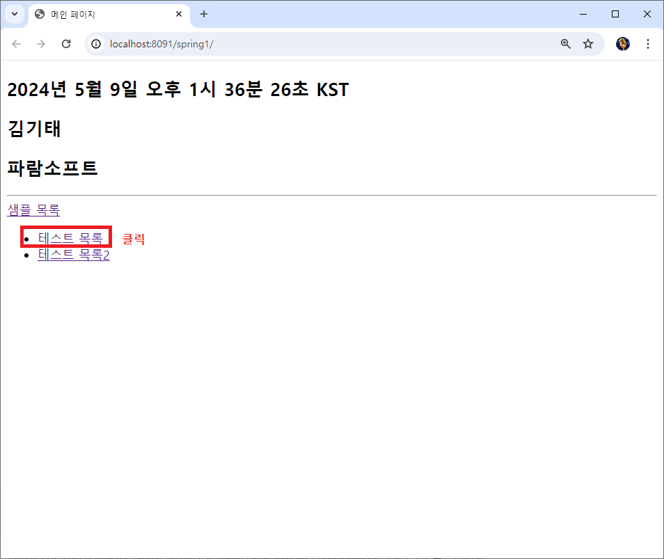


<br>

**테스트 목록2 실행**

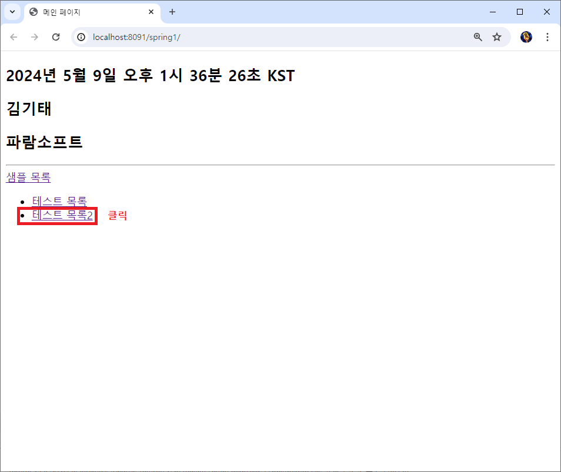


<br>

**특정 항목 열기 실행**

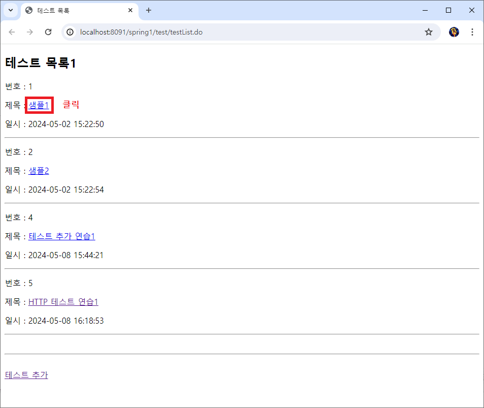

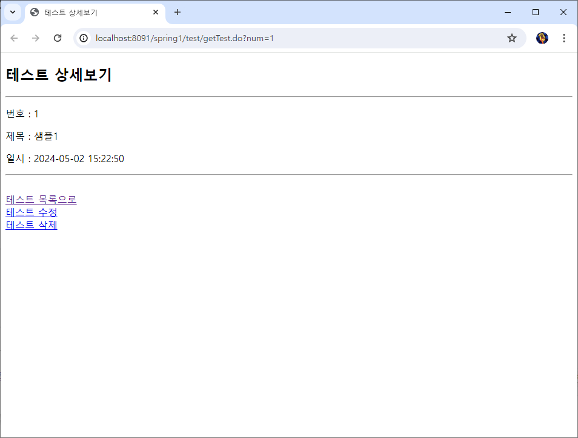

<br>

**특정 항목 수정 실행**

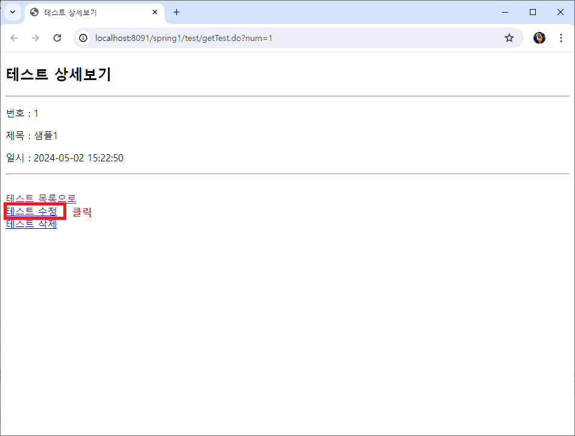

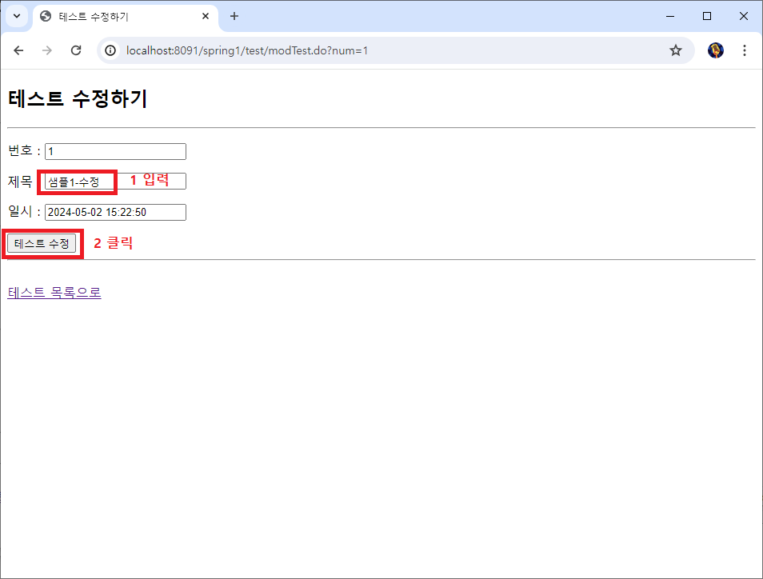


<br>

**특정 항목 삭제 실행**

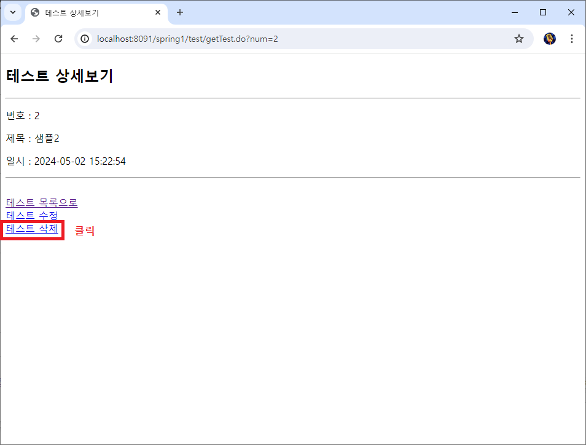

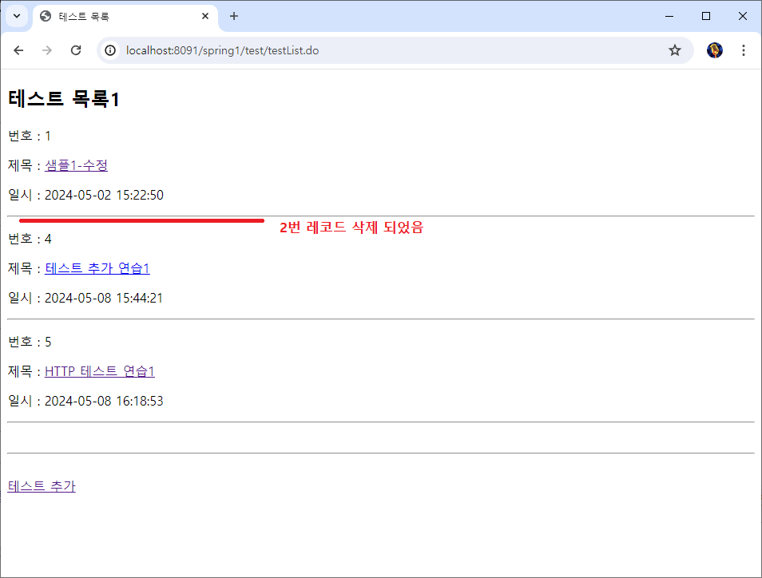

<br>

**특정 항목 추가 작업 실행**


<br><br><br>

<div id="4-5"></div>

## 4-5. ObjectAid 로 클래스 다이어그램 작성하기

### 4-5-1. sts에 ObjectAid 다운로드 및 수동 설치

#### 4-5-1-1. ObjectAid 다운로드

<a href="./plugin/objectAid/objectaid.zip" download>objectaid.zip 다운로드</a>

<a href="./plugin/objectAid/bundles.info에 추가할 내용.txt" download>bundles.info에 추가할 내용.txt 다운로드</a>

#### ※ 위 objectaid.zip과 bundles.info에 추가할 내용.txt 를 다운로드 받으시기 바랍니다. 다운로드가 안 될 경우 plugin/objectAid 디렉토리에 있으니 참고하여 다운로드 받으시면 됩니다.

<span style="font-size:32px;color:red"> ※ objectaid를 설치하기 전에 반드시 sts를 모두 종료하고, 진행하여야 합니다.</span>

<br><br>

#### 4-5-1-2. ObjectAid 압축풀기

**다운로드 받은 objectaid.zip 파일을 sts가 설치된 sts.exe가 존재하는 디렉토리에 압축을 해제합니다.**

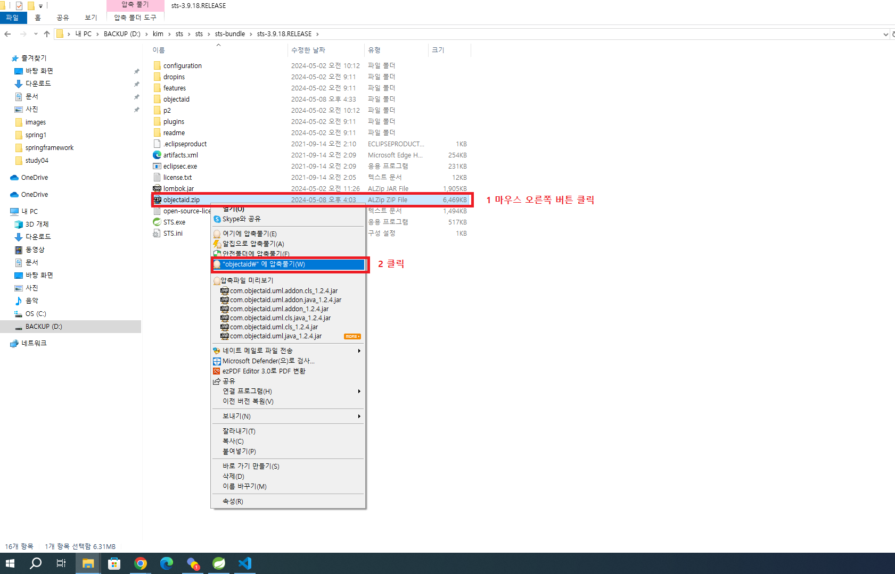

<br>

**다운로드 받은 bundles.info에 추가할 내용.txt 파일을 열고, 찾아 바꾸기를 진행하고, 변경된 내용을 전체 선택하여 복사하기 합니다.**


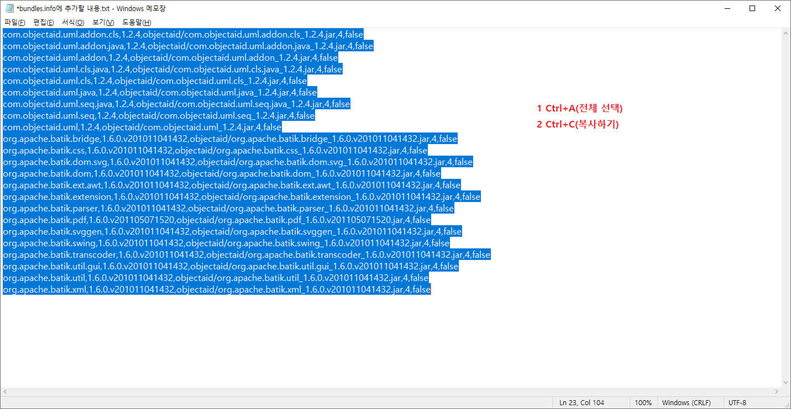

<br>

**sts가 설치된 디렉토리 안의 configuration/org.eclipse.equinox.simpleconfigurator/bundles.info를 메모장으로 열고, 맨 끝에 복사하기 한 내용을 붙여 넣고 저장합니다.**


<br><br><br>

### 4-5-2. sts에서 ObjectAid를 활용하여 클래스 다이어그램 작성하기

**sts를 다시 시작하여 아래와 같이 클래스 다이어그램을 작성합니다.**


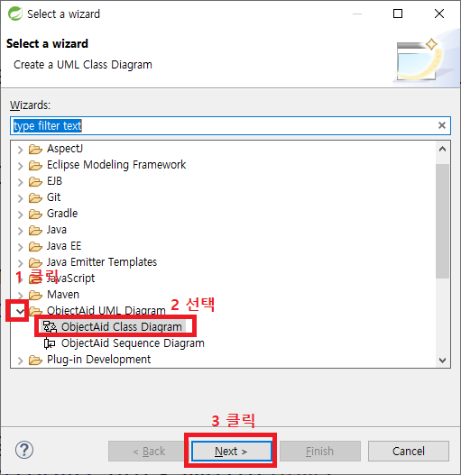

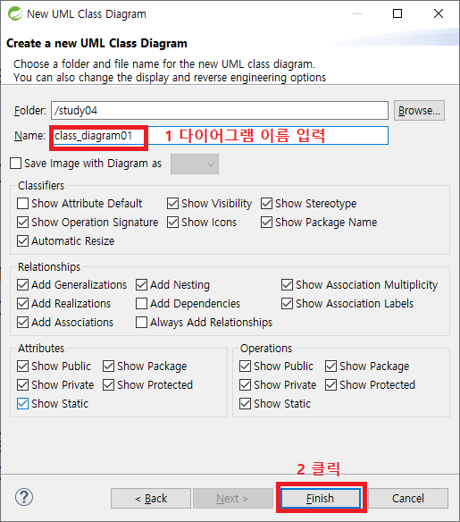

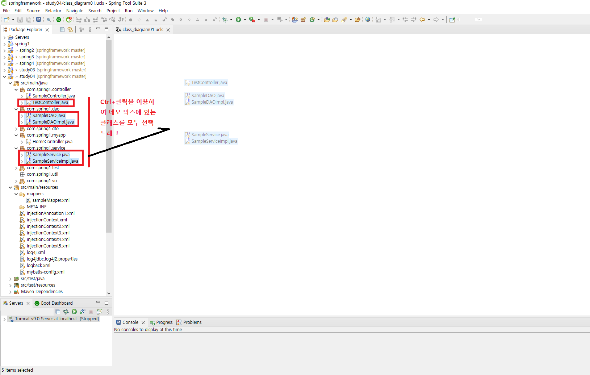


<br><br><hr><br><br>

