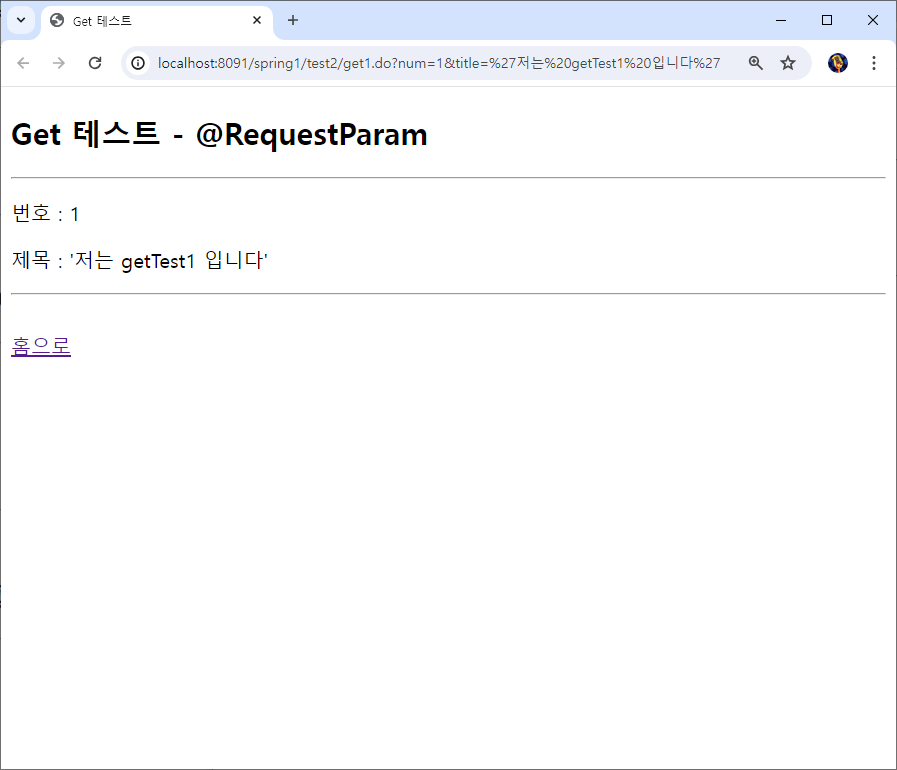
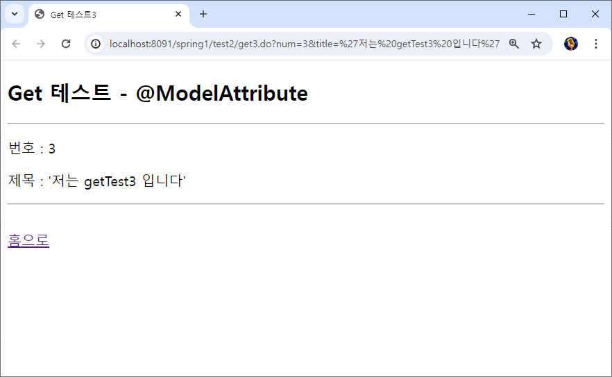
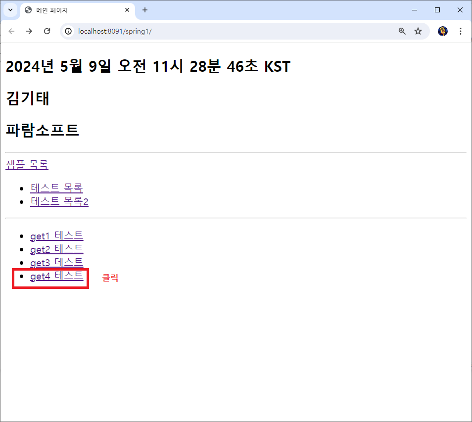
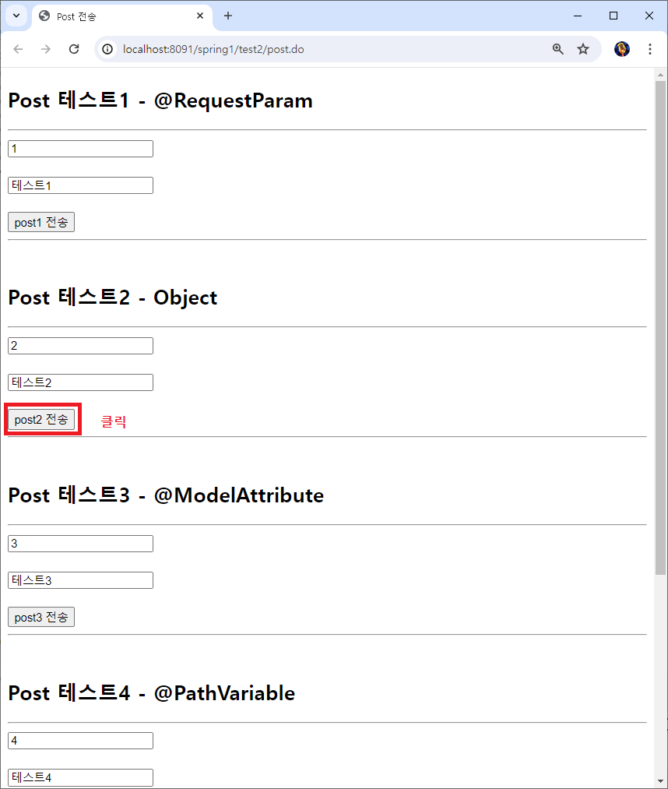
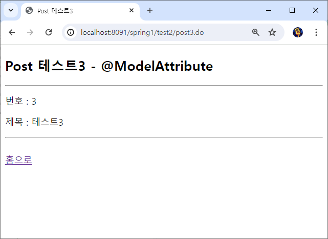
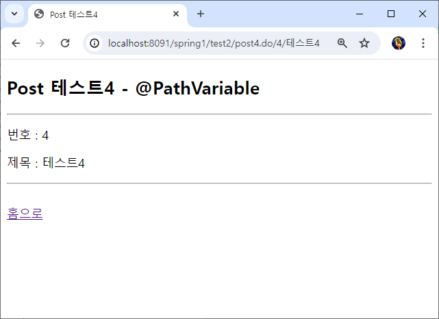
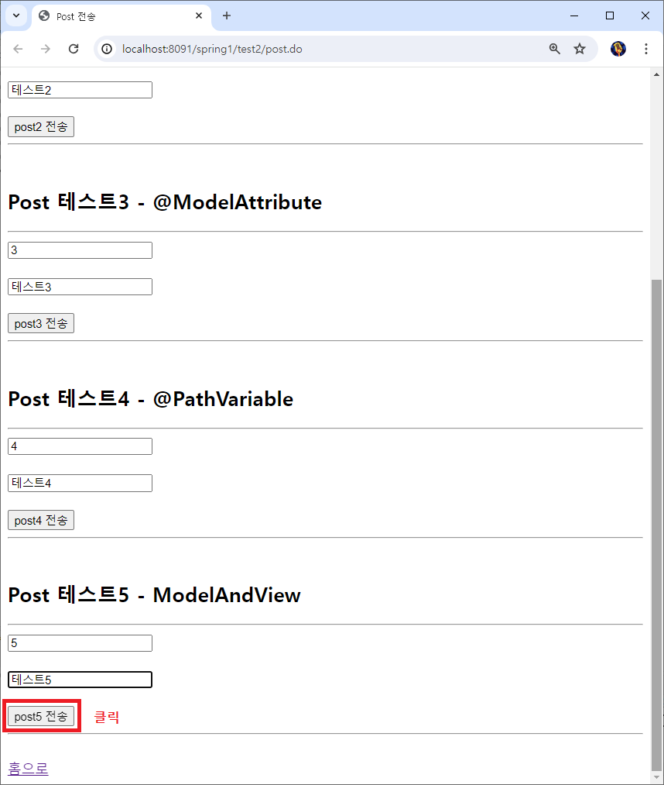
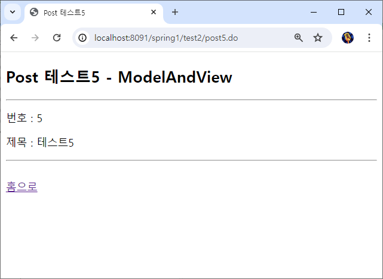

<nav id="quick" style="position:fixed;top:150px;right:100px;width:200px;height:auto;overflow:hidden;z-index:999;background-color:rgba(255,255,255,0.75);">
	<label for="chap5" style="color:black;font-size:28px;">5. HTTP Request Parameter Receive & Resolve</label>
	<input type="radio" name="chap" id="chap5" style="display:none;">
	<ul class="menu">
		<li><a href="#5-1" style="color:black;font-size:20px;text-decoration:none;">5-1. GetMapping 의 파라미터 받는 방법</a></li>
		<li><a href="#5-2" style="color:black;font-size:20px;text-decoration:none;">5-2. PostMapping 의 파라미터 받는 방법</li>
	</ul>	
</nav>

<div id="5-1"></div>

## 5-1. GetMapping 의 파라미터 받는 방법

### 5-1-1. GetMapping 의 @RequestParam 을 이용하여 파라미터 값 받기

**com.spring1.controller.TestController2 작성**

```java
package com.spring1.controller;

import org.springframework.beans.factory.annotation.Autowired;
import org.springframework.stereotype.Controller;
import org.springframework.ui.Model;
import org.springframework.web.bind.annotation.GetMapping;
import org.springframework.web.bind.annotation.ModelAttribute;
import org.springframework.web.bind.annotation.PathVariable;
import org.springframework.web.bind.annotation.PostMapping;
import org.springframework.web.bind.annotation.RequestMapping;
import org.springframework.web.bind.annotation.RequestParam;
import org.springframework.web.servlet.ModelAndView;

import com.spring1.dto.Sample;
import com.spring1.service.SampleService;

@Controller
@RequestMapping("/test2/")
public class TestController2 {

	@GetMapping("get1.do")
	public String get1(@RequestParam("num") int num, 
			@RequestParam("title") String title, Model model) {
		model.addAttribute("num", num);
		model.addAttribute("title", title);
		return "test2/get1";
	}	
}
```

<br><br>

**src/main/webapp/WEB-INF/views/test2/get1.jsp 작성**

```java
<%@ page language="java" contentType="text/html; charset=UTF-8"
    pageEncoding="UTF-8"%>
<%@ taglib prefix="c" uri="http://java.sun.com/jsp/jstl/core"  %>
<%@ taglib prefix="fmt" uri="http://java.sun.com/jsp/jstl/fmt" %>
<%@ taglib prefix="fn" uri = "http://java.sun.com/jsp/jstl/functions"%>
<c:set var="path2" value="${pageContext.request.contextPath }" />
<!DOCTYPE html>
<html>
<head>
<meta charset="UTF-8">
<title>Get 테스트</title>
</head>
<body>
	<h2>Get 테스트 - @RequestParam</h2>
	<hr>
	<div class="test">
		<p>번호 : ${num }</p>
		<p>제목 : ${title }</p>
	</div>
	<hr><br>
	<a href="${path2 }">홈으로</a><br>
</body>
</html>
```

<br><br>

**src/main/webapp/WEB-INF/views/home.jsp 수정**

```java
<%@ page language="java" contentType="text/html; charset=UTF-8"
    pageEncoding="UTF-8"%>
<%@ taglib uri="http://java.sun.com/jsp/jstl/core" prefix="c" %>
<%@ taglib prefix="c" uri="http://java.sun.com/jsp/jstl/core"  %>
<%@ taglib prefix="fmt" uri="http://java.sun.com/jsp/jstl/fmt" %>
<%@ taglib prefix="fn" uri = "http://java.sun.com/jsp/jstl/functions"%>
<c:set var="path2" value="${pageContext.request.contextPath }" />
<!DOCTYPE html>
<html>
<head>
<meta charset="UTF-8">
<title>메인 페이지</title>
</head>
<body>
	<h2>${serverTime }</h2>
	<h2>${author }</h2>
	<h2>${company }</h2>
	<hr>
	<a href="${path2 }/sample/list.do">샘플 목록</a>
	<ul>
		<li><a href="${path2 }/test/testList.do">테스트 목록</a></li>
		<li><a href="${path2 }/test/testList2.do">테스트 목록2</a></li>
	</ul>
	<!-- 여기부터 수정된 내용 -->
	<hr>
	<ul>
		<li><a href="${path2 }/test2/get1.do?num=1&title='저는 getTest1 입니다'">get1 테스트</a></li>
	</ul>
</body>
</html>
```

<br><br>

**실행 결과**




<br><br>

### 5-1-2. GetMapping 의 Object 를 이용하여 파라미터 값 받기

**com.spring1.controller.TestController2 수정**

```java
package com.spring1.controller;

import org.springframework.beans.factory.annotation.Autowired;
import org.springframework.stereotype.Controller;
import org.springframework.ui.Model;
import org.springframework.web.bind.annotation.GetMapping;
import org.springframework.web.bind.annotation.ModelAttribute;
import org.springframework.web.bind.annotation.PathVariable;
import org.springframework.web.bind.annotation.PostMapping;
import org.springframework.web.bind.annotation.RequestMapping;
import org.springframework.web.bind.annotation.RequestParam;
import org.springframework.web.servlet.ModelAndView;

import com.spring1.dto.Sample;
import com.spring1.service.SampleService;

@Controller
@RequestMapping("/test2/")
public class TestController2 {
	
	@Autowired
	private SampleService sampleService;

	@GetMapping("get1.do")
	public String get1(@RequestParam("num") int num, 
			@RequestParam("title") String title, Model model) {
		model.addAttribute("num", num);
		model.addAttribute("title", title);
		return "test2/get1";
	}
	
	@GetMapping("get2.do")	//추가된 내용
	public String get2(Sample sample, Model model) {
		model.addAttribute("test", sample);
		return "test2/get2";
	}
}
```

<br><br>

**src/main/webapp/WEB-INF/views/test2/get2.jsp 작성**

```java
<%@ page language="java" contentType="text/html; charset=UTF-8"
    pageEncoding="UTF-8"%>
<%@ taglib prefix="c" uri="http://java.sun.com/jsp/jstl/core"  %>
<%@ taglib prefix="fmt" uri="http://java.sun.com/jsp/jstl/fmt" %>
<%@ taglib prefix="fn" uri = "http://java.sun.com/jsp/jstl/functions"%>
<c:set var="path2" value="${pageContext.request.contextPath }" />
<!DOCTYPE html>
<html>
<head>
<meta charset="UTF-8">
<title>Get 테스트2</title>
</head>
<body>
	<h2>Get 테스트 - Object</h2>
	<hr>
	<div class="test">
		<p>번호 : ${test.num }</p>
		<p>제목 : ${test.title }</p>
	</div>
	<hr><br>
	<a href="${path2 }">홈으로</a><br>
</body>
</html>
```

<br><br>

**src/main/webapp/WEB-INF/views/home.jsp 수정**

```java
<%@ page language="java" contentType="text/html; charset=UTF-8"
    pageEncoding="UTF-8"%>
<%@ taglib uri="http://java.sun.com/jsp/jstl/core" prefix="c" %>
<%@ taglib prefix="c" uri="http://java.sun.com/jsp/jstl/core"  %>
<%@ taglib prefix="fmt" uri="http://java.sun.com/jsp/jstl/fmt" %>
<%@ taglib prefix="fn" uri = "http://java.sun.com/jsp/jstl/functions"%>
<c:set var="path2" value="${pageContext.request.contextPath }" />
<!DOCTYPE html>
<html>
<head>
<meta charset="UTF-8">
<title>메인 페이지</title>
</head>
<body>
	<h2>${serverTime }</h2>
	<h2>${author }</h2>
	<h2>${company }</h2>
	<hr>
	<a href="${path2 }/sample/list.do">샘플 목록</a>
	<ul>
		<li><a href="${path2 }/test/testList.do">테스트 목록</a></li>
		<li><a href="${path2 }/test/testList2.do">테스트 목록2</a></li>
	</ul>
	<hr>
	<ul>
		<li><a href="${path2 }/test2/get1.do?num=1&title='저는 getTest1 입니다'">get1 테스트</a></li>
		<!-- 추가된 내용 -->
		<li><a href="${path2 }/test2/get2.do?num=2&title='저는 getTest2 입니다'">get2 테스트</a></li>
	</ul>	
</body>
</html>
```

<br><br>

**실행 결과**


<br><br>

### 5-1-3. GetMapping 의 @ModelAttribute 를 이용하여 파라미터 값 받기

**com.spring1.controller.TestController2 수정**

```java
package com.spring1.controller;

import org.springframework.beans.factory.annotation.Autowired;
import org.springframework.stereotype.Controller;
import org.springframework.ui.Model;
import org.springframework.web.bind.annotation.GetMapping;
import org.springframework.web.bind.annotation.ModelAttribute;
import org.springframework.web.bind.annotation.PathVariable;
import org.springframework.web.bind.annotation.PostMapping;
import org.springframework.web.bind.annotation.RequestMapping;
import org.springframework.web.bind.annotation.RequestParam;
import org.springframework.web.servlet.ModelAndView;

import com.spring1.dto.Sample;
import com.spring1.service.SampleService;

@Controller
@RequestMapping("/test2/")
public class TestController2 {
	
	@Autowired
	private SampleService sampleService;

	@GetMapping("get1.do")
	public String get1(@RequestParam("num") int num, 
			@RequestParam("title") String title, Model model) {
		model.addAttribute("num", num);
		model.addAttribute("title", title);
		return "test2/get1";
	}
	
	@GetMapping("get2.do")
	public String get2(Sample sample, Model model) {
		model.addAttribute("test", sample);
		return "test2/get2";
	}
	
	@GetMapping("get3.do")	//추가된 내용
	public String get3(@ModelAttribute("sam") Sample sample, Model model) {
		return "test2/get3";
	}
}
```

<br><br>

**src/main/webapp/WEB-INF/views/test2/get3.jsp 작성**

```java
<%@ page language="java" contentType="text/html; charset=UTF-8"
    pageEncoding="UTF-8"%>
<%@ taglib prefix="c" uri="http://java.sun.com/jsp/jstl/core"  %>
<%@ taglib prefix="fmt" uri="http://java.sun.com/jsp/jstl/fmt" %>
<%@ taglib prefix="fn" uri = "http://java.sun.com/jsp/jstl/functions"%>
<c:set var="path2" value="${pageContext.request.contextPath }" />
<!DOCTYPE html>
<html>
<head>
<meta charset="UTF-8">
<title>Get 테스트3</title>
</head>
<body>
	<h2>Get 테스트 - @ModelAttribute</h2>
	<hr>
	<div class="test">
		<p>번호 : ${sam.num }</p>
		<p>제목 : ${sam.title }</p>
	</div>
	<hr><br>
	<a href="${path2 }">홈으로</a><br>
</body>
</html>
```

<br><br>

**src/main/webapp/WEB-INF/views/home.jsp 수정**

```java
<%@ page language="java" contentType="text/html; charset=UTF-8"
    pageEncoding="UTF-8"%>
<%@ taglib uri="http://java.sun.com/jsp/jstl/core" prefix="c" %>
<%@ taglib prefix="c" uri="http://java.sun.com/jsp/jstl/core"  %>
<%@ taglib prefix="fmt" uri="http://java.sun.com/jsp/jstl/fmt" %>
<%@ taglib prefix="fn" uri = "http://java.sun.com/jsp/jstl/functions"%>
<c:set var="path2" value="${pageContext.request.contextPath }" />
<!DOCTYPE html>
<html>
<head>
<meta charset="UTF-8">
<title>메인 페이지</title>
</head>
<body>
	<h2>${serverTime }</h2>
	<h2>${author }</h2>
	<h2>${company }</h2>
	<hr>
	<a href="${path2 }/sample/list.do">샘플 목록</a>
	<ul>
		<li><a href="${path2 }/test/testList.do">테스트 목록</a></li>
		<li><a href="${path2 }/test/testList2.do">테스트 목록2</a></li>
	</ul>
	<hr>
	<ul>
		<li><a href="${path2 }/test2/get1.do?num=1&title='저는 getTest1 입니다'">get1 테스트</a></li>
		<li><a href="${path2 }/test2/get2.do?num=2&title='저는 getTest2 입니다'">get2 테스트</a></li>
		<!-- 추가된 내용 -->
		<li><a href="${path2 }/test2/get3.do?num=3&title='저는 getTest3 입니다'">get3 테스트</a></li>
	</ul>	
</body>
</html>
```

<br><br>

**실행 결과**




<br><br>

### 5-1-4. GetMapping 의 @PathVariable 를 이용하여 파라미터 값 받기

**com.spring1.controller.TestController2 수정**

```java
package com.spring1.controller;

import org.springframework.beans.factory.annotation.Autowired;
import org.springframework.stereotype.Controller;
import org.springframework.ui.Model;
import org.springframework.web.bind.annotation.GetMapping;
import org.springframework.web.bind.annotation.ModelAttribute;
import org.springframework.web.bind.annotation.PathVariable;
import org.springframework.web.bind.annotation.PostMapping;
import org.springframework.web.bind.annotation.RequestMapping;
import org.springframework.web.bind.annotation.RequestParam;
import org.springframework.web.servlet.ModelAndView;

import com.spring1.dto.Sample;
import com.spring1.service.SampleService;

@Controller
@RequestMapping("/test2/")
public class TestController2 {
	
	@Autowired
	private SampleService sampleService;

	@GetMapping("get1.do")
	public String get1(@RequestParam("num") int num, 
			@RequestParam("title") String title, Model model) {
		model.addAttribute("num", num);
		model.addAttribute("title", title);
		return "test2/get1";
	}
	
	@GetMapping("get2.do")
	public String get2(Sample sample, Model model) {
		model.addAttribute("test", sample);
		return "test2/get2";
	}
	
	@GetMapping("get3.do")
	public String get3(@ModelAttribute("sam") Sample sample, Model model) {
		return "test2/get3";
	}
	
	@GetMapping("get4.do/{num}/{title}")	//추가된 내용
	public String get4(@PathVariable("num") int num, 
			@PathVariable("title") String title, Model model) {
		Sample test = new Sample(num, title, "2024-05-09");
		model.addAttribute("test", test);
		return "test2/get4";
	}
}
```

<br><br>

**src/main/webapp/WEB-INF/views/test2/get4.jsp 작성**

```java
<%@ page language="java" contentType="text/html; charset=UTF-8"
    pageEncoding="UTF-8"%>
<%@ taglib prefix="c" uri="http://java.sun.com/jsp/jstl/core"  %>
<%@ taglib prefix="fmt" uri="http://java.sun.com/jsp/jstl/fmt" %>
<%@ taglib prefix="fn" uri = "http://java.sun.com/jsp/jstl/functions"%>
<c:set var="path2" value="${pageContext.request.contextPath }" />
<!DOCTYPE html>
<html>
<head>
<meta charset="UTF-8">
<title>Get 테스트4</title>
</head>
<body>
	<h2>Get 테스트 - @PathVariable</h2>
	<hr>
	<div class="test">
		<p>번호 : ${test.num }</p>
		<p>제목 : ${test.title }</p>
	</div>
	<hr><br>
	<a href="${path2 }">홈으로</a><br>
</body>
</html>
```

<br><br>

**src/main/webapp/WEB-INF/views/home.jsp 수정**

```java
<%@ page language="java" contentType="text/html; charset=UTF-8"
    pageEncoding="UTF-8"%>
<%@ taglib uri="http://java.sun.com/jsp/jstl/core" prefix="c" %>
<%@ taglib prefix="c" uri="http://java.sun.com/jsp/jstl/core"  %>
<%@ taglib prefix="fmt" uri="http://java.sun.com/jsp/jstl/fmt" %>
<%@ taglib prefix="fn" uri = "http://java.sun.com/jsp/jstl/functions"%>
<c:set var="path2" value="${pageContext.request.contextPath }" />
<!DOCTYPE html>
<html>
<head>
<meta charset="UTF-8">
<title>메인 페이지</title>
</head>
<body>
	<h2>${serverTime }</h2>
	<h2>${author }</h2>
	<h2>${company }</h2>
	<hr>
	<a href="${path2 }/sample/list.do">샘플 목록</a>
	<ul>
		<li><a href="${path2 }/test/testList.do">테스트 목록</a></li>
		<li><a href="${path2 }/test/testList2.do">테스트 목록2</a></li>
	</ul>
	<hr>
	<ul>
		<li><a href="${path2 }/test2/get1.do?num=1&title='저는 getTest1 입니다'">get1 테스트</a></li>
		<li><a href="${path2 }/test2/get2.do?num=2&title='저는 getTest2 입니다'">get2 테스트</a></li>
		<li><a href="${path2 }/test2/get3.do?num=3&title='저는 getTest3 입니다'">get3 테스트</a></li>
		<!-- 추가된 내용 -->
		<li><a href="${path2 }/test2/get4.do/4/저는 getTest4 입니다">get4 테스트</a></li>
	</ul>	
</body>
</html>
```

<br><br>

**실행 결과**




<br><br>

### 5-1-5. ModelAndView 를 이용하여 View(jsp)에 값 보내기

**com.spring1.controller.TestController2 수정**

```java
package com.spring1.controller;

import org.springframework.beans.factory.annotation.Autowired;
import org.springframework.stereotype.Controller;
import org.springframework.ui.Model;
import org.springframework.web.bind.annotation.GetMapping;
import org.springframework.web.bind.annotation.ModelAttribute;
import org.springframework.web.bind.annotation.PathVariable;
import org.springframework.web.bind.annotation.PostMapping;
import org.springframework.web.bind.annotation.RequestMapping;
import org.springframework.web.bind.annotation.RequestParam;
import org.springframework.web.servlet.ModelAndView;

import com.spring1.dto.Sample;
import com.spring1.service.SampleService;

@Controller
@RequestMapping("/test2/")
public class TestController2 {
	
	@Autowired
	private SampleService sampleService;

	@GetMapping("get1.do")
	public String get1(@RequestParam("num") int num, 
			@RequestParam("title") String title, Model model) {
		model.addAttribute("num", num);
		model.addAttribute("title", title);
		return "test2/get1";
	}
	
	@GetMapping("get2.do")
	public String get2(Sample sample, Model model) {
		model.addAttribute("test", sample);
		return "test2/get2";
	}
	
	@GetMapping("get3.do")
	public String get3(@ModelAttribute("sam") Sample sample, Model model) {
		return "test2/get3";
	}
	
	@GetMapping("get4.do/{num}/{title}")
	public String get4(@PathVariable("num") int num, 
			@PathVariable("title") String title, Model model) {
		Sample test = new Sample(num, title, "2024-05-09");
		model.addAttribute("test", test);
		return "test2/get4";
	}
	
	@GetMapping("get5.do")	//추가된 내용
	public ModelAndView get5(@RequestParam("num") int num, 
			@RequestParam("title") String title, ModelAndView mav) {
		mav.addObject("num", num);
		mav.addObject("title", title);
		mav.setViewName("test2/get5");
		return mav;
	}
}
```

<br><br>

**src/main/webapp/WEB-INF/views/test2/get5.jsp 작성**

```java
<%@ page language="java" contentType="text/html; charset=UTF-8"
    pageEncoding="UTF-8"%>
<%@ taglib prefix="c" uri="http://java.sun.com/jsp/jstl/core"  %>
<%@ taglib prefix="fmt" uri="http://java.sun.com/jsp/jstl/fmt" %>
<%@ taglib prefix="fn" uri = "http://java.sun.com/jsp/jstl/functions"%>
<c:set var="path2" value="${pageContext.request.contextPath }" />
<!DOCTYPE html>
<html>
<head>
<meta charset="UTF-8">
<title>Get 테스트5</title>
</head>
<body>
	<h2>Get 테스트 - ModelAndView</h2>
	<hr>
	<div class="test">
		<p>번호 : ${num }</p>
		<p>제목 : ${title }</p>
	</div>
	<hr><br>
	<a href="${path2 }">홈으로</a><br>
</body>
</html>
```

<br><br>

**src/main/webapp/WEB-INF/views/home.jsp 수정**

```java
<%@ page language="java" contentType="text/html; charset=UTF-8"
    pageEncoding="UTF-8"%>
<%@ taglib uri="http://java.sun.com/jsp/jstl/core" prefix="c" %>
<%@ taglib prefix="c" uri="http://java.sun.com/jsp/jstl/core"  %>
<%@ taglib prefix="fmt" uri="http://java.sun.com/jsp/jstl/fmt" %>
<%@ taglib prefix="fn" uri = "http://java.sun.com/jsp/jstl/functions"%>
<c:set var="path2" value="${pageContext.request.contextPath }" />
<!DOCTYPE html>
<html>
<head>
<meta charset="UTF-8">
<title>메인 페이지</title>
</head>
<body>
	<h2>${serverTime }</h2>
	<h2>${author }</h2>
	<h2>${company }</h2>
	<hr>
	<a href="${path2 }/sample/list.do">샘플 목록</a>
	<ul>
		<li><a href="${path2 }/test/testList.do">테스트 목록</a></li>
		<li><a href="${path2 }/test/testList2.do">테스트 목록2</a></li>
	</ul>
	<hr>
	<ul>
		<li><a href="${path2 }/test2/get1.do?num=1&title='저는 getTest1 입니다'">get1 테스트</a></li>
		<li><a href="${path2 }/test2/get2.do?num=2&title='저는 getTest2 입니다'">get2 테스트</a></li>
		<li><a href="${path2 }/test2/get3.do?num=3&title='저는 getTest3 입니다'">get3 테스트</a></li>
		<li><a href="${path2 }/test2/get4.do/4/저는 getTest4 입니다">get4 테스트</a></li>
		<!-- 추가된 내용 -->
		<li><a href="${path2 }/test2/get5.do?num=5&title=저는 getTest5 입니다">get5 테스트</a></li>
	</ul>
</body>
</html>
```

<br><br>

**실행 결과**


<br><br><br>

<div id="5-2"></div>

## 5-2. PostMapping 의 파라미터 받는 방법

### 5-2-1. PostMapping 의 @RequestParam 을 이용하여 파라미터 값 받기

**com.spring1.controller.TestController2 수정**

```java

```

<br><br>

**src/main/webapp/WEB-INF/views/test2/post.jsp 작성**

```java
package com.spring1.controller;

import org.springframework.beans.factory.annotation.Autowired;
import org.springframework.stereotype.Controller;
import org.springframework.ui.Model;
import org.springframework.web.bind.annotation.GetMapping;
import org.springframework.web.bind.annotation.ModelAttribute;
import org.springframework.web.bind.annotation.PathVariable;
import org.springframework.web.bind.annotation.PostMapping;
import org.springframework.web.bind.annotation.RequestMapping;
import org.springframework.web.bind.annotation.RequestParam;
import org.springframework.web.servlet.ModelAndView;

import com.spring1.dto.Sample;
import com.spring1.service.SampleService;

@Controller
@RequestMapping("/test2/")
public class TestController2 {
	
	@Autowired
	private SampleService sampleService;

	@GetMapping("get1.do")
	public String get1(@RequestParam("num") int num, 
			@RequestParam("title") String title, Model model) {
		model.addAttribute("num", num);
		model.addAttribute("title", title);
		return "test2/get1";
	}
	
	@GetMapping("get2.do")
	public String get2(Sample sample, Model model) {
		model.addAttribute("test", sample);
		return "test2/get2";
	}
	
	@GetMapping("get3.do")
	public String get3(@ModelAttribute("sam") Sample sample, Model model) {
		return "test2/get3";
	}
	
	@GetMapping("get4.do/{num}/{title}")
	public String get4(@PathVariable("num") int num, 
			@PathVariable("title") String title, Model model) {
		Sample test = new Sample(num, title, "2024-05-09");
		model.addAttribute("test", test);
		return "test2/get4";
	}
	
	@GetMapping("get5.do")
	public ModelAndView get5(@RequestParam("num") int num, 
			@RequestParam("title") String title, ModelAndView mav) {
		mav.addObject("num", num);
		mav.addObject("title", title);
		mav.setViewName("test2/get5");
		return mav;
	}
	
	@GetMapping("post.do")	//추가된 내용
	public String post(Model model) {
		return "test2/post";
	}
	
	@PostMapping("post1.do")	//추가된 내용
	public String post1(@RequestParam("num") int num, 
			@RequestParam("title") String title, Model model) {
		model.addAttribute("num", num);
		model.addAttribute("title", title);
		return "test2/post1";
	}
}
```

<br><br>

**src/main/webapp/WEB-INF/views/test2/post1.jsp 작성**

```java
<%@ page language="java" contentType="text/html; charset=UTF-8"
    pageEncoding="UTF-8"%>
<%@ taglib prefix="c" uri="http://java.sun.com/jsp/jstl/core"  %>
<%@ taglib prefix="fmt" uri="http://java.sun.com/jsp/jstl/fmt" %>
<%@ taglib prefix="fn" uri = "http://java.sun.com/jsp/jstl/functions"%>
<c:set var="path2" value="${pageContext.request.contextPath }" />
<!DOCTYPE html>
<html>
<head>
<meta charset="UTF-8">
<title>Post 테스트1</title>
</head>
<body>
	<h2>Post 테스트1 - @RequestParam</h2>
	<hr>
	<div class="test">
		<p>번호 : ${num }</p>
		<p>제목 : ${title }</p>
	</div>
	<hr><br>
	<a href="${path2 }">홈으로</a><br>
</body>
</html>
```

<br><br>

**src/main/webapp/WEB-INF/views/test2/post.jsp 작성**

```java
<%@ page language="java" contentType="text/html; charset=UTF-8"
    pageEncoding="UTF-8"%>
<%@ taglib prefix="c" uri="http://java.sun.com/jsp/jstl/core"  %>
<%@ taglib prefix="fmt" uri="http://java.sun.com/jsp/jstl/fmt" %>
<%@ taglib prefix="fn" uri = "http://java.sun.com/jsp/jstl/functions"%>
<c:set var="path2" value="${pageContext.request.contextPath }" />
<!DOCTYPE html>
<html>
<head>
<meta charset="UTF-8">
<title>Post 전송</title>
<script src="https://code.jquery.com/jquery-1.11.0.js"></script>
</head>
<body>
<div class="wrap">
	<h2>Post 테스트1 - @RequestParam</h2>
	<hr>
	<div class="test">
		<form name="post1" action="${path2 }/test2/post1.do" method="post">
			<input type="number" name="num" id="num1" placeholder="숫자 입력" requrired /><br><br>
			<input type="text" name="title" id="title1" placeholder="제목 입력" requrired /><br><br>
			<button type="submit">post1 전송</button>
		</form>
	</div>
	<hr><br>
</div>
<div class="wrap">
	<h2>Post 테스트2 - Object</h2>
	<hr>
	<div class="test">
		<form name="post2" action="${path2 }/test2/post2.do" method="post">
			<input type="number" name="num" id="num2" placeholder="숫자 입력" requrired /><br><br>
			<input type="text" name="title" id="title2" placeholder="제목 입력" requrired /><br><br>
			<button type="submit">post2 전송</button>
		</form>
	</div>
	<hr><br>
</div>
<div class="wrap">
	<h2>Post 테스트3 - @ModelAttribute</h2>
	<hr>
	<div class="test">
		<form name="post3" action="${path2 }/test2/post3.do" method="post">
			<input type="number" name="num" id="num3" placeholder="숫자 입력" requrired /><br><br>
			<input type="text" name="title" id="title3" placeholder="제목 입력" requrired /><br><br>
			<button type="submit">post3 전송</button>
		</form>
	</div>
	<hr><br>
</div>
<div class="wrap">
	<h2>Post 테스트4 - @PathVariable</h2>
	<hr>
	<div class="test">
		<form name="post4" action="" method="get">
			<input type="number" name="num" id="num4" placeholder="숫자 입력" requrired /><br><br>
			<input type="text" name="title" id="title4" placeholder="제목 입력" required /><br><br>
			<button type="button" onclick="fnc1()">post4 전송</button>
		</form>
	</div>
	<script>
	function fnc1() {
		if($("#num4").val()=="" || $("#title4").val()==""){
			alert("값이 비어 있습니다.");
			return;
		}
		var num = parseInt($("#num4").val());
		var title = $("#title4").val();
		location.href = "${path2 }/test2/post4.do/"+num+"/"+title;
	}
	</script>	
	<hr><br>
</div>
<div class="wrap">
	<h2>Post 테스트5 - ModelAndView</h2>
	<hr>
	<div class="test">
		<form name="post5" action="${path2 }/test2/post5.do" method="post">
			<input type="number" name="num" id="num5" placeholder="숫자 입력" requrired /><br><br>
			<input type="text" name="title" id="title5" placeholder="제목 입력" requrired /><br><br>
			<button type="submit">post5 전송</button>
		</form>
	</div>
	<hr><br>
</div>


	<a href="${path2 }">홈으로</a><br>
</body>
</html>
```

<br><br>

**src/main/webapp/WEB-INF/views/home.jsp 수정**

```java
<%@ page language="java" contentType="text/html; charset=UTF-8"
    pageEncoding="UTF-8"%>
<%@ taglib uri="http://java.sun.com/jsp/jstl/core" prefix="c" %>
<%@ taglib prefix="c" uri="http://java.sun.com/jsp/jstl/core"  %>
<%@ taglib prefix="fmt" uri="http://java.sun.com/jsp/jstl/fmt" %>
<%@ taglib prefix="fn" uri = "http://java.sun.com/jsp/jstl/functions"%>
<c:set var="path2" value="${pageContext.request.contextPath }" />
<!DOCTYPE html>
<html>
<head>
<meta charset="UTF-8">
<title>메인 페이지</title>
</head>
<body>
	<h2>${serverTime }</h2>
	<h2>${author }</h2>
	<h2>${company }</h2>
	<hr>
	<a href="${path2 }/sample/list.do">샘플 목록</a>
	<ul>
		<li><a href="${path2 }/test/testList.do">테스트 목록</a></li>
		<li><a href="${path2 }/test/testList2.do">테스트 목록2</a></li>
	</ul>
	<hr>
	<ul>
		<li><a href="${path2 }/test2/get1.do?num=1&title='저는 getTest1 입니다'">get1 테스트</a></li>
		<li><a href="${path2 }/test2/get2.do?num=2&title='저는 getTest2 입니다'">get2 테스트</a></li>
		<li><a href="${path2 }/test2/get3.do?num=3&title='저는 getTest3 입니다'">get3 테스트</a></li>
		<li><a href="${path2 }/test2/get4.do/4/저는 getTest4 입니다">get4 테스트</a></li>
		<li><a href="${path2 }/test2/get5.do?num=5&title=저는 getTest5 입니다">get5 테스트</a></li>
	</ul>
	<!-- 여기 부터 추가된 내용 -->
	<hr>
	<ul>
		<li><a href="${path2 }/test2/post.do">post 테스트</a></li>
	</ul>		
</body>
</html>
```

<br><br>

**실행 결과**


<br><br>

### 5-2-2. PostMapping 의 Object 를 이용하여 파라미터 값 받기

**com.spring1.controller.TestController2 수정**

```java
package com.spring1.controller;

import org.springframework.beans.factory.annotation.Autowired;
import org.springframework.stereotype.Controller;
import org.springframework.ui.Model;
import org.springframework.web.bind.annotation.GetMapping;
import org.springframework.web.bind.annotation.ModelAttribute;
import org.springframework.web.bind.annotation.PathVariable;
import org.springframework.web.bind.annotation.PostMapping;
import org.springframework.web.bind.annotation.RequestMapping;
import org.springframework.web.bind.annotation.RequestParam;
import org.springframework.web.servlet.ModelAndView;

import com.spring1.dto.Sample;
import com.spring1.service.SampleService;

@Controller
@RequestMapping("/test2/")
public class TestController2 {
	
	@Autowired
	private SampleService sampleService;

	@GetMapping("get1.do")
	public String get1(@RequestParam("num") int num, 
			@RequestParam("title") String title, Model model) {
		model.addAttribute("num", num);
		model.addAttribute("title", title);
		return "test2/get1";
	}
	
	@GetMapping("get2.do")
	public String get2(Sample sample, Model model) {
		model.addAttribute("test", sample);
		return "test2/get2";
	}
	
	@GetMapping("get3.do")
	public String get3(@ModelAttribute("sam") Sample sample, Model model) {
		return "test2/get3";
	}
	
	@GetMapping("get4.do/{num}/{title}")
	public String get4(@PathVariable("num") int num, 
			@PathVariable("title") String title, Model model) {
		Sample test = new Sample(num, title, "2024-05-09");
		model.addAttribute("test", test);
		return "test2/get4";
	}
	
	@GetMapping("get5.do")
	public ModelAndView get5(@RequestParam("num") int num, 
			@RequestParam("title") String title, ModelAndView mav) {
		mav.addObject("num", num);
		mav.addObject("title", title);
		mav.setViewName("test2/get5");
		return mav;
	}
	
	@GetMapping("post.do")
	public String post(Model model) {
		return "test2/post";
	}
	
	@PostMapping("post1.do")
	public String post1(@RequestParam("num") int num, 
			@RequestParam("title") String title, Model model) {
		model.addAttribute("num", num);
		model.addAttribute("title", title);
		return "test2/post1";
	}

	@PostMapping("post2.do")	//추가된 내용
	public String post2(Sample sample, Model model) {
		model.addAttribute("test", sample);
		return "test2/post2";
	}
}
```

<br><br>

**src/main/webapp/WEB-INF/views/test2/post2.jsp 작성**

```java
<%@ page language="java" contentType="text/html; charset=UTF-8"
    pageEncoding="UTF-8"%>
<%@ taglib prefix="c" uri="http://java.sun.com/jsp/jstl/core"  %>
<%@ taglib prefix="fmt" uri="http://java.sun.com/jsp/jstl/fmt" %>
<%@ taglib prefix="fn" uri = "http://java.sun.com/jsp/jstl/functions"%>
<c:set var="path2" value="${pageContext.request.contextPath }" />
<!DOCTYPE html>
<html>
<head>
<meta charset="UTF-8">
<title>Post 테스트2</title>
</head>
<body>
	<h2>Post 테스트2 - Object</h2>
	<hr>
	<div class="test">
		<p>번호 : ${test.num }</p>
		<p>제목 : ${test.title }</p>
	</div>
	<hr><br>
	<a href="${path2 }">홈으로</a><br>
</body>
</html>
```

<br><br>

**실행 결과**





<br><br>

### 5-2-3. PostMapping 의 @ModelAttribute 를 이용하여 파라미터 값 받기

**com.spring1.controller.TestController2 수정**

```java
package com.spring1.controller;

import org.springframework.beans.factory.annotation.Autowired;
import org.springframework.stereotype.Controller;
import org.springframework.ui.Model;
import org.springframework.web.bind.annotation.GetMapping;
import org.springframework.web.bind.annotation.ModelAttribute;
import org.springframework.web.bind.annotation.PathVariable;
import org.springframework.web.bind.annotation.PostMapping;
import org.springframework.web.bind.annotation.RequestMapping;
import org.springframework.web.bind.annotation.RequestParam;
import org.springframework.web.servlet.ModelAndView;

import com.spring1.dto.Sample;
import com.spring1.service.SampleService;

@Controller
@RequestMapping("/test2/")
public class TestController2 {
	
	@Autowired
	private SampleService sampleService;

	@GetMapping("get1.do")
	public String get1(@RequestParam("num") int num, 
			@RequestParam("title") String title, Model model) {
		model.addAttribute("num", num);
		model.addAttribute("title", title);
		return "test2/get1";
	}
	
	@GetMapping("get2.do")
	public String get2(Sample sample, Model model) {
		model.addAttribute("test", sample);
		return "test2/get2";
	}
	
	@GetMapping("get3.do")
	public String get3(@ModelAttribute("sam") Sample sample, Model model) {
		return "test2/get3";
	}
	
	@GetMapping("get4.do/{num}/{title}")
	public String get4(@PathVariable("num") int num, 
			@PathVariable("title") String title, Model model) {
		Sample test = new Sample(num, title, "2024-05-09");
		model.addAttribute("test", test);
		return "test2/get4";
	}
	
	@GetMapping("get5.do")
	public ModelAndView get5(@RequestParam("num") int num, 
			@RequestParam("title") String title, ModelAndView mav) {
		mav.addObject("num", num);
		mav.addObject("title", title);
		mav.setViewName("test2/get5");
		return mav;
	}
	
	@GetMapping("post.do")
	public String post(Model model) {
		return "test2/post";
	}
	
	@PostMapping("post1.do")
	public String post1(@RequestParam("num") int num, 
			@RequestParam("title") String title, Model model) {
		model.addAttribute("num", num);
		model.addAttribute("title", title);
		return "test2/post1";
	}

	@PostMapping("post2.do")
	public String post2(Sample sample, Model model) {
		model.addAttribute("test", sample);
		return "test2/post2";
	}

	@PostMapping("post3.do")	//추가된 내용
	public String post3(@ModelAttribute("sample") Sample sample, Model model) {
		model.addAttribute("test", sample);
		return "test2/post3";
	}
}
```

<br><br>

**src/main/webapp/WEB-INF/views/test2/post3.jsp 작성**

```java
<%@ page language="java" contentType="text/html; charset=UTF-8"
    pageEncoding="UTF-8"%>
<%@ taglib prefix="c" uri="http://java.sun.com/jsp/jstl/core"  %>
<%@ taglib prefix="fmt" uri="http://java.sun.com/jsp/jstl/fmt" %>
<%@ taglib prefix="fn" uri = "http://java.sun.com/jsp/jstl/functions"%>
<c:set var="path2" value="${pageContext.request.contextPath }" />
<!DOCTYPE html>
<html>
<head>
<meta charset="UTF-8">
<title>Post 테스트3</title>
</head>
<body>
	<h2>Post 테스트3 - @ModelAttribute</h2>
	<hr>
	<div class="test">
		<p>번호 : ${test.num }</p>
		<p>제목 : ${test.title }</p>
	</div>
	<hr><br>
	<a href="${path2 }">홈으로</a><br>
</body>
</html>
```

<br><br>

**실행 결과**




<br><br>

### 5-2-4. PostMapping 의 @PathVariable 를 이용하여 파라미터 값 받기

**com.spring1.controller.TestController2 수정**

```java
package com.spring1.controller;

import org.springframework.beans.factory.annotation.Autowired;
import org.springframework.stereotype.Controller;
import org.springframework.ui.Model;
import org.springframework.web.bind.annotation.GetMapping;
import org.springframework.web.bind.annotation.ModelAttribute;
import org.springframework.web.bind.annotation.PathVariable;
import org.springframework.web.bind.annotation.PostMapping;
import org.springframework.web.bind.annotation.RequestMapping;
import org.springframework.web.bind.annotation.RequestParam;
import org.springframework.web.servlet.ModelAndView;

import com.spring1.dto.Sample;
import com.spring1.service.SampleService;

@Controller
@RequestMapping("/test2/")
public class TestController2 {
	
	@Autowired
	private SampleService sampleService;

	@GetMapping("get1.do")
	public String get1(@RequestParam("num") int num, 
			@RequestParam("title") String title, Model model) {
		model.addAttribute("num", num);
		model.addAttribute("title", title);
		return "test2/get1";
	}
	
	@GetMapping("get2.do")
	public String get2(Sample sample, Model model) {
		model.addAttribute("test", sample);
		return "test2/get2";
	}
	
	@GetMapping("get3.do")
	public String get3(@ModelAttribute("sam") Sample sample, Model model) {
		return "test2/get3";
	}
	
	@GetMapping("get4.do/{num}/{title}")
	public String get4(@PathVariable("num") int num, 
			@PathVariable("title") String title, Model model) {
		Sample test = new Sample(num, title, "2024-05-09");
		model.addAttribute("test", test);
		return "test2/get4";
	}
	
	@GetMapping("get5.do")
	public ModelAndView get5(@RequestParam("num") int num, 
			@RequestParam("title") String title, ModelAndView mav) {
		mav.addObject("num", num);
		mav.addObject("title", title);
		mav.setViewName("test2/get5");
		return mav;
	}
	
	@GetMapping("post.do")
	public String post(Model model) {
		return "test2/post";
	}
	
	@PostMapping("post1.do")
	public String post1(@RequestParam("num") int num, 
			@RequestParam("title") String title, Model model) {
		model.addAttribute("num", num);
		model.addAttribute("title", title);
		return "test2/post1";
	}

	@PostMapping("post2.do")
	public String post2(Sample sample, Model model) {
		model.addAttribute("test", sample);
		return "test2/post2";
	}

	@PostMapping("post3.do")
	public String post3(@ModelAttribute("sample") Sample sample, Model model) {
		model.addAttribute("test", sample);
		return "test2/post3";
	}
	
	@GetMapping("post4.do/{num}/{title}") //Post로는 @PathVariable의 값을 받을 수 없음
	public String post4(@PathVariable("num") int num, 
			@PathVariable("title") String title, Model model) {
		Sample test = new Sample(num, title, "2024-05-09");
		model.addAttribute("test", test);
		return "test2/post4";
	}
}
```

<br><br>

**src/main/webapp/WEB-INF/views/test2/post4.jsp 작성**

```java
<%@ page language="java" contentType="text/html; charset=UTF-8"
    pageEncoding="UTF-8"%>
<%@ taglib prefix="c" uri="http://java.sun.com/jsp/jstl/core"  %>
<%@ taglib prefix="fmt" uri="http://java.sun.com/jsp/jstl/fmt" %>
<%@ taglib prefix="fn" uri = "http://java.sun.com/jsp/jstl/functions"%>
<c:set var="path2" value="${pageContext.request.contextPath }" />
<!DOCTYPE html>
<html>
<head>
<meta charset="UTF-8">
<title>Post 테스트4</title>
</head>
<body>
	<h2>Post 테스트4 - @PathVariable</h2>
	<hr>
	<div class="test">
		<p>번호 : ${test.num }</p>
		<p>제목 : ${test.title }</p>
	</div>
	<hr><br>
	<a href="${path2 }">홈으로</a><br>
</body>
</html>
```

<br><br>

**실행 결과**




<br><br>

### 5-2-5. PostMapping 의 ModelAndView 를 이용하여 View(jsp)에 값 보내기

**com.spring1.controller.TestController2 수정**

```java
package com.spring1.controller;

import org.springframework.beans.factory.annotation.Autowired;
import org.springframework.stereotype.Controller;
import org.springframework.ui.Model;
import org.springframework.web.bind.annotation.GetMapping;
import org.springframework.web.bind.annotation.ModelAttribute;
import org.springframework.web.bind.annotation.PathVariable;
import org.springframework.web.bind.annotation.PostMapping;
import org.springframework.web.bind.annotation.RequestMapping;
import org.springframework.web.bind.annotation.RequestParam;
import org.springframework.web.servlet.ModelAndView;

import com.spring1.dto.Sample;
import com.spring1.service.SampleService;

@Controller
@RequestMapping("/test2/")
public class TestController2 {
	
	@Autowired
	private SampleService sampleService;

	@GetMapping("get1.do")
	public String get1(@RequestParam("num") int num, 
			@RequestParam("title") String title, Model model) {
		model.addAttribute("num", num);
		model.addAttribute("title", title);
		return "test2/get1";
	}
	
	@GetMapping("get2.do")
	public String get2(Sample sample, Model model) {
		model.addAttribute("test", sample);
		return "test2/get2";
	}
	
	@GetMapping("get3.do")
	public String get3(@ModelAttribute("sam") Sample sample, Model model) {
		return "test2/get3";
	}
	
	@GetMapping("get4.do/{num}/{title}")
	public String get4(@PathVariable("num") int num, 
			@PathVariable("title") String title, Model model) {
		Sample test = new Sample(num, title, "2024-05-09");
		model.addAttribute("test", test);
		return "test2/get4";
	}
	
	@GetMapping("get5.do")
	public ModelAndView get5(@RequestParam("num") int num, 
			@RequestParam("title") String title, ModelAndView mav) {
		mav.addObject("num", num);
		mav.addObject("title", title);
		mav.setViewName("test2/get5");
		return mav;
	}
	
	@GetMapping("post.do")
	public String post(Model model) {
		return "test2/post";
	}
	
	@PostMapping("post1.do")
	public String post1(@RequestParam("num") int num, 
			@RequestParam("title") String title, Model model) {
		model.addAttribute("num", num);
		model.addAttribute("title", title);
		return "test2/post1";
	}

	@PostMapping("post2.do")
	public String post2(Sample sample, Model model) {
		model.addAttribute("test", sample);
		return "test2/post2";
	}

	@PostMapping("post3.do")
	public String post3(@ModelAttribute("sample") Sample sample, Model model) {
		model.addAttribute("test", sample);
		return "test2/post3";
	}
	
	@GetMapping("post4.do/{num}/{title}")	//Post로는 @PathVariable의 값을 받을 수 없음
	public String post4(@PathVariable("num") int num, 
			@PathVariable("title") String title, Model model) {
		Sample test = new Sample(num, title, "2024-05-09");
		model.addAttribute("test", test);
		return "test2/post4";
	}
	
	@PostMapping("post5.do")	//추가된 내용
	public ModelAndView post5(@RequestParam("num") int num, 
			@RequestParam("title") String title, ModelAndView mav) {
		mav.addObject("num", num);
		mav.addObject("title", title);
		mav.setViewName("test2/post5");
		return mav;
	}
}
```

<br><br>

**src/main/webapp/WEB-INF/views/test2/post5.jsp 작성**

```java
<%@ page language="java" contentType="text/html; charset=UTF-8"
    pageEncoding="UTF-8"%>
<%@ taglib prefix="c" uri="http://java.sun.com/jsp/jstl/core"  %>
<%@ taglib prefix="fmt" uri="http://java.sun.com/jsp/jstl/fmt" %>
<%@ taglib prefix="fn" uri = "http://java.sun.com/jsp/jstl/functions"%>
<c:set var="path2" value="${pageContext.request.contextPath }" />
<!DOCTYPE html>
<html>
<head>
<meta charset="UTF-8">
<title>Post 테스트5</title>
</head>
<body>
	<h2>Post 테스트5 - ModelAndView</h2>
	<hr>
	<div class="test">
		<p>번호 : ${num }</p>
		<p>제목 : ${title }</p>
	</div>
	<hr><br>
	<a href="${path2 }">홈으로</a><br>
</body>
</html>
```

<br><br>

**실행 결과**






<br><br><hr><br><br>

