<nav id="quick" style="position:fixed;top:150px;right:100px;width:200px;height:auto;overflow:hidden;z-index:999;background-color:rgba(255,255,255,0.75);">
	<label for="chap6" style="color:black;font-size:28px;">6. Restful API(REpresentation State Transfer, Application Programming Interface)</label>
	<input type="radio" name="chap" id="chap6" style="display:none;">
	<ul class="menu">
		<li><a href="#6-1" style="color:black;font-size:20px;text-decoration:none;">6-1. 표준 JSON 라이브러리 활용</a></li>
		<li><a href="#6-2" style="color:black;font-size:20px;text-decoration:none;">6-2. simple-json 라이브러리 활용</a></li>
		<li><a href="#6-3" style="color:black;font-size:20px;text-decoration:none;">6-3. Gson 라이브러리 활용</a></li>
		<li><a href="#6-4" style="color:black;font-size:20px;text-decoration:none;">6-4. Jackson 라이브러리 활용</a></li>
	</ul>
</nav>

<div id="6"></div>

# 6. Restful API(REpresentation State Transfer, Application Programming Interface)

- Restful API : 프로그래밍으로 재표현이 가능한 상태의 애플리케이션 인터페이스
- API 를 제작하기 위해서는 다른 VIEW 템플릿이나 프론트 단에서 제한없이 응답하기 위해서는 공통으로 JSON으로 응답을 해야 합니다.
- JSON으로 처리하기 위한 자바의 라이브러리에는 표준 JSON, simple-json, Gson, Jackson 등이 있습니다.
- 직렬화(Serialization) : JSON 을 JAVA의 객체로 변환
- 역직렬화(Deserialization) : JAVA의 객체를 JSON으로 변환

<br><br>

**JSON 관련 라이브러리**

| 라이브러리 종류 | 주요 클래스 |  특징 |
|------------------|-----------------------------------------|----------------------------------------------------------|
| 표준 JSON | java.util.* | 스프링에서 제공하는 기본 형태의 JSON으로 별도의 라이브러리가 필요 없음 |
| simple-json | org.json.simple.JSONObject<br> org.json.simple.parser.JSONParser <br> org.json.simple.parser.ParseException | 일반적인 환경 즉 큰 파일과 작은 파일을 골고루 사용하는 곳에서 유리 |
|  Gson | com.google.gson.Gson |  마이크로 서비스와 분산 아키텍처 서비스로 작은 용량의 많은 환경에서 유리 |
| Jackson | com.fasterxml.jackson.core.type.TypeReference<br>  com.fasterxml.jackson.databind.ObjectMapper <br> com.fasterxml.jackson.core.JsonProcessingException | 빅데이터 처리가 필요한 큰 사이즈의 JSON을 처리해야 하는 서비스에서 유리 |

<br><br>

**pom.xml의 라이브러리 가져오기 및 컨트롤러의 import 부분 설명**

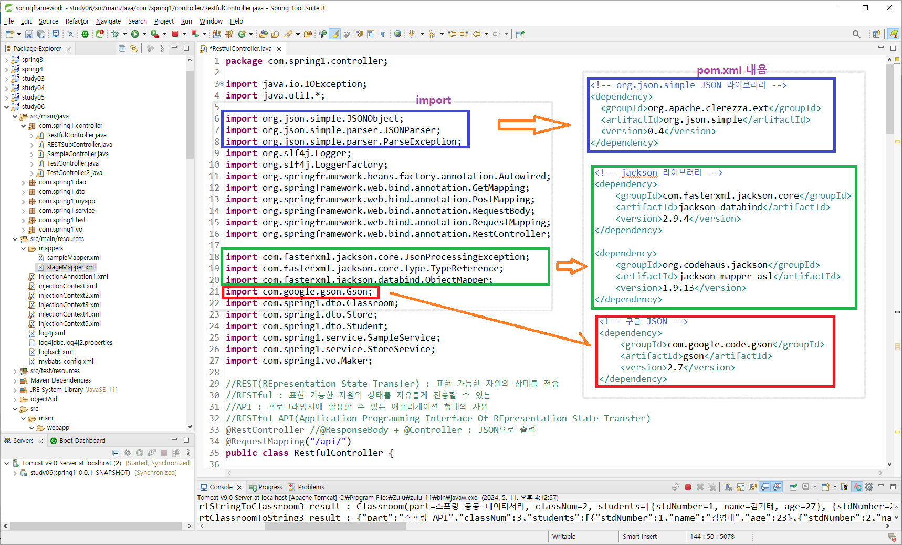

<br><br>

**com.spring1.controller.RestfulController 기본 작성 내용**

```java
package com.spring1.controller;

import java.io.IOException;
import java.util.*;

import org.json.simple.JSONObject;
import org.json.simple.parser.JSONParser;
import org.json.simple.parser.ParseException;
import org.slf4j.Logger;
import org.slf4j.LoggerFactory;
import org.springframework.beans.factory.annotation.Autowired;
import org.springframework.web.bind.annotation.GetMapping;
import org.springframework.web.bind.annotation.PostMapping;
import org.springframework.web.bind.annotation.RequestBody;
import org.springframework.web.bind.annotation.RequestMapping;
import org.springframework.web.bind.annotation.RestController;

import com.fasterxml.jackson.core.JsonProcessingException;
import com.fasterxml.jackson.core.type.TypeReference;
import com.fasterxml.jackson.databind.ObjectMapper;
import com.google.gson.Gson;
import com.spring1.dto.Classroom;
import com.spring1.dto.Store;
import com.spring1.dto.Student;
import com.spring1.service.SampleService;
import com.spring1.service.StoreService;
import com.spring1.vo.Maker;

//REST(REpresentation State Transfer) : 표현 가능한 자원의 상태를 전송
//RESTful : 표현 가능한 자원의 상태를 자유롭게 전송할 수 있는
//API : 프로그래밍시에 활용할 수 있는 애플리케이션 형태의 자원
//RESTful API(Application Programming Interface Of REpresentation State Transfer)
@RestController //@ResponseBody + @Controller : JSON으로 출력
@RequestMapping("/api/")
public class RestfulController {

	private static final Logger log = LoggerFactory.getLogger(RestfulController.class);
	
	@Autowired
	private SampleService sampleService;
	
	@Autowired
	private StoreService storeService;
	
}
```

<br><br>

**요청 페이지 로딩을 위한 com.spring1.controller.RESTSubController 작성**

```java
package com.spring1.controller;

import org.springframework.stereotype.Controller;
import org.springframework.web.bind.annotation.GetMapping;
import org.springframework.web.bind.annotation.RequestMapping;

@Controller
@RequestMapping("/api/sub/")
public class RESTSubController {

	@GetMapping("api5")
	public String api5() {
		return "api/api5";
	}
	
	@GetMapping("api6")
	public String api6() {
		return "api/api6";
	}
	
	@GetMapping("api7")
	public String api7() {
		return "api/api7";
	}
	
	@GetMapping("api8")
	public String api8() {
		return "api/api8";
	}
	
	@GetMapping("api9")
	public String api9() {
		return "api/api9";
	}
	
	@GetMapping("api10")
	public String api10() {
		return "api/api10";
	}
	
	@GetMapping("api11")
	public String api11() {
		return "api/api11";
	}
	
	@GetMapping("api12")
	public String api12() {
		return "api/api12";
	}
	
	@GetMapping("api13")
	public String api13() {
		return "api/api13";
	}
	
	@GetMapping("api14")
	public String api14() {
		return "api/api14";
	}
	
	@GetMapping("api15")
	public String api15() {
		return "api/api15";
	}
}
```

<br><br>

**src/main/webapp/WEB-INF/views/home.jsp 작성**

```java
<%@ page language="java" contentType="text/html; charset=UTF-8"
    pageEncoding="UTF-8"%>
<%@ taglib uri="http://java.sun.com/jsp/jstl/core" prefix="c" %>
<%@ taglib prefix="c" uri="http://java.sun.com/jsp/jstl/core"  %>
<%@ taglib prefix="fmt" uri="http://java.sun.com/jsp/jstl/fmt" %>
<%@ taglib prefix="fn" uri = "http://java.sun.com/jsp/jstl/functions"%>
<c:set var="path2" value="${pageContext.request.contextPath }" />
<!DOCTYPE html>
<html>
<head>
<meta charset="UTF-8">
<title>메인 페이지</title>
</head>
<body>
	<h2>${serverTime }</h2>
	<h2>${author }</h2>
	<h2>${company }</h2>
	<hr>
	<ul>
		<li><a href="${path2 }/api/api1.do">API1 테스트</a></li>
		<li><a href="${path2 }/api/api2.do">API2 테스트</a></li>
		<li><a href="${path2 }/api/api3.do">API3 테스트</a></li>
		<li><a href="${path2 }/api/api4.do">API4 테스트</a></li>
		<li><a href="${path2 }/api/sub/api5">API5 테스트</a></li>
		<li><a href="${path2 }/api/sub/api6">API6 테스트</a></li>
		<li><a href="${path2 }/api/sub/api7">API7 테스트</a></li>
		<li><a href="${path2 }/api/sub/api8">API8 테스트</a></li>
		<li><a href="${path2 }/api/sub/api9">API9 테스트</a></li>
		<li><a href="${path2 }/api/sub/api10">API10 테스트</a></li>
		<li><a href="${path2 }/api/sub/api11">API11 테스트</a></li>
		<li><a href="${path2 }/api/sub/api12">API12 테스트</a></li>
		<li><a href="${path2 }/api/sub/api13">API13 테스트</a></li>
		<li><a href="${path2 }/api/sub/api14">API14 테스트</a></li>
		<li><a href="${path2 }/api/sub/api15">API15 테스트</a></li>
	</ul>
	<hr>	
</body>
</html>
```

<br><br>

<div id="6-1"></div>

## 6-1. 표준 JSON

### 6-1-1. com.spring1.controller.RestfulController에 getApi1() 메소드 추가


<br><br>

### 6-1-2. src/main/webapp/WEB-INF/views/api/api1.jsp 작성

<br><br>

### 6-1-3. api1.do 을 호출하여 실행


<br>

### 6-1-4. com.spring1.controller.RestfulController에 getApi2() 메소드 추가


<br><br>

### 6-1-2. src/main/webapp/WEB-INF/views/api/api2.jsp 작성

<br><br>

### 6-1-3. api2.do 을 호출하여 실행


<br>

### 6-1-1. com.spring1.controller.RestfulController에 getApi1() 메소드 추가


<br><br>

### 6-1-2. api1.do 을 호출하여 실행


<br><br><br>

### 6-1-3. com.spring1.controller.RestfulController에 getApi2() 메소드 추가


<br><br>

### 6-1-4. api2.do 을 호출하여 실행


<br><br><br>

### 6-1-5. com.spring1.controller.RestfulController에 getApi3() 메소드 추가


<br><br>

### 6-1-6. api3.do 을 호출하여 실행


<br><br><br>

### 6-1-7. com.spring1.controller.RestfulController에 getApi4() 메소드 추가

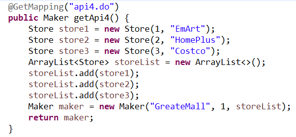

<br><br>

### 6-1-8. api4.do 을 호출하여 실행

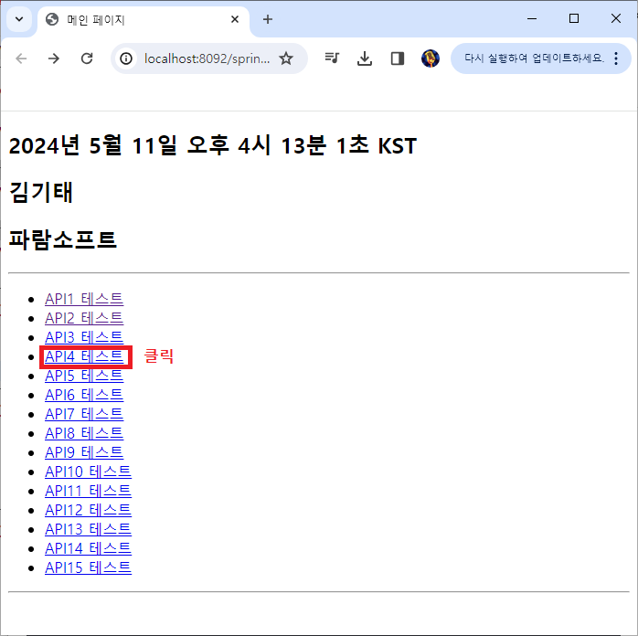


<br><br><br>

### 6-1-9. com.spring1.controller.RestfulController에 getApi5() 메소드 추가


<br><br>

### 6-1-10. src/main/webapp/WEB-INF/views/api/api5.jsp 작성

```java
<%@ page language="java" contentType="text/html; charset=UTF-8"
    pageEncoding="UTF-8"%>
<%@ taglib prefix="c" uri="http://java.sun.com/jsp/jstl/core"  %>
<%@ taglib prefix="fmt" uri="http://java.sun.com/jsp/jstl/fmt" %>
<%@ taglib prefix="fn" uri = "http://java.sun.com/jsp/jstl/functions"%>
<c:set var="path2" value="${pageContext.request.contextPath }" />
<!DOCTYPE html>
<html>
<head>
<meta charset="UTF-8">
<title>상점 등록</title>
<script src="https://code.jquery.com/jquery-latest.js"></script>
</head>
<body>
	<div class="form">
		<input type="number" name="storeNum" id="num" placeholder="번호 입력" /><br><br>
		<input type="text" name="storeName" id="name" placeholder="상점명 입력" /><br><br>
		<button type="button" id="btn1">등록</button>
	</div>
	<table>
		<thead>
			<th>번호</th><th>상점명</th>
		</thead>
		<tbody id="tbody">
			
		</tbody>
	</table>
	<script>
	$(document).ready(function(){
		$("#btn1").click(function(){
			var store = {storeNum:parseInt($("#num").val()), storeName:$("#name").val() };
			$.ajax({
				type:"post",
				url:"${path2}/api/api5.do",
				data:JSON.stringify(store),
				dataType:"json",
			    contentType: 'application/json; charset=utf-8', 
				success:function(data) { 
					console.log(data);
					var tbody = $("#tbody").html();
					var conData = "<tr><td>"+data.storeNum+"</td><td>"+data.storeName+"</td></tr>";
					$("#tbody").html(tbody+conData);
				}
			});
		});
	});
	</script>
</body>
</html>
```

<br><br>

### 6-1-11. api5.do 을 호출하여 실행


<br><br><br>

### 6-1-12. com.spring1.controller.RestfulController에 getApi1() 메소드 추가


<br><br>

### 6-1-13. src/main/webapp/WEB-INF/views/api/api6.jsp 작성

```java
<%@ page language="java" contentType="text/html; charset=UTF-8"
    pageEncoding="UTF-8"%>
<%@ taglib prefix="c" uri="http://java.sun.com/jsp/jstl/core"  %>
<%@ taglib prefix="fmt" uri="http://java.sun.com/jsp/jstl/fmt" %>
<%@ taglib prefix="fn" uri = "http://java.sun.com/jsp/jstl/functions"%>
<c:set var="path2" value="${pageContext.request.contextPath }" />
<!DOCTYPE html>
<html>
<head>
<meta charset="UTF-8">
<title>학생 객체 전송</title>
<script src="https://code.jquery.com/jquery-latest.js"></script>
</head>
<body>
	<!-- src/main/webapp/WEB-INF/views/api/api5.jsp 를 src/main/webapp/WEB-INF/views/api/api6.jsp 이름으로 복사하여 편집 -->
	<div class="form">
		<input type="number" name="stdNumber" id="num" placeholder="번호 입력" /><br><br>
		<input type="text" name="name" id="name" placeholder="학생명 입력" /><br><br>
		<input type="number" name="age" id="age" placeholder="나이 입력" /><br><br>
		<button type="button" id="btn1">등록</button>
	</div>
	<script>
	$(document).ready(function(){
		$("#btn1").click(function(){
			var student = {stdNumber:parseInt($("#num").val()), name:$("#name").val(),
					age:parseInt($("#age").val()) };
			$.ajax({
				type:"post",
				url:"${path2}/api/api6.do",
				data:JSON.stringify(student),
				dataType:"json",
			    contentType: 'application/json; charset=utf-8', 
				success:function(data) {
					console.log(data)
				}
			});
		});
	});
	</script>
</body>
</html>
```

<br><br>

### 6-1-14. api6.do 을 호출하여 실행

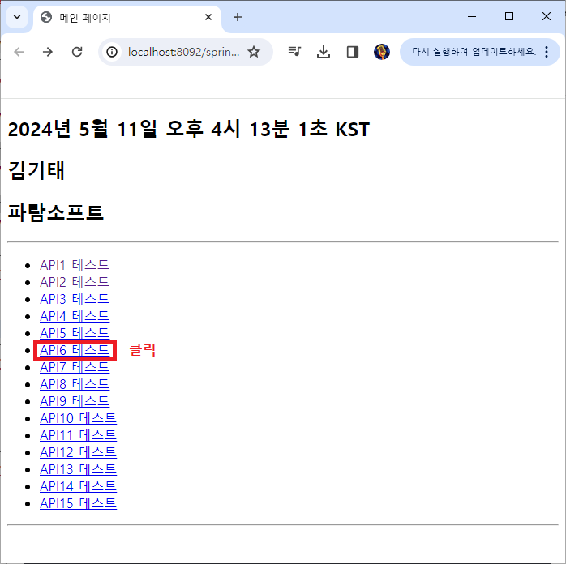

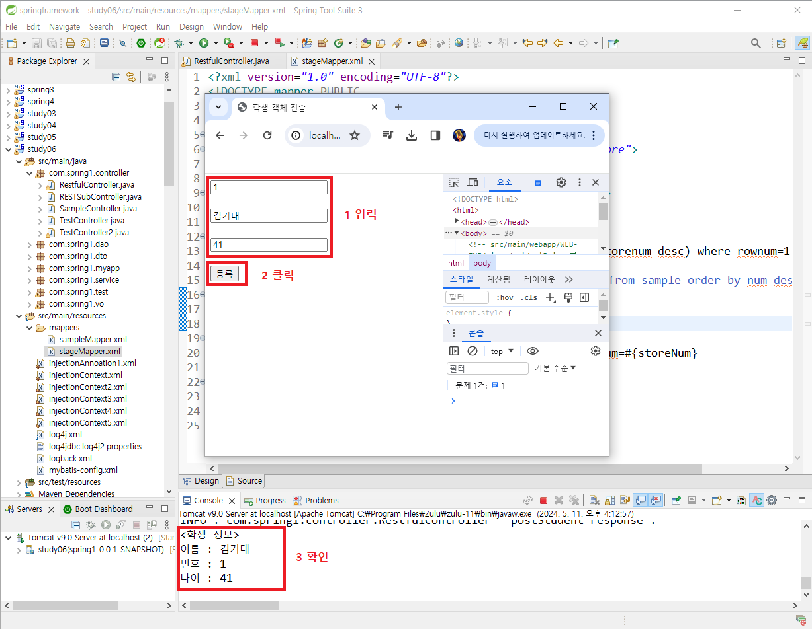

<br><br><br>

### 6-1-15. com.spring1.controller.RestfulController에 getApi7() 메소드 추가


<br><br>

### 6-1-16. src/main/webapp/WEB-INF/views/api/api7.jsp 작성

```java
<%@ page language="java" contentType="text/html; charset=UTF-8"
    pageEncoding="UTF-8"%>
<%@ taglib prefix="c" uri="http://java.sun.com/jsp/jstl/core"  %>
<%@ taglib prefix="fmt" uri="http://java.sun.com/jsp/jstl/fmt" %>
<%@ taglib prefix="fn" uri = "http://java.sun.com/jsp/jstl/functions"%>
<c:set var="path2" value="${pageContext.request.contextPath }" />
<!DOCTYPE html>
<html>
<head>
<meta charset="UTF-8">
<title>학생 컬렉션 전송</title>
<script src="https://code.jquery.com/jquery-latest.js"></script>
</head>
<body>
	<!-- src/main/webapp/WEB-INF/views/api/api6.jsp 를 src/main/webapp/WEB-INF/views/api/api7.jsp 이름으로 복사하여 편집 -->
	<div class="form">
		<input type="number" name="stdNumber1" class="num" placeholder="번호 입력" />
		<input type="text" name="name1" class="name" placeholder="학생명 입력" />
		<input type="number" name="age1" class="age" placeholder="나이 입력" />
	</div>
	<div class="form">
		<input type="number" name="stdNumber2" class="num" placeholder="번호 입력" />
		<input type="text" name="name2" class="name" placeholder="학생명 입력" />
		<input type="number" name="age2" class="age" placeholder="나이 입력" />
	</div>
	<div class="form">
		<input type="number" name="stdNumber3" class="num" placeholder="번호 입력" />
		<input type="text" name="name3" class="name" placeholder="학생명 입력" />
		<input type="number" name="age3" class="age" placeholder="나이 입력" />
	</div>
	<button type="button" id="btn1">등록</button>
	
	<script>
	$(document).ready(function(){
		$("#btn1").click(function(){
			var student = {stdNumber:0, name:"아무개", age:0 };
			var stds = [student, student, student];
			$.each($(".form"), function(index, value){
				var num = $(this).find(".num").val();
				var name = $(this).find(".name").val();
				var age = $(this).find(".age").val();
				
				student = {stdNumber:num, name:name, age:age };
				stds[index] = student;  
			});
			$.ajax({
				type:"post",
				url:"${path2}/api/api7.do",
				data:JSON.stringify(stds),
				dataType:"json",
			    contentType: 'application/json; charset=utf-8', 
				success:function(data) {}
			});
		});
	});
	</script>
</body>
</html>
```

<br><br>

### 6-1-17. api7.do 을 호출하여 실행


<br><br><br>


### 6-1-18. com.spring1.controller.RestfulController에 getApi8() 메소드 추가


<br><br>

### 6-1-19. src/main/webapp/WEB-INF/views/api/api8.jsp 작성

```java
<%@ page language="java" contentType="text/html; charset=UTF-8"
    pageEncoding="UTF-8"%>
<%@ taglib prefix="c" uri="http://java.sun.com/jsp/jstl/core"  %>
<%@ taglib prefix="fmt" uri="http://java.sun.com/jsp/jstl/fmt" %>
<%@ taglib prefix="fn" uri = "http://java.sun.com/jsp/jstl/functions"%>
<c:set var="path2" value="${pageContext.request.contextPath }" />
<!DOCTYPE html>
<html>
<head>
<meta charset="UTF-8">
<title>학급 객체(컬렉션 포함) 전송</title>
<script src="https://code.jquery.com/jquery-latest.js"></script>
</head>
<body>
	<!-- src/main/webapp/WEB-INF/views/api/api7.jsp 를 src/main/webapp/WEB-INF/views/api/api8.jsp 이름으로 복사하여 편집 -->
	<h2>학급 객체(컬렉션 포함) 전송</h2>
	<input type="text" name="part" id="part" placeholder="반 이름 입력" /><br><br>
	<input type="number" name="classNum" id="classNum" placeholder="반 번호 입력" /><br><br>
	<div class="form">
		<input type="number" name="stdNumber1" class="num" placeholder="번호 입력" />
		<input type="text" name="name1" class="name" placeholder="학생명 입력" />
		<input type="number" name="age1" class="age" placeholder="나이 입력" />
	</div>
	<div class="form">
		<input type="number" name="stdNumber2" class="num" placeholder="번호 입력" />
		<input type="text" name="name2" class="name" placeholder="학생명 입력" />
		<input type="number" name="age2" class="age" placeholder="나이 입력" />
	</div>
	<div class="form">
		<input type="number" name="stdNumber3" class="num" placeholder="번호 입력" />
		<input type="text" name="name3" class="name" placeholder="학생명 입력" />
		<input type="number" name="age3" class="age" placeholder="나이 입력" />
	</div>
	<button type="button" id="btn1">등록</button>
	
	<script>
	$(document).ready(function(){
		$("#btn1").click(function(){
			var student = {stdNumber:0, name:"아무개", age:0 };
			var students = [student, student, student];
			var team = {part:$("#part").val(), classNum:parseInt($("#classNum").val()),
					students:students};
			$.each($(".form"), function(index, value){
				var num = $(this).find(".num").val();
				var name = $(this).find(".name").val();
				var age = $(this).find(".age").val();
				
				student = {stdNumber:num, name:name, age:age };
				students[index] = student;
			});
			team.students = students;
			$.ajax({
				type:"post",
				url:"${path2}/api/api8.do",
				data:JSON.stringify(team),
				dataType:"json",
			    contentType: 'application/json; charset=utf-8', 
				success:function(data) {}
			});
		});
	});
	</script>
</body>
</html>
```

<br><br>

### 6-1-20. api8.do 을 호출하여 실행


<br><br><br>

<div id="6-2"></div>

## 6-2. simple-json 

### 6-2-1. com.spring1.controller.RestfulController에 getApi9() 메소드 추가


<br><br>

### 6-2-2. src/main/webapp/WEB-INF/views/api/api9.jsp 작성

```java
<%@ page language="java" contentType="text/html; charset=UTF-8"
    pageEncoding="UTF-8"%>
<%@ taglib prefix="c" uri="http://java.sun.com/jsp/jstl/core"  %>
<%@ taglib prefix="fmt" uri="http://java.sun.com/jsp/jstl/fmt" %>
<%@ taglib prefix="fn" uri = "http://java.sun.com/jsp/jstl/functions"%>
<c:set var="path2" value="${pageContext.request.contextPath }" />
<!DOCTYPE html>
<html>
<head>
<meta charset="UTF-8">
<title>학생 객체 전송 - JSON으로 받기1</title>
<script src="https://code.jquery.com/jquery-latest.js"></script>
</head>
<body>
	<h2>학생 객체 전송 - JSON으로 받기1 : org.json.simple.JSONObject, org.json.simple.parser.JSONParser</h2>
	<hr>
	<div class="form">
		<input type="number" name="stdNumber" id="num" placeholder="번호 입력" /><br><br>
		<input type="text" name="name" id="name" placeholder="학생명 입력" /><br><br>
		<input type="number" name="age" id="age" placeholder="나이 입력" /><br><br>
		<button type="button" id="btn1">등록</button>
	</div>
	<script>
	$(document).ready(function(){
		$("#btn1").click(function(){
			var student = {stdNumber:parseInt($("#num").val()), name:$("#name").val(),
					age:parseInt($("#age").val()) };
			$.ajax({
				type:"post",
				url:"${path2}/api/api9.do",
				data:JSON.stringify(student),
				dataType:"json",
			    contentType: 'application/json; charset=utf-8', 
				success:function(data) {
					console.log(data)
				}
			});
		});
	});
	</script>
</body>
</html>
```

<br><br>

### 6-2-3. api9.do 을 호출하여 실행


<br><br><br>

### 6-2-4. com.spring1.controller.RestfulController에 getApi10() 메소드 추가

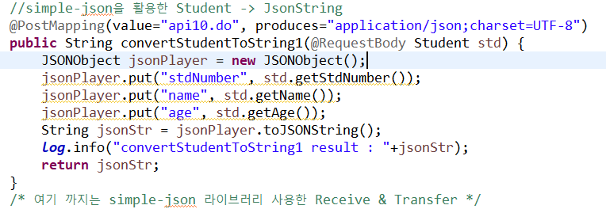

<br><br>

### 6-2-5. src/main/webapp/WEB-INF/views/api/api10.jsp 작성

```java
<%@ page language="java" contentType="text/html; charset=UTF-8"
    pageEncoding="UTF-8"%>
<%@ taglib prefix="c" uri="http://java.sun.com/jsp/jstl/core"  %>
<%@ taglib prefix="fmt" uri="http://java.sun.com/jsp/jstl/fmt" %>
<%@ taglib prefix="fn" uri = "http://java.sun.com/jsp/jstl/functions"%>
<c:set var="path2" value="${pageContext.request.contextPath }" />
<!DOCTYPE html>
<html>
<head>
<meta charset="UTF-8">
<title>학생 객체 전송 - JSON으로 받기1</title>
<script src="https://code.jquery.com/jquery-latest.js"></script>
</head>
<body>
	<h2>학생 객체 전송 - JSON으로 받기1 : org.json.simple.JSONObject, org.json.simple.parser.JSONParser</h2>
	<hr>
	<div class="form">
		<input type="number" name="stdNumber" id="num" placeholder="번호 입력" /><br><br>
		<input type="text" name="name" id="name" placeholder="학생명 입력" /><br><br>
		<input type="number" name="age" id="age" placeholder="나이 입력" /><br><br>
		<button type="button" id="btn1">등록</button>
	</div>
	<script>
	$(document).ready(function(){
		$("#btn1").click(function(){
			var student = {stdNumber:parseInt($("#num").val()), name:$("#name").val(),
					age:parseInt($("#age").val()) };
			$.ajax({
				type:"post",
				url:"${path2}/api/api9.do",
				data:JSON.stringify(student),
				dataType:"json",
			    contentType: 'application/json; charset=utf-8', 
				success:function(data) {
					console.log(data)
				}
			});
		});
	});
	</script>
</body>
</html>
```

<br><br>

### 6-2-6. api10.do 을 호출하여 실행


<br><br><br>

<div id="6-3"></div>

## 6-3. Gson

### 6-3-1. com.spring1.controller.RestfulController에 getApi11() 메소드 추가


<br><br>

### 6-3-2. src/main/webapp/WEB-INF/views/api/api11.jsp 작성

```java
<%@ page language="java" contentType="text/html; charset=UTF-8"
    pageEncoding="UTF-8"%>
<%@ taglib prefix="c" uri="http://java.sun.com/jsp/jstl/core"  %>
<%@ taglib prefix="fmt" uri="http://java.sun.com/jsp/jstl/fmt" %>
<%@ taglib prefix="fn" uri = "http://java.sun.com/jsp/jstl/functions"%>
<c:set var="path2" value="${pageContext.request.contextPath }" />
<!DOCTYPE html>
<html>
<head>
<meta charset="UTF-8">
<title>학생 객체 전송 - JSON으로 받기3</title>
<script src="https://code.jquery.com/jquery-latest.js"></script>
</head>
<body>
	<h2>학생 객체 전송 - JSON으로 받기3 : com.google.gson.Gson</h2>
	<hr>
	<div class="form">
		<input type="number" name="stdNumber" id="num" placeholder="번호 입력" /><br><br>
		<input type="text" name="name" id="name" placeholder="학생명 입력" /><br><br>
		<input type="number" name="age" id="age" placeholder="나이 입력" /><br><br>
		<button type="button" id="btn1">등록</button>
	</div>
	<script>
	$(document).ready(function(){
		$("#btn1").click(function(){
			var student = {stdNumber:parseInt($("#num").val()), name:$("#name").val(),
					age:parseInt($("#age").val()) };
			$.ajax({
				type:"post",
				url:"${path2}/api/api11.do",
				data:JSON.stringify(student),
				dataType:"json",
			    contentType: 'application/json; charset=utf-8', 
				success:function(data) {
					console.log(data)
				}
			});
		});
	});
	</script>
</body>
</html>
```

<br><br>

### 6-3-3. api11.do 을 호출하여 실행


<br><br><br>

### 6-3-4. com.spring1.controller.RestfulController에 getApi12() 메소드 추가


<br><br>

### 6-3-5. src/main/webapp/WEB-INF/views/api/api12.jsp 작성

```java
<%@ page language="java" contentType="text/html; charset=UTF-8"
    pageEncoding="UTF-8"%>
<%@ taglib prefix="c" uri="http://java.sun.com/jsp/jstl/core"  %>
<%@ taglib prefix="fmt" uri="http://java.sun.com/jsp/jstl/fmt" %>
<%@ taglib prefix="fn" uri = "http://java.sun.com/jsp/jstl/functions"%>
<c:set var="path2" value="${pageContext.request.contextPath }" />
<!DOCTYPE html>
<html>
<head>
<meta charset="UTF-8">
<title>학생 객체 전송 - JSON으로 받기4</title>
<script src="https://code.jquery.com/jquery-latest.js"></script>
</head>
<body>
	<h2>학급 객체(컬렉션 포함) 전송 - JSON으로 받기4 : com.google.gson.Gson</h2>
	<hr>
	<input type="text" name="part" id="part" placeholder="반 이름 입력" /><br><br>
	<input type="number" name="classNum" id="classNum" placeholder="반 번호 입력" /><br><br>
	<div class="form">
		<input type="number" name="stdNumber1" class="num" placeholder="번호 입력" />
		<input type="text" name="name1" class="name" placeholder="학생명 입력" />
		<input type="number" name="age1" class="age" placeholder="나이 입력" />
	</div>
	<div class="form">
		<input type="number" name="stdNumber2" class="num" placeholder="번호 입력" />
		<input type="text" name="name2" class="name" placeholder="학생명 입력" />
		<input type="number" name="age2" class="age" placeholder="나이 입력" />
	</div>
	<div class="form">
		<input type="number" name="stdNumber3" class="num" placeholder="번호 입력" />
		<input type="text" name="name3" class="name" placeholder="학생명 입력" />
		<input type="number" name="age3" class="age" placeholder="나이 입력" />
	</div>
	<button type="button" id="btn1">등록</button>
	
	<script>
	$(document).ready(function(){
		$("#btn1").click(function(){
			var student = {stdNumber:0, name:"아무개", age:0 };
			var students = [student, student, student];
			var team = {part:$("#part").val(), classNum:parseInt($("#classNum").val()),
					students:students};
			$.each($(".form"), function(index, value){
				var num = $(this).find(".num").val();
				var name = $(this).find(".name").val();
				var age = $(this).find(".age").val();
				
				student = {stdNumber:num, name:name, age:age };
				students[index] = student;
			});
			team.students = students;
			$.ajax({
				type:"post",
				url:"${path2}/api/api12.do",
				data:JSON.stringify(team),
				dataType:"json",
			    contentType: 'application/json; charset=utf-8', 
				success:function(data) {
					console.log(data);
				}
			});
		});
	});
	</script>
</body>
</html>
```

<br><br>

### 6-3-6. api12.do 을 호출하여 실행

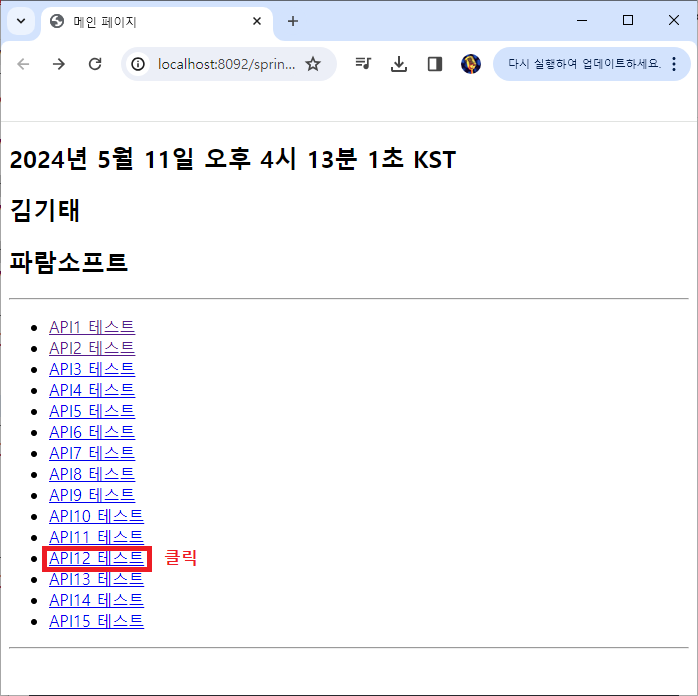

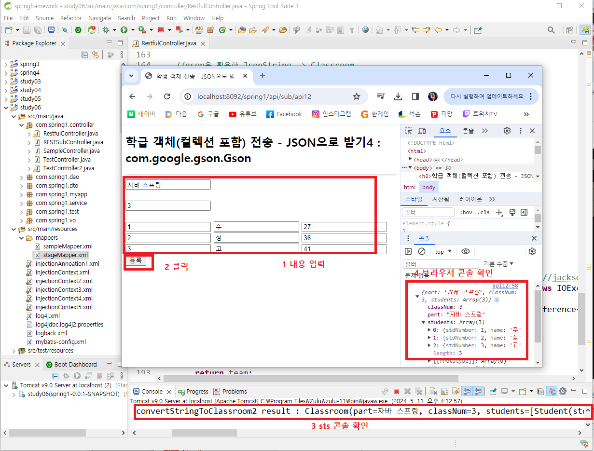

<br><br><br>

### 6-3-1. com.spring1.controller.RestfulController에 getApi13() 메소드 추가


<br><br>

### 6-3-2. src/main/webapp/WEB-INF/views/api/api13.jsp 작성

```java
<%@ page language="java" contentType="text/html; charset=UTF-8"
    pageEncoding="UTF-8"%>
<%@ taglib prefix="c" uri="http://java.sun.com/jsp/jstl/core"  %>
<%@ taglib prefix="fmt" uri="http://java.sun.com/jsp/jstl/fmt" %>
<%@ taglib prefix="fn" uri = "http://java.sun.com/jsp/jstl/functions"%>
<c:set var="path2" value="${pageContext.request.contextPath }" />
<!DOCTYPE html>
<html>
<head>
<meta charset="UTF-8">
<title>학생 객체 전송 - JSON으로 받기5</title>
<script src="https://code.jquery.com/jquery-latest.js"></script>
</head>
<body>
	<h2>학급 객체(컬렉션 포함) 전송 - JSON으로 받기5 : com.google.gson.Gson</h2>
	<hr>
	<input type="text" name="part" id="part" placeholder="반 이름 입력" /><br><br>
	<input type="number" name="classNum" id="classNum" placeholder="반 번호 입력" /><br><br>
	<div class="form">
		<input type="number" name="stdNumber1" class="num" placeholder="번호 입력" />
		<input type="text" name="name1" class="name" placeholder="학생명 입력" />
		<input type="number" name="age1" class="age" placeholder="나이 입력" />
	</div>
	<div class="form">
		<input type="number" name="stdNumber2" class="num" placeholder="번호 입력" />
		<input type="text" name="name2" class="name" placeholder="학생명 입력" />
		<input type="number" name="age2" class="age" placeholder="나이 입력" />
	</div>
	<div class="form">
		<input type="number" name="stdNumber3" class="num" placeholder="번호 입력" />
		<input type="text" name="name3" class="name" placeholder="학생명 입력" />
		<input type="number" name="age3" class="age" placeholder="나이 입력" />
	</div>
	<button type="button" id="btn1">등록</button>
	
	<script>
	$(document).ready(function(){
		$("#btn1").click(function(){
			var student = {stdNumber:0, name:"아무개", age:0 };
			var students = [student, student, student];
			var team = {part:$("#part").val(), classNum:parseInt($("#classNum").val()),
					students:students};
			$.each($(".form"), function(index, value){
				var num = $(this).find(".num").val();
				var name = $(this).find(".name").val();
				var age = $(this).find(".age").val();
				
				student = {stdNumber:num, name:name, age:age };
				students[index] = student;
			});
			team.students = students;
			$.ajax({
				type:"post",
				url:"${path2}/api/api13.do",
				data:JSON.stringify(team),
				dataType:"json",
			    contentType: 'application/json; charset=utf-8', 
				success:function(data) {
					console.log(data);
				}
			});
		});
	});
	</script>
</body>
</html>
```

<br><br>

### 6-3-3. api13.do 을 호출하여 실행

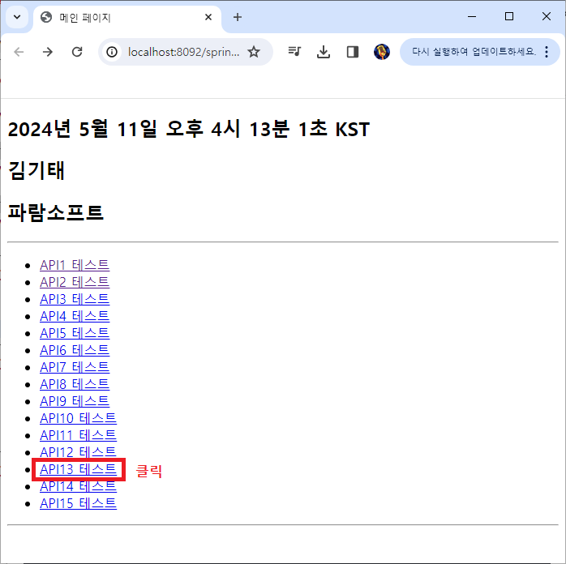


<br><br><br>

<div id="6-4"></div>

## 6-4. Jackson 라이브러리 활용

### 6-4-1. com.spring1.controller.RestfulController에 getApi14() 메소드 추가


<br><br>

### 6-4-2. src/main/webapp/WEB-INF/views/api/api14.jsp 작성

```java
<%@ page language="java" contentType="text/html; charset=UTF-8"
    pageEncoding="UTF-8"%>
<%@ taglib prefix="c" uri="http://java.sun.com/jsp/jstl/core"  %>
<%@ taglib prefix="fmt" uri="http://java.sun.com/jsp/jstl/fmt" %>
<%@ taglib prefix="fn" uri = "http://java.sun.com/jsp/jstl/functions"%>
<c:set var="path2" value="${pageContext.request.contextPath }" />
<!DOCTYPE html>
<html>
<head>
<meta charset="UTF-8">
<title>학생 객체 전송 - JSON으로 받기6</title>
<script src="https://code.jquery.com/jquery-latest.js"></script>
</head>
<body>
	<h2>학급 객체(컬렉션 포함) 전송 - JSON으로 받기6 : com.fasterxml.jackson.databind.ObjectMapper</h2>
	<hr>
	<input type="text" name="part" id="part" placeholder="반 이름 입력" /><br><br>
	<input type="number" name="classNum" id="classNum" placeholder="반 번호 입력" /><br><br>
	<div class="form">
		<input type="number" name="stdNumber1" class="num" placeholder="번호 입력" />
		<input type="text" name="name1" class="name" placeholder="학생명 입력" />
		<input type="number" name="age1" class="age" placeholder="나이 입력" />
	</div>
	<div class="form">
		<input type="number" name="stdNumber2" class="num" placeholder="번호 입력" />
		<input type="text" name="name2" class="name" placeholder="학생명 입력" />
		<input type="number" name="age2" class="age" placeholder="나이 입력" />
	</div>
	<div class="form">
		<input type="number" name="stdNumber3" class="num" placeholder="번호 입력" />
		<input type="text" name="name3" class="name" placeholder="학생명 입력" />
		<input type="number" name="age3" class="age" placeholder="나이 입력" />
	</div>
	<button type="button" id="btn1">등록</button>
	
	<script>
	$(document).ready(function(){
		$("#btn1").click(function(){
			var student = {stdNumber:0, name:"아무개", age:0 };
			var students = [student, student, student];
			var team = {part:$("#part").val(), classNum:parseInt($("#classNum").val()),
					students:students};
			$.each($(".form"), function(index, value){
				var num = $(this).find(".num").val();
				var name = $(this).find(".name").val();
				var age = $(this).find(".age").val();
				
				student = {stdNumber:num, name:name, age:age };
				students[index] = student;
			});
			team.students = students;
			$.ajax({
				type:"post",
				url:"${path2}/api/api14.do",
				data:JSON.stringify(team),
				dataType:"json",
			    contentType: 'application/json; charset=utf-8', 
				success:function(data) {
					console.log(data);
				}
			});
		});
	});
	</script>
</body>
</html>
```

<br><br>

### 6-4-3. api14.do 을 호출하여 실행

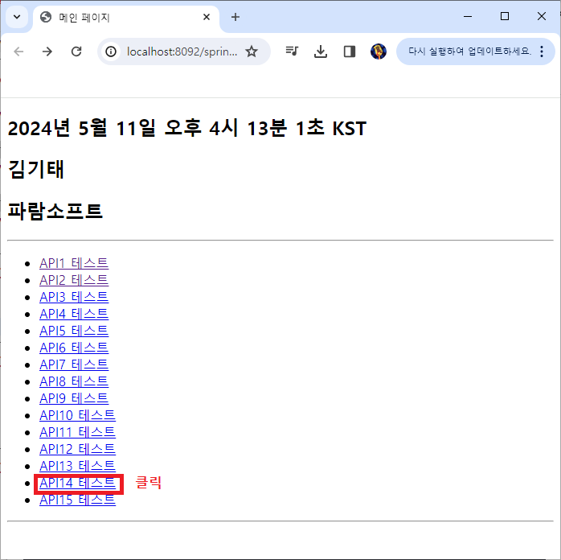

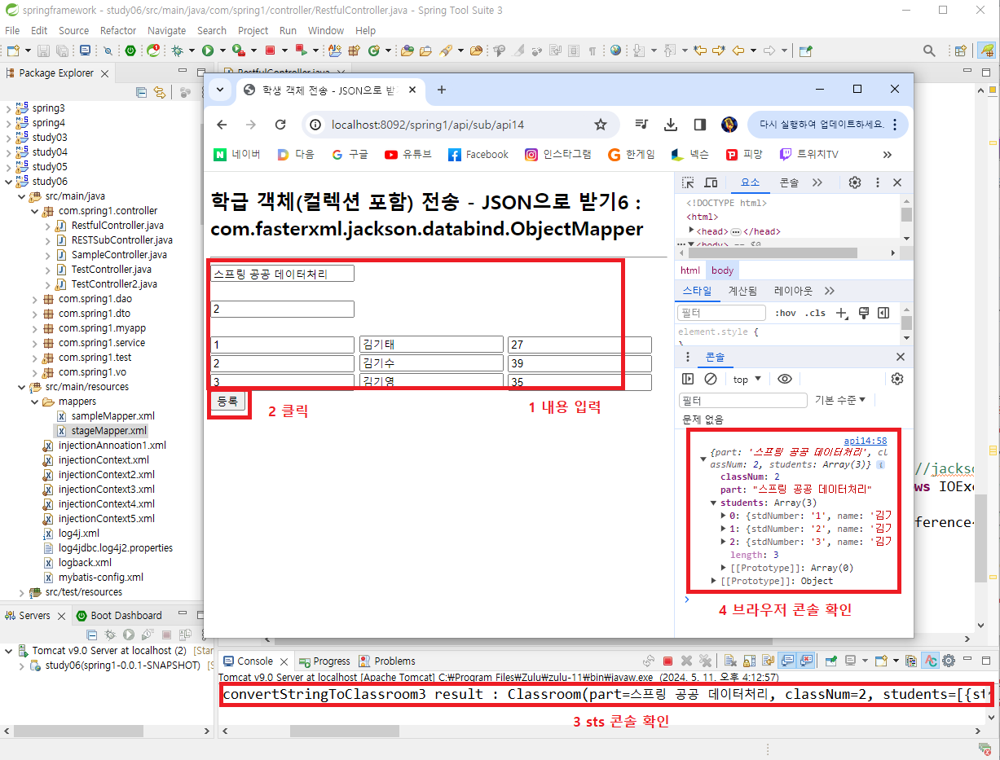

<br><br><br>

### 6-4-4. com.spring1.controller.RestfulController에 getApi15() 메소드 추가


<br><br>

### 6-4-5. src/main/webapp/WEB-INF/views/api/api15.jsp 작성

```java
<%@ page language="java" contentType="text/html; charset=UTF-8"
    pageEncoding="UTF-8"%>
<%@ taglib prefix="c" uri="http://java.sun.com/jsp/jstl/core"  %>
<%@ taglib prefix="fmt" uri="http://java.sun.com/jsp/jstl/fmt" %>
<%@ taglib prefix="fn" uri = "http://java.sun.com/jsp/jstl/functions"%>
<c:set var="path2" value="${pageContext.request.contextPath }" />
<!DOCTYPE html>
<html>
<head>
<meta charset="UTF-8">
<title>학생 객체 전송 - JSON으로 받기7</title>
<script src="https://code.jquery.com/jquery-latest.js"></script>
</head>
<body>
	<h2>학급 객체(컬렉션 포함) 전송 - JSON으로 받기7 : com.fasterxml.jackson.databind.ObjectMapper</h2>
	<hr>
	<input type="text" name="part" id="part" placeholder="반 이름 입력" /><br><br>
	<input type="number" name="classNum" id="classNum" placeholder="반 번호 입력" /><br><br>
	<div class="form">
		<input type="number" name="stdNumber1" class="num" placeholder="번호 입력" />
		<input type="text" name="name1" class="name" placeholder="학생명 입력" />
		<input type="number" name="age1" class="age" placeholder="나이 입력" />
	</div>
	<div class="form">
		<input type="number" name="stdNumber2" class="num" placeholder="번호 입력" />
		<input type="text" name="name2" class="name" placeholder="학생명 입력" />
		<input type="number" name="age2" class="age" placeholder="나이 입력" />
	</div>
	<div class="form">
		<input type="number" name="stdNumber3" class="num" placeholder="번호 입력" />
		<input type="text" name="name3" class="name" placeholder="학생명 입력" />
		<input type="number" name="age3" class="age" placeholder="나이 입력" />
	</div>
	<button type="button" id="btn1">등록</button>
	
	<script>
	$(document).ready(function(){
		$("#btn1").click(function(){
			var student = {stdNumber:0, name:"아무개", age:0 };
			var students = [student, student, student];
			var team = {part:$("#part").val(), classNum:parseInt($("#classNum").val()),
					students:students};
			$.each($(".form"), function(index, value){
				var num = $(this).find(".num").val();
				var name = $(this).find(".name").val();
				var age = $(this).find(".age").val();
				
				student = {stdNumber:num, name:name, age:age };
				students[index] = student;
			});
			team.students = students;
			$.ajax({
				type:"post",
				url:"${path2}/api/api15.do",
				data:JSON.stringify(team),
				dataType:"json",
			    contentType: 'application/json; charset=utf-8', 
				success:function(data) {
					console.log(data);
				}
			});
		});
	});
	</script>
</body>
</html>
```

<br><br>

### 6-4-6. api15.do 을 호출하여 실행


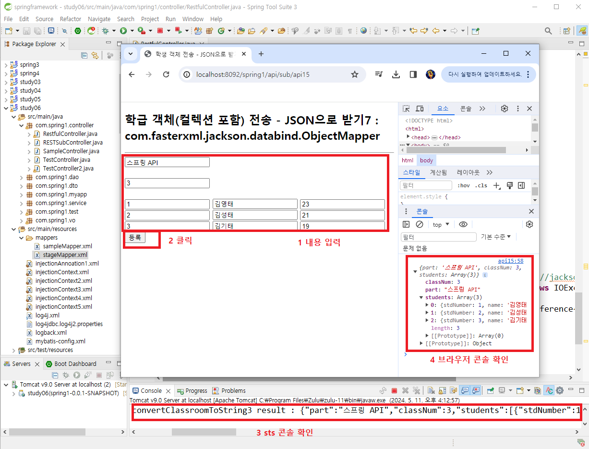

<br><br><hr><br><br>
