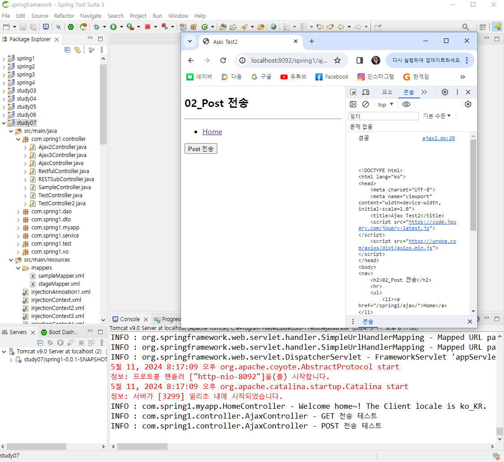
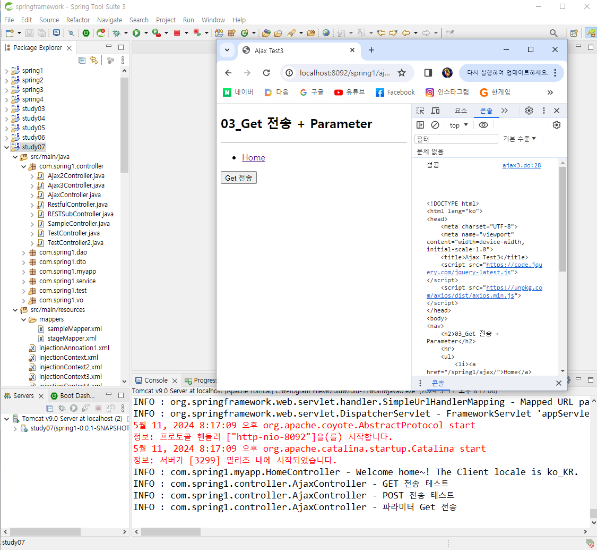
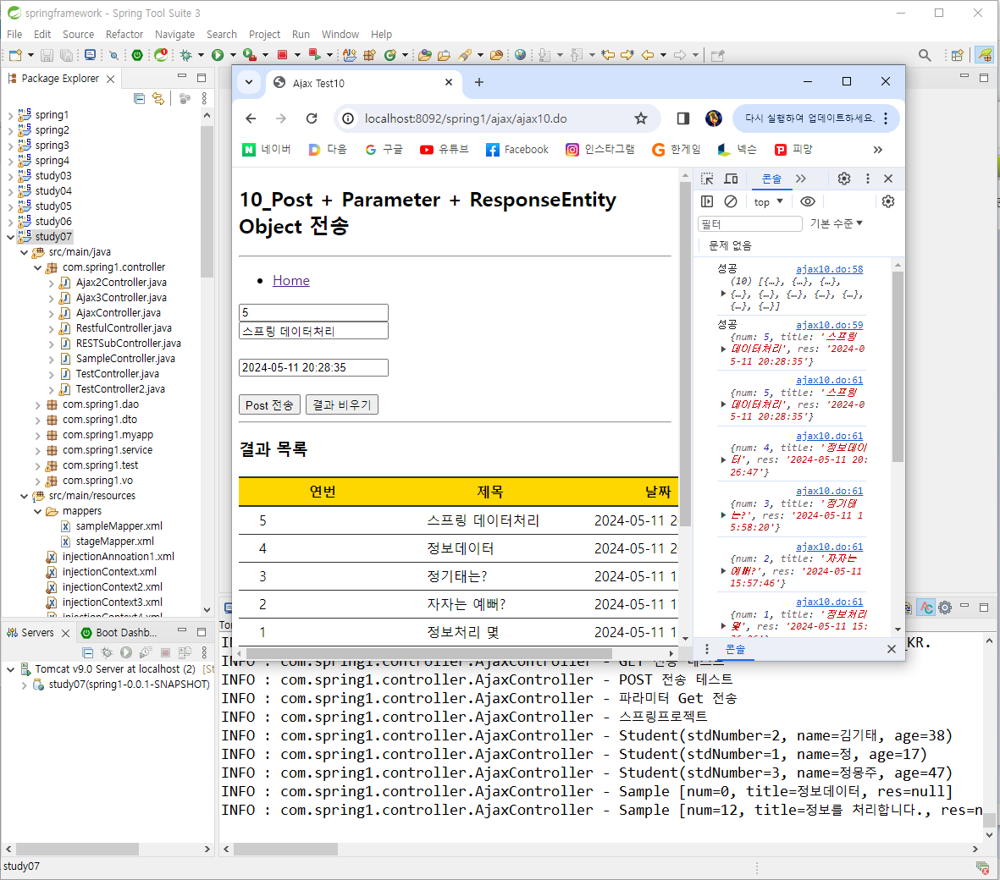
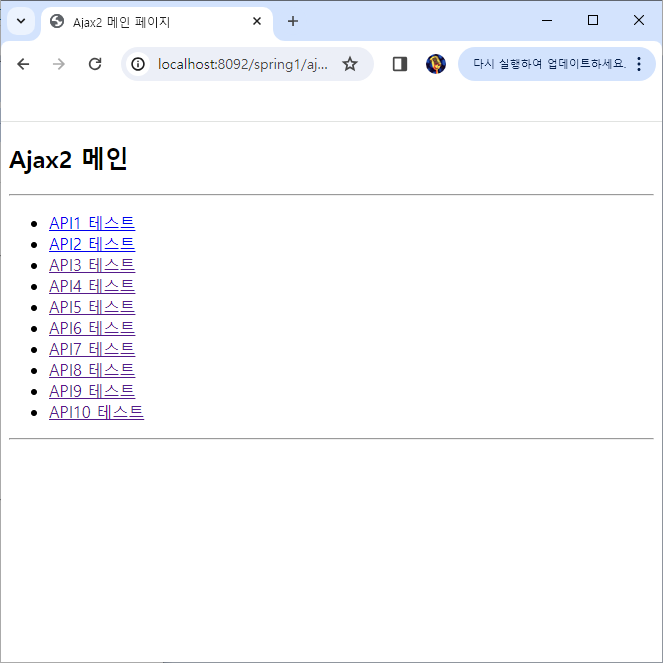
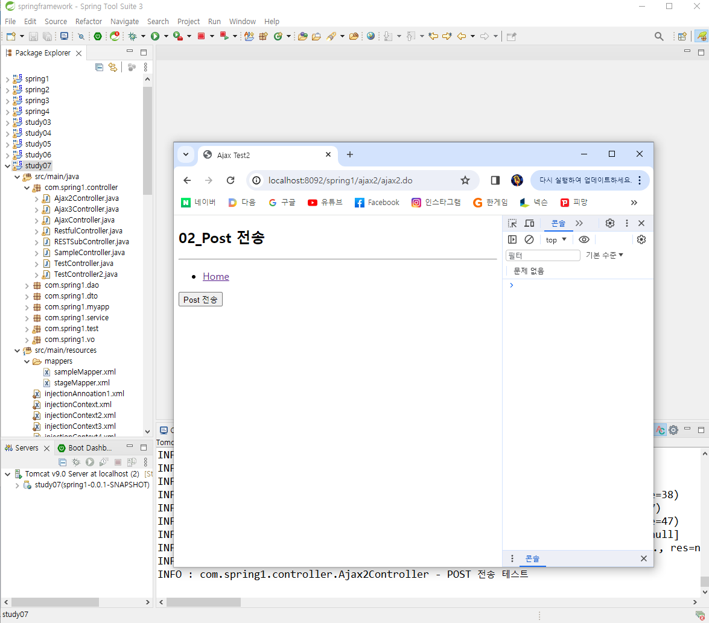
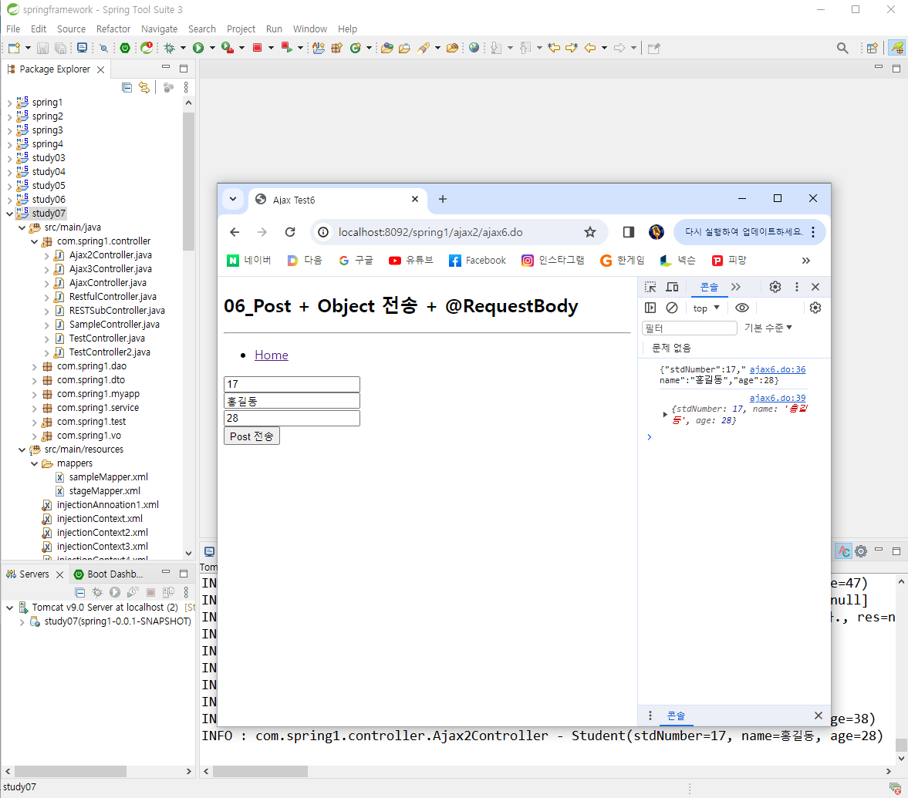
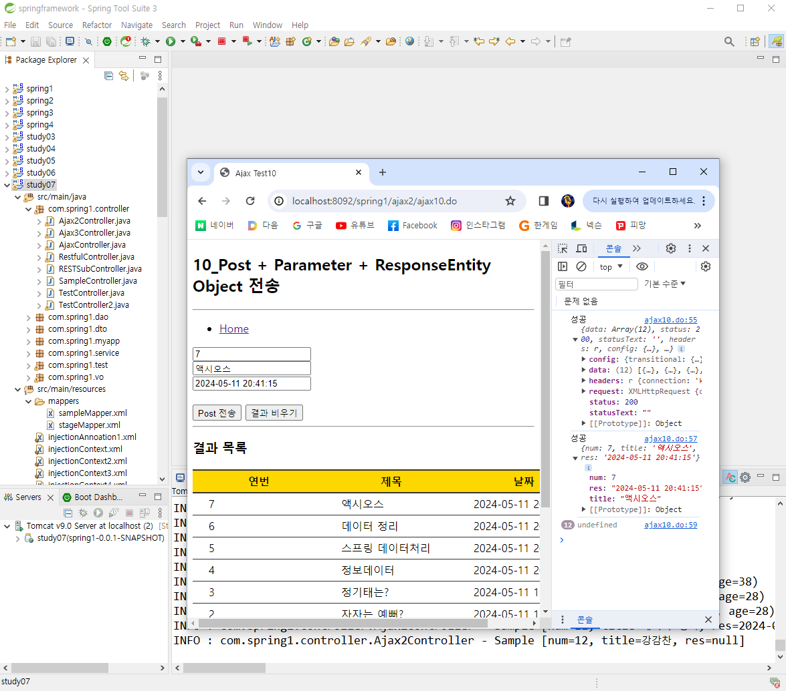
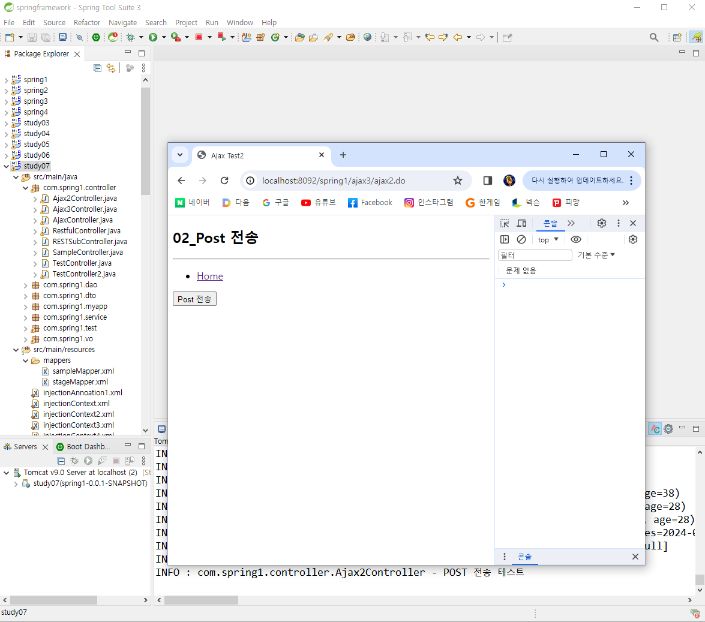
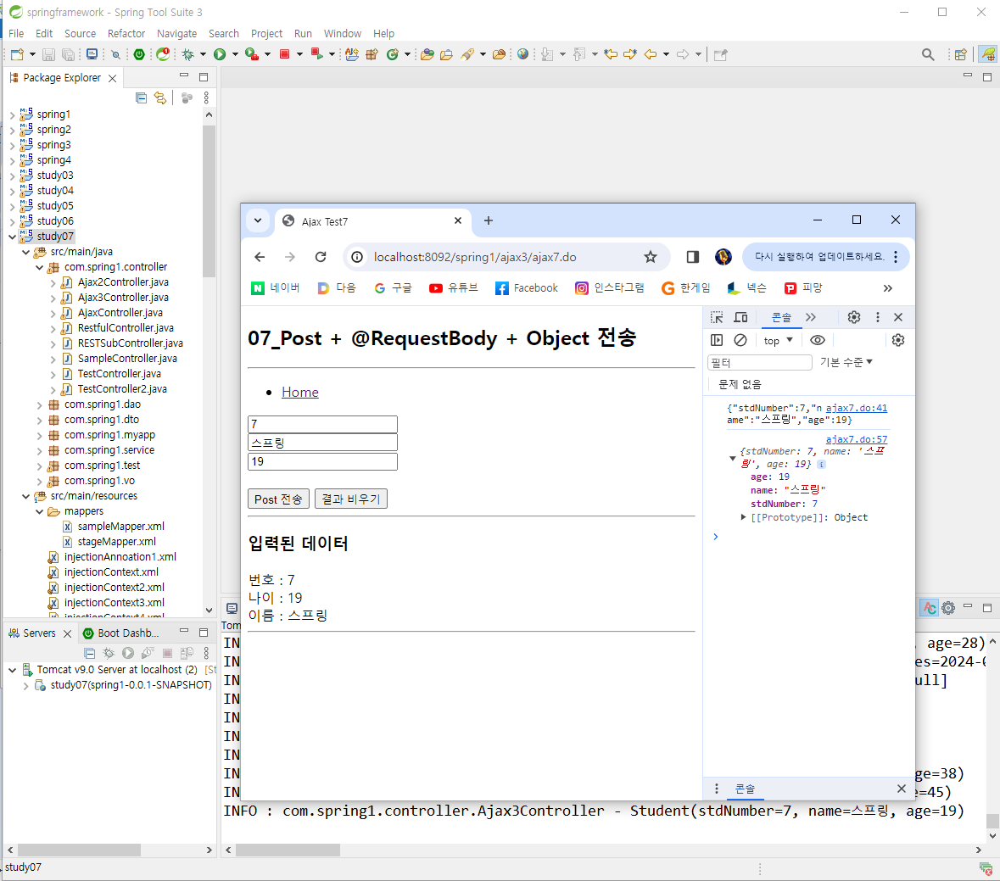

<nav id="quick" style="position:fixed;top:150px;right:100px;width:200px;height:auto;overflow:hidden;z-index:999;background-color:rgba(255,255,255,0.75);">
	<label for="chap7" style="color:black;font-size:28px;">7. Ajax(Asynchronous Javascript And Xml)</label>
	<input type="radio" name="chap" id="chap7" style="display:none;">
	<ul class="menu">
		<li><a href="#7-1" style="color:black;font-size:20px;text-decoration:none;">7-1. 사전 작업</a></li>
		<li><a href="#7-2" style="color:black;font-size:20px;text-decoration:none;">7-2. jQuery Ajax 를 활용한 ajax 구현</a></li>
		<li><a href="#7-3" style="color:black;font-size:20px;text-decoration:none;">7-3. axios.js 를 활용한 ajax 구현</a></li>
		<li><a href="#7-4" style="color:black;font-size:20px;text-decoration:none;">7-4. Fetch의 async/await 을 활용한 ajax 구현</a></li>
	</ul>	
</nav>

<div id="7"></div>

# 7. Ajax(Asynchronous Javascript And Xml)

- Ajax : 비동기식으로 자바스크립 객체 또는 XML로 구현되는 방식
- Ajax는 요청하는 페이지의 전체 내용을 응답된 내용으로 모두 변경하거나 다른 페이지로 이동하는 것이 아니라 필요한 일부 부분만을 변경하는 방식을 의미합니다.
- Ajax를 구현하는 방식은 프론트 단에서 어떠한 라이브러리나 방법을 활용하느냐에 따라 달라질 수도 있고, 백 단에서 @Controller, @RestController, @ResponseBody, @ResponseBody, @ModelAttribute, Object, Primitive Type 등에 따라 달라질 수도 있으며, 전송 방식인 Get, Post 에 따라 달라 집니다. 

<br><br>

**프론트 단에서의 Ajax를 구현하는 방법**

| 방법 | 설명 | 
|-----------------------|-----------------------------------------------------------|
| $.ajax | jQuery(jquery.js)의 ajax 기능을 활용하는 방법 <br> - GET, POST,  PUT, DELETE 전송방식을 지원 <br> - 웹페이지의 속도향상 서버의 처리가 완료될 때까지 기다리지 않고 처리가 가능하며, 서버에서 Data만 전송하면 되므로 전체적인 코딩의 양이 줄어듦. <br> - 다만, 모듈을 설치하거나 별도의 jquery.js 를 연결해야 하며, 또한, 히스토리 관리가 되지 않고, 페이지 이동없는 통신으로 인한 보안상의 문제가 발생할 수 있음. |
| axios | axios.js 의 axios 자바스크립트 객체를 활용하는 방법<br> - GET, POST, PUT, DELETE 전송방식을 지원<br> - response timeout 처리 방법이 있으며, promise 기반으로 다루기가 쉬움 <br> - 크로스 브라우징에 신경을 많이썼기에 브라우저 호환성이 뛰어남 <br> - 다만, 모듈 설치를 하거나 내부에 axios.js를 로딩해야 함. |
| Fetch | javascript ES6 이상의 Fetch 함수 객체의 async/await 을 활용하는 방법 <br> - GET, POST,  PUT, PATCH, DELETE 전송방식을 지원 <br> - 내장 라이브러리이기에 별도의 import를 하거나 라이브러리를 연결할 필요가 없으며, promise 기반으로 다루기가 쉬움<br> - 다만, 일부 브라우저에서는 제공하지 못할 수 있어 브라우저 호환성이 떨어짐. |

<br><br>

**jQuery 의 ajax에서 GET 방식으로 text 전송시 사용 문법**

```javascript
$.ajax({
	url: "요청주소?파라미터변수명="+파라미터값,
	method: "GET",
	dataType: "text",
	success: function (data) {
		console.log(data)
	}
});
```

<br><br>

**jQuery 의 ajax에서 GET 방식으로 객체 전송시 사용 문법**

```javascript
$.ajax({
	url: "요청주소",
	method: "GET",
	dataType: "json",
	data:JSON.stringify(자바스크립트객체명),
	success: function (data) {
		console.log(data)
	}
});
```

<br><br>

**jQuery 의 ajax에서 POST 방식으로 객체 전송시 사용 문법**

```javascript
$.ajax({
	url: "요청주소",
	method: "POST",
	dataType: "json",
	data:JSON.stringify(자바스크립트객체명),
	success: function (data) {
		console.log(data)
	}
});
```

<br><br>

**jQuery 의 ajax에서 GET 방식으로 전송하고, 백 단에서 PathVariable로 받도록 할 경우 문법**

```javascript
$.ajax({
	url: "요청주소/"+파라미터변수명,
	method: "GET",
	dataType: "text",
	success: function (data) {
		console.log(data)
	}
});
```

<br><br>

**jQuery 의 ajax에서 PUT 방식으로 객체 전송시 사용 문법**

```javascript
$.ajax({
	url: "요청주소",
	method: "PUT",
	dataType: "json",
	data: JSON.stringify(자바스크립트객체명),
	success: function (data) {
		console.log(data)
	}
});
```

<br><br>

**jQuery 의 ajax에서 DELETE 방식으로 객체 전송시 사용 문법**

```javascript
$.ajax({
	url: "요청주소",
	method: "DELETE",
	dataType: "json",
	data: JSON.stringify(자바스크립트객체명),
	success: function (data) {
		$('#output').val(data)
		console.log(data)
	}
})
```

<br><br>

**axios의 GET 방식으로 전송시 사용 문법**

```javascript
axios.get("요청주소?파라미터변수명="+값).then((res)=>{
    console.log(res.data);
}).catch((Error)=>{
    console.log(Error);
});
```

<br><br>

**axios의 POST 방식으로 전송시 사용 문법**

```javascript
axios.post("요청주소", 자바스크립트객체명).then((res)=>{
    console.log(res.data);
}).catch((Error)=>{
    console.log(Error);
});
```

<br><br>

**axios의 DELETE 방식으로 전송시 사용 문법**

```javascript
axios.delete("요청주소?파라미터변수명="+값).then(function(response){
    console.log(response);
}).catch(function(ex){
    throw new Error(ex)
});
```

<br><br>

**axios의 PUT 방식으로 전송시 사용 문법**

```javascript
axios.put("요청주소", 자바스크립트객체명).then((res)=>{
    console.log(res.data);
}).catch((Error)=>{
    console.log(Error);
});
```

<br><br>

**Fetch의 GET 전송시 사용 문법**

```javascript
async function(){
	try {
		const response = await fetch("요청주소?파라미터변수명="+값);
		if (response.ok) {
			//성공시
		} else {
			//실패시
		}
	} catch (error) {
		console.error(error);
	}
}
```

<br><br>

**Fetch의 POST 전송시 사용 문법**

```javascript
async function(){
	try {
		const response = await fetch("요청주소", {
			method: 'POST',
		});
		if (response.ok) {
			//성공시
		} else {
			//실패시
		}
	} catch (error) {
		console.error(error);
	}
}
```

<br><br>

**Fetch의 PUT 전송시 사용 문법**

```javascript
async function(){
	try {
		const response = await fetch("요청주소?파라미터변수명="+값, {
			method: 'PUT',
		});
		if (response.ok) {
			//성공시
		} else {
			//실패시
		}
	} catch (error) {
		console.error(error);
	}
}
```

<br><br>

**Fetch의 PATCH 전송시 사용 문법**

```javascript
async function(){
	try {
		const response = await fetch("요청주소?파라미터변수명="+값, {
			method: 'PATCH',
		});
		if (response.ok) {
			//성공시
		} else {
			//실패시
		}
	} catch (error) {
		console.error(error);
	}
}
```

<br><br>

**Fetch의 DELETE 전송시 사용 문법**

```javascript
async function(){
	try {
		const response = await fetch("요청주소?파라미터변수명="+값, {
			method: 'DELETE',
		});
		if (response.ok) {
			//성공시
		} else {
			//실패시
		}
	} catch (error) {
		console.error(error);
	}
}
```

<br><br><br>

<div id="7-1"></div>

## 7-1. 사전 작업

**src/main/webapp/WEB-INF/views/home.jsp 작성**

```java
<%@ page language="java" contentType="text/html; charset=UTF-8"
    pageEncoding="UTF-8"%>
<%@ taglib uri="http://java.sun.com/jsp/jstl/core" prefix="c" %>
<%@ taglib prefix="c" uri="http://java.sun.com/jsp/jstl/core"  %>
<%@ taglib prefix="fmt" uri="http://java.sun.com/jsp/jstl/fmt" %>
<%@ taglib prefix="fn" uri = "http://java.sun.com/jsp/jstl/functions"%>
<c:set var="path2" value="${pageContext.request.contextPath }" />
<!DOCTYPE html>
<html>
<head>
<meta charset="UTF-8">
<title>메인 페이지</title>
</head>
<body>
	<h2>${serverTime }</h2>
	<h2>${author }</h2>
	<h2>${company }</h2>
	<hr>
	<ul>
		<li><a href="${path2 }/ajax/">AJAX 테스트 - jQuery Ajax</a></li>
		<li><a href="${path2 }/ajax2/">AJAX2 테스트 - Axios</a></li>
		<li><a href="${path2 }/ajax3/">AJAX2 테스트 - Fetch(async/await)</a></li>
	</ul>
	<hr>	
</body>
</html>
```


<br><br><br>

<div id="7-2"></div>

## 7-2. jQuery Ajax 를 활용한 ajax 구현

**src/main/webapp/WEB-INF/views/ajax/home.jsp 작성**

```java
<%@ page language="java" contentType="text/html; charset=UTF-8"
    pageEncoding="UTF-8"%>
<%@ taglib uri="http://java.sun.com/jsp/jstl/core" prefix="c" %>
<%@ taglib prefix="c" uri="http://java.sun.com/jsp/jstl/core"  %>
<%@ taglib prefix="fmt" uri="http://java.sun.com/jsp/jstl/fmt" %>
<%@ taglib prefix="fn" uri = "http://java.sun.com/jsp/jstl/functions"%>
<c:set var="path2" value="${pageContext.request.contextPath }" />
<!DOCTYPE html>
<html>
<head>
<meta charset="UTF-8">
<title>Ajax 메인 페이지</title>
</head>
<body>
	<h2>Ajax 메인</h2>
	<hr>
	<ul>
		<li><a href="${path2 }/ajax/ajax1.do">API1 테스트</a></li>
		<li><a href="${path2 }/ajax/ajax2.do">API2 테스트</a></li>
		<li><a href="${path2 }/ajax/ajax3.do">API3 테스트</a></li>
		<li><a href="${path2 }/ajax/ajax4.do">API4 테스트</a></li>
		<li><a href="${path2 }/ajax/ajax5.do">API5 테스트</a></li>
		<li><a href="${path2 }/ajax/ajax6.do">API6 테스트</a></li>
		<li><a href="${path2 }/ajax/ajax7.do">API7 테스트</a></li>
		<li><a href="${path2 }/ajax/ajax8.do">API8 테스트</a></li>
		<li><a href="${path2 }/ajax/ajax9.do">API9 테스트</a></li>
		<li><a href="${path2 }/ajax/ajax10.do">API10 테스트</a></li>
	</ul>
	<hr>	
</body>
</html>
```

<br><br>

**com.spring1.controller.AjaxController 작성**

```java
package com.spring1.controller;

import java.util.List;

import org.slf4j.Logger;
import org.slf4j.LoggerFactory;
import org.springframework.beans.factory.annotation.Autowired;
import org.springframework.http.HttpStatus;
import org.springframework.http.ResponseEntity;
import org.springframework.stereotype.Controller;
import org.springframework.web.bind.annotation.GetMapping;
import org.springframework.web.bind.annotation.ModelAttribute;
import org.springframework.web.bind.annotation.PostMapping;
import org.springframework.web.bind.annotation.RequestBody;
import org.springframework.web.bind.annotation.RequestMapping;
import org.springframework.web.bind.annotation.RequestParam;
import org.springframework.web.bind.annotation.ResponseBody;

import com.spring1.dto.Sample;
import com.spring1.dto.Student;
import com.spring1.service.SampleService;

@Controller
@RequestMapping("/ajax")
public class AjaxController {

	private static final Logger log = 
			LoggerFactory.getLogger(AjaxController.class);
	
    @Autowired
    private SampleService sampleService;
	
	@GetMapping("/")	
	public String ajaxHome() {
		return "ajax/home";
	}
	
    @GetMapping("/ajax1.do")
    public String ajaxTest1() { return "ajax/ajax1"; }

    @ResponseBody
    @GetMapping(value="/ajax1pro.do", produces="application/json;charset=UTF-8")
    public String ajaxTest1Pro() {
    	String str = "GET 전송 테스트";
    	log.info(str);
        return str;
    }

    @GetMapping("/ajax2.do")
    public String ajaxTest2() { return "/ajax/ajax2"; }

    @PostMapping("/ajax2pro.do")
    public String ajaxTest2Pro() {
    	String str = "POST 전송 테스트";
        log.info(str);
        return "ajax/ajax2";
    }

    @GetMapping("/ajax3")
    public String ajaxTest3() {
        return "ajax/ajax3";
    }

    @GetMapping("/ajax3pro.do")
    public String ajaxTest3Pro(@RequestParam("msg") String msg) {
        log.info(msg);
        return "ajax/ajax3";
    }

    @GetMapping("/ajax4.do")
    public String ajaxTest4() {
        return "ajax/ajax4";
    }

    @PostMapping("/ajax4pro.do")
    public String ajaxTest4Pro(@RequestParam("msg") String msg) {
        log.info(msg);
        return "/ajax/ajax4";
    }

    @GetMapping("/ajax5.do")
    public String ajaxTest5() {
        return "ajax/ajax5";
    }

    @GetMapping("/ajax5pro.do")
    @ResponseBody
    public Student ajaxTest5Pro(@ModelAttribute("student") Student student) {
        log.info(student.toString());
        return student;
    }

    @GetMapping("/ajax6.do")
    public String ajaxTest6() {
        return "ajax/ajax6";
    }

    @PostMapping("/ajax6pro")
    @ResponseBody
    public Student ajaxTest6Pro(@ModelAttribute("student") Student student) {
        log.info(student.toString());
        return student;
    }

    @GetMapping("/ajax7.do")
    public String ajaxTest7() {
        return "ajax/ajax7";
    }
    
    @PostMapping("/ajax7pro.do")
    @ResponseBody
    public Student ajaxTest7Pro(@RequestBody Student student) {
        log.info(student.toString());
        return student;
    }

    @GetMapping("/ajax8.do")
    public String ajaxTest8() {
        return "ajax/ajax8";
    }
    
    @PostMapping("/ajax8pro.do")
    @ResponseBody
    public List<Sample> ajaxTest8Pro(@RequestBody Sample sample) throws Exception {
        log.info(sample.toString());
        sample.setNum(sampleService.maxNum()+1);
        sampleService.insSample(sample);
        List<Sample> tList = sampleService.getSampleList();
        return tList;
    }

    @GetMapping("/ajax9.do")
    public String ajaxTest9() {
        return "ajax/ajax9";
    }

    @PostMapping(value="/ajax9pro.do", produces="application/json;charset=UTF-8")
    public ResponseEntity ajaxTest9Pro(@RequestBody Sample sample) throws Exception {
        log.info(sample.toString());
        return new ResponseEntity<>(sample, HttpStatus.OK);
    }

    @GetMapping("/ajax10.do")
    public String ajaxTest10() {
        return "ajax/ajax10";
    }

    @PostMapping(value="/ajax10pro.do", produces="application/json;charset=UTF-8")
    public ResponseEntity ajaxTest10Pro(@RequestBody Sample sample) throws Exception {
    	sample.setNum(sampleService.maxNum()+1);
    	sampleService.insSample(sample);
        List<Sample> tList = sampleService.getSampleList();
        return new ResponseEntity<>(tList, HttpStatus.OK);
    }
}
```


<br><br>

### 7-2-1. jQuery Ajax 를 활용한 ajax GET 전송

**src/main/webapp/WEB-INF/views/ajax/ajax1.jsp 작성**

```java
<%@ page contentType="text/html;charset=UTF-8" pageEncoding="UTF-8" language="java" %>
<%@ taglib prefix="c" uri="http://java.sun.com/jsp/jstl/core"  %>
<%@ taglib prefix="fmt" uri="http://java.sun.com/jsp/jstl/fmt" %>
<%@ taglib prefix="fn" uri = "http://java.sun.com/jsp/jstl/functions"%>
<c:set var="path2" value="${pageContext.servletContext.contextPath }" />
<!DOCTYPE html>
<html lang="ko">
<head>
    <meta charset="UTF-8">
    <meta name="viewport" content="width=device-width, initial-scale=1.0">
    <title>Ajax Test1</title>
    <script src="https://code.jquery.com/jquery-latest.js"></script>
    <script src="https://unpkg.com/axios/dist/axios.min.js"></script>
</head>
<body>
<nav>
    <h2>01_Get 전송</h2>
    <hr>
    <ul>
        <li><a href="${path2}/ajax/">Home</a></li>
    </ul>
    <button id="btn1" type="button">Get 전송</button>
    <script>
    $(document).ready(function(){
        var fn1 = () => $.ajax({
            type:"get",
            url:"${path2}/ajax/ajax1pro.do",
            success:function(data) { console.log("성공", data); },
            error:function(err) { console.log("실패", err); }
        });
        $("#btn1").on("click", function() { fn1(); });
    });
    </script>
</nav>
</body>
</html>
```


<br><br>

### 7-2-2. jQuery Ajax 를 활용한 ajax POST 전송

**src/main/webapp/WEB-INF/views/ajax/ajax2.jsp 작성**

```java
<%@ page contentType="text/html;charset=UTF-8" pageEncoding="UTF-8" language="java" %>
<%@ taglib prefix="c" uri="http://java.sun.com/jsp/jstl/core"  %>
<%@ taglib prefix="fmt" uri="http://java.sun.com/jsp/jstl/fmt" %>
<%@ taglib prefix="fn" uri = "http://java.sun.com/jsp/jstl/functions"%>
<c:set var="path2" value="${pageContext.servletContext.contextPath }" />
<!DOCTYPE html>
<html lang="ko">
<head>
    <meta charset="UTF-8">
    <meta name="viewport" content="width=device-width, initial-scale=1.0">
    <title>Ajax Test2</title>
    <script src="https://code.jquery.com/jquery-latest.js"></script>
    <script src="https://unpkg.com/axios/dist/axios.min.js"></script>
</head>
<body>
<nav>
    <h2>02_Post 전송</h2>
    <hr>
    <ul>
        <li><a href="${path2}/ajax/">Home</a></li>
    </ul>
    <button id="btn2" type="button">Post 전송</button>
    <script>
    $(document).ready(function(){
        var fn2 = () => $.ajax({
            type:"post",
            url:"${path2}/ajax/ajax2pro.do",
            success:function(rep) { console.log("성공", rep); },
            error:function(err) { console.log("실패", err); }
        });
        $("#btn2").on("click", function() { fn2(); });
    });
    </script>
</nav>
</body>
</html>
```



<br><br>

### 7-2-3. jQuery Ajax 를 활용한 ajax GET 파라미터 전송

**src/main/webapp/WEB-INF/views/ajax/ajax3.jsp 작성**

```java
<%@ page contentType="text/html;charset=UTF-8" pageEncoding="UTF-8" language="java" %>
<%@ taglib prefix="c" uri="http://java.sun.com/jsp/jstl/core"  %>
<%@ taglib prefix="fmt" uri="http://java.sun.com/jsp/jstl/fmt" %>
<%@ taglib prefix="fn" uri = "http://java.sun.com/jsp/jstl/functions"%>
<c:set var="path2" value="${pageContext.servletContext.contextPath }" />
<!DOCTYPE html>
<html lang="ko">
<head>
    <meta charset="UTF-8">
    <meta name="viewport" content="width=device-width, initial-scale=1.0">
    <title>Ajax Test3</title>
    <script src="https://code.jquery.com/jquery-latest.js"></script>
    <script src="https://unpkg.com/axios/dist/axios.min.js"></script>
</head>
<body>
<nav>
    <h2>03_Get 전송 + Parameter</h2>
    <hr>
    <ul>
        <li><a href="${path2}/ajax/">Home</a></li>
    </ul>
    <button id="btn3" type="button">Get 전송</button>
    <script>
    $(document).ready(function(){
        var fn3 = () => $.ajax({
            type:"get",
            url:"${path2}/ajax/ajax3pro.do?msg=파라미터 Get 전송",
            success:function(rep) { console.log("성공", rep); },
            error:function(err) { console.log("실패", err); }
        });
        $("#btn3").on("click", function() { fn3(); });
    });
    </script>
</nav>
</body>
</html>
```



<br><br>

### 7-2-4. jQuery Ajax 를 활용한 ajax POST 파라미터 전송

**src/main/webapp/WEB-INF/views/ajax/ajax4.jsp 작성**

```java
<%@ page contentType="text/html;charset=UTF-8" pageEncoding="UTF-8" language="java" %>
<%@ taglib prefix="c" uri="http://java.sun.com/jsp/jstl/core"  %>
<%@ taglib prefix="fmt" uri="http://java.sun.com/jsp/jstl/fmt" %>
<%@ taglib prefix="fn" uri = "http://java.sun.com/jsp/jstl/functions"%>
<c:set var="path2" value="${pageContext.servletContext.contextPath }" />
<!DOCTYPE html>
<html lang="ko">
<head>
    <meta charset="UTF-8">
    <meta name="viewport" content="width=device-width, initial-scale=1.0">
    <title>Ajax Test4</title>
    <script src="https://code.jquery.com/jquery-latest.js"></script>
    <script src="https://unpkg.com/axios/dist/axios.min.js"></script>
</head>
<body>
<nav>
    <h2>04_Post + Parameter</h2>
    <hr>
    <ul>
        <li><a href="${path2}/ajax/">Home</a></li>
    </ul>
    <input type="text" name="msg" id="msg" placeholder="메시지 입력">
    <button id="btn4" type="button">Post 전송</button>
    <script>
        $(document).ready(function(){
            $("#btn4").click(function() {
                var msg = $("#msg").val();
                if(msg==""){ msg = "Post Parameter 전송"; }
                var obj = { "msg": msg};
                $.ajax({
                    type:"post",
                    url:"${path2}/ajax/ajax4pro.do",
                    data:obj,
                    success:function(res) { console.log("성공", res); },
                    error:function(err) { console.log("실패", err); }
                });
            });
        });
    </script>
</nav>
</body>
</html>
```


<br><br>

### 7-2-5. jQuery Ajax 를 활용한 ajax Get + @ModelAttribute + Object 전송

**src/main/webapp/WEB-INF/views/ajax/ajax5.jsp 작성**

```java
<%@ page contentType="text/html;charset=UTF-8" pageEncoding="UTF-8" language="java" %>
<%@ taglib prefix="c" uri="http://java.sun.com/jsp/jstl/core"  %>
<%@ taglib prefix="fmt" uri="http://java.sun.com/jsp/jstl/fmt" %>
<%@ taglib prefix="fn" uri = "http://java.sun.com/jsp/jstl/functions"%>
<c:set var="path2" value="${pageContext.servletContext.contextPath }" />
<!DOCTYPE html>
<html lang="ko">
<head>
    <meta charset="UTF-8">
    <meta name="viewport" content="width=device-width, initial-scale=1.0">
    <title>Ajax Test5</title>
    <script src="https://code.jquery.com/jquery-latest.js"></script>
    <script src="https://unpkg.com/axios/dist/axios.min.js"></script>
</head>
<body>
<nav>
    <h2>05_Get + @ModelAttribute + Object 전송</h2>
    <hr>
    <ul>
        <li><a href="${path2}/ajax/">Home</a></li>
    </ul>
    <button id="btn5" type="button" num="2" age="38" name="김기태">Get 전송</button>
    <script>
        $(document).ready(function(){
            $("#btn5").click(function() {
                var student = {"stdNumber":parseInt($(this).attr("num")),
                		"age":parseInt($(this).attr("age")),
                		"name":$(this).attr("name") };
                $.ajax({
                    type:"get",
                    url:"${path2}/ajax/ajax5pro.do",
                    data:student,
                    success:function(res) { console.log("성공", res); },
                    error:function(err) { console.log("실패", err); }
                });
            });
        });
    </script>
</nav>
</body>
</html>
```


<br><br>

### 7-2-6. jQuery Ajax 를 활용한 ajax Post + @ModelAttribute + Object 전송

**src/main/webapp/WEB-INF/views/ajax/ajax6.jsp 작성**

```java
<%@ page contentType="text/html;charset=UTF-8" pageEncoding="UTF-8" language="java" %>
<%@ taglib prefix="c" uri="http://java.sun.com/jsp/jstl/core"  %>
<%@ taglib prefix="fmt" uri="http://java.sun.com/jsp/jstl/fmt" %>
<%@ taglib prefix="fn" uri = "http://java.sun.com/jsp/jstl/functions"%>
<c:set var="path2" value="${pageContext.servletContext.contextPath }" />
<!DOCTYPE html>
<html lang="ko">
<head>
    <meta charset="UTF-8">
    <meta name="viewport" content="width=device-width, initial-scale=1.0">
    <title>Ajax Test6</title>
    <script src="https://code.jquery.com/jquery-latest.js"></script>
    <script src="https://unpkg.com/axios/dist/axios.min.js"></script>
</head>
<body>
<nav>
    <h2>06_Post + @ModelAttribute + Object 전송</h2>
    <hr>
    <ul>
        <li><a href="${path2}/ajax/">Home</a></li>
    </ul>
    <input type="text" name="num" id="num" placeholder="번호 입력" required><br>
    <input type="text" name="name" id="name" placeholder="이름 입력" required><br>
    <input type="text" name="age" id="age" placeholder="나이 입력" required><br>
    <button id="btn6" type="button">Post 전송</button>
    <script>
        $(document).ready(function(){
            $("#btn6").click(function() {
                var student  = { "stdNumber":parseInt($("#num").val()),
                		"age":parseInt($("#age").val()), "name":$("#name").val() };
                $.ajax({
                    type:"post",
                    url:"${path2}/ajax/ajax6pro.do",
                    data:student,
                    success:function(res) { console.log("성공", res); },
                    error:function(err) { console.log("실패", err); }
                });
            });
        });
    </script>
</nav>
</body>
</html>
```


<br><br>

### 7-2-7. jQuery Ajax 를 활용한 ajax Post + @RequestBody + Object 전송

**src/main/webapp/WEB-INF/views/ajax/ajax7.jsp 작성**

```java
<%@ page contentType="text/html;charset=UTF-8" pageEncoding="UTF-8" language="java" %>
<%@ taglib prefix="c" uri="http://java.sun.com/jsp/jstl/core"  %>
<%@ taglib prefix="fmt" uri="http://java.sun.com/jsp/jstl/fmt" %>
<%@ taglib prefix="fn" uri = "http://java.sun.com/jsp/jstl/functions"%>
<c:set var="path2" value="${pageContext.servletContext.contextPath }" />
<!DOCTYPE html>
<html lang="ko">
<head>
    <meta charset="UTF-8">
    <meta name="viewport" content="width=device-width, initial-scale=1.0">
    <title>Ajax Test7</title>
    <script src="https://code.jquery.com/jquery-latest.js"></script>
    <script src="https://unpkg.com/axios/dist/axios.min.js"></script>
</head>
<body>
<nav>
    <h2>07_Post + @RequestBody + Object 전송</h2>
    <hr>
    <ul>
        <li><a href="${path2}/ajax/">Home</a></li>
    </ul>
    <input type="text" name="num" id="num" placeholder="번호 입력" required><br>
    <input type="text" name="name" id="name" placeholder="이름 입력" required><br>
    <input type="text" name="age" id="age" placeholder="나이 입력" required><br><br>
    <button id="btn7" type="button">Post 전송</button>
    <button id="remove" type="button">결과 비우기</button>
    <hr>
    <h3>입력된 데이터</h3>
    <div id="res"></div>
    <script>
        $(document).ready(function(){
            $("#btn7").click(function() {
                var student = { "stdNumber":parseInt($("#num").val()),
                		"age":parseInt($("#age").val()), "name":$("#name").val() };
                $.ajax({
                    type:"post",
                    url:"${path2}/ajax/ajax7pro.do",
                    data:JSON.stringify(student),
                    dataType:"json",
                    contentType: "application/json",
                    success:function(res) {
                    	console.log("번호", res.stdNumber);
                        console.log("이름", res.name);
                        console.log("나이", res.age);
                        var txt = "<span>번호 : "+res.stdNumber +"</span><br>";
                        txt += "<span>나이 : "+res.age +"</span><br>";
                        txt += "<span>이름 : "+res.name +"</span><hr>";
                        $("#res").append(txt);
                    },
                    error:function(err) { console.log("실패", err); }
                });
            });
            $("#remove").click(function(){
                $("#res").empty();
            });
        });
    </script>
</nav>
</body>
</html>
```


<br><br>

### 7-2-8. jQuery Ajax 를 활용한 ajax Post + Parameter/Object + List 전송

**src/main/webapp/WEB-INF/views/ajax/ajax8.jsp 작성**

```java
<%@ page contentType="text/html;charset=UTF-8" pageEncoding="UTF-8" language="java" %>
<%@ taglib prefix="c" uri="http://java.sun.com/jsp/jstl/core"  %>
<%@ taglib prefix="fmt" uri="http://java.sun.com/jsp/jstl/fmt" %>
<%@ taglib prefix="fn" uri = "http://java.sun.com/jsp/jstl/functions"%>
<c:set var="path2" value="${pageContext.servletContext.contextPath }" />
<!DOCTYPE html>
<html lang="ko">
<head>
    <meta charset="UTF-8">
    <meta name="viewport" content="width=device-width, initial-scale=1.0">
    <title>Ajax Test8</title>
    <script src="https://code.jquery.com/jquery-latest.js"></script>
    <script src="https://unpkg.com/axios/dist/axios.min.js"></script>
    <style>
    #tb1 { border-collapse: collapse; }
    #tb1 th { border-top:2px solid #333; border-bottom:2px solid #333; background-color:gold; line-height:30px; min-width:150px;
        padding-left: 24px; padding-right: 24px; }
    #tb1 td { border-bottom:1px solid #333;  line-height: 30px; min-width:150px;  padding-left: 24px; padding-right: 24px; }
    #tb1 tbody tr:last-child td { background-color:#eee; }
    </style>
</head>
<body>
<nav>
    <h2>08_Post + Parameter/Object + List 전송</h2>
    <hr>
    <ul>
        <li><a href="${path2}/ajax/">Home</a></li>
    </ul>
    <input type="text" name="num" id="num" placeholder="연번 입력" required><br>
    <input type="text" name="title" id="title" placeholder="제목 입력" required><br><br>
    <input type="text" name="res" id="res" placeholder="작성일 입력" readonly><br><br>
    <button id="btn8" type="button">Post 전송</button>
    <button id="empty" type="button">결과 비우기</button>
    <hr>
    <h3>결과 목록</h3>
    <div id="res">
        <table id="tb1">
            <thead>
                <tr><th>연번</th><th>제목</th><th>날짜</th></tr>
            </thead>
            <tbody>

            </tbody>
        </table>
    </div>
    <script>
        $(document).ready(function(){
            $("#btn8").click(function() {
                var sample = { "title":$("#title").val() };
                var txt = "";
                $.ajax({
                    type:"post",
                    url:"${path2}/ajax/ajax8pro.do",
                    data:JSON.stringify(sample),
                    dataType:"json",
                    contentType: "application/json",
                    success:function(res) {
                        console.log("성공", res);
                        console.log("성공", res[0]);
                        for(let i in res){
                            console.log(res[i]);
                            txt = txt + "<tr><td>"+res[i].num+"</td><td>"+res[i].title +"</td><td>"+res[i].res+"</td></tr>";
                        }
                        $("#num").val(res[0].num);
                        $("#title").val(res[0].title);
                        $("#res").val(res[0].res);
                        $("#tb1 tbody").html(txt);
                    },
                    error:function(err) { console.log("실패", err); }
                });
            });
            $("#empty").click(function(){
               $("#tb1 tbody").empty();
            });
        });
    </script>
</nav>
</body>
</html>
```


<br><br>

### 7-2-9. jQuery Ajax 를 활용한 ajax Post + Parameter + ResponseEntity Object 전송

**src/main/webapp/WEB-INF/views/ajax/ajax9.jsp 작성**

```java
<%@ page contentType="text/html;charset=UTF-8" pageEncoding="UTF-8" language="java" %>
<%@ taglib prefix="c" uri="http://java.sun.com/jsp/jstl/core"  %>
<%@ taglib prefix="fmt" uri="http://java.sun.com/jsp/jstl/fmt" %>
<%@ taglib prefix="fn" uri = "http://java.sun.com/jsp/jstl/functions"%>
<c:set var="path2" value="${pageContext.servletContext.contextPath }" />
<!DOCTYPE html>
<html lang="ko">
<head>
    <meta charset="UTF-8">
    <meta name="viewport" content="width=device-width, initial-scale=1.0">
    <title>Ajax Test9</title>
    <script src="https://code.jquery.com/jquery-latest.js"></script>
    <script src="https://unpkg.com/axios/dist/axios.min.js"></script>
    <style>
        #tb1 { border-collapse: collapse; }
        #tb1 th { border-top:2px solid #333; border-bottom:2px solid #333; background-color:gold; line-height:30px; min-width:150px;
            padding-left: 24px; padding-right: 24px; }
        #tb1 td { border-bottom:1px solid #333;  line-height: 30px; min-width:150px;  padding-left: 24px; padding-right: 24px; }
        #tb1 tbody tr:last-child td { background-color:#eee; }
    </style>
</head>
<body>
<nav>
    <h2>09_Post + Parameter + ResponseEntity Object 전송</h2>
    <hr>
    <ul>
        <li><a href="${path2}/ajax/">Home</a></li>
    </ul>
    <input type="text" name="num" id="num" placeholder="연번 입력" value="12" readonly required><br>
    <input type="text" name="title" id="title" placeholder="제목 입력" required><br><br>
    <button id="btn9" type="button">Post 전송</button>
    <hr>
    <h3>결과</h3>
    <ul id="res">

    </ul>
    <script>
        $(document).ready(function(){
            $("#btn9").click(function() {
                var test = {"num":parseInt($("#num").val()), "title":$("#title").val() };
                var txt = "";
                $.ajax({
                    type:"post",
                    url:"${path2}/ajax/ajax9pro.do",
                    data:JSON.stringify(test),
                    dataType:"json",
                    contentType: "application/json; charset=utf-8",
                    success:function(res) {
                        console.log("성공", res);
                        console.log("번호 : "+res.num);
                        console.log("제목 : "+res.title);
                        $("#res").append("<li>"+res.num+", "+res.title+"</li>");
                    },
                    error:function(err) { console.log("실패", err); }
                });
            });
        });
    </script>
</nav>
</body>
</html>
```


<br><br>

### 7-2-10. jQuery Ajax 를 활용한 ajax Post + Parameter + ResponseEntity Object 전송

**src/main/webapp/WEB-INF/views/ajax/ajax10.jsp 작성**

```java
<%@ page contentType="text/html;charset=UTF-8" pageEncoding="UTF-8" language="java" %>
<%@ taglib prefix="c" uri="http://java.sun.com/jsp/jstl/core"  %>
<%@ taglib prefix="fmt" uri="http://java.sun.com/jsp/jstl/fmt" %>
<%@ taglib prefix="fn" uri = "http://java.sun.com/jsp/jstl/functions"%>
<c:set var="path2" value="${pageContext.servletContext.contextPath }" />
<!DOCTYPE html>
<html lang="ko">
<head>
    <meta charset="UTF-8">
    <meta name="viewport" content="width=device-width, initial-scale=1.0">
    <title>Ajax Test10</title>
    <script src="https://code.jquery.com/jquery-latest.js"></script>
    <script src="https://unpkg.com/axios/dist/axios.min.js"></script>
    <style>
    #tb1 { border-collapse: collapse; }
    #tb1 th { border-top:2px solid #333; border-bottom:2px solid #333; background-color:gold; line-height:30px; min-width:150px;
        padding-left: 24px; padding-right: 24px; }
    #tb1 td { border-bottom:1px solid #333;  line-height: 30px; min-width:150px;  padding-left: 24px; padding-right: 24px; }
    #tb1 tbody tr:last-child td { background-color:#eee; }
    </style>
</head>
<body>
<nav>
    <h2>10_Post + Parameter + ResponseEntity Object 전송</h2>
    <hr>
    <ul>
        <li><a href="${path2}/ajax/">Home</a></li>
    </ul>
    <input type="text" name="num" id="num" placeholder="연번 입력" readonly required><br>
    <input type="text" name="title" id="title" placeholder="제목 입력" required><br><br>
    <input type="text" name="res" id="res" placeholder="작성일 입력" readonly><br><br>
    <button id="btn8" type="button">Post 전송</button>
    <button id="empty" type="button">결과 비우기</button>
    <hr>
    <h3>결과 목록</h3>
    <div id="res">
        <table id="tb1">
            <thead>
                <tr><th>연번</th><th>제목</th><th>날짜</th></tr>
            </thead>
            <tbody>

            </tbody>
        </table>
    </div>
    <script>
        $(document).ready(function(){
            $("#btn8").click(function() {
                var sample = { "title":$("#title").val() };
                var txt = "";
                $.ajax({
                    type:"post",
                    url:"${path2}/ajax/ajax10pro.do",
                    data:JSON.stringify(sample),
                    dataType:"json",
                    contentType: "application/json; charset=utf-8",
                    success:function(res) {
                        console.log("성공", res);
                        console.log("성공", res[0]);
                        for(let i in res){
                            console.log(res[i]);
                            txt = txt + "<tr><td>"+res[i].num+"</td><td>"+res[i].title +"</td><td>"+res[i].res+"</td></tr>";
                        }
                        $("#tb1 tbody").html(txt);
                        
                        $("#num").val(res[0].num);
                        $("#title").val(res[0].title);
                        $("#res").val(res[0].res);
                    },
                    error:function(err) { console.log("실패", err); }
                });
            });
            $("#empty").click(function(){
               $("#tb1 tbody").empty();
            });
        });
    </script>
</nav>
</body>
</html>
```



<br><br><br>


<div id="7-3"></div>

## 7-3. axios.js 를 활용한 ajax 구현

**src/main/webapp/WEB-INF/views/ajax2/home.jsp 작성**

```java
<%@ page language="java" contentType="text/html; charset=UTF-8"
    pageEncoding="UTF-8"%>
<%@ taglib uri="http://java.sun.com/jsp/jstl/core" prefix="c" %>
<%@ taglib prefix="c" uri="http://java.sun.com/jsp/jstl/core"  %>
<%@ taglib prefix="fmt" uri="http://java.sun.com/jsp/jstl/fmt" %>
<%@ taglib prefix="fn" uri = "http://java.sun.com/jsp/jstl/functions"%>
<c:set var="path2" value="${pageContext.request.contextPath }" />
<!DOCTYPE html>
<html>
<head>
<meta charset="UTF-8">
<title>Ajax2 메인 페이지</title>
</head>
<body>
	<h2>Ajax2 메인</h2>
	<hr>
	<ul>
		<li><a href="${path2 }/ajax2/ajax1.do">API1 테스트</a></li>
		<li><a href="${path2 }/ajax2/ajax2.do">API2 테스트</a></li>
		<li><a href="${path2 }/ajax2/ajax3.do">API3 테스트</a></li>
		<li><a href="${path2 }/ajax2/ajax4.do">API4 테스트</a></li>
		<li><a href="${path2 }/ajax2/ajax5.do">API5 테스트</a></li>
		<li><a href="${path2 }/ajax2/ajax6.do">API6 테스트</a></li>
		<li><a href="${path2 }/ajax2/ajax7.do">API7 테스트</a></li>
		<li><a href="${path2 }/ajax2/ajax8.do">API8 테스트</a></li>
		<li><a href="${path2 }/ajax2/ajax9.do">API9 테스트</a></li>
		<li><a href="${path2 }/ajax2/ajax10.do">API10 테스트</a></li>
	</ul>
	<hr>	
</body>
</html>
```

<br><br>

**com.spring1.controller.Ajax2Controller 작성**

```java
package com.spring1.controller;

import java.util.List;

import org.slf4j.Logger;
import org.slf4j.LoggerFactory;
import org.springframework.beans.factory.annotation.Autowired;
import org.springframework.http.HttpStatus;
import org.springframework.http.ResponseEntity;
import org.springframework.stereotype.Controller;
import org.springframework.web.bind.annotation.GetMapping;
import org.springframework.web.bind.annotation.ModelAttribute;
import org.springframework.web.bind.annotation.PostMapping;
import org.springframework.web.bind.annotation.RequestBody;
import org.springframework.web.bind.annotation.RequestMapping;
import org.springframework.web.bind.annotation.RequestParam;
import org.springframework.web.bind.annotation.ResponseBody;

import com.spring1.dto.Sample;
import com.spring1.dto.Student;
import com.spring1.service.SampleService;

@Controller
@RequestMapping("/ajax2")
public class Ajax2Controller {

	private static final Logger log = 
			LoggerFactory.getLogger(Ajax2Controller.class);
	
    @Autowired
    private SampleService sampleService;
	
	@GetMapping("/")	
	public String ajaxHome() {
		return "ajax2/home";
	}
	
    @GetMapping("/ajax1.do")
    public String ajaxTest1() { return "ajax2/ajax1"; }

    @ResponseBody
    @GetMapping(value="/ajax1pro.do", produces="application/json;charset=UTF-8")
    public String ajaxTest1Pro() {
    	String str = "GET 전송 테스트";
    	log.info(str);
        return str;
    }

    @GetMapping("/ajax2.do")
    public String ajaxTest2() { return "/ajax2/ajax2"; }

    @PostMapping("/ajax2pro.do")
    public String ajaxTest2Pro() {
    	String str = "POST 전송 테스트";
        log.info(str);
        return "ajax2/ajax2";
    }

    @GetMapping("/ajax3")
    public String ajaxTest3() {
        return "ajax2/ajax3";
    }

    @GetMapping("/ajax3pro.do")
    public String ajaxTest3Pro(@RequestParam("msg") String msg) {
        log.info(msg);
        return "ajax2/ajax3";
    }

    @GetMapping("/ajax4.do")
    public String ajaxTest4() {
        return "ajax2/ajax4";
    }

    @PostMapping("/ajax4pro.do")
    public String ajaxTest4Pro(@RequestBody String msg) {
        log.info(msg);
        return "ajax2/ajax4";
    }

    @GetMapping("/ajax5.do")
    public String ajaxTest5() {
        return "ajax2/ajax5";
    }

    @GetMapping(value="/ajax5pro.do", produces="application/json;charset=UTF-8")
    @ResponseBody
    public Student ajaxTest5Pro(@RequestParam("stdNumber") int stdNumber,
            @RequestParam("age") int age,
            @RequestParam("name") String name) {
		Student student = new Student(stdNumber, name, age);
        log.info(student.toString());
        return student;
    }

    @GetMapping("/ajax6.do")
    public String ajaxTest6() {
        return "ajax2/ajax6";
    }

    @PostMapping(value="/ajax6pro.do", produces="application/json;charset=UTF-8")
    @ResponseBody
    public Student ajaxTest6Pro(@RequestBody Student student) {
        log.info(student.toString());
        return student;
    }

    @GetMapping("/ajax7.do")
    public String ajaxTest7() {
        return "ajax2/ajax7";
    }
    
    @PostMapping("/ajax7pro.do")
    @ResponseBody
    public Student ajaxTest7Pro(@RequestBody Student student) {
        log.info(student.toString());
        return student;
    }

    @GetMapping("/ajax8.do")
    public String ajaxTest8() {
        return "ajax2/ajax8";
    }
    
    @PostMapping("/ajax8pro.do")
    @ResponseBody
    public List<Sample> ajaxTest8Pro(@RequestBody Sample sample) throws Exception {
        log.info(sample.toString());
        sample.setNum(sampleService.maxNum()+1);
        sampleService.insSample(sample);
        List<Sample> tList = sampleService.getSampleList();
        return tList;
    }

    @GetMapping("/ajax9.do")
    public String ajaxTest9() {
        return "ajax2/ajax9";
    }

    @PostMapping(value="/ajax9pro.do", produces="application/json;charset=UTF-8")
    public ResponseEntity ajaxTest9Pro(@RequestBody Sample sample) throws Exception {
        log.info(sample.toString());
        return new ResponseEntity<>(sample, HttpStatus.OK);
    }

    @GetMapping("/ajax10.do")
    public String ajaxTest10() {
        return "ajax2/ajax10";
    }

    @PostMapping(value="/ajax10pro.do", produces="application/json;charset=UTF-8")
    public ResponseEntity ajaxTest10Pro(@RequestBody Sample sample) throws Exception {
    	sample.setNum(sampleService.maxNum()+1);
    	sampleService.insSample(sample);
        List<Sample> tList = sampleService.getSampleList();
        return new ResponseEntity<>(tList, HttpStatus.OK);
    }
}
```



<br><br>

### 7-3-1. axios.js 를 활용한 ajax Get 전송

**src/main/webapp/WEB-INF/views/ajax2/ajax1.jsp 작성**

```java
<%@ page contentType="text/html;charset=UTF-8" pageEncoding="UTF-8" language="java" %>
<%@ taglib prefix="c" uri="http://java.sun.com/jsp/jstl/core"  %>
<%@ taglib prefix="fmt" uri="http://java.sun.com/jsp/jstl/fmt" %>
<%@ taglib prefix="fn" uri = "http://java.sun.com/jsp/jstl/functions"%>
<c:set var="path2" value="${pageContext.servletContext.contextPath }" />
<!DOCTYPE html>
<html lang="ko">
<head>
    <meta charset="UTF-8">
    <meta name="viewport" content="width=device-width, initial-scale=1.0">
    <title>Axios Test1</title>
    <script src="https://code.jquery.com/jquery-latest.js"></script>
    <script src="https://unpkg.com/axios/dist/axios.min.js"></script>
</head>
<body>
<nav>
    <h2>01_Get 전송</h2>
    <hr>
    <ul>
        <li><a href="${path2}/ajax2/">Home</a></li>
    </ul>
    <button id="btn1" type="button">Get 전송</button>
    <script>
    document.getElementById("btn1").addEventListener("click", function(){
    	axios.get('${path2}/ajax2/ajax1pro.do').then(res => {
			alert("ajax1pro 전송 완료");
        });
    });
    </script>
</nav>
</body>
</html>
```


<br><br>

### 7-3-2. axios.js 를 활용한 ajax Post 전송
**src/main/webapp/WEB-INF/views/ajax2/ajax2.jsp 작성**

```java
<%@ page contentType="text/html;charset=UTF-8" pageEncoding="UTF-8" language="java" %>
<%@ taglib prefix="c" uri="http://java.sun.com/jsp/jstl/core"  %>
<%@ taglib prefix="fmt" uri="http://java.sun.com/jsp/jstl/fmt" %>
<%@ taglib prefix="fn" uri = "http://java.sun.com/jsp/jstl/functions"%>
<c:set var="path2" value="${pageContext.servletContext.contextPath }" />
<!DOCTYPE html>
<html lang="ko">
<head>
    <meta charset="UTF-8">
    <meta name="viewport" content="width=device-width, initial-scale=1.0">
    <title>Ajax Test2</title>
    <script src="https://code.jquery.com/jquery-latest.js"></script>
    <script src="https://unpkg.com/axios/dist/axios.min.js"></script>
</head>
<body>
<nav>
    <h2>02_Post 전송</h2>
    <hr>
    <ul>
        <li><a href="${path2}/ajax2/">Home</a></li>
    </ul>
    <button id="btn2" type="button">Post 전송</button>
    <script>
    document.getElementById("btn2").addEventListener("click", function(){
    	axios.post('${path2}/ajax2/ajax2pro.do').then(res => {
			alert("ajax2pro 전송 완료");
        });
    });
    </script>
</nav>
</body>
</html>
```



<br><br>

### 7-3-3. axios.js 를 활용한 ajax Get 전송 + Parameter

**src/main/webapp/WEB-INF/views/ajax2/ajax3.jsp 작성**

```java
<%@ page contentType="text/html;charset=UTF-8" pageEncoding="UTF-8" language="java" %>
<%@ taglib prefix="c" uri="http://java.sun.com/jsp/jstl/core"  %>
<%@ taglib prefix="fmt" uri="http://java.sun.com/jsp/jstl/fmt" %>
<%@ taglib prefix="fn" uri = "http://java.sun.com/jsp/jstl/functions"%>
<c:set var="path2" value="${pageContext.servletContext.contextPath }" />
<!DOCTYPE html>
<html lang="ko">
<head>
    <meta charset="UTF-8">
    <meta name="viewport" content="width=device-width, initial-scale=1.0">
    <title>Ajax Test3</title>
    <script src="https://code.jquery.com/jquery-latest.js"></script>
    <script src="https://unpkg.com/axios/dist/axios.min.js"></script>
</head>
<body>
<nav>
    <h2>03_Get 전송 + Parameter</h2>
    <hr>
    <ul>
        <li><a href="${path2}/ajax2/">Home</a></li>
    </ul>
    <button id="btn3" type="button">Get 전송</button>
    <script>
    document.getElementById("btn3").addEventListener("click", function(){
    	axios.get('${path2}/ajax2/ajax3pro.do?msg=파라미터 Get 전송').then(res => {
			alert("ajax3pro 전송 완료");
        });
    });
    </script>
</nav>
</body>
</html>
```


<br><br>

### 7-3-4. axios.js 를 활용한 ajax Post + Parameter + @RequestBody

**src/main/webapp/WEB-INF/views/ajax2/ajax4.jsp 작성**

```java
<%@ page contentType="text/html;charset=UTF-8" pageEncoding="UTF-8" language="java" %>
<%@ taglib prefix="c" uri="http://java.sun.com/jsp/jstl/core"  %>
<%@ taglib prefix="fmt" uri="http://java.sun.com/jsp/jstl/fmt" %>
<%@ taglib prefix="fn" uri = "http://java.sun.com/jsp/jstl/functions"%>
<c:set var="path2" value="${pageContext.servletContext.contextPath }" />
<!DOCTYPE html>
<html lang="ko">
<head>
    <meta charset="UTF-8">
    <meta name="viewport" content="width=device-width, initial-scale=1.0">
    <title>Ajax Test4</title>
    <script src="https://code.jquery.com/jquery-latest.js"></script>
    <script src="https://unpkg.com/axios/dist/axios.min.js"></script>
</head>
<body>
<nav>
    <h2>04_Post + Parameter + @RequestBody</h2>
    <hr>
    <ul>
        <li><a href="${path2}/ajax2/">Home</a></li>
    </ul>
    <input type="text" name="msg" id="msg" placeholder="메시지 입력">
    <button id="btn4" type="button">Post 전송</button>
    <script>
    document.getElementById("btn4").addEventListener("click", function(){
        var msgData = document.getElementById("msg").value;
        console.log("원본 데이터 : "+msgData);
        if(msgData==""){ msgData = "Post Parameter 전송"; }
        var msg = { "msg": msgData };
    	axios.post("${path2}/ajax2/ajax4pro.do", msg).then(res => {
			alert("ajax4pro 전송 완료");
        });
    });
    </script>
</nav>
</body>
</html>
```


<br><br>

### 7-3-5. axios.js 를 활용한 ajax Get + queryString + @RequestParam 전송

**src/main/webapp/WEB-INF/views/ajax2/ajax5.jsp 작성**

```java
<%@ page contentType="text/html;charset=UTF-8" pageEncoding="UTF-8" language="java" %>
<%@ taglib prefix="c" uri="http://java.sun.com/jsp/jstl/core"  %>
<%@ taglib prefix="fmt" uri="http://java.sun.com/jsp/jstl/fmt" %>
<%@ taglib prefix="fn" uri = "http://java.sun.com/jsp/jstl/functions"%>
<c:set var="path2" value="${pageContext.servletContext.contextPath }" />
<!DOCTYPE html>
<html lang="ko">
<head>
    <meta charset="UTF-8">
    <meta name="viewport" content="width=device-width, initial-scale=1.0">
    <title>Ajax Test5</title>
    <script src="https://code.jquery.com/jquery-latest.js"></script>
    <script src="https://unpkg.com/axios/dist/axios.min.js"></script>
</head>
<body>
<nav>
    <h2>05_Get + queryString + @RequestParam 전송</h2>
    <hr>
    <ul>
        <li><a href="${path2}/ajax2/">Home</a></li>
    </ul>
    <button id="btn5" type="button" num="2" age="38" name="김기태">Get 전송</button>
    <script>
    var btn5 = document.getElementById("btn5");
    btn5.addEventListener("click", function(){
        var student = {stdNumber:parseInt(btn5.getAttribute("num")),
        		age:parseInt(btn5.getAttribute("age")),
        		name:btn5.getAttribute("name") };
        var queryString = "?stdNumber="+student.stdNumber+"&age="+student.age+"&name="+student.name;
    	axios.get('${path2}/ajax2/ajax5pro.do'+queryString).then(res => {
			alert("ajax5pro 전송 완료");
			console.log(res.data);
        });
    });
    </script>
</nav>
</body>
</html>
```


<br><br>

### 7-3-6. axios.js 를 활용한 ajax Post + Object 전송 + @RequestBody

**src/main/webapp/WEB-INF/views/ajax2/ajax6.jsp 작성**

```java
<%@ page contentType="text/html;charset=UTF-8" pageEncoding="UTF-8" language="java" %>
<%@ taglib prefix="c" uri="http://java.sun.com/jsp/jstl/core"  %>
<%@ taglib prefix="fmt" uri="http://java.sun.com/jsp/jstl/fmt" %>
<%@ taglib prefix="fn" uri = "http://java.sun.com/jsp/jstl/functions"%>
<c:set var="path2" value="${pageContext.servletContext.contextPath }" />
<!DOCTYPE html>
<html lang="ko">
<head>
    <meta charset="UTF-8">
    <meta name="viewport" content="width=device-width, initial-scale=1.0">
    <title>Ajax Test6</title>
    <script src="https://code.jquery.com/jquery-latest.js"></script>
    <script src="https://unpkg.com/axios/dist/axios.min.js"></script>
</head>
<body>
<nav>
    <h2>06_Post + Object 전송 + @RequestBody</h2>
    <hr>
    <ul>
        <li><a href="${path2}/ajax2/">Home</a></li>
    </ul>
    <input type="text" name="num" id="num" placeholder="번호 입력" required><br>
    <input type="text" name="stdName" id="stdName" placeholder="이름 입력" required><br>
    <input type="text" name="age" id="age" placeholder="나이 입력" required><br>
    <button id="btn6" type="button">Post 전송</button>
    <script>
    var btn6 = document.getElementById("btn6");
    var num = document.getElementById("num");
    var age = document.getElementById("age");
    var stdName = document.getElementById("stdName");
    var student  = { "stdNumber":0, "age":0, "name":"김아무개" };
    btn6.addEventListener("click", function(){
        student = { stdNumber:parseInt(num.value), 
        		name:stdName.value,
        		age:parseInt(age.value)};
        console.log(JSON.stringify(student));
    	axios.post("${path2}/ajax2/ajax6pro.do", student).then(res => {
			alert("ajax6pro 전송 완료");
			console.log(res.data);
        });
    });
    </script>
</nav>
</body>
</html>
```



<br><br>

### 7-3-7. axios.js 를 활용한 ajax Post + @RequestBody + Object 전송

**src/main/webapp/WEB-INF/views/ajax2/ajax7.jsp 작성**

```java
<%@ page contentType="text/html;charset=UTF-8" pageEncoding="UTF-8" language="java" %>
<%@ taglib prefix="c" uri="http://java.sun.com/jsp/jstl/core"  %>
<%@ taglib prefix="fmt" uri="http://java.sun.com/jsp/jstl/fmt" %>
<%@ taglib prefix="fn" uri = "http://java.sun.com/jsp/jstl/functions"%>
<c:set var="path2" value="${pageContext.servletContext.contextPath }" />
<!DOCTYPE html>
<html lang="ko">
<head>
    <meta charset="UTF-8">
    <meta name="viewport" content="width=device-width, initial-scale=1.0">
    <title>Ajax Test7</title>
    <script src="https://code.jquery.com/jquery-latest.js"></script>
    <script src="https://unpkg.com/axios/dist/axios.min.js"></script>
</head>
<body>
<nav>
    <h2>07_Post + @RequestBody + Object 전송</h2>
    <hr>
    <ul>
        <li><a href="${path2}/ajax2/">Home</a></li>
    </ul>
    <input type="text" name="num" id="num" placeholder="번호 입력" required><br>
    <input type="text" name="stdName" id="stdName" placeholder="이름 입력" required><br>
    <input type="text" name="age" id="age" placeholder="나이 입력" required><br><br>
    <button id="btn7" type="button">Post 전송</button>
    <button id="remove" type="button">결과 비우기</button>
    <hr>
    <h3>입력된 데이터</h3>
    <div id="res"></div>
    <script>
		var btn7 = document.getElementById("btn7");
		var prt = document.getElementById("res");
		var remove = document.getElementById("remove");
        btn7.addEventListener("click", function() {
            var student = { stdNumber:parseInt(document.getElementById("num").value),
            		name:document.getElementById("stdName").value,
            		age:document.getElementById("age").value};
            console.log(JSON.stringify(student));
        	axios.post("${path2}/ajax2/ajax7pro.do", student).then(res => {
    			alert("ajax7pro 전송 완료");
    			console.log(res.data);
    			var rds = res.data;
                var txt = "<span>번호 : "+rds.stdNumber +"</span><br>";
                txt += "<span>나이 : "+rds.age +"</span><br>";
                txt += "<span>이름 : "+rds.name +"</span><hr>";
           		prt.innerHTML = txt;     
            });
        });
        remove.addEventListener("click", function(){
            prt.innerHTML = "";
        });
    </script>
</nav>
</body>
</html>
```


<br><br>

### 7-3-8. axios.js 를 활용한 ajax Post + Parameter/Object + List 전송

**src/main/webapp/WEB-INF/views/ajax2/ajax8.jsp 작성**

```java
<%@ page contentType="text/html;charset=UTF-8" pageEncoding="UTF-8" language="java" %>
<%@ taglib prefix="c" uri="http://java.sun.com/jsp/jstl/core"  %>
<%@ taglib prefix="fmt" uri="http://java.sun.com/jsp/jstl/fmt" %>
<%@ taglib prefix="fn" uri = "http://java.sun.com/jsp/jstl/functions"%>
<c:set var="path2" value="${pageContext.servletContext.contextPath }" />
<!DOCTYPE html>
<html lang="ko">
<head>
    <meta charset="UTF-8">
    <meta name="viewport" content="width=device-width, initial-scale=1.0">
    <title>Ajax Test8</title>
    <script src="https://code.jquery.com/jquery-latest.js"></script>
    <script src="https://unpkg.com/axios/dist/axios.min.js"></script>
    <style>
    #tb1 { border-collapse: collapse; }
    #tb1 th { border-top:2px solid #333; border-bottom:2px solid #333; background-color:gold; line-height:30px; min-width:150px;
        padding-left: 24px; padding-right: 24px; }
    #tb1 td { border-bottom:1px solid #333;  line-height: 30px; min-width:150px;  padding-left: 24px; padding-right: 24px; }
    #tb1 tbody tr:last-child td { background-color:#eee; }
    </style>
</head>
<body>
<nav>
    <h2>08_Post + Parameter/Object + List 전송</h2>
    <hr>
    <ul>
        <li><a href="${path2}/ajax2/">Home</a></li>
    </ul>
    <input type="text" name="num" id="num" placeholder="연번 입력" value="12" required><br><br>
    <input type="text" name="title" id="title" placeholder="제목 입력" required><br><br>
    <input type="text" name="res" id="res" placeholder="작성일 입력" value="2024-05-10" readonly><br><br>
    <button id="btn8" type="button">Post 전송</button>
    <button id="empty" type="button">결과 비우기</button>
    <hr>
    <h3>결과 목록</h3>
    <div id="res">
        <table id="tb1">
            <thead>
                <tr><th>연번</th><th>제목</th><th>날짜</th></tr>
            </thead>
            <tbody id="tbody">

            </tbody>
        </table>
    </div>
    <script>
	var btn8 = document.getElementById("btn8");
	var tbody = document.getElementById("tbody");
	var empty = document.getElementById("empty");
	btn8.addEventListener("click", function(){
        var sample = { 
        		num:document.getElementById("num").value,
        		title:document.getElementById("title").value,
        		res:document.getElementById("res").value
        		};
        var txt = "";
        console.log(sample);
    	axios.post("${path2}/ajax2/ajax8pro.do", sample).then(res => {
			alert("ajax8pro 전송 완료");
            console.log("성공", res.data);
            var rds = res.data;
            console.log("성공", rds[0]);
            for(let i in rds){
                console.log(rds[i]);
                txt = txt + "<tr><td>"+rds[i].num+"</td><td>"+rds[i].title +"</td><td>"+rds[i].res+"</td></tr>";
            }
            document.getElementById("num").value = rds[0].num;
            document.getElementById("title").value = rds[0].title;
            document.getElementById("res").value = rds[0].res;
            tbody.innerHTML = txt;
        });
    });
    empty.addEventListener("click", function(){
    	tbody.innerHTML = "";
    });
    </script>
</nav>
</body>
</html>
```


<br><br>

### 7-3-9. axios.js 를 활용한 ajax Post + Parameter + ResponseEntity Object 전송

**src/main/webapp/WEB-INF/views/ajax2/ajax9.jsp 작성**

```java
<%@ page contentType="text/html;charset=UTF-8" pageEncoding="UTF-8" language="java" %>
<%@ taglib prefix="c" uri="http://java.sun.com/jsp/jstl/core"  %>
<%@ taglib prefix="fmt" uri="http://java.sun.com/jsp/jstl/fmt" %>
<%@ taglib prefix="fn" uri = "http://java.sun.com/jsp/jstl/functions"%>
<c:set var="path2" value="${pageContext.servletContext.contextPath }" />
<!DOCTYPE html>
<html lang="ko">
<head>
    <meta charset="UTF-8">
    <meta name="viewport" content="width=device-width, initial-scale=1.0">
    <title>Ajax Test9</title>
    <script src="https://code.jquery.com/jquery-latest.js"></script>
    <script src="https://unpkg.com/axios/dist/axios.min.js"></script>
    <style>
        #tb1 { border-collapse: collapse; }
        #tb1 th { border-top:2px solid #333; border-bottom:2px solid #333; background-color:gold; line-height:30px; min-width:150px;
            padding-left: 24px; padding-right: 24px; }
        #tb1 td { border-bottom:1px solid #333;  line-height: 30px; min-width:150px;  padding-left: 24px; padding-right: 24px; }
        #tb1 tbody tr:last-child td { background-color:#eee; }
    </style>
</head>
<body>
<nav>
    <h2>09_Post + Parameter + ResponseEntity Object 전송</h2>
    <hr>
    <ul>
        <li><a href="${path2}/ajax2/">Home</a></li>
    </ul>
    <input type="text" name="num" id="num" placeholder="연번 입력" value="12" readonly required><br>
    <input type="text" name="title" id="title" placeholder="제목 입력" required><br><br>
    <button id="btn9" type="button">Post 전송</button>
    <hr>
    <h3>결과</h3>
    <ul id="res">

    </ul>
    <script>
	var btn9 = document.getElementById("btn9");
	var prt = document.getElementById("res");
	var txt = "";
	btn9.addEventListener("click", function(){
       	var sample = {num:parseInt(document.getElementById("num").value), 
       		title:document.getElementById("title").value };
       	var txt = "";
 		axios.post("${path2}/ajax2/ajax9pro.do", sample).then(res => {
			alert("ajax9pro 전송 완료");
			console.log(res.data);
			var rds = res.data;
	        console.log("성공", rds);
	        console.log("번호 : "+rds.num);
	        console.log("제목 : "+rds.title);
	        txt += "<li>"+rds.num+", "+rds.title+"</li>";
	   		prt.innerHTML = txt;     
        });
    });
    </script>
</nav>
</body>
</html>
```


<br><br>

### 7-3-10. axios.js 를 활용한 ajax Post + Parameter + ResponseEntity Object 전송

**src/main/webapp/WEB-INF/views/ajax2/ajax10.jsp 작성**

```java
<%@ page contentType="text/html;charset=UTF-8" pageEncoding="UTF-8" language="java" %>
<%@ taglib prefix="c" uri="http://java.sun.com/jsp/jstl/core"  %>
<%@ taglib prefix="fmt" uri="http://java.sun.com/jsp/jstl/fmt" %>
<%@ taglib prefix="fn" uri = "http://java.sun.com/jsp/jstl/functions"%>
<c:set var="path2" value="${pageContext.servletContext.contextPath }" />
<!DOCTYPE html>
<html lang="ko">
<head>
    <meta charset="UTF-8">
    <meta name="viewport" content="width=device-width, initial-scale=1.0">
    <title>Ajax Test10</title>
    <script src="https://code.jquery.com/jquery-latest.js"></script>
    <script src="https://unpkg.com/axios/dist/axios.min.js"></script>
    <style>
    #tb1 { border-collapse: collapse; }
    #tb1 th { border-top:2px solid #333; border-bottom:2px solid #333; background-color:gold; line-height:30px; min-width:150px;
        padding-left: 24px; padding-right: 24px; }
    #tb1 td { border-bottom:1px solid #333;  line-height: 30px; min-width:150px;  padding-left: 24px; padding-right: 24px; }
    #tb1 tbody tr:last-child td { background-color:#eee; }
    </style>
</head>
<body>
<nav>
    <h2>10_Post + Parameter + ResponseEntity Object 전송</h2>
    <hr>
    <ul>
        <li><a href="${path2}/ajax2/">Home</a></li>
    </ul>
    <input type="text" name="num" id="num" placeholder="연번 입력" readonly required><br>
    <input type="text" name="title" id="title" placeholder="제목 입력" required><br>
    <input type="text" name="res" id="res" placeholder="작성일 입력" readonly><br><br>
    <button id="btn10" type="button">Post 전송</button>
    <button id="empty" type="button">결과 비우기</button>
    <hr>
    <h3>결과 목록</h3>
    <div id="res">
        <table id="tb1">
            <thead>
                <tr><th>연번</th><th>제목</th><th>날짜</th></tr>
            </thead>
            <tbody id="tbody">

            </tbody>
        </table>
    </div>
    <script>
	var btn10 = document.getElementById("btn10");
	var tbody = document.getElementById("tbody");
	var empty = document.getElementById("empty");
	btn10.addEventListener("click", function(){
        var sample = { title:document.getElementById("title").value };
        var txt = "";
    	axios.post("${path2}/ajax2/ajax10pro.do", sample).then(res => {
			alert("ajax10pro 전송 완료");
            console.log("성공", res);
            var rds = res.data;
            console.log("성공", rds[0]);
            for(let i in rds){
                console.log(res[i]);
                txt = txt + "<tr><td>"+rds[i].num+"</td><td>"+rds[i].title +"</td><td>"+rds[i].res+"</td></tr>";
            }
            document.getElementById("num").value = rds[0].num;
            document.getElementById("title").value = rds[0].title;
            document.getElementById("res").value = rds[0].res;
            tbody.innerHTML = txt;
        });
    });
    empty.addEventListener("click", function(){
    	tbody.innerHTML = "";
    });
    </script>
</nav>
</body>
</html>
```



<br><br><br>

<div id="7-4"></div>

## 7-4. Fetch의 async/await 을 활용한 ajax 구현

**src/main/webapp/WEB-INF/views/ajax3/home.jsp 작성**

```java
<%@ page language="java" contentType="text/html; charset=UTF-8"
    pageEncoding="UTF-8"%>
<%@ taglib uri="http://java.sun.com/jsp/jstl/core" prefix="c" %>
<%@ taglib prefix="c" uri="http://java.sun.com/jsp/jstl/core"  %>
<%@ taglib prefix="fmt" uri="http://java.sun.com/jsp/jstl/fmt" %>
<%@ taglib prefix="fn" uri = "http://java.sun.com/jsp/jstl/functions"%>
<c:set var="path2" value="${pageContext.request.contextPath }" />
<!DOCTYPE html>
<html>
<head>
<meta charset="UTF-8">
<title>Ajax3 메인 페이지</title>
</head>
<body>
	<h2>Ajax3 메인</h2>
	<hr>
	<ul>
		<li><a href="${path2 }/ajax3/ajax1.do">API1 테스트</a></li>
		<li><a href="${path2 }/ajax3/ajax2.do">API2 테스트</a></li>
		<li><a href="${path2 }/ajax3/ajax3.do">API3 테스트</a></li>
		<li><a href="${path2 }/ajax3/ajax4.do">API4 테스트</a></li>
		<li><a href="${path2 }/ajax3/ajax5.do">API5 테스트</a></li>
		<li><a href="${path2 }/ajax3/ajax6.do">API6 테스트</a></li>
		<li><a href="${path2 }/ajax3/ajax7.do">API7 테스트</a></li>
		<li><a href="${path2 }/ajax3/ajax8.do">API8 테스트</a></li>
		<li><a href="${path2 }/ajax3/ajax9.do">API9 테스트</a></li>
		<li><a href="${path2 }/ajax3/ajax10.do">API10 테스트</a></li>
	</ul>
	<hr>	
</body>
</html>
```

<br><br>

**com.spring1.controller.Ajax3Controller 작성**

```java
package com.spring1.controller;

import java.util.List;

import org.slf4j.Logger;
import org.slf4j.LoggerFactory;
import org.springframework.beans.factory.annotation.Autowired;
import org.springframework.http.HttpStatus;
import org.springframework.http.ResponseEntity;
import org.springframework.stereotype.Controller;
import org.springframework.web.bind.annotation.GetMapping;
import org.springframework.web.bind.annotation.ModelAttribute;
import org.springframework.web.bind.annotation.PostMapping;
import org.springframework.web.bind.annotation.RequestBody;
import org.springframework.web.bind.annotation.RequestMapping;
import org.springframework.web.bind.annotation.RequestParam;
import org.springframework.web.bind.annotation.ResponseBody;

import com.spring1.dto.Sample;
import com.spring1.dto.Student;
import com.spring1.service.SampleService;

@Controller
@RequestMapping("/ajax3")
public class Ajax3Controller {

	private static final Logger log = 
			LoggerFactory.getLogger(Ajax3Controller.class);
	
    @Autowired
    private SampleService sampleService;
	
	@GetMapping("/")	
	public String ajaxHome() {
		return "ajax3/home";
	}
	
    @GetMapping("/ajax1.do")
    public String ajaxTest1() { return "ajax2/ajax1"; }

    @ResponseBody
    @GetMapping(value="/ajax1pro.do", produces="application/json;charset=UTF-8")
    public String ajaxTest1Pro() {
    	String str = "GET 전송 테스트";
    	log.info(str);
        return str;
    }

    @GetMapping("/ajax2.do")
    public String ajaxTest2() { return "/ajax2/ajax2"; }

    @PostMapping("/ajax2pro.do")
    public String ajaxTest2Pro() {
    	String str = "POST 전송 테스트";
        log.info(str);
        return "ajax3/ajax2";
    }

    @GetMapping("/ajax3")
    public String ajaxTest3() {
        return "ajax3/ajax3";
    }

    @GetMapping("/ajax3pro.do")
    public String ajaxTest3Pro(@RequestParam("msg") String msg) {
        log.info(msg);
        return "ajax3/ajax3";
    }

    @GetMapping("/ajax4.do")
    public String ajaxTest4() {
        return "ajax3/ajax4";
    }

    @PostMapping("/ajax4pro.do")
    public String ajaxTest4Pro(@RequestBody String msg) {
        log.info(msg);
        return "ajax3/ajax4";
    }

    @GetMapping("/ajax5.do")
    public String ajaxTest5() {
        return "ajax2/ajax5";
    }

    @GetMapping(value="/ajax5pro.do", produces="application/json;charset=UTF-8")
    @ResponseBody
    public Student ajaxTest5Pro(@RequestParam("stdNumber") int stdNumber,
            @RequestParam("age") int age,
            @RequestParam("name") String name) {
		Student student = new Student(stdNumber, name, age);
        log.info(student.toString());
        return student;
    }

    @GetMapping("/ajax6.do")
    public String ajaxTest6() {
        return "ajax3/ajax6";
    }

    @PostMapping(value="/ajax6pro.do", produces="application/json;charset=UTF-8")
    @ResponseBody
    public Student ajaxTest6Pro(@RequestBody Student student) {
        log.info(student.toString());
        return student;
    }

    @GetMapping("/ajax7.do")
    public String ajaxTest7() {
        return "ajax3/ajax7";
    }
    
    @PostMapping("/ajax7pro.do")
    @ResponseBody
    public Student ajaxTest7Pro(@RequestBody Student student) {
        log.info(student.toString());
        return student;
    }

    @GetMapping("/ajax8.do")
    public String ajaxTest8() {
        return "ajax3/ajax8";
    }
    
    @PostMapping("/ajax8pro.do")
    @ResponseBody
    public List<Sample> ajaxTest8Pro(@RequestBody Sample sample) throws Exception {
        log.info(sample.toString());
        sample.setNum(sampleService.maxNum()+1);
        sampleService.insSample(sample);
        List<Sample> tList = sampleService.getSampleList();
        return tList;
    }

    @GetMapping("/ajax9.do")
    public String ajaxTest9() {
        return "ajax3/ajax9";
    }

    @PostMapping(value="/ajax9pro.do", produces="application/json;charset=UTF-8")
    public ResponseEntity ajaxTest9Pro(@RequestBody Sample sample) throws Exception {
        log.info(sample.toString());
        return new ResponseEntity<>(sample, HttpStatus.OK);
    }

    @GetMapping("/ajax10.do")
    public String ajaxTest10() {
        return "ajax3/ajax10";
    }

    @PostMapping(value="/ajax10pro.do", produces="application/json;charset=UTF-8")
    public ResponseEntity ajaxTest10Pro(@RequestBody Sample sample) throws Exception {
    	sample.setNum(sampleService.maxNum()+1);
    	sampleService.insSample(sample);
        List<Sample> tList = sampleService.getSampleList();
        return new ResponseEntity<>(tList, HttpStatus.OK);
    }
}
```


<br><br>

### 7-4-1. Fetch의 async/await 을 활용한 ajax Get 전송

**src/main/webapp/WEB-INF/views/ajax3/ajax1.jsp 작성**

```java
<%@ page contentType="text/html;charset=UTF-8" pageEncoding="UTF-8" language="java" %>
<%@ taglib prefix="c" uri="http://java.sun.com/jsp/jstl/core"  %>
<%@ taglib prefix="fmt" uri="http://java.sun.com/jsp/jstl/fmt" %>
<%@ taglib prefix="fn" uri = "http://java.sun.com/jsp/jstl/functions"%>
<c:set var="path2" value="${pageContext.servletContext.contextPath }" />
<!DOCTYPE html>
<html lang="ko">
<head>
    <meta charset="UTF-8">
    <meta name="viewport" content="width=device-width, initial-scale=1.0">
    <title>Axios Test1</title>
    <script src="https://code.jquery.com/jquery-latest.js"></script>
</head>
<body>
<nav>
    <h2>01_Get 전송</h2>
    <hr>
    <ul>
        <li><a href="${path2}/ajax3/">Home</a></li>
    </ul>
    <button id="btn1" type="button">Get 전송</button>
    <script>
    document.getElementById("btn1").addEventListener("click", async function(){
        try {
            const response = await fetch('${path2}/ajax3/ajax1pro.do');
            if (response.ok) {
                alert("ajax1pro 전송 완료");
            } else {
                throw new Error('서버 응답 실패');
            }
        } catch (error) {
            console.error(error);
        }
    });
    </script>
</nav>
</body>
</html>
```


<br><br>

### 7-4-2. Fetch의 async/await 을 활용한 ajax Post 전송

**src/main/webapp/WEB-INF/views/ajax3/ajax2.jsp 작성**

```java
<%@ page contentType="text/html;charset=UTF-8" pageEncoding="UTF-8" language="java" %>
<%@ taglib prefix="c" uri="http://java.sun.com/jsp/jstl/core"  %>
<%@ taglib prefix="fmt" uri="http://java.sun.com/jsp/jstl/fmt" %>
<%@ taglib prefix="fn" uri = "http://java.sun.com/jsp/jstl/functions"%>
<c:set var="path2" value="${pageContext.servletContext.contextPath }" />
<!DOCTYPE html>
<html lang="ko">
<head>
    <meta charset="UTF-8">
    <meta name="viewport" content="width=device-width, initial-scale=1.0">
    <title>Ajax Test2</title>
    <script src="https://code.jquery.com/jquery-latest.js"></script>
</head>
<body>
<nav>
    <h2>02_Post 전송</h2>
    <hr>
    <ul>
        <li><a href="${path2}/ajax3/">Home</a></li>
    </ul>
    <button id="btn2" type="button">Post 전송</button>
    <script>
    document.getElementById("btn2").addEventListener("click", async function(){
        try {
            const response = await fetch('${path2}/ajax3/ajax2pro.do', {
                method: 'POST',
            });
            if (response.ok) {
                alert("ajax2pro 전송 완료");
            } else {
                throw new Error('서버 응답 실패');
            }
        } catch (error) {
            console.error(error);
        }
    });
    </script>
</nav>
</body>
</html>
```



<br><br>

### 7-4-3. Fetch의 async/await 을 활용한 ajax Get 전송 + Parameter

**src/main/webapp/WEB-INF/views/ajax3/ajax3.jsp 작성**

```java
<%@ page contentType="text/html;charset=UTF-8" pageEncoding="UTF-8" language="java" %>
<%@ taglib prefix="c" uri="http://java.sun.com/jsp/jstl/core"  %>
<%@ taglib prefix="fmt" uri="http://java.sun.com/jsp/jstl/fmt" %>
<%@ taglib prefix="fn" uri = "http://java.sun.com/jsp/jstl/functions"%>
<c:set var="path2" value="${pageContext.servletContext.contextPath }" />
<!DOCTYPE html>
<html lang="ko">
<head>
    <meta charset="UTF-8">
    <meta name="viewport" content="width=device-width, initial-scale=1.0">
    <title>Ajax Test3</title>
    <script src="https://code.jquery.com/jquery-latest.js"></script>
</head>
<body>
<nav>
    <h2>03_Get 전송 + Parameter</h2>
    <hr>
    <ul>
        <li><a href="${path2}/ajax3/">Home</a></li>
    </ul>
    <button id="btn3" type="button">Get 전송</button>
    <script>
    document.getElementById("btn3").addEventListener("click", async function(){
        try {
            const response = await fetch('${path2}/ajax3/ajax3pro.do?msg=파라미터 Get 전송');
            if (response.ok) {
                alert("ajax3pro 전송 완료");
            } else {
                throw new Error('서버 응답 실패');
            }
        } catch (error) {
            console.error(error);
        }
    });
    </script>
</nav>
</body>
</html>
```


<br><br>

### 7-4-4. Fetch의 async/await 을 활용한 ajax Post + Parameter + @RequestBody

**src/main/webapp/WEB-INF/views/ajax3/ajax4.jsp 작성**

```java
<%@ page contentType="text/html;charset=UTF-8" pageEncoding="UTF-8" language="java" %>
<%@ taglib prefix="c" uri="http://java.sun.com/jsp/jstl/core"  %>
<%@ taglib prefix="fmt" uri="http://java.sun.com/jsp/jstl/fmt" %>
<%@ taglib prefix="fn" uri = "http://java.sun.com/jsp/jstl/functions"%>
<c:set var="path2" value="${pageContext.servletContext.contextPath }" />
<!DOCTYPE html>
<html lang="ko">
<head>
    <meta charset="UTF-8">
    <meta name="viewport" content="width=device-width, initial-scale=1.0">
    <title>Ajax Test4</title>
    <script src="https://code.jquery.com/jquery-latest.js"></script>
</head>
<body>
<nav>
    <h2>04_Post + Parameter + @RequestBody</h2>
    <hr>
    <ul>
        <li><a href="${path2}/ajax3/">Home</a></li>
    </ul>
    <input type="text" name="msg" id="msg" placeholder="메시지 입력">
    <button id="btn4" type="button">Post 전송</button>
    <script>
    document.getElementById("btn4").addEventListener("click", async function(){
        try {
            var msgData = document.getElementById("msg").value;
            console.log("원본 데이터 : "+msgData);
            if(msgData==""){ msgData = "Post Parameter 전송"; }
            var msg = { "msg": msgData };
            
            const response = await fetch("${path2}/ajax3/ajax4pro.do", {
                method: 'POST',
                headers: {
                    'Content-Type': 'application/json'
                },
                body: JSON.stringify(msg)
            });

            if (response.ok) {
                alert("ajax4pro 전송 완료");
            } else {
                throw new Error('서버 응답 실패');
            }
        } catch (error) {
            console.error(error);
        }
    });
    </script>
</nav>
</body>
</html>
```


<br><br>

### 7-4-5. Fetch의 async/await 을 활용한 ajax Get + queryString + @RequestParam 전송

**src/main/webapp/WEB-INF/views/ajax3/ajax5.jsp 작성**

```java
<%@ page contentType="text/html;charset=UTF-8" pageEncoding="UTF-8" language="java" %>
<%@ taglib prefix="c" uri="http://java.sun.com/jsp/jstl/core"  %>
<%@ taglib prefix="fmt" uri="http://java.sun.com/jsp/jstl/fmt" %>
<%@ taglib prefix="fn" uri = "http://java.sun.com/jsp/jstl/functions"%>
<c:set var="path2" value="${pageContext.servletContext.contextPath }" />
<!DOCTYPE html>
<html lang="ko">
<head>
    <meta charset="UTF-8">
    <meta name="viewport" content="width=device-width, initial-scale=1.0">
    <title>Ajax Test5</title>
    <script src="https://code.jquery.com/jquery-latest.js"></script>
</head>
<body>
<nav>
    <h2>05_Get + queryString + @RequestParam 전송</h2>
    <hr>
    <ul>
        <li><a href="${path2}/ajax3/">Home</a></li>
    </ul>
    <button id="btn5" type="button" num="2" age="38" name="김기태">Get 전송</button>
    <script>
    var btn5 = document.getElementById("btn5");
    btn5.addEventListener("click", async function(){
        try {
            var student = {
                stdNumber: parseInt(btn5.getAttribute("num")),
                age: parseInt(btn5.getAttribute("age")),
                name: btn5.getAttribute("name")
            };
            var queryString = `?stdNumber=${student.stdNumber}&age=${student.age}&name=${student.name}`;
            
            const response = await fetch('${path2}/ajax3/ajax5pro.do'+queryString);
            if (!response.ok) {
                throw new Error('서버 응답 실패');
            }
            
            const data = await response.json();
            alert("ajax5pro 전송 완료");
            console.log(data);
        } catch (error) {
            console.error(error);
        }
    });
    </script>
</nav>
</body>
</html>
```


<br><br>

### 7-4-6. Fetch의 async/await 을 활용한 ajax Post + Object 전송 + @RequestBody

**src/main/webapp/WEB-INF/views/ajax3/ajax6.jsp 작성**

```java
<%@ page contentType="text/html;charset=UTF-8" pageEncoding="UTF-8" language="java" %>
<%@ taglib prefix="c" uri="http://java.sun.com/jsp/jstl/core"  %>
<%@ taglib prefix="fmt" uri="http://java.sun.com/jsp/jstl/fmt" %>
<%@ taglib prefix="fn" uri = "http://java.sun.com/jsp/jstl/functions"%>
<c:set var="path2" value="${pageContext.servletContext.contextPath }" />
<!DOCTYPE html>
<html lang="ko">
<head>
    <meta charset="UTF-8">
    <meta name="viewport" content="width=device-width, initial-scale=1.0">
    <title>Ajax Test6</title>
    <script src="https://code.jquery.com/jquery-latest.js"></script>
</head>
<body>
<nav>
    <h2>06_Post + Object 전송 + @RequestBody</h2>
    <hr>
    <ul>
        <li><a href="${path2}/ajax3/">Home</a></li>
    </ul>
    <input type="text" name="num" id="num" placeholder="번호 입력" required><br>
    <input type="text" name="stdName" id="stdName" placeholder="이름 입력" required><br>
    <input type="text" name="age" id="age" placeholder="나이 입력" required><br>
    <button id="btn6" type="button">Post 전송</button>
    <script>
    var btn6 = document.getElementById("btn6");
    var num = document.getElementById("num");
    var age = document.getElementById("age");
    var stdName = document.getElementById("stdName");
    var student = { stdNumber: 0, age: 0, name: "김아무개" };
    
    btn6.addEventListener("click", async function(){
        try {
            student.stdNumber = parseInt(num.value);
            student.age = parseInt(age.value);
            student.name = stdName.value;
            
            const response = await fetch("${path2}/ajax3/ajax6pro.do", {
                method: 'POST',
                headers: {
                    'Content-Type': 'application/json'
                },
                body: JSON.stringify(student)
            });
            
            if (!response.ok) {
                throw new Error('서버 응답 실패');
            }
            
            const data = await response.json();
            alert("ajax6pro 전송 완료");
            console.log(data);
        } catch (error) {
            console.error(error);
        }
    });
    </script>
</nav>
</body>
</html>
```


<br><br>

### 7-3-7. Fetch의 async/await 을 활용한 ajax Post + @RequestBody + Object 전송

**src/main/webapp/WEB-INF/views/ajax3/ajax7.jsp 작성**

```java
<%@ page contentType="text/html;charset=UTF-8" pageEncoding="UTF-8" language="java" %>
<%@ taglib prefix="c" uri="http://java.sun.com/jsp/jstl/core"  %>
<%@ taglib prefix="fmt" uri="http://java.sun.com/jsp/jstl/fmt" %>
<%@ taglib prefix="fn" uri = "http://java.sun.com/jsp/jstl/functions"%>
<c:set var="path2" value="${pageContext.servletContext.contextPath }" />
<!DOCTYPE html>
<html lang="ko">
<head>
    <meta charset="UTF-8">
    <meta name="viewport" content="width=device-width, initial-scale=1.0">
    <title>Ajax Test7</title>
    <script src="https://code.jquery.com/jquery-latest.js"></script>
</head>
<body>
<nav>
    <h2>07_Post + @RequestBody + Object 전송</h2>
    <hr>
    <ul>
        <li><a href="${path2}/ajax3/">Home</a></li>
    </ul>
    <input type="text" name="num" id="num" placeholder="번호 입력" required><br>
    <input type="text" name="stdName" id="stdName" placeholder="이름 입력" required><br>
    <input type="text" name="age" id="age" placeholder="나이 입력" required><br><br>
    <button id="btn7" type="button">Post 전송</button>
    <button id="remove" type="button">결과 비우기</button>
    <hr>
    <h3>입력된 데이터</h3>
    <div id="res"></div>
    <script>
        var btn7 = document.getElementById("btn7");
        var prt = document.getElementById("res");
        var remove = document.getElementById("remove");
        
        btn7.addEventListener("click", async function() {
            try {
                var student = {
                    stdNumber: parseInt(document.getElementById("num").value),
                    name: document.getElementById("stdName").value,
                    age: parseInt(document.getElementById("age").value)
                };
                console.log(JSON.stringify(student));

                const response = await fetch("${path2}/ajax3/ajax7pro.do", {
                    method: 'POST',
                    headers: {
                        'Content-Type': 'application/json'
                    },
                    body: JSON.stringify(student)
                });

                if (!response.ok) {
                    throw new Error('서버 응답 실패');
                }

                const data = await response.json();
                alert("ajax7pro 전송 완료");
                console.log(data);
                var txt = "<span>번호 : " + data.stdNumber + "</span><br>";
                txt += "<span>나이 : " + data.age + "</span><br>";
                txt += "<span>이름 : " + data.name + "</span><hr>";
                prt.innerHTML = txt;
            } catch (error) {
                console.error(error);
            }
        });

        remove.addEventListener("click", function() {
            prt.innerHTML = "";
        });
    </script>
</nav>
</body>
</html>
```



<br><br>

### 7-4-8. Fetch의 async/await 을 활용한 ajax Post + Parameter/Object + List 전송

**src/main/webapp/WEB-INF/views/ajax3/ajax8.jsp 작성**

```java
<%@ page contentType="text/html;charset=UTF-8" pageEncoding="UTF-8" language="java" %>
<%@ taglib prefix="c" uri="http://java.sun.com/jsp/jstl/core"  %>
<%@ taglib prefix="fmt" uri="http://java.sun.com/jsp/jstl/fmt" %>
<%@ taglib prefix="fn" uri = "http://java.sun.com/jsp/jstl/functions"%>
<c:set var="path2" value="${pageContext.servletContext.contextPath }" />
<!DOCTYPE html>
<html lang="ko">
<head>
    <meta charset="UTF-8">
    <meta name="viewport" content="width=device-width, initial-scale=1.0">
    <title>Ajax Test8</title>
    <script src="https://code.jquery.com/jquery-latest.js"></script>
    <style>
    #tb1 { border-collapse: collapse; }
    #tb1 th { border-top:2px solid #333; border-bottom:2px solid #333; background-color:gold; line-height:30px; min-width:150px;
        padding-left: 24px; padding-right: 24px; }
    #tb1 td { border-bottom:1px solid #333;  line-height: 30px; min-width:150px;  padding-left: 24px; padding-right: 24px; }
    #tb1 tbody tr:last-child td { background-color:#eee; }
    </style>
</head>
<body>
<nav>
    <h2>08_Post + Parameter/Object + List 전송</h2>
    <hr>
    <ul>
        <li><a href="${path2}/ajax3/">Home</a></li>
    </ul>
    <input type="text" name="num" id="num" placeholder="연번 입력" value="12" required><br><br>
    <input type="text" name="title" id="title" placeholder="제목 입력" required><br><br>
    <input type="text" name="res" id="res" placeholder="작성일 입력" value="2024-05-10" readonly><br><br>
    <button id="btn8" type="button">Post 전송</button>
    <button id="empty" type="button">결과 비우기</button>
    <hr>
    <h3>결과 목록</h3>
    <div id="result">
        <table id="tb1">
            <thead>
                <tr><th>연번</th><th>제목</th><th>날짜</th></tr>
            </thead>
            <tbody id="tbody">

            </tbody>
        </table>
    </div>
    <script>
    var btn8 = document.getElementById("btn8");
    var tbody = document.getElementById("tbody");
    var empty = document.getElementById("empty");

    btn8.addEventListener("click", async function() {
        try {
            var sample = { 
                num:document.getElementById("num").value,
                title:document.getElementById("title").value,
                res:document.getElementById("res").value
            };
            console.log(sample);

            const response = await fetch("${path2}/ajax3/ajax8pro.do", {
                method: 'POST',
                headers: {
                    'Content-Type': 'application/json'
                },
                body: JSON.stringify(sample)
            });

            if (!response.ok) {
                throw new Error('서버 응답 실패');
            }

            const data = await response.json();
            alert("ajax8pro 전송 완료");
            console.log("성공", data);
            var txt = "";
            for (let i in data) {
                console.log(data[i]);
                txt += "<tr><td>" + data[i].num + "</td><td>" + data[i].title + "</td><td>" + data[i].res + "</td></tr>";
            }
            document.getElementById("num").value = data[0].num;
            document.getElementById("title").value = data[0].title;
            document.getElementById("res").value = data[0].res;
            tbody.innerHTML = txt;
        } catch (error) {
            console.error(error);
        }
    });

    empty.addEventListener("click", function() {
        tbody.innerHTML = "";
    });
    </script>
</nav>
</body>
</html>
```


<br><br>

### 7-4-9. Fetch의 async/await 을 활용한 ajax Post + Parameter + ResponseEntity Object 전송

**src/main/webapp/WEB-INF/views/ajax3/ajax9.jsp 작성**

```java
<%@ page contentType="text/html;charset=UTF-8" pageEncoding="UTF-8" language="java" %>
<%@ taglib prefix="c" uri="http://java.sun.com/jsp/jstl/core"  %>
<%@ taglib prefix="fmt" uri="http://java.sun.com/jsp/jstl/fmt" %>
<%@ taglib prefix="fn" uri = "http://java.sun.com/jsp/jstl/functions"%>
<c:set var="path2" value="${pageContext.servletContext.contextPath }" />
<!DOCTYPE html>
<html lang="ko">
<head>
    <meta charset="UTF-8">
    <meta name="viewport" content="width=device-width, initial-scale=1.0">
    <title>Ajax Test9</title>
    <script src="https://code.jquery.com/jquery-latest.js"></script>
    <style>
        #tb1 { border-collapse: collapse; }
        #tb1 th { border-top:2px solid #333; border-bottom:2px solid #333; background-color:gold; line-height:30px; min-width:150px;
            padding-left: 24px; padding-right: 24px; }
        #tb1 td { border-bottom:1px solid #333;  line-height: 30px; min-width:150px;  padding-left: 24px; padding-right: 24px; }
        #tb1 tbody tr:last-child td { background-color:#eee; }
    </style>
</head>
<body>
<nav>
    <h2>09_Post + Parameter + ResponseEntity Object 전송</h2>
    <hr>
    <ul>
        <li><a href="${path2}/ajax3/">Home</a></li>
    </ul>
    <input type="text" name="num" id="num" placeholder="연번 입력" value="12" readonly required><br>
    <input type="text" name="title" id="title" placeholder="제목 입력" required><br><br>
    <button id="btn9" type="button">Post 전송</button>
    <hr>
    <h3>결과</h3>
    <ul id="res">

    </ul>
    <script>
    var btn9 = document.getElementById("btn9");
    var prt = document.getElementById("res");

    btn9.addEventListener("click", async function() {
        try {
            var sample = {
                num: parseInt(document.getElementById("num").value),
                title: document.getElementById("title").value
            };

            const response = await fetch("${path2}/ajax3/ajax9pro.do", {
                method: 'POST',
                headers: {
                    'Content-Type': 'application/json'
                },
                body: JSON.stringify(sample)
            });

            if (!response.ok) {
                throw new Error('서버 응답 실패');
            }

            const data = await response.json();
            alert("ajax9pro 전송 완료");
            console.log(data);
            var txt = "<li>" + data.num + ", " + data.title + "</li>";
            prt.innerHTML = txt;
        } catch (error) {
            console.error(error);
        }
    });
    </script>
</nav>
</body>
</html>
```


<br><br>

### 7-4-10. Fetch의 async/await 을 활용한 ajax Post + Parameter + ResponseEntity Object 전송

**src/main/webapp/WEB-INF/views/ajax3/ajax10.jsp 작성**

```java
<%@ page contentType="text/html;charset=UTF-8" pageEncoding="UTF-8" language="java" %>
<%@ taglib prefix="c" uri="http://java.sun.com/jsp/jstl/core"  %>
<%@ taglib prefix="fmt" uri="http://java.sun.com/jsp/jstl/fmt" %>
<%@ taglib prefix="fn" uri = "http://java.sun.com/jsp/jstl/functions"%>
<c:set var="path2" value="${pageContext.servletContext.contextPath }" />
<!DOCTYPE html>
<html lang="ko">
<head>
    <meta charset="UTF-8">
    <meta name="viewport" content="width=device-width, initial-scale=1.0">
    <title>Ajax Test10</title>
    <script src="https://code.jquery.com/jquery-latest.js"></script>
    <style>
    #tb1 { border-collapse: collapse; }
    #tb1 th { border-top:2px solid #333; border-bottom:2px solid #333; background-color:gold; line-height:30px; min-width:150px;
        padding-left: 24px; padding-right: 24px; }
    #tb1 td { border-bottom:1px solid #333;  line-height: 30px; min-width:150px;  padding-left: 24px; padding-right: 24px; }
    #tb1 tbody tr:last-child td { background-color:#eee; }
    </style>
</head>
<body>
<nav>
    <h2>10_Post + Parameter + ResponseEntity Object 전송</h2>
    <hr>
    <ul>
        <li><a href="${path2}/ajax3/">Home</a></li>
    </ul>
    <input type="text" name="num" id="num" placeholder="연번 입력" readonly required><br>
    <input type="text" name="title" id="title" placeholder="제목 입력" required><br>
    <input type="text" name="res" id="res" placeholder="작성일 입력" readonly><br><br>
    <button id="btn10" type="button">Post 전송</button>
    <button id="empty" type="button">결과 비우기</button>
    <hr>
    <h3>결과 목록</h3>
    <div id="res">
        <table id="tb1">
            <thead>
                <tr><th>연번</th><th>제목</th><th>날짜</th></tr>
            </thead>
            <tbody id="tbody">

            </tbody>
        </table>
    </div>
    <script>
    var btn10 = document.getElementById("btn10");
    var tbody = document.getElementById("tbody");
    var empty = document.getElementById("empty");

    btn10.addEventListener("click", async function() {
        try {
            var sample = {
                title: document.getElementById("title").value
            };

            const response = await fetch("${path2}/ajax3/ajax10pro.do", {
                method: 'POST',
                headers: {
                    'Content-Type': 'application/json'
                },
                body: JSON.stringify(sample)
            });

            if (!response.ok) {
                throw new Error('서버 응답 실패');
            }

            const data = await response.json();
            alert("ajax10pro 전송 완료");
            console.log("성공", data);
            var txt = "";
            for (let i in data) {
                console.log(data[i]);
                txt += "<tr><td>" + data[i].num + "</td><td>" + data[i].title + "</td><td>" + data[i].res + "</td></tr>";
            }
            document.getElementById("num").value = data[0].num;
            document.getElementById("title").value = data[0].title;
            document.getElementById("res").value = data[0].res;
            tbody.innerHTML = txt;
        } catch (error) {
            console.error(error);
        }
    });

    empty.addEventListener("click", function() {
        tbody.innerHTML = "";
    });
    </script>
</nav>
</body>
</html>
```


<br><br><hr><br><br>
