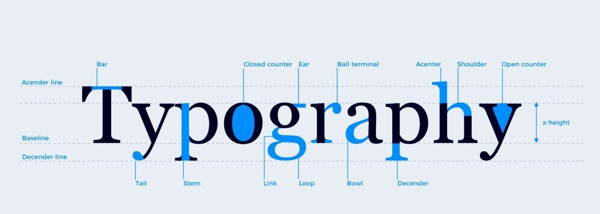
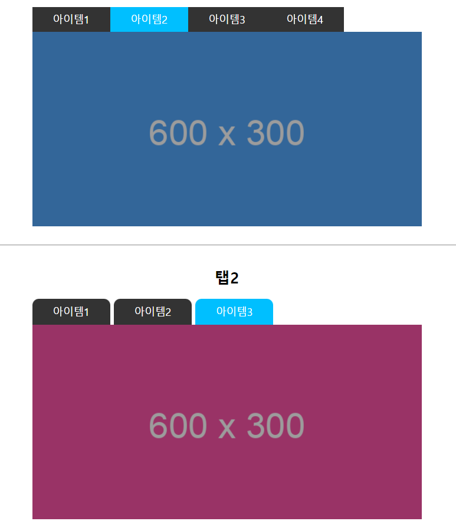

# 1. UI 설계 검토하기

<br><br>

## 1-1. UI 구현 프로세스 기획

### 1-1-1. 스타일 가이드 작성하기

| 표시 종류 | 설명 |
|-----------|--------------------------------------------------------------------|
| 색상(Color) | 사용자에게 상호작용 요소를 직관적으로 이해시키며, 버튼 같은 컨트롤에 고유의 색을 부여하고, <br> 애플리케이션의 전체 화면에 일관성 있게 사용하여 시선을 집중시키고, 행동을 유도할 수 있습니다.|
| 타이포(Typo) | 타이포그래피(Typograph)는 활자를 배열하여 표시하거나 인쇄할 때 언어를 읽을 수 있도록 호소력 있게<br> 만드는 기법과 기술을 의미합니다.|
| 아이콘(Icon) | 아이콘은 디스플레이에서 언어와 관계없이 누구나 쉽게 인지될 수 있도록한 작은 그림이나 이미지로서 <br> 의미나 해당 콘텐츠가 가지는 기능, 액션이나 상태, 정보 등을 쉽게 알 수 있도록한 그림문자를 포함합니다.  |
| 레이아웃(Layout) | 레이아웃이란, 특정 영역 안에 요소들을 배치하는 것을 의미하며, 정적인 화면 균형뿐만 아니라 <br> 서비스의 추상적인 공간의 구조를 적절하게 표현해야 합니다. |

<br>

#### 메타포 작성하기

```html
<!DOCTYPE html>
<html lang="en">
<head>
    <meta charset="UTF-8">
    <meta name="viewport" content="width=device-width, initial-scale=1.0">
    <title>가산동 소개</title>
    <script src="./js/jquery-3.2.1.min.js"></script>
    <link rel="stylesheet" href="./css/bootstrap.min.css" />
    <script src="./js/bootstrap.min.js"></script>
    <link rel="stylesheet" href="https://use.fontawesome.com/releases/v5.7.0/css/all.css" />
    <meta name="viewport" content="width=device-width, initial-scale=1.0">
    <meta name="subject" content="가산동 소개(Gasandong Intro)" />
    <meta name="description" content="가산동, 패션, 아웃렛, IT빌딩, 디지털산업단지, 가산동 맛집" />
    <meta name="keywords" content="가산동, 패션, 아웃렛, IT빌딩, 디지털산업단지, 가산동 맛집" />
    <link rel="icon" href="./images/favicon.png" />
    <link rel="shortcut icon" href="./images/favicon.png" />
    <meta property="og:type" content="website" />
    <meta property="og:title" content="gasandong" />
    <meta property="og:description" content="가산동, 패션, 아웃렛, IT빌딩, 디지털산업단지, 가산동 맛집" />
    <meta property="og:image" content="./images/site.png" />
    <meta property="og:url" content="http://localhost:8091" />
    <link href="https://fonts.googleapis.com/css2?family=Noto+Sans+KR" rel="stylesheet">
    <link rel="stylesheet" href="normalize2.css">
    <link rel="stylesheet" href="common.css">
    <link rel="stylesheet" href="sub_common.css">
	<style>

    </style>
</head>
<body>
    <header id="hd" class="clr-fix">
        <div class="hd_wrap">
        </div>
        <div class="hd_wrap2">

        </div>
    </header>
    <main id="contents" class="clr-fix">
        <figure id="vs">
            
        </figure>
        <section class="page" id="page1">
        </section>
    </main>

    <footer id="ft" class="clr-fix">

    </footer>
</body>
</html>
```

<br>

#### 색상(Color)


```comment
UI 에서 색상이란, 사용자에게 디자인을 직관적으로 이해시킬 수 있는 강력한 시각 요소입니다. 색상이 잘못 사용된 디자인은 사용자에게 혼란을 주고 서비스의 집중도를 떨어트립니다. UI에서 색상만 제대로 사용해도 사용자를 원하는 방향으로 이끌어 줄 수 있습니다.
```

[컬러 피커](https://htmlcolors.com/color-picker)

[그라디언트 컬러](https://www.colorzilla.com/ko/gradient-editor/)

[이미지 컬러 추출](https://color.adobe.com/ko/create/image)

<br>

##### 색상(Color) 구현하기


```html
<!DOCTYPE html>
<html lang="en">
<head>
    <meta charset="UTF-8">
    <meta name="viewport" content="width=device-width, initial-scale=1.0">
    <title>색상 구현하기</title>
	<style>
:root {
   --green-color-h: 81;
   --green-color-s: 50%;
   --green-color-l: 41%;
  
   --red-color-h: 2;
   --red-color-s: 50%;
   --red-color-l: 45%;
  
   --blue-color-h: 183;
   --blue-color-s: 49%;
   --blue-color-l: 27%;

   --green-color: hsl(var(--green-color-h), var(--green-color-s), var(--green-color-l));
   --green-color-10: hsl(var(--green-color-h), var(--green-color-s), calc(var(--green-color-l) + 5%));
   --green-color-20: hsl(var(--green-color-h), var(--green-color-s), calc(var(--green-color-l) + 10%));
   --green-color-30: hsl(var(--green-color-h), var(--green-color-s), calc(var(--green-color-l) + 15%));
   --green-color-40: hsl(var(--green-color-h), var(--green-color-s), calc(var(--green-color-l) + 20%));
   --green-color-50: hsl(var(--green-color-h), var(--green-color-s), calc(var(--green-color-l) + 25%));
   --green-color-60: hsl(var(--green-color-h), var(--green-color-s), calc(var(--green-color-l) + 30%));
   --green-color-70: hsl(var(--green-color-h), var(--green-color-s), calc(var(--green-color-l) + 35%));
   --green-color-80: hsl(var(--green-color-h), var(--green-color-s), calc(var(--green-color-l) + 40%));
  
   --red-color: hsl(var(--red-color-h), var(--red-color-s), var(--red-color-l));
   --red-color-10: hsl(var(--red-color-h), var(--red-color-s), calc(var(--red-color-l) + 5%));
   --red-color-20: hsl(var(--red-color-h), var(--red-color-s), calc(var(--red-color-l) + 10%));
   --red-color-30: hsl(var(--red-color-h), var(--red-color-s), calc(var(--red-color-l) + 15%));
   --red-color-40: hsl(var(--red-color-h), var(--red-color-s), calc(var(--red-color-l) + 20%));
   --red-color-50: hsl(var(--red-color-h), var(--red-color-s), calc(var(--red-color-l) + 25%));
   --red-color-60: hsl(var(--red-color-h), var(--red-color-s), calc(var(--red-color-l) + 30%));
   --red-color-70: hsl(var(--red-color-h), var(--red-color-s), calc(var(--red-color-l) + 35%));
   --red-color-80: hsl(var(--red-color-h), var(--red-color-s), calc(var(--red-color-l) + 40%));
  
   --blue-color: hsl(var(--blue-color-h), var(--blue-color-s), var(--blue-color-l));
   --blue-color-10: hsl(var(--blue-color-h), var(--blue-color-s), calc(var(--blue-color-l) + 5%));
   --blue-color-20: hsl(var(--blue-color-h), var(--blue-color-s), calc(var(--blue-color-l) + 10%));
   --blue-color-30: hsl(var(--blue-color-h), var(--blue-color-s), calc(var(--blue-color-l) + 15%));
   --blue-color-40: hsl(var(--blue-color-h), var(--blue-color-s), calc(var(--blue-color-l) + 20%));
   --blue-color-50: hsl(var(--blue-color-h), var(--blue-color-s), calc(var(--blue-color-l) + 25%));
   --blue-color-60: hsl(var(--blue-color-h), var(--blue-color-s), calc(var(--blue-color-l) + 30%));
   --blue-color-70: hsl(var(--blue-color-h), var(--blue-color-s), calc(var(--blue-color-l) + 35%));
   --blue-color-80: hsl(var(--blue-color-h), var(--blue-color-s), calc(var(--blue-color-l) + 40%));
}
     
.green {
  background: var(--green-color);
}

.green-10 {
  background: var(--green-color-10);
}

.green-20 {
  background: var(--green-color-20);
}

.green-30 {
  background: var(--green-color-30);
}

.green-40 {
  background: var(--green-color-40);
}

.green-50 {
  background: var(--green-color-50);
}

.green-60 {
  background: var(--green-color-60);
}

.green-70 {
  background: var(--green-color-70);
}

.green-80 {
  background: var(--green-color-80);
}
     
.red {
    background: var(--red-color);
}

.red-10 {
    background: var(--red-color-10);
}

.red-20 {
    background: var(--red-color-20);
}

.red-30 {
    background: var(--red-color-30);
}

.red-40 {
    background: var(--red-color-40);
}

.red-50 {
    background: var(--red-color-50);
}

.red-60 {
    background: var(--red-color-60);
}

.red-70 {
    background: var(--red-color-70);
}

.red-80 {
    background: var(--red-color-80);
}

.blue {
    background: var(--blue-color);
}

.blue-10 {
    background: var(--blue-color-10);
}

.blue-20 {
    background: var(--blue-color-20);
}

.blue-30 {
    background: var(--blue-color-30);
}

.blue-40 {
    background: var(--blue-color-40);
}

.blue-50 {
    background: var(--blue-color-50);
}

.blue-60 {
    background: var(--blue-color-60);
}

.blue-70 {
    background: var(--blue-color-70);
}

.blue-80 {
    background: var(--blue-color-80);
}

.container {
  display: grid;
  grid-template-columns: repeat(9, 100px);
  grid-template-rows: repeat(3, 40px);
  grid-gap: 4px
}
    </style>
</head>
<body>
    <div class="container">
        <div class="green"></div>
        <div class="green green-10"></div>
        <div class="green green-20"></div>
        <div class="green green-30"></div>
        <div class="green green-40"></div>
        <div class="green green-50"></div>
        <div class="green green-60"></div>
        <div class="green green-70"></div>
        <div class="green green-80"></div>
        
        <div class="red"></div>
        <div class="red red-10"></div>
        <div class="red red-20"></div>
        <div class="red red-30"></div>
        <div class="red red-40"></div>
        <div class="red red-50"></div>
        <div class="red red-60"></div>
        <div class="red red-70"></div>
        <div class="red red-80"></div>
        
        <div class="blue"></div>
        <div class="blue blue-10"></div>
        <div class="blue blue-20"></div>
        <div class="blue blue-30"></div>
        <div class="blue blue-40"></div>
        <div class="blue blue-50"></div>
        <div class="blue blue-60"></div>
        <div class="blue blue-70"></div>
        <div class="blue blue-80"></div>
    </div>  
</body>
</html>
```

<br><hr><br>

#### 타이포그래피(Typograph)



```comment
UI에서 타이포그래피란, 다른 시각 언어보다 구체적이고 정확하게 정보를 전달하는 언어입니다. 물체나 풍경 같은 것들은 아이콘이나 이미지로 알려주는 게 좋을 수 있지만, 행동이나 개념을 알려줄 때는 문자가 더 효율적입니다.
```


```html
<!DOCTYPE html>
<html lang="en">
<head>
    <meta charset="UTF-8">
    <meta name="viewport" content="width=device-width, initial-scale=1.0">
    <title>타이포그래피</title>
    <style>
    @font-face {
    font-family: "strato-tonale";
    src: url("https://s3-us-west-2.amazonaws.com/s.cdpn.io/209981/strato_tonale-webfont.woff2") format("woff2");
    font-weight: 600;
    font-style: normal;
    }
    @font-face {
    font-family: "strato-cesello";
    src: url("https://s3-us-west-2.amazonaws.com/s.cdpn.io/209981/strato_cesello-webfont.woff2") format("woff2");
    font-weight: 600;
    font-style: normal;
    }
    @font-face {
    font-family: "strato-roman";
    src: url("https://s3-us-west-2.amazonaws.com/s.cdpn.io/209981/strato_roman-webfont.woff2") format("woff2");
    font-weight: 600;
    font-style: normal;
    }
    @font-face {
    font-family: "strato-eclisse";
    src: url("https://s3-us-west-2.amazonaws.com/s.cdpn.io/209981/strato_eclisse-webfont.woff2") format("woff2");
    font-weight: 600;
    font-style: normal;
    }
    @font-face {
    font-family: "strato-inline";
    src: url("https://s3-us-west-2.amazonaws.com/s.cdpn.io/209981/strato_inline-webfont.woff2") format("woff2");
    font-weight: 600;
    font-style: normal;
    }    
    @font-face {
    font-family: "Rig Bold Coarse";
    src: url("https://s3-us-west-2.amazonaws.com/s.cdpn.io/209981/Rig-BoldCoarse.otf");
    }
    @font-face {
    font-family: "Rig Bold Extrude";
    src: url("https://s3-us-west-2.amazonaws.com/s.cdpn.io/209981/Rig-BoldExtrude.otf");
    }
    @font-face {
    font-family: "Rig Bold Shadow";
    src: url("https://s3-us-west-2.amazonaws.com/s.cdpn.io/209981/Rig-BoldShadow.otf");
    }
    @font-face {
    font-family: "Rig Bold Face";
    src: url("https://s3-us-west-2.amazonaws.com/s.cdpn.io/209981/Rig-BoldFace.otf");
    }
    @font-face {
    font-family: "Rig Bold Inline";
    src: url("https://s3-us-west-2.amazonaws.com/s.cdpn.io/209981/Rig-BoldInline.otf");
    }
    @font-face {
        font-family: "Square Sans Serif";
        src: url("https://www.sicontis.com/codepen/cpc-text-shadow/fonts/square-sans-serif-7.regular.woff2")
                format("woff2"),
            url("https://www.sicontis.com/codepen/cpc-text-shadow/fonts/square-sans-serif-7.regular.woff")
                format("woff");
    }
    * { margin: 0; padding: 0; }
    body { width: 100%; min-height: 100%; }  
    .wrap { width: 100%; min-height:50vh; clear:both; position:relative; }
    .wrap:after { content:""; display:block; width: 100%; clear:both; } 
    </style>
    <style> 
    #typo1 {   background: #E4E2F3;  width: 100%;  height:50%; }
    #typo1 h1 {  font-family: "strato-roman";  text-transform: uppercase;
    font-size: 18vw;  text-align: center;  font-weight: normal;  line-height: 1;
    margin: 0;  top: 50%;  left: 50%;  transform: translate(-50%, -50%);
    position: absolute;  color: #a2adff;  letter-spacing: 1rem;
    width: 100%;  text-shadow: -1px -1px 0 #5a66c4, 1px -1px 0 #5a66c4, -1px 1px 0 #5a66c4, 1px 1px 0 #5a66c4;}
    #typo1 h1:after, #typo1 h1:before, #typo1 h1 span:before, #typo1 h1 span:after {
    content: attr(data-heading);  position: absolute;  overflow: hidden;  left: 0;  top: 0;
    text-shadow: none;  width: 100%;  font-weight: normal; }
    #typo1 h1:after {  font-family: "strato-tonale", sans-serif;  color: #5a66c4;
    z-index: -1; }
    #typo1 h1:before {  color: #c9cfff;  font-family: "strato-cesello";
    z-index: 3;  text-shadow: none; }
    #typo1 h1 span:before {  color: #7c88e6;  font-family: "strato-eclisse";
    text-shadow: none;  z-index: -1; }
    #typo1 h1 span:after {  font-family: "strato-inline";  color: #7d89e7;
    z-index: 6;  text-shadow: none; }
    </style>

    <style>
    #typo2 * { margin: 0;    padding: 0;    position: relative;    box-sizing: border-box;    }
    #typo2 { background-color: #110809;    min-height:50vh;    display: flex;    justify-content: center;
    align-items: center;    }
    #typo2 .con {    height: 100%;    display: flex;    align-items: center;    justify-content: center;
    flex: 0 1;    }
    #typo2 .st {    text-align: center;    flex: 0 1 auto;    display: flex;
    flex-wrap: wrap;    font-family: "Cochin";    font-size: 5em;
    font-weight: 600;    line-height: 1;    text-transform: uppercase;
    color: transparent;    -webkit-text-stroke: 2px red;  filter: drop-shadow(0 0 15px red); }
    #typo2 .l {    font-size: 1.4em;    vertical-align: -0.175em;    margin-top: -0.2em; }
    #typo2 .full {    flex: 1 0 100%;    }
    #typo2 .w {    white-space: nowrap;    }
    #typo2 .w-2 {    margin: 0 0.1em;    margin-top: -0.4em;    }
    #typo2 .decorator {    height: 0.1em;    border: 2px solid red;    flex: 1 0 auto; }
    </style>

    <style>
    #typo3 {   background: #e4e2f2;  width: 100%;  height:50vh;}    
    #typo3 h1 {  font-family: "Rig Bold Face", sans-serif;
    text-transform: uppercase;  font-size: 18vw;  text-align: center;
    font-weight: normal;  margin: 0;  top: 50%;  left: 50%;
    transform: translate(-50%, -50%);  position: absolute;  color: #91d4ff; }
        #typo3 h1:before, #typo3 h1:after, #typo3 h1 span:before, #typo3 h1 span:after {
    content: attr(data-heading);  position: absolute;
    overflow: hidden;  left: 0;  top: 0;  width: 100%;  z-index: 5;
    font-weight: normal;  text-shadow: none; }
    #typo3 h1:before {  color: #fff;  font-family: "Rig Bold Inline", sans-serif;}
    #typo3 h1:after {  font-family: "Rig Bold Coarse", sans-serif;  color: #040351;}
    #typo3 span::before {  font-family: "Rig Bold Shadow", sans-serif;  color: #cbc7e3;
    z-index: -1; }
    #typo3 span::after {  font-family: "Rig Bold Extrude", sans-serif;  color: #4d8bea;
    z-index: -1; }
    </style>

    <style>
    @import url("https://fonts.googleapis.com/css?family=Bungee Shade");    
    #typo4 {   width: 100%;  height:50vh;  display: flex;  align-items: center;
    justify-content: center;  font-family: "Bungee Shade", cursive;  background: #ffed94;}
    #typo4 h1 {  display: flex;  align-items: center;  justify-content: center;
    align-content: center;  text-align: center;  font-weight: normal;  width: 100%;
    text-align: center;  font-size: 16vw;
    background: linear-gradient(-45deg, #4bc0c8 25%, #feac5e 25%, #feac5e 50%, #4bc0c8 50%, #4bc0c8 75%, #feac5e 75%, #feac5e);
    -webkit-background-clip: text;  -webkit-text-fill-color: transparent;
    background-size: 20px 20px;  background-position: 0 0; 
    }
    </style>

    <style>
    @import url("https://fonts.googleapis.com/css?family=Luckiest+Guy&display=swap");
    #typo5 {
    background: radial-gradient(circle, #fffc00 0%, #f0ed17 100%);
    height: 50vh;   display: flex;    justify-content: center;
    align-items: center;    font-family: "Luckiest Guy", cursive;    }
    #typo5 h1 {    margin: 0;    font-size: 8em;    padding: 0;
    color: white;    text-shadow: 0 0.1em 20px black, 0.05em -0.03em 0 black, 0.05em 0.005em 0 black, 0em 0.08em 0 black, 0.05em 0.08em 0 black, 0px -0.03em 0 black, -0.03em -0.03em 0 black, -0.03em 0.08em 0 black, -0.03em 0 0 black; }
    #typo5 h1 span {    transform: scale(0.9);    display: inline-block;    }
    </style>

    <style>
    @import url("https://fonts.googleapis.com/css2?family=Anton&display=swap");
    #typo6 {    height: 80vh;    overflow: hidden;
    background: radial-gradient(farthest-corner, rgba(0, 0, 0, 0.5), rgba(0, 0, 0, 0.8)), url(https://picsum.photos/1280/800) center/cover;
    display: flex;    flex-direction: column;    align-items: center;    justify-content: center;    }
    #typo6 .wrapper {    font-size: 20vmin;    height: 2em;    width: 100%;
    display: flex;    align-items: center;    justify-content: center;    mix-blend-mode: screen;   }
    #typo6 .wrapper.invert span {    color: black;    }
    #typo6 .wrapper.invert span::before {     -webkit-text-stroke: 0.1em var(--color);    }
    #typo6 .wrapper span {    --color: #ffba11;
    font-family: Impact, "Anton", Haettenschweiler, "Arial Narrow Bold", sans-serif;
    font-weight: 700;    font-style: italic;    display: block;    position: absolute;
    color: var(--color);    letter-spacing: -0.005em;    }
    #typo6 .wrapper span::before, #typo6 .wrapper span::after {
    content: attr(data-text);    display: block;    position: relative;
    padding: 0 0.1em;    z-index: 1;    }
    #typo6 .wrapper span::before {    position: absolute;    -webkit-text-stroke: 0.1em black;
    z-index: 0;    }
    #typo6 .wrapper span:first-child {    transform: translate(-0.255em, -0.25em);    }
    #typo6 .wrapper span:last-child {    --color: #b6acff;    transform: translate(0.255em, 0.25em); }
    </style>

    <style>
    #typo7 {    --gold: #ffb338;    --light-shadow: #77571d;
    --dark-shadow: #3e2904;    margin: 0;   height:50vh; }
    #typo7 * {    box-sizing: border-box;    }
    #typo7 .wrapper {    background: radial-gradient(#272727, #1b1b1b);
    display: grid;    grid-template-areas: 'overlap';
    place-content: center;    text-transform: uppercase;    height:50vh;    }
    #typo7 .wrapper > div {    background-clip: text;      -webkit-background-clip: text;
    color: #363833;    font-family: 'Poppins', sans-serif;    font-weight: 900;
    font-size: clamp( 3em, 18vw, 15rem);    grid-area: overlap;
    letter-spacing: 1px;    -webkit-text-stroke: 4px transparent;    }
    #typo7 div.bg {    background-image: repeating-linear-gradient( 105deg, 
        var(--gold) 0% , var(--dark-shadow) 5%,  var(--gold) 12%);  color: transparent;
    filter: drop-shadow(5px 15px 15px black);   transform: scaleY(1.05);
    transform-origin: top;  }
    #typo7 div.fg{    background-image: repeating-linear-gradient( 5deg,  
        var(--gold) 0% , var(--light-shadow) 23%, var(--gold) 31%);
    color: #1e2127;    transform: scale(1);    }    
    </style>

    <style>
    @import url("https://fonts.googleapis.com/css2?family=Bai+Jamjuree&display=swap");    
    #typo8 { font-family: "Bai Jamjuree", sans-serif;  font-size: 15rem;  display: flex;
    align-items: center;  justify-content: center;   width: 100%;  height: 50vh;
    background-color: #001e2e;    }

    #typo8 .number {    position: relative;    animation: rotate 2s infinite ease-in-out;    }
    #typo8 span:nth-child(1) {    position: absolute;    font-weight: bold;    filter: blur(10rem);
    color: #0067ff;    }
    #typo8 span:nth-child(2) {    position: absolute;    font-weight: bold;    filter: blur(1.3rem);
    background: -webkit-linear-gradient(85deg, #084d92 20%, #76d8fe 21%, #149dcc, #76d8fe 31%, #084d92 33%, #084d92 50%, #76d8fe 52%, #149dcc, #76d8fe 72%, #084d92 72%, #76d8fe);
    -webkit-background-clip: text;    -webkit-text-fill-color: transparent;    }
    #typo8 span:nth-child(3) {    position: absolute;    font-weight: 700;  filter: blur(0.3rem);    color: rgba(0, 0, 0, 0.4); }
    #typo8 span:nth-child(4) {    position: absolute;    font-weight: 700;
    background: -webkit-linear-gradient(85deg, #084d92 20%, #76d8fe 21%, #149dcc, #76d8fe 31%, #084d92 33%, #084d92 50%, #76d8fe 52%, #149dcc, #76d8fe 72%, #084d92 72%, #76d8fe);
    -webkit-background-clip: text;    -webkit-text-fill-color: transparent;    }
    #typo8 span:nth-child(5) {    position: absolute;    color: black;
    filter: blur(1px);    text-shadow: 0.3rem 0.3rem rgba(0, 0, 0, 0.7);    }
    #typo8 span:nth-child(6) {
    position: relative;    background: -webkit-linear-gradient(#76d8fe, #084d92);
    -webkit-background-clip: text;    -webkit-text-fill-color: transparent;    }
    </style>

    <style>
    #typo9 article { height: 20vh;    width: 20vw;    display: flex;    flex-direction: column;
    justify-content: center;    align-items: center;    margin: auto;
    transform: skewY(-8deg);    }
    #typo9 {    background: var(--back);    --back: hsl(223, 32%, 12%);    font-family: Ruda;
    color: #eff6ff;    display: flex;    overflow: hidden;    margin: 0;    padding: 0;
    box-sizing: border-box;    line-height: 1;    }
    #typo9 div { position: absolute; height:5vw; width: 50vw; background: linear-gradient(
        to bottom,     hsl(343, 80%, 64%),    hsl(343, 80%, 54%));
    left: 50%;    top: 50%;    transform: translate(-44%, -53%) skewX(-5.6deg);    filter: url(#drawn2); }    
    #typo9 .vote {  text-transform: uppercase;  font-size: 44vmin;  letter-spacing: -0.05em;
  filter: url(#drawn); }    
    #typo9 .empathy {    text-transform: uppercase;    font-size: 26vmin;
    letter-spacing: -0.068em;    translate: -1.5vmin -4vmin;    color: var(--back);
    color: hsl(343, 100%, 80%);    opacity: 1;    padding: 0 1em;    filter: url(#drawn);   }
    #typo9 .little {    width: 120vmin;    margin: 0.25em 0;    font-size: 8vmin;
    translate: 0 -4vmin;    text-align: center;    position: relative;    overflow: hidden;
    filter: url(#drawn2);    }
    #typo9 .little::before {    background: linear-gradient(to right, hsl(243, 80%, 64%), hsl(343, 80%, 54%));
    content: "";    position: absolute;    top: 1px;    right: 3px;    bottom: 3px;
    left: 1px;    filter: url(#drawn2);    }
    #typo9 .little span {    padding: 0.25em;    display: block;    width: 100%;
    position: relative;    }
    #typo9 .little span:last-of-type {    position: absolute;    left: 0%;    top: 0%;
    bottom: 0%;    animation-delay: -5000ms;    }
    </style>

    <style>
    @import url("https://fonts.googleapis.com/css2?family=Dorsa&family=Raleway&display=swap");    

    #typo10 {  background: black; height: 60vh; overflow:hidden;  }    
    #typo10 .container { display: flex;  position: relative;  width: 100%;  height: 60vh;
    align-items: center;  flex-direction: column;  filter: url("#noise") url("#light");
    justify-content: center;  transform: translate3d(0, 0, 0);  z-index: 1;
    color: #fff;  text-align: center; }
    #typo10 .title {  margin: 0 0 0.075em;  font-family: "Dorsa", sans-serif;
    font-size: 18em;  font-weight: 400;  line-height: 0.8;  text-transform: uppercase; }
    #typo10 .subtitle {  font-family: "Raleway", sans-serif;  font-size: 0.8em;
    letter-spacing: 0.2em;  text-transform: uppercase; }
    #typo10 svg {  position: absolute;  top: 0;  left: 0;
    width: 100%;  height: 100%;  z-index: 10; }
    #typo10 .cursor__point {  margin: -3px 0 0 -3px;  position: fixed;  top: 0;
    left: 0;  width: 6px;  height: 6px;  background-color: white;
    border-radius: 50%;  z-index: 2; }
    #typo10 .cursor__light {  margin: -24px 0 0 -24px;  position: fixed;
    top: 0;  left: 0;  width: 48px;  height: 48px;  background-color: white;
    border-radius: 50%;  opacity: 0.1;  z-index: 2; }
    </style>

    <style>
    @import url("https://fonts.googleapis.com/css2?family=Lobster&display=swap");
    .wrap:nth-child(11) {  height: 80vh;  background-color: #333;  font-family: Lobster, "Trebuchet MS", "Lucida Sans Unicode", "Lucida Grande", "Lucida Sans", Arial, sans-serif;}
    #typo11 {  --text: "Spotlight";  --hue: 220deg;  --spin: 25deg;  --light-color: #ffeab1;
    --perspective: 80vmin;  --stripe: .3em;  --stripe-angle: -35deg;  width: 100%;
    height: 100%;  overflow: hidden;  display: flex;  align-items: center;
    justify-content: center;  position: relative;
    background-image: linear-gradient(to bottom, #383838, #3c3c3c 50%, #2f2f2f 60%, #0b0e13);
    font-size: 17.5vmin;
    }
    #typo11 .light {  display: block;  position: absolute;  top: 0;
    left: 50%;  width: 90%;  height: 60%;  min-height: 6em;  transform: translateX(-50%) translateY(-1em);
    z-index: 1;  mix-blend-mode: screen;  filter: blur(0.15em);  opacity: 0.6; }
    #typo11 .light::before {    content: "";    display: block;    top: 0;
    left: 0;    width: 100%;    height: 100%;
    background-image: linear-gradient(to bottom, var(--light-color), transparent);
    -webkit-clip-path: polygon(25% 0, 75% 0, 100% 100%, 0% 100%);
            clip-path: polygon(25% 0, 75% 0, 100% 100%, 0% 100%);
    border-radius: 0 0 1em 1em;    }
    #typo11 figure {    display: block;    position: relative;    display: flex;
    align-items: center;    justify-content: center;    transform-style: preserve-3d;
    perspective: var(--perspective);    }
    #typo11 figure span {    display: block;    }
    #typo11 figure span::before {    text-align: center;    content: var(--text);    white-space: pre;    display: block;    }
    #typo11 figure .text {    transform-style: preserve-3d;    position: relative;    
        -webkit-animation: rotate 3s ease-in-out infinite both alternate;
          animation: rotate 3s ease-in-out infinite both alternate; }
    #typo11 figure .text span {    transform-style: preserve-3d;    position: absolute;    top: 0;    left: 0;    }
    #typo11 figure .text span:first-child {    position: static;    -webkit-animation: shine 3s linear infinite;            animation: shine 3s linear infinite;    }
    #typo11 figure .text span:nth-child(1)::before {    transform: translateZ(-0.01em);    color: hsl(var(--hue), 59%, 77.5%);    }
    #typo11 figure .text span:nth-child(2)::before {    transform: translateZ(-0.02em);    color: hsl(var(--hue), 58%, 75%);    }
    #typo11 figure .text span:nth-child(3)::before {    transform: translateZ(-0.03em);    color: hsl(var(--hue), 57%, 72.5%);    }
    #typo11 figure .text span:nth-child(4)::before {    transform: translateZ(-0.04em);    color: hsl(var(--hue), 56%, 70%);    }
    #typo11 figure .text span:nth-child(5)::before {    transform: translateZ(-0.05em);    color: hsl(var(--hue), 55%, 67.5%);    }
    #typo11 figure .text span:nth-child(6)::before {    transform: translateZ(-0.06em);    color: hsl(var(--hue), 54%, 65%);    }
    #typo11 figure .text span:nth-child(7)::before {    transform: translateZ(-0.07em);    color: hsl(var(--hue), 53%, 62.5%);    }
    #typo11 figure .text span:nth-child(8)::before {    transform: translateZ(-0.08em);    color: hsl(var(--hue), 52%, 60%);    }
    #typo11 figure .text span:nth-child(9)::before {    transform: translateZ(-0.09em);    color: hsl(var(--hue), 51%, 57.5%);    }
    #typo11 figure .text span:nth-child(10)::before {    transform: translateZ(-0.1em);    color: hsl(var(--hue), 50%, 55%);    }
    #typo11 figure .text span:nth-child(11)::before {    transform: translateZ(-0.11em);    color: hsl(var(--hue), 49%, 52.5%);    }
    #typo11 figure .text span:nth-child(12)::before {    transform: translateZ(-0.12em);    color: hsl(var(--hue), 48%, 50%);    }
    #typo11 figure .text span:nth-child(13)::before {    transform: translateZ(-0.13em);    color: hsl(var(--hue), 47%, 47.5%);    }
    #typo11 figure .text span:nth-child(14)::before {    transform: translateZ(-0.14em);    color: hsl(var(--hue), 46%, 45%);    }
    #typo11 figure .text span:nth-child(15)::before {    transform: translateZ(-0.15em);    color: hsl(var(--hue), 45%, 42.5%);    }
    #typo11 figure .text span:nth-child(16)::before {    transform: translateZ(-0.16em);    color: hsl(var(--hue), 44%, 40%);    }
    #typo11 figure .text span:nth-child(17)::before {    transform: translateZ(-0.17em);    color: hsl(var(--hue), 43%, 37.5%);    }
    #typo11 figure .text span:nth-child(18)::before {    transform: translateZ(-0.18em);    color: hsl(var(--hue), 42%, 35%);    }
    #typo11 figure .text span:nth-child(19)::before {    transform: translateZ(-0.19em);    color: hsl(var(--hue), 41%, 32.5%);    }
    #typo11 figure .text span:nth-child(20)::before {    transform: translateZ(-0.2em);    color: hsl(var(--hue), 40%, 30%);    }
    #typo11 figure .shadow {    display: flex;    align-items: center;    justify-content: center;
    position: absolute;    transform-style: preserve-3d;
    perspective: var(--perspective);    width: 90vw;    height: 90vw;
    font-size: 1em;    transform: translate3D(0, 2em, 0) rotateX(90.01deg);
    opacity: 0.9;    -webkit-backface-visibility: hidden;            backface-visibility: hidden;
    }
    #typo11 figure .shadow::after {    content: "";    display: block;    position: absolute;
    top: 0;    left: 0;    width: 100%;    height: 100%;
    background-image: radial-gradient(closest-side, var(--light-color), transparent);
    transform: translateY(1px);    z-index: 0;    mix-blend-mode: screen;
    opacity: 0.5;    }
    #typo11 figure .shadow::before {    filter: blur(4px);    opacity: 0.8;    z-index: 1;  
        -webkit-animation: rotate-shadow 3s ease-in-out infinite both alternate;
          animation: rotate-shadow 3s ease-in-out infinite both alternate; }    

    @-webkit-keyframes rotate {
    /* from {
        transform: rotate3D(0, 1, 0, calc(var(--spin) * -1)) rotateX(30deg);
    }
    to {
        transform: rotate3D(0, 1, 0, var(--spin)) rotateX(30deg);
    } */
    }

    @keyframes rotate {
    /* from {
        transform: rotate3D(0, 1, 0, calc(var(--spin) * -1)) rotateX(30deg);
    }
    to {
        transform: rotate3D(0, 1, 0, var(--spin)) rotateX(30deg);
    } */
    }
    @-webkit-keyframes rotate-shadow {
    /* from {
        transform: rotateZ(var(--spin));
    }
    to {
        transform: rotateZ(calc(var(--spin) * -1));
    } */
    }
    @keyframes rotate-shadow {
    /* from {
        transform: rotateZ(var(--spin));
    }
    to {
        transform: rotateZ(calc(var(--spin) * -1));
    } */
    }
    @-webkit-keyframes shine {
    0% {
        filter: brightness(1);
    }
    30% {
        filter: brightness(1.2);
    }
    50% {
        filter: brightness(1.4);
    }
    70% {
        filter: brightness(1.2);
    }
    100% {
        filter: brightness(1);
    }
    }
    @keyframes shine {
    0% {
        filter: brightness(1);
    }
    30% {
        filter: brightness(1.2);
    }
    50% {
        filter: brightness(1.4);
    }
    70% {
        filter: brightness(1.2);
    }
    100% {
        filter: brightness(1);
    }
    }
    </style>

    <style>
    @import url("https://fonts.googleapis.com/css2?family=Raleway:wght@900&display=swap"); 
    #typo12 {    height:50vh;    width: 100%;    font-family: "Raleway", sans-serif;
    display: flex;    align-items: center;    justify-content: center;    background-color: #eaece5;    
    font-weight: 900; }
    #typo12 .text {    font-size: 8em;    position: relative;    text-transform: full-width;
    display: flex;    }
    #typo12 .text .letter {    position: relative;    display: flex;    }
    #typo12 .text .letter .source {    color: gray;    -webkit-text-stroke: 0.01em rgba(0, 0, 0, 0.3);
            display: flex;    }
    #typo12 .text .letter .overlay, #typo12 .text .letter .shadow {    position: absolute;
    top: 0;    left: 0;    pointer-events: none;    user-select: none;    }
    #typo12 .text .letter .overlay { background-image: linear-gradient(90deg, white 50%, #eff0eb);
    -webkit-background-clip: text;    -webkit-text-fill-color: transparent;
    transform: rotateY(-30deg) skew(0, -10deg);    transform-origin: left;
    animation: overlay 3s infinite ease-out var(--delay);    }
    #typo12 .text .letter .shadow {    filter: blur(5px);
    background-image: linear-gradient(90deg, rgba(0, 0, 0, 0.4) 30%, transparent);
    -webkit-background-clip: text;    -webkit-text-fill-color: transparent;
    transform: skew(0, 20deg) translateY(0.1em) translateX(0.05em);
    animation: shadow 3s infinite var(--delay);    }

    @keyframes shadow {
    /* 0%, 20%, 100% {
        transform: skew(0, 20deg) translateY(0.1em) translateX(0.05em);
        opacity: 1;
    }
    10% {
        transform: skew(0, 0) translateY(0) translateX(0);
        opacity: 0;
    } */
    }
    @keyframes overlay {
    /* 0%, 20%, 100% {
        transform: rotateY(-30deg) skew(0, -10deg);
    }
    10% {
        transform: rotateY(0deg) skew(0, 0);
    } */
    }    
    </style>

    <style>
    @import url("https://fonts.googleapis.com/css?family=Monoton&display=swap");    
    @import url("https://fonts.googleapis.com/css?family=Lobster&display=swap");    
    @import url("https://fonts.googleapis.com/css?family=Abril+Fatface&display=swap");    
    @import url("https://fonts.googleapis.com/css?family=Comfortaa:400,700&display=swap");    
    @import url("https://fonts.googleapis.com/css?family=Do+Hyeon&display=swap");    
    @import url("https://fonts.googleapis.com/css?family=Notable&display=swap");    
    .wrap:nth-child(13) { margin: 0; padding: 0; min-height:80vh; width: 100%; 
        background:
    radial-gradient(black 15%, transparent 16%) 0 0,
    radial-gradient(black 15%, transparent 16%) 8px 8px,
    radial-gradient(rgba(255,255,255,.1) 15%, transparent 20%) 0 1px,
    radial-gradient(rgba(255,255,255,.1) 15%, transparent 20%) 8px 9px;
    background-color:#282828;    background-size:16px 16px;   padding-top: 20px;
    padding-bottom: 50px;  }
    #typo13 .neon_effect p {    text-align: center;    font-size: 8vw;
    margin: 50px;    transition: all 0.4s;    }
    #typo13 .neon_effect p:nth-child(1){    color: #fff;
    font-family: Monoton;    text-shadow: 0 0 10px #fff, 0 0 20px #fff, 0 0 30px #fff, 0 0 40px #FF1177, 0 0 70px #FF1177, 0 0 80px #FF1177, 0 0 100px #FF1177, 0 0 150px #FF1177;   }
    #typo13 .neon_effect p:nth-child(2){    color: #fff;
    font-family: Lobster;    text-shadow: 0 0 10px #fff, 0 0 20px #fff, 0 0 30px #fff, 0 0 40px #228DFF, 0 0 70px #228DFF, 0 0 80px #228DFF, 0 0 100px #228DFF, 0 0 150px #228DFF;    }
    #typo13 .neon_effect p:nth-child(3){    color: #fff;
    font-family: Abril Fatface;    text-shadow: 0 0 10px #fff, 0 0 20px #fff, 0 0 30px #fff, 0 0 40px #FFDD1B, 0 0 70px #FFDD1B, 0 0 80px #FFDD1B, 0 0 100px #FFDD1B, 0 0 150px #FFDD1B;    }
    #typo13 .neon_effect p:nth-child(4){    color: #fff;    font-family: Comfortaa;
    font-weight: 700;    text-shadow: 0 0 10px #fff, 0 0 20px #fff, 0 0 30px #fff, 0 0 40px #B6FF00, 0 0 70px #B6FF00, 0 0 80px #B6FF00, 0 0 100px #B6FF00, 0 0 150px #B6FF00;    }
    #typo13 .neon_effect p:nth-child(5){    color: #fff;    font-family: 'Do Hyeon';
    font-weight: bold;     text-shadow: 0 0 10px #fff, 0 0 20px #fff, 0 0 30px #fff, 0 0 40px #FF9900, 0 0 70px #FF9900, 0 0 80px #FF9900, 0 0 100px #FF9900, 0 0 150px #FF9900;    }
    #typo13 .neon_effect p:nth-child(6){    color: #fff;    font-family: 'Notable', sans-serif;
    font-size:4vw;
    font-weight: bold;    text-shadow: 0 0 5px #fff, 0 0 10px #fff, 0 0 15px #fff, 0 0 20px #ff00de, 0 0 35px #ff00de, 0 0 40px #ff00de, 0 0 50px #ff00de, 0 0 75px #ff00de;    }
    </style>
    <style>
    #typo14 {  background-color: #1D2025; min-height:40vh; }
    #typo14 .main{  width: 90vw;  margin: 0 auto;  text-align: center; }
    #typo14 .main_item {  font-size:150px;  font-weight: 900; line-height: 40vh;
  background-image: linear-gradient(258deg, rgb(12 154 162), rgb(217 217 144));
    -webkit-background-clip: text;  -webkit-text-fill-color: transparent;  background-clip: text;
  color: transparent; }
    
    </style>
    <style>
    #typo15 {  background-color: #181d25; min-height:40vh; }
    #typo15 .main{  width: 90vw;  margin: 0 auto;  text-align: center; }    
    #typo15 .main_item {  font-size:180px;  font-weight: 900; line-height: 40vh; 
    -webkit-text-stroke: 4px deepskyblue;
    text-shadow: 3px 3px deepskyblue, -3px -3px deepskyblue;
    text-shadow: 3px 0px deepskyblue, 0px 3px deepskyblue, -3px 0px deepskyblue, 0px -3px deepskyblue;
        color:white;
    }
    </style>
</head>
<body>
    <div class="wrap">
        <div id="typo1">
            <h1 data-heading="Strato">
                <span data-heading="Strato" contenteditable>Strato</span>
            </h1>
        </div>
    </div>
    <div class="wrap">
        <div id="typo2">
            <article class="con">
                <div class="st">
                    <i class="decorator full"></i>
                    <span class="w full js-w1">
                    <span class="l">S</span>trange<span class="l">r</span>
                    </span>
                    <i class="decorator"></i>
                    <span class="w w-2 js-w2">Things</span>
                    <i class="decorator"></i>
                </div> 
            </article>  
        </div>      
    </div>
    <div class="wrap">
        <div id="typo3">
            <h1 data-heading="Magic">
                <span contenteditable data-heading="Magic">Magic</span>
            </h1>        
        </div>
    </div>
    <div class="wrap">
        <div id="typo4">
            <h1 data-heading="Slide">Slide</h1>
        </div>
    </div>
    <div class="wrap">
        <div id="typo5">
            <h1><span>"BIG</span><span>YIKES"</span></h1>
        </div>
    </div>
    <div class="wrap">
        <div id="typo6">
            <div class="wrapper">
                <span data-text="Lorem"></span>
                <span data-text="Ipsum"></span>
            </div>
            <div class="wrapper invert">
                <span data-text="Lorem"></span>
                <span data-text="Ipsum"></span>
            </div>
        </div>
    </div>
    <div class="wrap">
        <div id="typo7">
            <div class="wrapper">
                <div class="bg"> Gold </div>
                <div class="fg"> Gold </div>
            </div>
        </div>
    </div>
    <div class="wrap">
        <div id="typo8">
            <div class="number">
                <span>Aquaman</span>
                <span>Aquaman</span>
                <span>Aquaman</span>
                <span>Aquaman</span>
                <span>Aquaman</span>
                <span>Aquaman</span>
            </div>
        </div>
    </div>
    <div class="wrap">
        <div id="typo9">
            <div>
                <article>
                    <p class="vote">Vote</p>
                    <p class="little"><span>with</span><span>for</span></p>
                    <p class="empathy">Empathy</p>
                </article>
            </div>
            <svg viewBox="0 0 200 200">
                <defs>
                  <filter id="drawn">
                    <feTurbulence baseFrequency="0.45" numOctaves="7" />
                    <feDisplacementMap in="SourceGraphic" scale="7" />
                  </filter>
                  <filter id="drawn2">
                    <feTurbulence baseFrequency="0.35" numOctaves="7" />
                    <feDisplacementMap in="SourceGraphic" scale="7" />
                  </filter>
                </defs>
              </svg>
        </div>
    </div>
    <div class="wrap">
        <div id="typo10">
            <div class="container">
                <h1 class="title">
                  This is <br/> 
                  just SVG
                </h1>
                <div class="subtitle">
                  How cool is that?
                </div>
              </div>
              
              <div class="cursor">
                <div class="cursor__point"></div>
                <div class="cursor__light"></div>
              </div>
              
              <svg xmlns="http://www.w3.org/2000/svg" preserveAspectRatio="none">
                <filter id="light">
                  <feSpecularLighting result="specOut" surfaceScale="1" specularConstant="1.2" specularExponent="10" lighting-color="#999">
                    <fePointLight id="point-light" x="50" y="75" z="100" />
                  </feSpecularLighting>
                </filter>
              
                <filter id="noise">
                  <feTurbulence id="turbulence" type="fractalNoise" baseFrequency="0.999 0.999" seed="1" numOctaves="10" />
                  <feColorMatrix type="saturate" values="0" />
                  <feComponentTransfer result="noise">
                    <feFuncA type="linear" slope="1" />
                  </feComponentTransfer>
                  <feBlend in="noise" in2="SourceGraphic" mode="multiply" />
                </filter>
              </svg>
        </div>
    </div>
    <div class="wrap">
        <div id="typo11">
            <div class="light"></div>
            <figure>
              <div class="text"><span></span><span></span><span></span><span></span><span></span><span></span><span></span><span></span><span></span><span></span><span></span><span></span><span></span><span></span><span></span><span></span><span></span><span></span><span></span><span></span>
              </div><span class="shadow"></span>
            </figure>
        </div>
    </div>
    <div class="wrap">
        <div id="typo12">
            <div class="text"><div class="letter" style="--delay: 0s;"><span class="source">P</span><span class="shadow">P</span><span class="overlay">P</span></div><div class="letter" style="--delay: 0.2s;"><span class="source">A</span><span class="shadow">A</span><span class="overlay">A</span></div><div class="letter" style="--delay: 0.4s;"><span class="source">P</span><span class="shadow">P</span><span class="overlay">P</span></div><div class="letter" style="--delay: 0.6000000000000001s;"><span class="source">E</span><span class="shadow">E</span><span class="overlay">E</span></div><div class="letter" style="--delay: 0.8s;"><span class="source">R</span><span class="shadow">R</span><span class="overlay">R</span></div></div>
            <div class="text"><div class="letter" style="--delay: 0s;"><span class="source">C</span><span class="shadow">C</span><span class="overlay">C</span></div><div class="letter" style="--delay: 0.2s;"><span class="source">U</span><span class="shadow">U</span><span class="overlay">U</span></div><div class="letter" style="--delay: 0.4s;"><span class="source">T</span><span class="shadow">T</span><span class="overlay">T</span></div><div class="letter" style="--delay: 0.6000000000000001s;"><span class="source">!</span><span class="shadow">!</span><span class="overlay">!</span></div></div>
        </div>
    </div>
    <div class="wrap">
        <div id="typo13">
            <div class="neon_effect">
                <p>HTML5</p>
                <p>CSS3</p>
                <p>Javascript</p>
                <p>jQuery</p>
                <p>JAVA</p>
                <p>SPRING FRAMEWORK</p>
            </div>
        </div>
    </div>
    <div class="wrap">
        <div id="typo14">
            <div class="main">
                <span class="main_item">
                  GRADIENT TEXT
                </span>
            </div>
        </div>
    </div>
    <div class="wrap">
        <div id="typo15">
            <div class="main">
                <span class="main_item">
                  OUTLINE TEXT
                </span>
            </div>
        </div>
    </div>
</body>
</html>
```

[타이포그래피 제작1](typograph01.html)

[타이포그래피 제작2](typograph02.html)

<br><hr><br>

#### 아이콘(Icon)


```comment
아이콘은 대상의 특징을 강조해 만드는 기호로 다른 언어보다 보편적으로 이해할 수 있는 시각 언어입니다. UI 아이콘, 픽토그램, 사인 등으로 대표되며 좁은 영역을 차지하면서도 의미를 전달할 수 있어 다양한 영역에서 쓰이고 있습니다. 다른 요소보다 개성을 부여하기 쉽고 시각 원리에 대한 실험을 할 수 있어 많은 디자이너의 사랑을 받고 있습니다.
```

<br><br>

#### XE 아이콘 적용하기

[XE 아이콘 넣기](https://xpressengine.github.io/XEIcon/)

[XE 아이콘 설치 및 등록](https://xpressengine.github.io/XEIcon/started.html)

[XE 아이콘 종류](https://xpressengine.github.io/XEIcon/library-2.3.3.html)

[XE 아이콘 적용 예시](https://xpressengine.github.io/XEIcon/examples.html)

[XE 아이콘 깃허브 페이지](https://github.com/xpressengine/XEIcon)


```html
<!DOCTYPE html>
<html lang="en">
<head>
    <meta charset="UTF-8">
    <meta name="viewport" content="width=device-width, initial-scale=1.0">
    <!-- CDN 적용 -->
    <link rel="stylesheet" href="//cdn.jsdelivr.net/npm/xeicon@2.3.3/xeicon.min.css">
</head>
<body>
    <i class="xi-apps"></i>
</body>
</html>    
```

<br><br>

#### 구글 아이콘 적용하기

[구글 아이콘 넣기](https://fonts.google.com/icons)


```html
<!DOCTYPE html>
<html lang="en">
<head>
    <meta charset="UTF-8">
    <meta name="viewport" content="width=device-width, initial-scale=1.0">
    <!-- CDN 적용 -->
    <link href="https://fonts.googleapis.com/icon?family=Material+Icons" rel="stylesheet">
</head>
<body>
    <span class="material-icons md-48">face</span>
</body>
</html>    
```

<br><br>

#### 어썸 아이콘 폰트 적용하기

[폰트 어썸 아이콘 넣기](https://fontawesome.com/)

[폰트 어썸 아이콘 설치](https://fontawesome.com/download)

[폰트 어썸 아이콘 종류](https://fontawesome.com/icons)


```html
<!DOCTYPE html>
<html lang="en">
<head>
    <meta charset="UTF-8">
    <meta name="viewport" content="width=device-width, initial-scale=1.0">
    <!-- CDN 적용 -->
    <link rel="stylesheet" href="https://maxcdn.bootstrapcdn.com/font-awesome/4.4.0/css/font-awesome.min.css">
</head>
<body>
    <i class="fa fa-camera-retro"></i>
</body>
</html>    
```

<br><br>

#### 글리프 아이콘 적용하기

[부트 스트랩 글리프 아이콘 넣기](https://glyphicons.bootstrapcheatsheets.com/)


```html
<!DOCTYPE html>
<html lang="en">
<head>
    <meta charset="UTF-8">
    <meta name="viewport" content="width=device-width, initial-scale=1.0">
    <!-- CDN 적용 -->
    <link rel="stylesheet" href="https://maxcdn.bootstrapcdn.com/bootstrap/3.3.4/css/bootstrap.min.css">
    <script src="https://ajax.googleapis.com/ajax/libs/jquery/1.11.2/jquery.min.js"></script>
    <script src="https://maxcdn.bootstrapcdn.com/bootstrap/3.3.4/js/bootstrap.min.js"></script>
</head>
<body>
    <i class="glyphicon glyphicon-align-justify"></i>
</body>
</html>    
```

<br><hr><br>

#### 레이아웃(Layout)


```comment
레이아웃은 특정 영역 안에 요소를 배치하는 것입니다. 스크린에서 사용하는 레이아웃은 정적인 화면 균형뿐만 아니라 서비스의 추상적인 공간의 구조를 적절하게 표현해야 합니다. 또한 다양한 스크린에서 표시되기 때문에 어떤 환경에서도 유사한 맥락으로 사용할 수 있도록 설계합니다.
```

<br>

##### 레이아웃 구현하기

| 구역 | 설명 |
|--------------|-------------------------------------------------------|
| header | 웹페이지의 최상단부분. 주로 사이트의 이름, 검색창, 네비게이션 등의 내용이 포함됩니다. |
| main  | 본문 영역입니다. 일반적으로 body 내에서 1개만 존재합니다. header와 footer를 제외한 모든 내용의 부모 요소입니다. |
| footer | 웹페이지의 최하단부분. 주로 상호명, 연락처, 개인정보처리방침 등의 내용이 포함됩니다. |


```html
<!DOCTYPE html>
<html lang="en">
  <head>
    <meta charset="UTF-8" />
    <meta name="viewport" content="width=device-width, initial-scale=1.0" />
    <title>레이아웃 잡기</title>
    <style>
    * {
  box-sizing: border-box; /* 길이 계산을 편하게 하기위함. box-sizing에 관한 설명은 아래 링크를 참고해주세요 */
}
body {
  margin: 0; /* body의 기본마진을 없애줍니다(선택사항) */
  font-family: sans-serif;
}
a {
  text-decoration: none; /* 기본 밑줄을 제거합니다 */
  color: #888;
}
a:hover {
  text-decoration: underline; /* 마우스 커서가 올라갔을 때 밑줄을 생성합니다*/
}
header {
  margin: auto; /* header의 양쪽 여백(margin)을 동등하게 맞춤 -> 수평가운데정렬 */
  width: 1080px;
  height: 215px;
  display: flex;
  align-items: center; /* 하위 요소들 수직 가운데정렬 */
  position: relative;
}
fieldset {
  border: none; /* 기본 border 없애기(이 코드를 지우고 기본 border를 확인해보세요) */
}
.visually-hidden {
  /* legend 안보이게 설정. 이렇게하면 접근성을 준수하면서 디자인을 해치지 않습니다. */
  position: absolute !important;
  height: 1px;
  width: 1px;
  overflow: hidden;
  clip: rect(1px, 1px, 1px, 1px);
  white-space: nowrap;
}
.links {
  /* 링크들을 상단 우측에 위치시킵니다. */
  position: absolute;
  top: 0;
  right: 0;
}
.link_text {
  font-size: 10px;
  margin-left: 5px;
}
.img_logo {
  margin-bottom: 12px;
  width: 220px;
  height: 65px;
}
.search_box {
  width: 520px;
  height: 50px;
  border: 2px solid #03cf5d;
  display: flex;
  align-items: center;
}
.search_box input {
  flex: 9; /* search-box내부에서 9만큼의 크기를 차지(비율) */
  height: 46px;
  padding-left: 12px;
  padding-right: 12px;
  border: none;
  outline: none;
  font-size: 18px;
}
.search_box button {
  flex: 1; /* search-box내부에서 1만큼의 크기를 차지(비율) */
  height: 46px;
  margin: 0;
  padding: 0;
  border: none;
  outline: none;
  background: #03cf5d;
  color: #ffffff;
}
/* nav */
header > nav {
  width: 100%;
  height: 45px;
  position: absolute;
  bottom: 0;
}
.nav_items {
  width: 100%;
  height: 100%;
  display: flex;
  justify-content: space-between;
  align-items: center;
  font-size: 15px;
  font-weight: bold;
  border-top: 1px solid #f1f3f6;
}
.nav_items ul > li {
  display: inline-block;
  margin-left: 8px;
}
.nav_items ul > li:nth-child(-n + 7) > a {
  /* <ul>하위 7번째 <li>까지 각각 내부의 <a> 태그 접근 */
  color: #03cf5d;
}
.nav_items ul > li > a {
  text-decoration: none;
  cursor: pointer;
}
main {
  background: #f2f4f7;
  min-height: 700px;
}
footer {
  background: darkgray;
  height: 310px;
}
/* 재사용 클래스 */
.color_naver {
  color: #03cf5d;
}    
body {
  margin: 0;
  font-family: sans-serif;
}
a {
  text-decoration: none;
  color: #888;
}
a:hover {
  text-decoration: underline;
}
ul {
  margin: 0;
  padding: 0;
}
* {
  box-sizing: border-box; /* 길이 계산을 편하게 하기위함. box-sizing에 관한 설명은 아래 링크를 참고해주세요 */
}
/* 재사용 클래스 */
.color_naver {
  color: #03cf5d;
}
.text_bold-13 {
  font-weight: bold;
  font-size: 13px;
}

main {
  background: #f2f4f7;
  min-height: 700px;
}

footer {
  width: 1080px;
  height: 310px;
  margin: auto;
  padding: 0 8px 0 8px; /* 각각 위 오른쪽 아래 왼쪽 */
  display: flex;
  flex-direction: column; /* 요소들을 수평정렬 */
  font-size: 12px;
}
.notice_box {
  flex: 1;
  display: flex;
  justify-content: space-between; /* 양끝 정렬 */
  align-items: center;
  border-bottom: 1px solid #f1f3f6;
}
.notice_box a {
  font-weight: bold;
  color: black;
}
.aside_box {
  flex: 2;
  display: flex;
  align-items: center;
  border-bottom: 1px solid #f1f3f6;
}
.area_user {
  flex: 4;
  line-height: 2em; /* 줄간격 */
}
.area_user_row {
  display: flex;
}
.area_user_row span {
  flex: 1;
}
.area_user_row ul {
  flex: 6;
}
.aur_title {
  font-size: 13px;
  font-weight: bold;
}
.area_user_row ul > li {
  display: inline-block; /* li 수평정렬하는 방법 */
  margin-left: 8px;
}
.area_col {
  flex: 1;
  display: flex;
}
.area_col .ac_content {
  line-height: 20px;
}
.area_col .ac_img {
  width: 60px;
  height: 60px;
}
.bottom_box {
  flex: 3;
  padding-top: 20px;
  font-size: 14px;
}
.bottom_box ul > li {
  display: inline-block; /* 수평정렬 */
  margin-left: 8px;
}
.bottom_box ul > li:last-child {
  /* 마지막 li요소 (Naver Corp.) 굵게 */
  font-weight: bold;
}
/* 재사용 클래스 */
.color_naver {
  color: #03cf5d;
}
.text_bold-13 {
  font-weight: bold;
  font-size: 13px;
}
    </style>   
  </head>
  <body>
    <header>
    <div class="links">
      <a href="/" class="link_text">네이버를 시작페이지로</a>
      <a href="/" class="link_text">쥬니어네이버</a>
      <a href="/" class="link_text">해피빈</a>
    </div>
    <a href="/"></a>
    <form>
      <fieldset>
        <legend class="visually-hidden">검색</legend>
        <div class="search_box">
          <input type="text" maxlength="225" tabindex="1" />
          <button type="submit" tabindex="2">
            검색
          </button>
        </div>
      </fieldset>
    </form>
    <nav>
      <div class="nav_items">
        <ul>
      	  <li><a href="/">메일</a></li>
          <li><a href="/">카페</a></li>
          <li><a href="/">블로그</a></li>
          <li><a href="/">지식iN</a></li>
          <li><a href="/">쇼핑</a></li>
          <li><a href="/">Pay</a></li>
          <li><a href="/">TV</a></li>
          <li><a href="/">사전</a></li>
          <li><a href="/">뉴스</a></li>
          <li><a href="/">증권</a></li>
          <li><a href="/">부동산</a></li>
          <li><a href="/">지도</a></li>
          <li><a href="/">영화</a></li>
          <li><a href="/">뮤직</a></li>
          <li><a href="/">책</a></li>
          <li><a href="/">웹툰</a></li>
          <li><a href="/">더보기</a></li>
        </ul>
        <div class="keyword">
          <span class="color_naver">1</span>
          <span>Eoldam spark</span></span>
        </div>
      </div>
    </nav>
    </header>
    <main>메인</main>
    <footer>
          <div class="notice_box">
    <a href="/">공지사항</a>
    <a href="/">서비스 전체보기></a>
  </div>
  <div class="aside_box">
    <div class="area_user">
      <div class="area_user_row">
        <span class="text_bold-13">Creators</span>
        <ul>
          <li><a href="/">크리에이터</a></li>
          <li><a href="/">스몰비즈니스</a></li>
        </ul>
      </div>
      <div class="area_user_row">
        <span class="text_bold-13">Partners</span>
        <ul>
          <li><a href="/">비즈니스 광고</a></li>
          <li><a href="/">스토어 개설</a></li>
          <li><a href="/">지역업체 등록</a></li>
        </ul>
      </div>
      <div class="area_user_row">
        <span class="text_bold-13">Developers</span>
        <ul>
          <li><a href="/">네이버 개발자센터</a></li>
          <li><a href="/">오픈API</a></li>
          <li><a href="/">오픈소스</a></li>
          <li><a href="/">네이버 D2</a></li>
          <li><a href="/">네이버 D2SF</a></li>
          <li><a href="/">네이버 랩스</a></li>
        </ul>
      </div>
    </div>
    <div class="area_col">
      <div class="ac_content">
        <div class="text_bold-13">웨일 브라우저</div>
        <div class="ac_link"><a href="/">다운받기</a></div>
      </div>
      <a href="/"></a>
    </div>
    <div class="area_col">
      <div class="ac_content">
        <div class="text_bold-13">프로젝트 꽃</div>
        <div class="ac_link"><a href="/">바로가기</a></div>
      </div>
      <a href="/"></a>
    </div>
  </div>
  <div class="bottom_box">
    <ul>
      <li><a href="/">회사소개</a></li>
      <li><a href="/">인재채용</a></li>
      <li><a href="/">제휴제안</a></li>
      <li><a href="/">이용약관</a></li>
      <li><a href="/">개인정보처리방침</a></li>
      <li><a href="/">청소년보호정책</a></li>
      <li><a href="/">네이버 정책</a></li>
      <li><a href="/">고객센터</a></li>
      <li><a href="/">&copy; NAVER Corp.</a></li>
    </ul>
  </div>
    </footer>
  </body>
</html>
```

<br><br>

```html
<!DOCTYPE html>
<html lang="en">
<head>
    <meta charset="UTF-8">
    <meta name="viewport" content="width=device-width, initial-scale=1.0">
    <title>UI 스타일 가이드</title>
    <style>
    * { margin: 0; padding: 0; }
    body { width: 100%; overflow-x:hidden; }
    ul { list-style: none; }
    a { text-decoration: none; }
    .title { padding-top: 2rem; padding-bottom: 0.5rem;
          padding-left: 80px;}
    .comment { padding-left: 80px; font-size:18px; }
    .lst { width: 960px; margin: 24px auto; clear:both; }
    .lst:after { content:""; display:block; width: 100%; 
    clear:both; } 
    .lst li { width:150px; height: 180px; 
        float:left; margin:14px; 
     }
    .lst li .box { width: 80px; height: 80px; 
        border:2px solid #ececec; border-radius:44px; }
    p.more { width:960px; margin:10px auto; clear:both; }
    p.more a { display:inline-block; width: 45px; height: 45px; 
        border:2px solid #ececec; line-height: 45px; 
        color:#fff; background-color:deepskyblue; 
        text-align: center; font-size:28px;  }     

    .lst li.item1 .box { background-color:#246beb; } 
    .lst li.item2 .box { background-color: #7ca6f3; }
    .lst li.item3 .box { background-color:#003675; }
    .lst li.item4 .box { background-color:#2a5c96; }
    .lst li.item5 .box { background-color:#99b0cb; }
    .lst li.item6 .box { background-color:#002046; }
    .lst li.item7 .box { background-color:#ffd700; }
    .lst li.item8 .box { background-color:#81e2df; }
    .lst li.item9 .box { background-color:#808080; }
    .lst li.item10 .box { background-color:#bfbfbf; }
    .lst li.item11 .box { background-color:#333333; }

    .lst li.item1 .item_tit, .lst li.item1 .tit_com { color:#246beb; } 
    .lst li.item2 .item_tit, .lst li.item2 .tit_com { color: #7ca6f3; }
    .lst li.item3 .item_tit, .lst li.item3 .tit_com { color:#003675; }
    .lst li.item4 .item_tit, .lst li.item4 .tit_com { color:#2a5c96; }
    .lst li.item5 .item_tit, .lst li.item5 .tit_com { color:#99b0cb; }
    .lst li.item6 .item_tit, .lst li.item6 .tit_com { color:#002046; }
    .lst li.item7 .item_tit, .lst li.item7 .tit_com { color:#ffd700; }
    .lst li.item8 .item_tit, .lst li.item8 .tit_com { color:#81e2df; }
    .lst li.item9 .item_tit, .lst li.item9 .tit_com { color:#808080; }
    .lst li.item10 .item_tit, .lst li.item10 .tit_com { color:#bfbfbf; }
    .lst li.item11 .item_tit, .lst li.item11 .tit_com { color:#333333; }
    </style>
    <link rel="stylesheet" href="./fonts.css">
    <style>
    .lst.typo li { clear:both; width: 100%; height: 140px;     }
    .lst.typo li h3 { font-size:60px; line-height: 90px; }
    .lst.typo li.typo1 h3 { font-family:'nts', sans-serif; font-weight: 200; }
    .lst.typo li.typo2 h3 { font-family:'nts', sans-serif; font-weight: 400; }
    .lst.typo li.typo3 h3 { font-family:'nts', sans-serif; font-weight: 800; }
    .lst.typo li.typo4 h3 { font-family:'ntf', serif; font-weight: 300; }
    .lst.typo li.typo5 h3 { font-family:'ntf', serif; font-weight: 500; }
    .lst.typo li.typo6 h3 { font-family:'ntf', serif; font-weight: 800; }
    .lst.typo li.typo7 h3 { font-family:'nnp', cursive; font-weight: 200; }
    .lst.typo li.typo8 h3 { font-family:'nnp', cursive; font-weight: 400; }
    .lst.typo li.typo9 h3 { font-family:'nnp', cursive; font-weight: 800; }
    .lst.typo li.typo10 h3 { font-family:'nng', sans-serif; font-weight: 200; }
    .lst.typo li.typo11 h3 { font-family:'nng', sans-serif; font-weight: 400; }
    .lst.typo li.typo12 h3 { font-family:'nng', sans-serif; font-weight: 800; }
    </style>

    <link href="https://fonts.googleapis.com/icon?family=Material+Icons"
rel="stylesheet">
    <style>
    .lst.icon li { float:left; width:100px; height: 100px;     } 
    .lst.icon li span { display:block; line-height: 50px;  }
    .lst.icon li strong { display:block; line-height:20px; }
    .icons.md-18 { font-size: 18px; }
    .icons.md-24 { font-size: 24px; }
    .icons.md-36 { font-size: 36px; }
    .icons.md-48 { font-size: 48px; }    
    </style>

    <style>
    .lst.layout li { clear:both; width: 100%; min-height:250px; margin-bottom: 90px; }  
    .lst.layout li.lay1 { min-height:450px; }  
    .lst.layout li:after { content:""; display:block; width: 100%; 
    clear:both; }
    .lst.layout li img { display:block; width:400px; }
    .lst.layout li.lay3 img { display:block; width:960px; }    
    </style>
</head>
<body>
    <h1 class="title" style="font-size:48px;">UI Style Guide</h1>
    <hr>
    <h2 class="title">UI Color</h1>
    <p class="comment">UI 색상은 정보 전달과 정체성을 구축하는 요소이며, 
        각 콘텐츠를 강조, 융합, 분리하는 역할을 수행하며, 심미성을 부여하는 가장 중요한 요소입니다.</p>
    <ul class="lst">
        <li class="item1">
            <div class="box"></div>
            <h3 class="item_tit">Primary Color1</h3>
            <p class="tit_com">기본색1 - #246beb</p>
        </li>
        <li class="item2">
            <div class="box"></div>
            <h3 class="item_tit">Primary Color2</h3>
            <p class="tit_com">기본색2 - #7ca6f3</p>
        </li>
        <li class="item3">
            <div class="box"></div>
            <h3 class="item_tit">Secondary Color1</h3>
            <p class="tit_com">보조색1 - #003675</p>
        </li>
        <li class="item4">
            <div class="box"></div>
            <h3 class="item_tit">Secondary Color2</h3>
            <p class="tit_com">보조색2 - #2a5c96</p>
        </li>
        <li class="item5">
            <div class="box"></div>
            <h3 class="item_tit">Secondary Color3</h3>
            <p class="tit_com">보조색3 - #99b0cb</p>
        </li>
        <li class="item6">
            <div class="box"></div>
            <h3 class="item_tit">Secondary Color4</h3>
            <p class="tit_com">보조색4 - #002046</p>
        </li>
        <li class="item7">
            <div class="box"></div>
            <h3 class="item_tit">Point Color1</h3>
            <p class="tit_com">강조색1 - #ffd700</p>
        </li>
        <li class="item8">
            <div class="box"></div>
            <h3 class="item_tit">Point Color2</h3>
            <p class="tit_com">강조색2 - #81e2df</p>
        </li>
        <li class="item9">
            <div class="box"></div>
            <h3 class="item_tit">ETC Color1</h3>
            <p class="tit_com">기타색1 - #808080/#404040</p>
        </li>
        <li class="item10">
            <div class="box"></div>
            <h3 class="item_tit">ETC Color2</h3>
            <p class="tit_com">기타색2 - #bfbfbf/#e5e5e5</p>
        </li>
        <li class="item11">
            <div class="box"></div>
            <h3 class="item_tit">ETC Color3</h3>
            <p class="tit_com">기타색3 - #333333/#ffffff</p>
        </li>
    </ul>
    <hr>
    <h2 class="title">UI Typograph</h1>
    <p class="comment">타이포그래피는 웹 폰트를 활용하여 각 콘텐츠의 제목, 내용 등을 장식하거나
        표시하는 역할을 하고, 각 콘텐츠의 가독성을 높이는 역할을 수행합니다. </p>
    <ul class="lst typo">
        <li class="typo1">
            <h3>우리 동네 가산동을 소개합니다.</h3>
            <p>Noto Sans Kr, 200</p>
        </li>
        <li class="typo2">
            <h3>우리 동네 가산동을 소개합니다.</h3>
            <p>Noto Sans Kr, 400</p>
        </li>
        <li class="typo3">
            <h3>우리 동네 가산동을 소개합니다.</h3>
            <p>Noto Sans Kr, 800</p>
        </li>
        <li class="typo4">
            <h3>우리 동네 가산동을 소개합니다.</h3>
            <p>Noto Serif Kr, 300</p>
        </li>
        <li class="typo5">
            <h3>우리 동네 가산동을 소개합니다.</h3>
            <p>Noto Serif Kr, 500</p>
        </li>
        <li class="typo6">
            <h3>우리 동네 가산동을 소개합니다.</h3>
            <p>Noto Serif Kr, 800</p>
        </li>
        <li class="typo7">
            <h3>우리 동네 가산동을 소개합니다.</h3>
            <p>Nanum Pen Script, 200</p>
        </li>
        <li class="typo8">
            <h3>우리 동네 가산동을 소개합니다.</h3>
            <p>Nanum Pen Script, 400</p>
        </li>
        <li class="typo9">
            <h3>우리 동네 가산동을 소개합니다.</h3>
            <p>Nanum Pen Script, 800</p>
        </li>
        <li class="typo10">
            <h3>우리 동네 가산동을 소개합니다.</h3>
            <p>Nanum Gothic, 200</p>
        </li>
        <li class="typo11">
            <h3>우리 동네 가산동을 소개합니다.</h3>
            <p>Nanum Gothic, 400</p>
        </li>
        <li class="typo12">
            <h3>우리 동네 가산동을 소개합니다.</h3>
            <p>Nanum Gothic, 800</p>
        </li>
    </ul>
    <hr>
    <h2 class="title">구글 머트리얼 아이콘(Matrial Icon)</h2>
    <p class="comment">폰트 아이콘, 글리프 아이콘, 어썸 아이콘, 머트리얼 아이콘, XE아이콘, IONIC 아이콘 등 여러 웹 아이콘 적용방식이 있습니다.</p>
    <ul class="lst icon">
        <li>
            <span class="icons md-18">face</span>
            <strong>face, font-size:18px </strong>
        </li>
        <li>
            <span class="icons md-24">face</span>
            <strong>face, font-size:24px </strong>
        </li>
        <li>
            <span class="icons md-36">face</span>
            <strong>face, font-size:36px </strong>
        </li>
        <li>
            <span class="icons md-48">face</span>
            <strong>face, font-size:48px </strong>
        </li>
        <li>
            <span class="icons md-48">search</span>
            <strong>search, font-size:48px </strong>
        </li>
        <li>
            <span class="icons md-48">home</span>
            <strong>home, font-size:48px </strong>
        </li>
        <li>
            <span class="icons md-48">menu</span>
            <strong>menu, font-size:48px </strong>
        </li>
        <li>
            <span class="icons md-48">close</span>
            <strong>close, font-size:48px </strong>
        </li>
        <li>
            <span class="icons md-48">settings</span>
            <strong>settings, font-size:48px </strong>
        </li>
        <li>
            <span class="icons md-48">done</span>
            <strong>done, font-size:48px </strong>
        </li>
        <li>
            <span class="icons md-48">expand_more</span>
            <strong>expand_more, font-size:48px </strong>
        </li>
        <li>
            <span class="icons md-48">check_circle</span>
            <strong>check_circle, font-size:48px </strong>
        </li>
        <li>
            <span class="icons md-48">favorite</span>
            <strong>favorite, font-size:48px </strong>
        </li>
        <li>
            <span class="icons md-48">add</span>
            <strong>add, font-size:48px </strong>
        </li>
        <li>
            <span class="icons md-48">delete</span>
            <strong>delete, font-size:48px </strong>
        </li>
        <li>
            <span class="icons md-48">arrow_back</span>
            <strong>arrow_back, font-size:48px </strong>
        </li>
        <li>
            <span class="icons md-48">star</span>
            <strong>star, font-size:48px </strong>
        </li>
        <li>
            <span class="icons md-48">chevron_right</span>
            <strong>chevron_right, font-size:48px </strong>
        </li>
        <li>
            <span class="icons md-48">logout</span>
            <strong>logout, font-size:48px </strong>
        </li>
        <li>
            <span class="icons md-48">arrow_forward</span>
            <strong>arrow_forward, font-size:48px </strong>
        </li>
        <li>
            <span class="icons md-48">add_circle</span>
            <strong>add_circle, font-size:48px </strong>
        </li>
        <li>
            <span class="icons md-48">cancle</span>
            <strong>cancle, font-size:48px </strong>
        </li>
        <li>
            <span class="icons md-48">arrow_back_ios</span>
            <strong>arrow_back_ios, font-size:48px </strong>
        </li>
        <li>
            <span class="icons md-48">arrow_forward</span>
            <strong>arrow_forward, font-size:48px </strong>
        </li>
        <li>
            <span class="icons md-48">arrow_drop_down</span>
            <strong>arrow_drop_down, font-size:48px </strong>
        </li>
        <li>
            <span class="icons md-48">more_vert</span>
            <strong>more_vert, font-size:48px </strong>
        </li>
        <li>
            <span class="icons md-48">check</span>
            <strong>check, font-size:48px </strong>
        </li>
        <li>
            <span class="icons md-48">check_box</span>
            <strong>check_box, font-size:48px </strong>
        </li>
        <li>
            <span class="icons md-48">open_in_new</span>
            <strong>open_in_new, font-size:48px </strong>
        </li>
        <li>
            <span class="icons md-48">toggle_on</span>
            <strong>toggle_on, font-size:48px </strong>
        </li>

        <li>
            <span class="icons md-48">grade</span>
            <strong>grade, font-size:48px </strong>
        </li>
        <li>
            <span class="icons md-48">refresh</span>
            <strong>refresh, font-size:48px </strong>
        </li>
        <li>
            <span class="icons md-48">check_box_outline_blank</span>
            <strong>check_box_outline_blank, font-size:48px </strong>
        </li>
        <li>
            <span class="icons md-48">login</span>
            <strong>login, font-size:48px </strong>
        </li>
        <li>
            <span class="icons md-48">chevron_left</span>
            <strong>chevron_left, font-size:48px </strong>
        </li>
        <li>
            <span class="icons md-48">expand_less</span>
            <strong>expand_less, font-size:48px </strong>
        </li>
        <li>
            <span class="icons md-48">radio_button_unchecked</span>
            <strong>radio_button_unchecked, font-size:48px </strong>
        </li>
        <li>
            <span class="icons md-48">radio_button_checked</span>
            <strong>radio_button_checked, font-size:48px </strong>
        </li>
        <li>
            <span class="icons md-48">more_horiz</span>
            <strong>more_horiz, font-size:48px </strong>
        </li>
        <li>
            <span class="icons md-48">download</span>
            <strong>download, font-size:48px </strong>
        </li>
        <li>
            <span class="icons md-48">apps</span>
            <strong>apps, font-size:48px </strong>
        </li>
        <li>
            <span class="icons md-48">arrow_right_alt</span>
            <strong>arrow_right_alt, font-size:48px </strong>
        </li>
        <li>
            <span class="icons md-48">remove</span>
            <strong>remove, font-size:48px </strong>
        </li>
        <li>
            <span class="icons md-48">bolt</span>
            <strong>bolt, font-size:48px </strong>
        </li>
        <li>
            <span class="icons md-48">toggle_off</span>
            <strong>toggle_off, font-size:48px </strong>
        </li>
        <li>
            <span class="icons md-48">arrow_upward</span>
            <strong>arrow_upward, font-size:48px </strong>
        </li>
        <li>
            <span class="icons md-48">filter_list</span>
            <strong>filter_list, font-size:48px </strong>
        </li>
        <li>
            <span class="icons md-48">delete_forever</span>
            <strong>delete_forever, font-size:48px </strong>
        </li>
        <li>
            <span class="icons md-48">autorenew</span>
            <strong>autorenew, font-size:48px </strong>
        </li>
        <li>
            <span class="icons md-48">key</span>
            <strong>key, font-size:48px </strong>
        </li>
        <li>
            <span class="icons md-48">sync</span>
            <strong>sync, font-size:48px </strong>
        </li>
        <li>
            <span class="icons md-48">block</span>
            <strong>block, font-size:48px </strong>
        </li>

        <li>
            <span class="icons md-48">arrow_downward</span>
            <strong>arrow_downward, font-size:48px </strong>
        </li>
        <li>
            <span class="icons md-48">sort</span>
            <strong>sort, font-size:48px </strong>
        </li>
        <li>
            <span class="icons md-48" style="color:gold">add_box</span>
            <strong>add_box, font-size:48px </strong>
        </li>
        <li>
            <span class="icons md-48" style="color:gold">arrow_back_ios_new</span>
            <strong>arrow_back_ios_new, font-size:48px </strong>
        </li>
        <li>
            <span class="icons md-48" style="color:gold">restart_alt</span>
            <strong>restart_alt, font-size:48px </strong>
        </li>
        <li>
            <span class="icons md-48" style="color:gold">shopping_cart_checkout</span>
            <strong>shopping_cart_checkout, font-size:48px </strong>
        </li>
        <li>
            <span class="icons md-48" style="color:gold">menu_open</span>
            <strong>menu_open, font-size:48px </strong>
        </li>
        <li>
            <span class="icons md-48" style="color:gold">expand_circle_down</span>
            <strong>expand_circle_down, font-size:48px </strong>
        </li>
        <li>
            <span class="icons md-48" style="color:gold">undo</span>
            <strong>undo, font-size:48px </strong>
        </li>
        <li>
            <span class="icons md-48" style="color:gold">backspace</span>
            <strong>backspace, font-size:48px </strong>
        </li>
        <li>
            <span class="icons md-48" style="color:gold">arrow_circle_right</span>
            <strong>arrow_circle_right, font-size:48px </strong>
        </li>
        <li>
            <span class="icons md-48" style="color:gold">done_all</span>
            <strong>done_all, font-size:48px </strong>
        </li>
    </ul>
    <p class="more">구글 머트리얼 아이콘 더보기 : <a href="https://fonts.google.com/icons">+</a></p>
    <p class="more">글리프(Glyph) 아이콘 더보기 : <a href="https://www.glyphicons.com/">+</a></p>
    <p class="more">어썸(Awesome) 아이콘 더보기 : <a href="https://fontawesome.com/">+</a></p>
    <p class="more">다폰트 아이콘 더보기 : <a href="https://www.dafont.com/theme.php?cat=717">+</a></p>
    <p class="more">XE 아이콘 더보기 : <a href="https://xpressengine.github.io/XEIcon/index.html">+</a></p>
    <p class="more">IONIC 아이콘 더보기 : <a href="https://ionic.io/ionicons">+</a></p>
    <hr>
    <h2 class="title">레이아웃</h2>
    <p class="comment">페이지에 대한 레이아웃</p>
    <ul class="lst layout">
        <li class="lay1"><strong>메인 페이지 레이아웃</strong></li>
        <li class="lay2"><strong>서브 페이지 레이아웃</strong></li>
        <li class="lay3"><strong>반응형 레이아웃</strong></li>
    </ul>
</body>
</html>
```

<br><br>

### 1-1-2. 공통 컴포넌트(Component) 및 위젯(Widget) 작성하기

| 위젯 종류 | 설명 |
|-----------|--------------------------------------------------------------------|
| 메인메뉴 | 웹 애플리케이션에서 주 메뉴를 가리키며, 웹 애플리케이션에 존재하는 모든 페이지나 콘텐츠의 제목 등을 <br> 모아 놓아 메뉴로 구성한 것  |
| 상단메뉴 | 웹 애플리케이션에서 주로 상단 오른쪽이나 중앙에 배치하며, 로그인, 회원가입, 오시는 길 등 많이 사용하는 <br> 기능만을 따로 모아 놓은 메뉴  |
| 로컬메뉴 | 웹 애플리케이션의 서브 페이지 등의 왼쪽 측면부에 배치하며, 해당 페이지의 카테고리의 상세 페이지 등으로 <br> 이동할 수 있도록 한 메뉴   |
| 퀵메뉴 | 웹 애플리케이션에서 오른쪽 부분에 배치하며, 화면 스크롤시에도 항상 그 자리에 배치하여 최상단에 존재하는 <br> 메인메뉴로 이동하지 않고도 언제든지 핵심 콘텐츠나 페이지로 이동할 수 있도록 한 메뉴 |
| 하단메뉴 | 웹 애플리케이션의 푸터인 하단부에 배치하며, 클라이언트가 대부분 모든 콘텐츠를 관찰하고 나서 진행해야 하는 <br> 내용인 회원약관이나 개인정보처리방침, 상담센터 등이 배치되는 메뉴   |
| 브레드크럼 | 클라이언트가 웹 애플리케이션을 서핑하다가 길을 잃지 않도록 현재가 어떠한 카테고리에 해당하는 페이지에 <br> 있는지 그 위치를 알려 주도록한 메뉴 |
| 버튼 | 버튼(Button) 요소는 사용자가 데이터를 전송하거나 다른 페이지나 화면으로 이동 또는 해당 기능을 실행하도록 하는 요소 |
| 탭 | 여러 콘텐츠를 한 꺼번에 표시하지 못하는 경우 해당 버튼을 누르면, 그에 해당하는 콘텐츠를 교대로 보여 줄 수 있도록 구성한 요소 |
| 아코디언 | 해당 카테고리에 해당하는 메뉴를 선택하게 되면, 그에 해당하는 상세내용을 보여주고, 다른 카테고리에 속하는 상세내용을 숨기도록 하는 요소 |
| 컬랩시블 | 다른 카테고리 메뉴와 관계없이 해당 카테고리의 상세내용을 보여주거나 숨기도록 하는 요소 |
| 모달 | 대화상자(Dialog)라고도 하며, 창(Window) 라고도 할 수 있으며, 레이어 형태와 윈도우 형태로 나눔 |


```html
<!DOCTYPE html>
<html lang="en">
<head>
    <meta charset="UTF-8">
    <meta name="viewport" content="width=device-width, initial-scale=1.0">
    <title>내비게이션</title>
    <link rel="stylesheet" href="normalize2.css">
    <style>
    * { margin: 0; padding: 0; }    
    body { width: 100%; overflow-x:hidden; }
    ul { list-style: none; }
    a { text-decoration: none; }
    .wrap { min-height:250px; }
    .blank { width: 100%; clear: both; min-height:150px; }
    .title { padding-top: 2rem; padding-bottom: 0.5rem; text-align: center; }
    .lst { list-style:disc; margin-left: 20px; padding-left: 5px; }
    .lst li { padding-top: 10px; padding-bottom: 5px; }
    .lst a { color:#333; }
    .clr-fix { clear:both; }
    .clr-fix:after { content:""; display:block; width: 100%; clear:both; 
    padding-bottom: 16px; }


    /* 메인메뉴1 */
    #gnb1 { clear:both; width: 800px; height:auto; margin:0 auto; }
    #gnb1 li { text-align: center; float:left; 
    background-color:#333; line-height: 32px; border-top:3px solid transparent;
    border-bottom:3px solid transparent; 
    border-left:1px solid #ececec; 
    border-right:1px solid #111; }
    #gnb1 li a { color:#fff; padding:22px;  }
    #gnb1 li:hover { background-color: deepskyblue;
         border-top:3px solid deeppink;  border-bottom:3px solid deeppink;}
    </style>
    <style>
    /* 메인메뉴2 */    
    .wrap { position:relative; }
    #gnb2 { clear:both; width: 800px; position:absolute;
    left:50%; margin-left: -400px; z-index:100; }
    #gnb2 > .menu > li {  float:left; width: 25%; text-align: center; }   
    #gnb2 a.dp1 { background-color:#333; color:#fff; display:block; 
    line-height: 36px; }
    #gnb2 li:hover a.dp1 { background-color:deepskyblue; }
    #gnb2 .sub { display:none; }
    #gnb2:hover .menu .sub { display:block; }
    #gnb2 .menu li:hover .sub { background-color:#ccc; }
    </style>
    <style>
    /* 메인메뉴3 */    
    #gnb3 { clear:both; width: 800px; position:absolute;
    left:50%; margin-left: -400px; z-index:100;  }
    #gnb3 > .menu > li {  float:left; width: 25%; text-align: center; }   
    #gnb3 a.dp1 { background-color:#333; color:#fff; display:block; 
    line-height: 36px; }
    #gnb3 li:hover a.dp1 { background-color:deepskyblue; }
    #gnb3 .sub { display:none; }
    #gnb3 .menu li:hover .sub { display:block; background-color:#ccc; }
    </style>
    <style>
    /* 2단 메뉴 공통 */    
    .sub li { line-height: 32px; }
    .sub li a { color:#333; }
    .sub li:hover a { text-decoration:underline; color:navy; }
    </style>
    <style>
    /* 상단 메뉴 */
    #tnb1 { float:right; margin-right: 80px; }    
    #tnb1 li { float:left; margin:8px; }
    #tnb1 li:after { content:"/"; padding-left: 15px; }
    #tnb1 li a { color:#333; font-size:0.8rem; font-weight: bold; }
    #tnb1 li a:hover { color:darkslategray; border-bottom:1px solid darkolivegreen; }

    #tnb2 p { text-align: right; padding-right: 40px; }
    #tnb2 p a { padding: 8px 14px; background-color: #333; color:#fff; 
    border-radius:20px; margin:14px; font-size:0.85rem; }
    #tnb2 p a:hover { background-color:deepskyblue; }

    #tnb3 { width:300px; margin:20px auto; }
    #tnb3 a { padding: 10px; font-weight: bold; color:#333; 
    border-top:2px solid transparent; border-bottom:2px solid transparent; }
    #tnb3 a:hover { color:deeppink; border-top:2px solid deeppink;  
        border-bottom:2px solid deeppink; } 
    </style>
    <style>
    /* 사이드 메뉴 */
    #left1 { float:left; width: 240px; min-height:100vh;
        box-sizing: border-box; }  
    #lnb { margin-top: 100px; padding-left: 24px; }      
    #lnb > .menu > li { line-height: 40px; }
    #lnb a.dp1 { color:#333; font-size:16px; font-weight:900; }
    #lnb li .sub { height:0; overflow:hidden; transition:0.8s; }
    #lnb .sub li { padding-left: 28px; }
    #lnb .sub li a.dp2 { color:#555; font-size:13px; font-weight: 600; }
    #lnb li:hover .sub { height:130px; }
    .contents { float:right; width:calc(100vw - 270px); 
    box-sizing: border-box; min-height:100vh;         
    border-left:1px solid #aaa;  }
    #vs { clear:both; width: 100%; text-align: center; 
        padding-top: 50px; padding-bottom: 50px; }
    .breadcrumb { clear:both; border-bottom:2px solid #777; 
    padding-top: 24px; padding-bottom: 24px; text-align: right; 
    box-sizing:border-box;  padding-right: 40px;   }
    .breadcrumb p * { padding:0px 7px; color:#333; font-weight:bold; }
    .breadcrumb p a:after { content:">"; padding-left: 14px; }
    </style>

    <style>
    /* 푸터 메뉴 */    
    .contents2 { clear:both; width: 100%;   
        box-sizing: border-box; min-height:50vh; }
    .ft { clear:both; width: 100%; padding-top:3px; padding-bottom: 20px; 
    }
    #fnb { clear:both; width:100%; height:42px; line-height: 42px; 
    border-bottom:1px solid #ccc; background-color:#333; }
    #fnb:after { content:""; display:block; width: 100%; clear: both; }
    #fnb ul li { float:left; padding:0px 10px; }
    #fnb ul.fl { float:left; }
    #fnb ul.fr { float:right; }
    #fnb ul li a { color:#fff; font-size:16px; }
    #fnb ul.fl li a:after { content:"|"; padding-left: 16px; }
    #fnb ul.fr li a:before { content:"|"; padding-right: 16px; }
    #fnb ul.fl li:hover a:after { content:"|"; padding-left: 16px; color:#fff; }
    #fnb ul.fr li:hover a:before { content:"|"; padding-right: 16px; color:#fff;  }
    #fnb ul.fl li:last-child a:after { content:""; }
    #fnb ul.fr li:first-child a:before { content:""; }
    #fnb ul li:hover a { color:deepskyblue; }
    #fnb ul.fl li:hover::last-child a:after { content:""; }
    #fnb ul.fr li:hover::first-child a:before { content:""; } 
    .copy { padding:24px; line-height: 24px; }   
    </style>
    <style>
    /* 퀵 메뉴 */
    #quick { width:180px; height:400px; position:fixed;
    right:50px; top:150px; z-index:9999; 
    background-color:rgba(230,100,0,0.7); border-radius:24px 24px 0px 0px; 
    text-align: center; }    
    #quick:before { content:"Quick"; display:block; width: 100%; 
    font-size:32px; line-height: 68px; border-bottom:2px solid #ececec; } 
    .quick { clear:both; }
    .quick li { line-height: 40px; border-top:1px solid rgba(230,100,0,0.8);
        border-bottom:1px solid #999;  }
    .quick li a { color:#333; font-weight: bold;  }    

    </style>
</head>
<body>
    <h1 class="title">내비게이션 만들기</h1>
    <hr>
    <ul class="lst">
        <li><a href="">메인메뉴(GNB)</a></li>
        <li><a href="">상단메뉴(TNB)</a></li>
        <li><a href="">로컬메뉴(LNB)</a></li>
        <li><a href="">하단링크(FNB)</a></li>
        <li><a href="">퀵메뉴(Quick)</a></li>
        <li><a href="">브레드크럼(BreadCrumb)</a></li>
        <li><a href="">펼침메뉴</a></li>
    </ul>
    <hr>
    <h2 class="title">메인메뉴1</h2>
    <nav id="gnb1" class="clr-fix">
        <ul class="menu clr-fix">
            <li><a href="">메뉴1</a></li>
            <li><a href="">메뉴2 메뉴2 메뉴2</a></li>
            <li><a href="">메뉴3 메뉴3</a></li>
            <li><a href="">메뉴4 메뉴4 메뉴4 메뉴4 메뉴4</a></li>
            <li><a href="">메뉴5</a></li>
        </ul>
    </nav>
    <hr>
    <!-- nav#gnb2>ul.menu>li*4>a.dp1{메인$}+(ul.sub>li*5>a.dp2{서브$$}) -->
    <h2 class="title">메인메뉴2</h2>
    <div class="wrap clr-fix">
        <nav id="gnb2" class="clr-fix">
            <ul class="menu clr-fix">
                <li class="item1">
                    <a href="" class="dp1">메인1</a>
                    <ul class="sub">
                        <li><a href="" class="dp2">서브01</a></li>
                        <li><a href="" class="dp2">서브02</a></li>
                        <li><a href="" class="dp2">서브03</a></li>
                        <li><a href="" class="dp2">서브04</a></li>
                        <li><a href="" class="dp2">서브05</a></li>
                    </ul>
                </li>
                <li class="item2">
                    <a href="" class="dp1">메인2</a>
                    <ul class="sub">
                        <li><a href="" class="dp2">서브01</a></li>
                        <li><a href="" class="dp2">서브02</a></li>
                        <li><a href="" class="dp2">서브03</a></li>
                        <li><a href="" class="dp2">서브04</a></li>
                        <li><a href="" class="dp2">서브05</a></li>
                    </ul>
                </li>
                <li class="item3">
                    <a href="" class="dp1">메인3</a>
                    <ul class="sub">
                        <li><a href="" class="dp2">서브01</a></li>
                        <li><a href="" class="dp2">서브02</a></li>
                        <li><a href="" class="dp2">서브03</a></li>
                        <li><a href="" class="dp2">서브04</a></li>
                        <li><a href="" class="dp2">서브05</a></li>
                    </ul>
                </li>
                <li class="item4">
                    <a href="" class="dp1">메인4</a>
                    <ul class="sub">
                        <li><a href="" class="dp2">서브01</a></li>
                        <li><a href="" class="dp2">서브02</a></li>
                        <li><a href="" class="dp2">서브03</a></li>
                        <li><a href="" class="dp2">서브04</a></li>
                        <li><a href="" class="dp2">서브05</a></li>
                    </ul>
                </li>
            </ul>
        </nav>
    </div>    
    <hr>
    <h2 class="title">메인메뉴3</h2>
    <div class="wrap clr-fix">
        <nav id="gnb3">
            <ul class="menu">
                <li>
                    <a href="" class="dp1">메인1</a>
                    <ul class="sub">
                        <li><a href="" class="dp2">서브01</a></li>
                        <li><a href="" class="dp2">서브02</a></li>
                        <li><a href="" class="dp2">서브03</a></li>
                        <li><a href="" class="dp2">서브04</a></li>
                        <li><a href="" class="dp2">서브05</a></li>
                    </ul>
                </li>
                <li>
                    <a href="" class="dp1">메인2</a>
                    <ul class="sub">
                        <li><a href="" class="dp2">서브01</a></li>
                        <li><a href="" class="dp2">서브02</a></li>
                        <li><a href="" class="dp2">서브03</a></li>
                        <li><a href="" class="dp2">서브04</a></li>
                        <li><a href="" class="dp2">서브05</a></li>
                    </ul>
                </li>
                <li>
                    <a href="" class="dp1">메인3</a>
                    <ul class="sub">
                        <li><a href="" class="dp2">서브01</a></li>
                        <li><a href="" class="dp2">서브02</a></li>
                        <li><a href="" class="dp2">서브03</a></li>
                        <li><a href="" class="dp2">서브04</a></li>
                        <li><a href="" class="dp2">서브05</a></li>
                    </ul>
                </li>
                <li>
                    <a href="" class="dp1">메인4</a>
                    <ul class="sub">
                        <li><a href="" class="dp2">서브01</a></li>
                        <li><a href="" class="dp2">서브02</a></li>
                        <li><a href="" class="dp2">서브03</a></li>
                        <li><a href="" class="dp2">서브04</a></li>
                        <li><a href="" class="dp2">서브05</a></li>
                    </ul>
                </li>
            </ul>
        </nav>
    </div>
    <hr>
    <h2 class="title">상단메뉴1</h2>
    <div class="wrap">
        <nav id="tnb1">
            <ul class="menu">
                <li><a href="">상단메뉴1</a></li>
                <li><a href="">상단메뉴2</a></li>
                <li><a href="">상단메뉴3</a></li>
            </ul>
        </nav>
    </div>
    <hr>
    <h2 class="title">상단메뉴2</h2>    
    <div class="wrap">
        <nav id="tnb2">
            <p><a href="">상단메뉴1</a><a href="">상단메뉴2</a><a href="">상단메뉴3</a></p>
        </nav>
    </div>
    <hr>
    <h2 class="title">상단메뉴3</h2>    
    <div class="wrap">
        <nav id="tnb3">
            <a href="">상단메뉴1</a>
            <a href="">상단메뉴2</a>
            <a href="">상단메뉴3</a>
        </nav>
    </div>
    <hr>
    <h2 class="title">로컬 메뉴와 브레드크럼</h2>
    <hr>
    <div class="wrap clr-fix">
        <!-- aside#left1>nav#lnb>ul>li*3>a.dp1{메뉴$}+(ul.sub>li*4>a.dp2{서브$}) -->
        <aside id="left1">
            <nav id="lnb">
                <ul class="menu">
                    <li>
                        <a href="" class="dp1">메뉴1</a>
                        <ul class="sub">
                            <li><a href="" class="dp2">서브11</a></li>
                            <li><a href="" class="dp2">서브12</a></li>
                            <li><a href="" class="dp2">서브13</a></li>
                            <li><a href="" class="dp2">서브14</a></li>
                        </ul>
                    </li>
                    <li>
                        <a href="" class="dp1">메뉴2</a>
                        <ul class="sub">
                            <li><a href="" class="dp2">서브21</a></li>
                            <li><a href="" class="dp2">서브22</a></li>
                            <li><a href="" class="dp2">서브23</a></li>
                            <li><a href="" class="dp2">서브24</a></li>
                        </ul>
                    </li>
                    <li>
                        <a href="" class="dp1">메뉴3</a>
                        <ul class="sub">
                            <li><a href="" class="dp2">서브31</a></li>
                            <li><a href="" class="dp2">서브32</a></li>
                            <li><a href="" class="dp2">서브33</a></li>
                            <li><a href="" class="dp2">서브34</a></li>
                        </ul>
                    </li>
                </ul>
            </nav>
        </aside>
        <div class="contents">
            <figure id="vs">
                
            </figure>
            <hr>
            <div class="breadcrumb">
                <p>
                    <a href="">홈</a><a href="">메인메뉴</a><span>현재 페이지</span>
                </p>
            </div>
            <h2 class="title">서브 페이지</h2>
        </div>
    </div>
    <hr>
    <h2 class="title">하단링크 - 푸터 내비게이션바</h2>
    <hr>
    <div class="wrap clr-fix">
        <div class="contents2 clr-fix">
            <h2 class="title">콘텐츠 영역</h2>
        </div>
        <hr>
        <footer class="ft">
            <!-- nav#fnb>(ul.fl>li*4>a{왼쪽$})+(ul.fr>li*3>a{오른쪽$}) -->
            <nav id="fnb">
                <ul class="fl">
                    <li><a href="">왼쪽1</a></li>
                    <li><a href="">왼쪽2</a></li>
                    <li><a href="">왼쪽3</a></li>
                    <li><a href="">왼쪽4</a></li>
                </ul>
                <ul class="fr">
                    <li><a href="">오른쪽1</a></li>
                    <li><a href="">오른쪽2</a></li>
                    <li><a href="">오른쪽3</a></li>
                </ul>
            </nav>
            <hr>
            <div class="copy">
                <p class="copyright">Copyrigh 2024. KiM Gi Tae. All Rights Reserved.</p>
                <p class="addr">#1204, 128-14, Block 6, Gasan-dong, Geumcheon-gu, Seoul-city</p>
                <p class="tel">Tel. 010-2858-4307, Fax. 02-2488-7954, Email : kkt09072@google.com
                    <a href="https://www.google.com/maps/search/%EA%B0%80%EC%82%B0%EB%8F%99+128-14+%EC%A7%80%EB%8F%84?entry=ttu" target="_blank">오시는 길</a>
                </p>
            </div>
        </footer>
        <hr>
        <h2 class="title">퀵 메뉴</h2>
        <div class="wrap">
            퀵 메뉴는 화면에 고정시켜 스크롤시에도 항상 보이도록 하는 메뉴입니다.
        </div>
    </div>
    <div class="blank"></div>
    <div class="quick_fr">
        <nav id="quick">
            <ul class="quick">
                <li><a href="">퀵메뉴1</a></li>
                <li><a href="">퀵메뉴2</a></li>
                <li><a href="">퀵메뉴3</a></li>
                <li><a href="">퀵메뉴4</a></li>
            </ul>
        </nav>
    </div>
</body>
</html>
```

<br><br>

### 1-1-3. 상세 컴포넌트(Component) 및 위젯(Widget) 작성하기

| 위젯 종류 | 설명 |
|-----------|--------------------------------------------------------------------|
| 슬라이드배너 | 배너 콘텐츠를 옆 또는 상하로 슬라이딩되면서 교대로 보여 줄 수 있는 요소 |
| 콤보상자 | 해당 요소를 활성화할 경우 아래로 펼쳐지며, 목록을 보여주는 요소 |
| 슬라이더 | 해당 요소에 대한 값을 드래그 또는 클릭해가면서 조절할 수 있는 요소  |
| 컨트롤패널 | 제어패널을 의미하며, 해당 콘텐츠의 내용을 설정하거나 상태를 볼 수 있도록 구성한 제어가 가능하도록 만든 패널 |



```html
<!DOCTYPE html>
<html lang="en">
<head>
    <meta charset="UTF-8">
    <meta name="viewport" content="width=device-width, initial-scale=1.0">
    <title>탭</title>
    <style>
        * { margin: 0; padding: 0; }    
    body { width: 100%; overflow-x:hidden; }
    ul { list-style: none; }
    a { text-decoration: none; }
    .wrap { min-height:250px; }
    .blank { width: 100%; clear: both; min-height:150px; }
    .title { padding-top: 2rem; padding-bottom: 0.5rem; text-align: center; }
    .lst { list-style:disc; margin-left: 20px; padding-left: 5px; }
    .lst li { padding-top: 10px; padding-bottom: 5px; }
    .lst a { color:#333; }
    .clr-fix { clear:both; }
    .clr-fix:after { content:""; display:block; width: 100%; clear:both; 
    padding-bottom: 16px; }    

    #tab1 {  position:relative; width: 600px; height: 350px; 
    clear:both; margin: 10px auto; }
    #tab1 li label { position:absolute; top:10px; z-index:20;
        display:inline-block; cursor:pointer;
        width:120px; height:38px; line-height: 38px; 
        text-align: center; color:#fff; background-color:#333; }
    #tab1 li.item1 label { left: 0; }    
    #tab1 li.item2 label { left: 120px; }
    #tab1 li.item3 label { left: 240px; }
    #tab1 li.item4 label { left: 360px; }
    #tab1 li .tab_ra:checked + label { background-color: deepskyblue; }
    .tab_con { display:none; position:absolute; top:48px; left: 0; }
    .tab_ra { display:none; }
    .tab_ra:checked ~ .tab_con { display:block; }

    .ra_item { display:none; }
    .tab_con_box { display:none; }
    #ra1:checked ~ .tab_con_wrap #tab_con_box1 { display:block; }
    #ra2:checked ~ .tab_con_wrap #tab_con_box2 { display:block; }
    #ra3:checked ~ .tab_con_wrap #tab_con_box3 { display:block; }

    #tab2 { position:relative; width: 600px; height: 350px; 
    clear:both; margin: 10px auto;  }
    .btn_box .ra_btn { display:inline-block; width: 120px; 
    height: 40px; line-height: 40px; text-align: center; background-color:#333;
    color:#fff; border-radius:10px 10px 0px 0px; }
    #ra1:checked ~ .btn_box label:first-child { background-color: deepskyblue; }
    #ra2:checked ~ .btn_box label:nth-child(2) { background-color: deepskyblue; }
    #ra3:checked ~ .btn_box label:last-child { background-color: deepskyblue; }

    #tab0 { position:relative; width: 600px; height: 350px; 
    clear:both; margin: 10px auto;  }
    .tb_btn { display: inline-block; width: 120px; height: 40px; 
        text-align: center; line-height: 40px; color:#fff;
        background-color: #333; }
    .tb_box { display:none; }
    .tb_box:target { display:block; }

    #tab3 { position:relative; width: 600px; height: 350px; 
    clear:both; margin: 10px auto;  }
    .t_btn { display: inline-block; width: 120px; height: 40px; 
        text-align: center; line-height: 40px; color:#fff;
        background-color: #333; outline: none; border:none; 
        cursor:pointer; }
    .t_con_box { display:none; }   
    </style>
</head>
<body>
    <h1 class="title">탭</h1>
    <hr>
    <h2 class="title">탭0</h2>
    <div class="wrap">
        <nav id="tab0">
            <div class="tb_wrap">
                <div class="btn_box">
                    <a href="#tb1" class="tb_btn">아이템1</a>
                    <a href="#tb2" class="tb_btn">아이템2</a>
                    <a href="#tb3" class="tb_btn">아이템3</a>
                </div>
                <div class="tb_con_wrap">
                    <div class="tb_box" id="tb1">
                        
                    </div>
                    <div class="tb_box" id="tb2">
                        
                    </div>
                    <div class="tb_box" id="tb3">
                        
                    </div>
                </div>
            </div>
        </nav>
    </div>
    <hr>
    <h2 class="title">탭1</h2>
    <div class="wrap clr-fix">
        <ul id="tab1">
            <li class="item1">
                <input type="radio" class="tab_ra" name="tab1" id="tab_ra1" checked>
                <label for="tab_ra1" class="tab_btn">아이템1</label>
                <div class="tab_con">
                    
                </div>
            </li>
            <li class="item2">
                <input type="radio" class="tab_ra" name="tab1" id="tab_ra2">
                <label for="tab_ra2" class="tab_btn">아이템2</label>
                <div class="tab_con">
                    
                </div>
            </li>
            <li class="item3">
                <input type="radio" class="tab_ra" name="tab1" id="tab_ra3">
                <label for="tab_ra3" class="tab_btn">아이템3</label>
                <div class="tab_con">
                    
                </div>
            </li>
            <li class="item4">
                <input type="radio" class="tab_ra" name="tab1" id="tab_ra4">
                <label for="tab_ra4" class="tab_btn">아이템4</label>
                <div class="tab_con">
                    
                </div>
            </li>
        </ul>
    </div>
    <hr>
    <h2 class="title">탭2</h2>
    <div class="wrap">
        <nav id="tab2">
            <div class="tb_wrap">
                <input type="radio" class="ra_item" name="tb_ra2" id="ra1" checked>
                <input type="radio" class="ra_item" name="tb_ra2" id="ra2">
                <input type="radio" class="ra_item" name="tb_ra2" id="ra3">
                <div class="btn_box">
                    <label for="ra1" class="ra_btn">아이템1</label>
                    <label for="ra2" class="ra_btn">아이템2</label>
                    <label for="ra3" class="ra_btn">아이템3</label>
                </div>
                <div class="tab_con_wrap">
                    <div class="tab_con_box" id="tab_con_box1">
                        
                    </div>
                    <div class="tab_con_box" id="tab_con_box2">
                        
                    </div>
                    <div class="tab_con_box" id="tab_con_box3">
                        
                    </div>
                </div>
            </div>
        </nav>
    </div>
    <hr>
    <h2 class="title">탭3</h2>
    <div class="wrap">
        <nav id="tab3">
            <div class="t_wrap">
                <div class="bt_box">
                    <button type="button" class="t_btn" id="btn1" onclick="tab('1')">아이템1</button>
                    <button type="button" class="t_btn" id="btn2" onclick="tab('2')">아이템2</button>
                    <button type="button" class="t_btn" id="btn3" onclick="tab('3')">아이템3</button>
                </div>
                <div class="t_con_wrap">
                    <div class="t_con_box" id="tbox1">
                        
                    </div>
                    <div class="t_con_box" id="tbox2">
                        
                    </div>
                    <div class="t_con_box" id="tbox3">
                        
                    </div>
                </div>
            </div>
        </nav>
    </div>
    <script>
    var btn1 = document.getElementById("btn1");
    var btn2 = document.getElementById("btn2");    
    var btn3 = document.getElementById("btn3");
    var tbox1 = document.getElementById("tbox1");
    var tbox2 = document.getElementById("tbox2");
    var tbox3 = document.getElementById("tbox3");
    tab("btn1");
    function tab(btn) {
        if(btn=="1"){
            tbox1.style.display = "block";
            tbox2.style.display = "none";
            tbox3.style.display = "none";
            btn1.style.backgroundColor = "deepskyblue";
            btn2.style.backgroundColor = "#333";
            btn3.style.backgroundColor = "#333";
        } else if(btn=="2") {
            tbox1.style.display = "none";
            tbox2.style.display = "block";
            tbox3.style.display = "none";
            btn1.style.backgroundColor = "#333";
            btn2.style.backgroundColor = "deepskyblue";
            btn3.style.backgroundColor = "#333";
        } else if(btn=="3"){
            tbox1.style.display = "none";
            tbox2.style.display = "none";
            tbox3.style.display = "block";
            btn1.style.backgroundColor = "#333";
            btn2.style.backgroundColor = "#333";
            btn3.style.backgroundColor = "deepskyblue";
        } else {
            tbox1.style.display = "block";
            tbox2.style.display = "none";
            tbox3.style.display = "none";
            btn1.style.backgroundColor = "deepskyblue";
            btn2.style.backgroundColor = "#333";
            btn3.style.backgroundColor = "#333";
        }
    }
    </script>
</body>
</html>
```

[CSS 버튼 만들기](button.html)

[CSS 도형 만들기](shape01.html)

[CSS 풍선 도움말 만들기](tooltip.html)

[CSS 테이블 만들기](table.html)

<br><br>

## 1-2. UI 구현 프로세스 검토


| 유형 | 설명 |
|-----------|--------------------------------------------------------------------|
| 퍼실러테이터(Facilitator)와 모데라토 | 경험이 풍부한 중재자, 촉진자가 필요하며, 테스트를 원활하게 진행하기 위한 커뮤니케이션 스킬이 있는 진행자의 역할이 매우 중요 |
| 관찰자 은닉 | 관찰자는 테스트 참가자가 의식할 수 없도록 최대한 은닉하고 최소 인원으로 활동하여야 함 |
| 자기 검열 방지 | 사후 설문지를 추가로 준비하여 정확한 참가자의 의도를 파악하는 것이 중요 |
| 호손 효과(Hawshorne Effect) |  테스트 설계시 휴식 시간을 충분히 확보하는 것을 고려 |
| Why의 반복 | 더 이상 나올 것이 없을 때까지 파고드는 게 필요 |
| Think-Aloud | 참가자가 어떤 행동을 하려고 할 때마다 소리 내어 말하도록 하면 사용자의 의도를 보다 정확히 파악할 수 있음 |

<br>

### 1-2-1. 사용성 테스트 유형 적용하기

| 유형 | 설명 |
|-----------|--------------------------------------------------------------------|
| 페르소나 | 어떤 제품, 혹은 서비스를 사용할 만한 목표 인구집단 안에 있는 다양한 사용자 유형들을 대표하는 가상의 인물을 설정하고 하는 테스트이다. |
| DIY 평가 | 적은 인원(3~5명)으로 빠른 시간 내에 테스트하여 당장 개선할 문제를 추출하는 테스트이다. |
| Eye-Tracking | 사용자에게 시스템을 보여주고 업무 화면에 대한 눈동자의 움직임을 추적하는 테스트이다. |
| Morae | 관찰자, 관리자로 구성되어 도구를 통해 사용자에게 단계별 지시를 하고 업무 동선을 녹화, 테스트하는 기법이다. |
| 카드소팅 | 주어진 카드를 그룹핑하는 그룹에 이름을 부여, 사용자가 어떻게 서비스를 구조적으로 이해하는지 관찰하는 테스트이다. |
| A/B 테스트 | 임의로 나뉜 두 집단의 반응, 혹은 두 가지를 선택하는 테스트이다. |

<br>

### 1-2-2. UI 검토 의견 제시하기

- 3P(Personal, Physical Evicdence, Process Management) 관점 분석
- 사용성 테스트로 발견된 문제점 종합, 문제점 상세, 심각성 분석, 개선 우선순위 분석을 포함하여 작성

<br><hr><br>

# 2. UI 구현 표준 검토하기

| 유형 | 설명 |
|-----------|--------------------------------------------------------------------|
| FGI(Focus Group Interview | 특정 집단 내에서 중점 인터뷰 대상을 추출하여 이를 통해 심층적인 의견과 요구사항을 도출하는 정성적 조사 기법 |
| 페르소나(Persona) | 특정한 환경에서의 사용자 패턴, 행동, 생각, 감정 등을 예측하기 위해 실
제 사용자들의 데이터를 바탕으로 설정된 가상의 대표 사용자 |
| 필드 스터디(Field Study) | 필드에서의 사용자를 직접 관찰하고 주요 이슈를 파악하는
활동 |
| 5whys | 5단계 이상에 걸쳐 특정 문제에 대하여 심층적으로 탐색하고 필요사항을 도출하기 위한 기법 |
| 브레인스토밍(Brainstorming) | 다수로 구성된 집단에 의한 창의적 아이디어 도출 기법 |
| 프로토타이핑(Prototyping) | 중요한 요구사항에 대해 이해 관계자의 이해가 불분명하거나 모호할 경우 해당 요구사항에 대한 최종 산출물의 개략적인 모형을 간단하고 빠르게 만들어 시각적으로 제공함으로써 요구사항을 구체화하는 기법 |

<br><br>

## 2-1. UI 구현 요구사항 분석

- 기능적 요구사항 확인 : UI가 수행해야 할 작업, 기능이 무엇인지 정확히 작성되었는지 확인한다. 
- 비기능적 요구사항 확인 : UI 기능 수행 중 확보해야 할 성능, 보안 등 제약사항에 대해 작성되었는지 확인한다. 
- 품질 요구사항 확인 : UI를 사용함에 있어 사용자 관점의 품질 요구사항이 작성되었는지 확인한다.


<br>

### 2-1-1. UI 구현 요구사항 분석 기법

- FGI(Focus Group Interview) : 특정 집단 내에서 중점 인터뷰 대상을 추출하여 이를 통해 심층적인 의견과 
요구사항을 도출하는 정성적 조사 기법
- 페르소나(Persona) : 특정한 환경에서의 사용자 패턴, 행동, 생각, 감정 등을 예측하기 위해 실제 사용자들의 데이터를 바탕으로 설정된 가상의 대표 사용자를 활용하는 기법
- 필드 스터디(Field Study) : 필드에서의 사용자를 직접 관찰하고 주요 이슈를 파악하는 활동
- 5whys : 특정 문제에 대하여 심층적으로 탐색하고 필요사항을 도출하기 위한 기법
- 프로토타이핑(Prototyping) : 중요한 요구사항에 대해 이해 관계자의 이해가 불분명하거나 모호할 경우 해당 요구사항에 대한 최종 산출물의 개략적인 모형을 간단하고 빠르게 만들어 시각적으로 제공함으로써 요구사항을 구체화하는 기법

<br><br>

## 2-2. UI 구현 표준안 작성


<br><br>

### 2-2-1. UI 구현 표준 수립하기

- 직관적이고 이해가 용이한 구성
- 중요 정보, 주요 기능의 그룹화와 순차적 레이아웃
- 사용자 관점의 네비게이션 구성과 정보의 흐름
- 색상과 아이콘, 타이포그래피의 적정성 

<br>

### 2-2-2. 스토리보드(Storyboard) 작성하기

- 스토리보드는 전체 UI에 대한 정책과 흐름, 그리고 디자인 콘셉트에 기반한 콘텐츠 구성 등 모든 UI 관련 내용이 작성되어 있는 문서이다.

<br>

### 2-2-3. 와이어 프레임(Wire-frame) 작성하기

- 와이어 프레임은 말 그대로 서비스를 구성하는 레이아웃을 간단히 스케치한 것으로, 전체 인터페이스 구성을 시각적으로 제공한다.

<br>

### 2-2-4. 각 화면 구현하기

#### 메인 화면 구현하기

```css
/* 폰트 정의 : fonts.css */
@charset "UTF-8";
/* https://googlefonts.github.io/korean/ */

@font-face {
    font-family:"nng";
    src:local("※"),
    url("./nanumgothic.eot?#iefix") format('embedded-opentype'),
    url("./nanumgothic.woff") format('woff'),
    url("./nanumgothic.woff2") format('woff2'),
    url("./nanumgothic.otf") format('opentype'),
    url("./nanumgothic.ttf") format('truetype'),
    url("./nanumgothic.svg") format('svg');
}

@font-face {
    font-family: 'nts';
    src:local("※"),
    url("./noto.eot?#iefix") format('embedded-opentype'),
    url("./noto.woff") format('woff'),
    url("./noto.woff2") format('woff2'),
    url("./noto.otf") format('opentype'),
    url("./noto.ttf") format('truetype'),
    url("./noto.svg") format('svg');
}

@font-face {
    font-family: 'nnp';
    src:local("※"),
    url("./nanumgothic.eot?#iefix") format('embedded-opentype'),
    url("./nanumpen.woff") format('woff'),
    url("./nanumpen.woff2") format('woff2'),
    url("./nanumpen.otf") format('opentype'),
    url("./nanumpen.ttf") format('truetype'),
    url("./nanumpen.svg") format('svg');
}

@font-face {
    font-family: 'ntf';
    font-weight:200;
    src:local("※"),
    url("./NotoSerifKR-ExtraLight.eot?#iefix") format('embedded-opentype'),
    url("./NotoSerifKR-ExtraLight.woff") format('woff'),
    url("./NotoSerifKR-ExtraLight.woff2") format('woff2'),
    url("./NotoSerifKR-ExtraLight.otf") format('opentype'),
    url("./NotoSerifKR-ExtraLight.ttf") format('truetype'),
    url("./NotoSerifKR-ExtraLight.svg") format('svg');
}

@font-face {
    font-family: 'ntf';
    font-weight:300;
    src:local("※"),
    url("./NotoSerifKR-Light.eot?#iefix") format('embedded-opentype'),
    url("./NotoSerifKR-Light.woff") format('woff'),
    url("./NotoSerifKR-Light.woff2") format('woff2'),
    url("./NotoSerifKR-Light.otf") format('opentype'),
    url("./NotoSerifKR-Light.ttf") format('truetype'),
    url("./NotoSerifKR-Light.svg") format('svg');
}

@font-face {
    font-family: 'ntf';
    font-weight: 400;
    src:local("※"),
    url("./NotoSerifKR-Medium.eot?#iefix") format('embedded-opentype'),
    url("./NotoSerifKR-Medium.woff") format('woff'),
    url("./NotoSerifKR-Medium.woff2") format('woff2'),
    url("./NotoSerifKR-Medium.otf") format('opentype'),
    url("./NotoSerifKR-Medium.ttf") format('truetype'),
    url("./NotoSerifKR-Medium.svg") format('svg');
}

@font-face {
    font-family: 'ntf';
    font-weight: 500;
    src:local("※"),
    url("./NotoSerifKR-Regular.eot?#iefix") format('embedded-opentype'),
    url("./NotoSerifKR-Regular.woff") format('woff'),
    url("./NotoSerifKR-Regular.woff2") format('woff2'),
    url("./NotoSerifKR-Regular.otf") format('opentype'),
    url("./NotoSerifKR-Regular.ttf") format('truetype'),
    url("./NotoSerifKR-Regular.svg") format('svg');
}

@font-face {
    font-family: 'ntf';
    font-weight: 600;
    src:local("※"),
    url("./NotoSerifKR-SemiBold.eot?#iefix") format('embedded-opentype'),
    url("./NotoSerifKR-SemiBold.woff") format('woff'),
    url("./NotoSerifKR-SemiBold.woff2") format('woff2'),
    url("./NotoSerifKR-SemiBold.otf") format('opentype'),
    url("./NotoSerifKR-SemiBold.ttf") format('truetype'),
    url("./NotoSerifKR-SemiBold.svg") format('svg');
}

@font-face {
    font-family: 'ntf';
    font-weight: 700;
    src:local("※"),
    url("./NotoSerifKR-Bold.eot?#iefix") format('embedded-opentype'),
    url("./NotoSerifKR-Bold.woff") format('woff'),
    url("./NotoSerifKR-Bold.woff2") format('woff2'),
    url("./NotoSerifKR-Bold.otf") format('opentype'),
    url("./NotoSerifKR-Bold.ttf") format('truetype'),
    url("./NotoSerifKR-Bold.svg") format('svg');
}

@font-face {
    font-family: 'ntf';
    font-weight: 800;
    src:local("※"),
    url("./NotoSerifKR-Black.eot?#iefix") format('embedded-opentype'),
    url("./NotoSerifKR-Black.woff") format('woff'),
    url("./NotoSerifKR-Black.woff2") format('woff2'),
    url("./NotoSerifKR-Black.otf") format('opentype'),
    url("./NotoSerifKR-Black.ttf") format('truetype'),
    url("./NotoSerifKR-Black.svg") format('svg');
}

@font-face {
    font-family: 'Material Icons';
    font-style: normal;
    font-weight: 400;
    src: url(https://fonts.gstatic.com/s/materialicons/v142/flUhRq6tzZclQEJ-Vdg-IuiaDsNc.woff2) format('woff2');
  }
  
  .icons {
    font-family: 'Material Icons';
    font-weight: normal;
    font-style: normal;
    font-size: 24px;
    line-height: 1;
    letter-spacing: normal;
    text-transform: none;
    display: inline-block;
    white-space: nowrap;
    word-wrap: normal;
    direction: ltr;
    -webkit-font-feature-settings: 'liga';
    -webkit-font-smoothing: antialiased;
  }
```

```css
/* 공통 스타일 common.css */
@charset "UTF-8";
* { margin: 0; padding: 0; }    
body { width: 100%;  overflow-x:hidden; min-width:1200px; }
body, html { background-color: #fff; }
ul { list-style: none; }
a { text-decoration: none; }
.wrap { min-height:250px; }
.clr-fix { clear:both; }
.clr-fix:after { content:""; display:block; width:100%; clear:both;}

#hd { width: 100%; height: 120px; position:relative; }
.hd_wrap { clear:both; width:1200px; margin: 0 auto; }
.hd_wrap2 { clear:both; width:100%; border-top:1px solid #333; border-bottom:1px solid #333; 
height: 36px; margin: 0; }
.logo { display:block; width: 60px; height: 60px; float:left; margin-top:5px; 
margin-bottom: 10px; }

#tnb2 { float:right; margin-top: 10px;  }
#tnb2 p { text-align: right; padding-right: 40px; }
#tnb2 p a { padding: 8px 14px; background-color: #333; color:#fff; 
border-radius:20px; margin:14px; font-size:0.85rem; }
#tnb2 p a:hover { background-color:deepskyblue; }

#gnb2 { clear:both; width:1200px; height:auto; margin: 0 auto;  }
#gnb2 > .menu > li {  float:left; width: 25%; text-align: center; 
position:relative; }   
#gnb2 a.dp1 { background-color:#333; color:#fff; display:block; 
line-height: 36px; }
#gnb2 li:hover a.dp1 { background-color:deepskyblue; }
#gnb2 .sub { display:none; position:absolute; left: 0; top: 35px; z-index:100; 
    width: 100%; height: 150px; }
#gnb2:hover .menu .sub { display:block; }
#gnb2 .sub li { line-height: 30px; }
#gnb2 .sub li a { color:#333; font-weight: 600; }
#gnb2 .menu li:hover .sub { background-color:#ccc; }
#gnb2 .sub li:hover a { color:deepskyblue; text-decoration: underline; }

#contents { width: 100%; }
.page { clear:both; width: 100%; min-height:60vh; }
.page:after { content:""; display:block; width:100%; clear:both; }
.page_title { text-align: center; padding-top: 2em; 
    padding-bottom: 0.5em; }
.page_wrap { clear:both; width: 1200px; margin: 0 auto; }

#vs { clear:both; width: 100%; height:280px; overflow:hidden; 
position:relative; }
#vs img { display:block; width: 100%;  height: auto; 
position:absolute; top:50%; margin-top:-160px; z-index:90; }
.img_box { width:400%; height: 280px; }
.img_box li { float:left; position:relative;  width:25%; height: 250px; }
.more_btn { display: block; width:180px; line-height:40px; 
text-align: center; border-radius:24px; background-color: pink; 
color:#333; position:absolute;  z-index:91; bottom:50px; right:25%; }
.more_btn:hover { background-color:deeppink; color:#fff; }

.item_lst { width: 1200px; height:auto; }
.item_lst li { float:left; width: 300px; box-sizing:border-box; 
padding:14px; }
.item_lst li a { display:block; }
.item_lst li a .img_fr { width: 90%; height:170px; overflow:hidden; margin:20px auto; }
.item_lst li a .thumb { display:block; width:100%; height:auto; margin: 10%; }
.item_tit, .item_com { padding:10px 18px; padding-left: 36px; white-space: nowrap;
text-overflow: ellipsis; overflow:hidden; color:#333; }

.detail { display:block; width: 40px; height: 40px; line-height: 40px; 
font-size: 20px; text-align: center; font-weight: 700; background-color: navy; 
color:#fff; float: right; margin-top: 20px; margin-bottom: 20px; }
.tb1 { width:1200px; margin:0 auto; border-collapse: collapse; clear:both;  }

.tb1 th, .tb1 td { line-height: 32px; }
.tb1 th { background-color: #333; color:#fff; }
.tb1 td { border-bottom:1px solid #333; }
.tb1 td:first-child { text-align: center; color:deepskyblue; }
.tb1 td:last-child { text-align: right; padding-right: 20px; }
.tb1 a { text-decoration: none; color:#333; }
.tb1 a:hover { text-decoration: underline; color:deepskyblue; }
.tb1 a.answer { padding-left: 28px; }

.icon_lst { clear:both; width: 1200px; margin: 0 auto; }
.icon_lst li { float:left; width:110px; margin: 20px; text-align:center; }
.icon_lst li a { color:#333; }
.icon_lst .icon_fr { width: 110px; height: 110px; display:flex;
    align-items: center; text-align: center; justify-content: center; 
border-radius:56px; background-color:#ececec; }
.icon_lst .icon_fr img { opacity:0.6; transition:0.6s; }
.icon_lst li:hover .icon_fr img { opacity:1; }
.icon_lst .icon_tit { line-height: 36px; padding-top: 0.5em; }


.grid { clear:both; width: 1125px; height:auto; padding-bottom: 100px; }
.grid li .box { width: 100%; height: 120px; background-color: #333; 
color:#fff; text-align: center; line-height: 120px; }
[class^=col] { float:left; margin-right: 15px; margin-top: 15px; }
[class^=col].last { margin-right: 0; }
.col1 { width:80px; }
.col2 { width: 175px; }
.col3 { width: 270px; }
.col4 { width: 365px; }
.col5 { width: 460px; }
.col6 { width: 555px; }
.col7 { width: 650px; }
.col8 { width: 745px; }
.col9 { width: 840px; }
.col10 { width: 935px; }
.col11 { width: 1030px; }
.col12 { width: 1125px; }


.grid2 { width: 90%; margin: 0 auto; clear:both; padding-bottom: 100px;  }
.grid2 li .box { width: 100%; height: 120px; background-color: #333; 
color:#fff; text-align: center; line-height: 120px; }
[class^=can] { float:left; margin-right: 2%; margin-top: 2%; }
[class^=can].last { margin-right: 0; }
.can1 { width: 6.5%; }
.can2 { width: 15%; }
.can3 { width: 23.5%; }
.can4 { width: 32%; }
.can5 { width: 40.5%; }
.can6 { width: 49%; }
.can7 { width: 57.5%; }
.can8 { width: 66%; }
.can9 { width: 74.5%; }
.can10 { width: 83%;    }
.can11 { width: 91.5%; }
.can12 { width: 100%; }


.grid3 { position:relative; width: 1090px; margin: 0 auto; padding-bottom: 100px; 
height:520px; }
.grid3 li { box-sizing: border-box; position:absolute; z-index:5; 
border-radius:20px; }
.grid3 li .box { width: 100%; height:100%; background-color: #333; 
color:#fff; text-align: center; line-height: 120px; font-size:32px; }
.box1 { width: 500px; height: 240px; }
.box2 { width: 182px; height: 190px; }
#item1 { top: 30px; left: 30px; }
#item2 { top:90px; right:30px; }
#item3 { bottom:130px; left:30px; }
#item4 { bottom:130px; left:242px; }
#item5 { bottom:70px; left:454px; }
#item6 { bottom: 70px; left: 666px; }
#item7 { bottom: 70px; left: 878px; }

#ft { width: 100%; }   
.ft_wrap { clear:both; width: 1200px; margin: 0 auto; } 
.ft { clear:both; width: 100%; padding-top:3px; padding-bottom: 20px; 
}
#fnb { clear:both; width:100%; height:42px; line-height: 42px; 
border-bottom:1px solid #ccc; background-color:#333; }
#fnb:after { content:""; display:block; width: 100%; clear: both; }
#fnb ul li { float:left; padding:0px 10px; }
#fnb ul.fl { float:left; }
#fnb ul.fr { float:right; }
#fnb ul li a { color:#fff; font-size:16px; }
#fnb ul.fl li a:after { content:"|"; padding-left: 16px; }
#fnb ul.fr li a:before { content:"|"; padding-right: 16px; }
#fnb ul.fl li:hover a:after { content:"|"; padding-left: 16px; color:#fff; }
#fnb ul.fr li:hover a:before { content:"|"; padding-right: 16px; color:#fff;  }
#fnb ul.fl li:last-child a:after { content:""; }
#fnb ul.fr li:first-child a:before { content:""; }
#fnb ul li:hover a { color:deepskyblue; }
#fnb ul.fl li:hover::last-child a:after { content:""; }
#fnb ul.fr li:hover::first-child a:before { content:""; } 
.copy { padding:24px; line-height: 24px; } 

.btn-group { clear:both; margin-top: 10px; padding-top: 10px; text-align: right; }
.btn { display:inline-block; padding:4px 14px; color:#fff; background-color: #333; }
.btn.primary { background-color: deepskyblue; }
.btn.primary:hover { background-color: #333; }
```

```css
/* 서브 페이지 공통 sub_common.css */ 
@charset "UTF-8";
.breadcrumb { clear:both; border-bottom:2px solid #777; 
padding-top: 24px; padding-bottom: 24px; text-align: right; 
box-sizing:border-box;  padding-right: 40px;   }
.breadcrumb p * { padding:0px 7px; color:#333; font-weight:bold; }
.breadcrumb p a:after { content:">"; padding-left: 14px; }

button { outline: none; border: none; }

.form-layout { clear:both; width:600px; margin: 10px auto; }
.form-layout li { line-height: 60px; }
.form-layout li label, .form-layout li input { 
    display:inline-block; height: 40px; line-height: 40px; 
    font-size:18px; }
.form-layout li input { width: 360px; padding-left: 18px; }
.form-layout li label { width: 150px; text-align: center; }
```

```html
<!DOCTYPE html>
<html lang="en">
<head>
    <meta charset="UTF-8">
    <meta name="viewport" content="width=device-width, initial-scale=1.0">
    <title>가산동 소개 메인</title>
    <!-- 메타포 -->
    <!-- 바로가기 또는 파비콘 -->
    <!-- 오픈그래프 -->
    <!-- 폰트 로딩 -->
    <!-- 외부 스타일 로딩 -->
    <!-- 외부 js 라이브러리 로딩 -->
    <link rel="stylesheet" href="normalize2.css">
    <link rel="stylesheet" href="common.css">
    <style>
    .item_lst { height: 320px; overflow: hidden; }
    </style>
</head>
<body>
    <header id="hd" class="clr-fix">
        <div class="hd_wrap">
            <a href="" class="logo"></a>
            <nav id="tnb2">
                <p><a href="login.html">로그인</a><a href="join.html">회원가입</a><a href="map.html">오시는 길</a></p>
            </nav>
        </div>
        <div class="hd_wrap2">
            <nav id="gnb2">
                <ul class="menu clr-fix">
                    <li class="item1">
                        <a href="" class="dp1">마이페이지</a>
                        <ul class="sub">
                            <li><a href="login.html" class="dp2">로그인</a></li>
                            <li><a href="mypage.html" class="dp2">나의정보</a></li>
                            <li><a href="term.html" class="dp2">회원약관</a></li>
                            <li><a href="policy.html" class="dp2">개인정보처리방침</a></li>
                            <li><a href="join.html" class="dp2">회원가입</a></li>
                        </ul>
                    </li>
                    <li class="item2">
                        <a href="" class="dp1">지역소개</a>
                        <ul class="sub">
                            <li><a href="intro.html?data=local1" class="dp2">지명 유래</a></li>
                            <li><a href="intro.html?data=local2" class="dp2">지역 특징 및 시설안내</a></li>
                            <li><a href="intro.html?data=local3" class="dp2">연혁</a></li>
                            <li><a href="intro.html?data=local4" class="dp2">오시는 길</a></li>
                        </ul>
                    </li>
                    <li class="item3">
                        <a href="" class="dp1">이용안내</a>
                        <ul class="sub">
                            <li><a href="guide1.html" class="dp2">교통편 안내</a></li>
                            <li><a href="guide2.html" class="dp2">주요 빌딩 안내</a></li>
                            <li><a href="guide3.html" class="dp2">주요 협회 단체</a></li>
                            <li><a href="guide4.html" class="dp2">맛집 안내</a></li>
                            <li><a href="guide5.html" class="dp2">숙박시설 안내</a></li>
                        </ul>
                    </li>
                    <li class="item4">
                        <a href="" class="dp1">커뮤니티</a>
                        <ul class="sub">
                            <li><a href="notice.html" class="dp2">공지사항</a></li>
                            <li><a href="qna.html" class="dp2">묻고 답하기</a></li>
                            <li><a href="databank.html" class="dp2">자료실</a></li>
                        </ul>
                    </li>
                </ul>
            </nav>
        </div>
    </header>
    <main id="contents" class="clr-fix">
        <figure id="vs">
            <ul class="img_box">
                <li class="item1">
                    
                    <a href="" class="more_btn">더 보기</a>
                </li>
                <li class="item2">
                    
                    <a href="" class="more_btn">더 보기</a>
                </li>
                <li class="item3">
                    
                    <a href="" class="more_btn">더 보기</a>
                </li>
                <li class="item4">
                    
                    <a href="" class="more_btn">더 보기</a>
                </li>
            </ul>
        </figure>
        <script src="jquery-1.12.3.js"></script>
        <script src="main.js"></script>
        <section class="page" id="page1">
            <h2 class="page_title">페이지 제목1 - 썸네일 목록</h2>
            <div class="page_wrap">
                <!-- ul.item_lst>li*10>a>img.thumb+h3.item_tit{아이템 제목$}+p.item_com{아이템 설명$} -->
                <ul class="item_lst clr-fix">
                    <li>
                        <a href="">
                            <div class="img_fr">
                                
                            </div>
                            <h3 class="item_tit">아이템 제목1 아이템 제목1 아이템 제목1 아이템 제목1 아이템 제목1 아이템 제목1</h3>
                            <p class="item_com">아이템 설명1</p>
                        </a>
                    </li>
                    <li>
                        <a href="">
                            <div class="img_fr">
                                
                            </div>
                            <h3 class="item_tit">아이템 제목2</h3>
                            <p class="item_com">아이템 설명2</p>
                        </a>
                    </li>
                    <li>
                        <a href="">
                            <div class="img_fr">
                                
                            </div>
                            <h3 class="item_tit">아이템 제목3</h3>
                            <p class="item_com">아이템 설명3</p>
                        </a>
                    </li>
                    <li>
                        <a href="">
                            <div class="img_fr">
                                
                            </div>    
                            <h3 class="item_tit">아이템 제목4</h3>
                            <p class="item_com">아이템 설명4</p>
                        </a>
                    </li>
                    <li>
                        <a href="">
                            <div class="img_fr">
                                
                            </div>
                            <h3 class="item_tit">아이템 제목5</h3>
                            <p class="item_com">아이템 설명5</p>
                        </a>
                    </li>
                    <li>
                        <a href="">
                            <div class="img_fr">
                                
                            </div>    
                            <h3 class="item_tit">아이템 제목6</h3>
                            <p class="item_com">아이템 설명6</p>
                        </a>
                    </li>
                    <li>
                        <a href="">
                            <div class="img_fr">
                                
                            </div>    
                            <h3 class="item_tit">아이템 제목7</h3>
                            <p class="item_com">아이템 설명7</p>
                        </a>
                    </li>
                    <li>
                        <a href="">
                            <div class="img_fr">
                                
                            </div>    
                            <h3 class="item_tit">아이템 제목8</h3>
                            <p class="item_com">아이템 설명8</p>
                        </a>
                    </li>
                    <li>
                        <a href="">
                            <div class="img_fr">
                                
                            </div>
                            <h3 class="item_tit">아이템 제목9</h3>
                            <p class="item_com">아이템 설명9</p>
                        </a>
                    </li>
                    <li>
                        <a href="">
                            <div class="img_fr">
                                
                            </div>
                            <h3 class="item_tit">아이템 제목10</h3>
                            <p class="item_com">아이템 설명10</p>
                        </a>
                    </li>
                </ul>
            </div>
        </section>
        <section class="page" id="page2">
            <h2 class="page_title">페이지 제목2 - 테이블</h2>
            <div class="page_wrap">
                <a href="" class="detail">+</a>
                <table class="tb1">
                    <thead>
                        <tr>
                            <th>필드명1</th>
                            <th>필드명2</th>
                            <th>필드명3</th>
                            <th>필드명4</th>
                        </tr>
                    </thead>
                    <tbody>
                        <tr>
                            <td>컬럼데이터1</td>
                            <td>컬럼데이터2</td>
                            <td>컬럼데이터3</td>
                            <td>컬럼데이터4</td>
                        </tr>
                        <tr>
                            <td>컬럼데이터1</td>
                            <td>컬럼데이터2</td>
                            <td>컬럼데이터3</td>
                            <td>컬럼데이터4</td>
                        </tr>
                        <tr>
                            <td>컬럼데이터1</td>
                            <td>컬럼데이터2</td>
                            <td>컬럼데이터3</td>
                            <td>컬럼데이터4</td>
                        </tr>
                        <tr>
                            <td>컬럼데이터1</td>
                            <td>컬럼데이터2</td>
                            <td>컬럼데이터3</td>
                            <td>컬럼데이터4</td>
                        </tr>
                        <tr>
                            <td>컬럼데이터1</td>
                            <td>컬럼데이터2</td>
                            <td>컬럼데이터3</td>
                            <td>컬럼데이터4</td>
                        </tr>
                        <tr>
                            <td>컬럼데이터1</td>
                            <td>컬럼데이터2</td>
                            <td>컬럼데이터3</td>
                            <td>컬럼데이터4</td>
                        </tr>
                    </tbody>
                </table>
            </div>
        </section>
        <section class="page" id="page3">
            <h2 class="page_title">페이지 제목3 - 아이콘 목록</h2>
            <div class="page_wrap">
                <ul class="icon_lst">
                    <li>
                        <a href="">
                            <div class="icon_fr"></div>
                            <h3 class="icon_tit">아이콘 제목</h3>
                        </a>
                    </li>
                    <li>
                        <a href="">
                            <div class="icon_fr"></div>
                            <h3 class="icon_tit">아이콘 제목</h3>
                        </a>
                    </li>
                    <li>
                        <a href="">
                            <div class="icon_fr"></div>
                            <h3 class="icon_tit">아이콘 제목</h3>
                        </a>
                    </li>
                    <li>
                        <a href="">
                            <div class="icon_fr"></div>
                            <h3 class="icon_tit">아이콘 제목</h3>
                        </a>
                    </li>
                    <li>
                        <a href="">
                            <div class="icon_fr"></div>
                            <h3 class="icon_tit">아이콘 제목</h3>
                        </a>
                    </li>
                    <li>
                        <a href="">
                            <div class="icon_fr"></div>
                            <h3 class="icon_tit">아이콘 제목</h3>
                        </a>
                    </li>
                    <li>
                        <a href="">
                            <div class="icon_fr"></div>
                            <h3 class="icon_tit">아이콘 제목</h3>
                        </a>
                    </li>
                    <li>
                        <a href="">
                            <div class="icon_fr"></div>
                            <h3 class="icon_tit">아이콘 제목</h3>
                        </a>
                    </li>
                </ul>
            </div>
        </section>
        <section class="page" id="page4">
            <h2 class="page_title">페이지 제목4 - 정적 그리드</h2>
            <div class="page_wrap">
                <ul class="grid clr-fix">
                    <li class="col4">
                        <div class="box">col4</div>
                    </li>
                    <li class="col4">
                        <div class="box">col4</div>
                    </li>
                    <li class="col4 last">
                        <div class="box">col4</div>
                    </li>
                    <li class="col3">
                        <div class="box">col3</div>
                    </li>
                    <li class="col3">
                        <div class="box">col3</div>
                    </li>
                    <li class="col3">
                        <div class="box">col3</div>
                    </li>
                    <li class="col3 last">
                        <div class="box">col3</div>
                    </li>
                    <li class="col5">
                        <div class="box">col5</div>
                    </li>
                    <li class="col3">
                        <div class="box">col3</div>
                    </li>
                    <li class="col4 last">
                        <div class="box">col4</div>
                    </li>
                    <li class="col6">
                        <div class="box">col6</div>
                    </li>
                    <li class="col6 last">
                        <div class="box">col6</div>
                    </li>
                    <li class="col12">
                        <div class="box">col12</div>
                    </li>
                </ul>
            </div>
        </section>
        <section class="page" id="page5">
            <h2 class="page_title">페이지 제목5 - 동적 그리드</h2>

            <ul class="grid2 clr-fix">
                <li class="can4">
                    <div class="box">col-4</div>
                </li>
                <li class="can4">
                    <div class="box">col-4</div>
                </li>
                <li class="can4 last">
                    <div class="box">col-4</div>
                </li>
                <li class="can3">
                    <div class="box">col-3</div>
                </li>
                <li class="can3">
                    <div class="box">col-3</div>
                </li>
                <li class="can3">
                    <div class="box">col-3</div>
                </li>
                <li class="can3 last">
                    <div class="box">col-3</div>
                </li>
                <li class="can5">
                    <div class="box">col-5</div>
                </li>
                <li class="can3">
                    <div class="box">col-3</div>
                </li>
                <li class="can4 last">
                    <div class="box">col-4</div>
                </li>
                <li class="can6">
                    <div class="box">col-6</div>
                </li>
                <li class="can6 last">
                    <div class="box">col-6</div>
                </li>
                <li class="can12">
                    <div class="box">col-12</div>
                </li>
            </ul>

        </section>

        <section class="page" id="page6">
            <h2 class="page_title">페이지 제목6 - 절대 좌표 그리드</h2>

            <ul class="grid3 clr-fix">
                <li id="item1" class="box1">
                    <div class="box">item1</div>
                </li>
                <li id="item2" class="box1">
                    <div class="box">item2</div>
                </li>
                <li id="item3" class="box2">
                    <div class="box">item3</div>
                </li>
                <li id="item4" class="box2">
                    <div class="box">item4</div>
                </li>
                <li id="item5" class="box2">
                    <div class="box">item5</div>
                </li>
                <li id="item6" class="box2">
                    <div class="box">item6</div>
                </li>
                <li id="item7" class="box2">
                    <div class="box">item7</div>
                </li>
            </ul>

        </section>
    </main>

    <footer id="ft" class="clr-fix">
        <nav id="fnb">
            <ul class="fl">
                <li><a href="term.html">회원약관</a></li>
                <li><a href="policy.html">개인정보처리방침</a></li>
                <li><a href="map.html">오시는길</a></li>
                <li><a href="contact.html">관리자 문의</a></li>
            </ul>
            <ul class="fr">
                <li><a href="intro.html?data=local1">지역소개</a></li>
                <li><a href="guide1.html">이용안내</a></li>
                <li><a href="notice.html">커뮤니티</a></li>
            </ul>
        </nav>
        <hr>
        <div class="copy">
            <p class="copyright">Copyrigh 2024. KiM Gi Tae. All Rights Reserved.</p>
            <p class="addr">#1204, 128-14, Block 6, Gasan-dong, Geumcheon-gu, Seoul-city</p>
            <p class="tel">Tel. 010-2858-4307, Fax. 02-2488-7954, Email : kkt09072@google.com
                <a href="https://www.google.com/maps/search/%EA%B0%80%EC%82%B0%EB%8F%99+128-14+%EC%A7%80%EB%8F%84?entry=ttu" target="_blank">오시는 길</a>
            </p>
        </div>
    </footer>
</body>
</html>
```
<br><br>

#### 이용안내 페이지

```html
<!DOCTYPE html>
<html lang="en">
<head>
    <meta charset="UTF-8">
    <meta name="viewport" content="width=device-width, initial-scale=1.0">
    <title>가산동 소개</title>
    <!-- 메타포 -->
    <!-- 바로가기 또는 파비콘 -->
    <!-- 오픈그래프 -->
    <!-- 폰트 로딩 -->
    <!-- 외부 스타일 로딩 -->
    <!-- 외부 js 라이브러리 로딩 -->
    <link rel="stylesheet" type="text/css" href="http://s1.daumcdn.net/svc/attach/U03/cssjs/mapapidoc/1421136453605/service.min.css">
    <script type="text/javascript" src="http://dmaps.daum.net/map_js_init/v3.js"></script>
	<script type="text/javascript" src="http://s1.daumcdn.net/svc/original/U03/cssjs/jquery/jquery-1.11.0.js"></script>
	<script type="text/javascript" src="http://s1.daumcdn.net/svc/original/U0301/cssjs/JSON-js/fc535e9cc8/json2.min.js"></script>
    <link rel="stylesheet" href="normalize2.css">
    <link rel="stylesheet" href="common.css">
    <link rel="stylesheet" href="sub_common.css">

	<style>
    body { background-color: #fff; }    
    .ra_item { display:none; }
    .tab_con_box { display:none; }
    #ra1:checked ~ .tab_con_wrap #tab_con_box1 { display:block; }
    #ra2:checked ~ .tab_con_wrap #tab_con_box2 { display:block; }
    #ra3:checked ~ .tab_con_wrap #tab_con_box3 { display:block; }

    #tab2 { position:relative; width: 600px; height: 350px; 
    clear:both; margin: 10px auto;  }
    .btn_box .ra_btn { display:inline-block; width: 120px; 
    height: 40px; line-height: 40px; text-align: center; background-color:#333;
    color:#fff; border-radius:10px 10px 0px 0px; }
    #ra1:checked ~ .btn_box label:first-child { background-color: deepskyblue; }
    #ra2:checked ~ .btn_box label:nth-child(2) { background-color: deepskyblue; }
    #ra3:checked ~ .btn_box label:last-child { background-color: deepskyblue; }

    </style>
</head>
<body>
    <header id="hd" class="clr-fix">
        <div class="hd_wrap">
            <a href="" class="logo"></a>
            <nav id="tnb2">
                <p><a href="login.html">로그인</a><a href="join.html">회원가입</a><a href="map.html">오시는 길</a></p>
            </nav>
        </div>
        <div class="hd_wrap2">
            <nav id="gnb2">
                <ul class="menu clr-fix">
                    <li class="item1">
                        <a href="" class="dp1">마이페이지</a>
                        <ul class="sub">
                            <li><a href="login.html" class="dp2">로그인</a></li>
                            <li><a href="mypage.html" class="dp2">나의정보</a></li>
                            <li><a href="term.html" class="dp2">회원약관</a></li>
                            <li><a href="policy.html" class="dp2">개인정보처리방침</a></li>
                            <li><a href="join.html" class="dp2">회원가입</a></li>
                        </ul>
                    </li>
                    <li class="item2">
                        <a href="" class="dp1">지역소개</a>
                        <ul class="sub">
                            <li><a href="intro.html?data=local1" class="dp2">지명 유래</a></li>
                            <li><a href="intro.html?data=local2" class="dp2">지역 특징 및 시설안내</a></li>
                            <li><a href="intro.html?data=local3" class="dp2">연혁</a></li>
                            <li><a href="intro.html?data=local4" class="dp2">오시는 길</a></li>
                        </ul>
                    </li>
                    <li class="item3">
                        <a href="" class="dp1">이용안내</a>
                        <ul class="sub">
                            <li><a href="guide1.html" class="dp2">교통편 안내</a></li>
                            <li><a href="guide2.html" class="dp2">주요 빌딩 안내</a></li>
                            <li><a href="guide3.html" class="dp2">주요 협회 단체</a></li>
                            <li><a href="guide4.html" class="dp2">맛집 안내</a></li>
                            <li><a href="guide5.html" class="dp2">숙박시설 안내</a></li>
                        </ul>
                    </li>
                    <li class="item4">
                        <a href="" class="dp1">커뮤니티</a>
                        <ul class="sub">
                            <li><a href="notice.html" class="dp2">공지사항</a></li>
                            <li><a href="qna.html" class="dp2">묻고 답하기</a></li>
                            <li><a href="databank.html" class="dp2">자료실</a></li>
                        </ul>
                    </li>
                </ul>
            </nav>
        </div>
    </header>
    <main id="contents" class="clr-fix">
        <figure id="vs">
            
        </figure>
        <section class="page" id="page1">
            <div class="breadcrumb">
                <p>
                    <a href="">홈</a><a href="">이용안내</a><span>교통편 안내</span>
                </p>
            </div>
            <hr>
            <h2 class="page_title">교통편 안내</h2>
            <div class="page_wrap clr-fix" style="padding-bottom: 90px;">
                <nav id="tab2">
                    <div class="tb_wrap">
                        <input type="radio" class="ra_item" name="tb_ra2" id="ra1" checked>
                        <input type="radio" class="ra_item" name="tb_ra2" id="ra2">
                        <input type="radio" class="ra_item" name="tb_ra2" id="ra3">
                        <div class="btn_box">
                            <label for="ra1" class="ra_btn">지하철 1호선</label>
                            <label for="ra2" class="ra_btn">지하철 3호선</label>
                            <label for="ra3" class="ra_btn">버스 - 21번</label>
                        </div>
                        <div class="tab_con_wrap">
                            <div class="tab_con_box" id="tab_con_box1">
                                <h3 class="tab_tit">지하철 1호선</h3>
                                
                            </div>
                            <div class="tab_con_box" id="tab_con_box2">
                                <h3 class="tab_tit">지하철 7호선</h3>
                                
                            </div>
                            <div class="tab_con_box" id="tab_con_box3">
                                <h3 class="tab_tit">버스 21번</h3>
                                
                            </div>
                        </div>
                    </div>
                </nav>
            </div>
        </section>
    </main>

    <footer id="ft" class="clr-fix">
        <nav id="fnb">
            <ul class="fl">
                <li><a href="term.html">회원약관</a></li>
                <li><a href="policy.html">개인정보처리방침</a></li>
                <li><a href="map.html">오시는길</a></li>
                <li><a href="contact.html">관리자 문의</a></li>
            </ul>
            <ul class="fr">
                <li><a href="intro.html?data=local1">지역소개</a></li>
                <li><a href="guide1.html">이용안내</a></li>
                <li><a href="notice.html">커뮤니티</a></li>
            </ul>
        </nav>
        <hr>
        <div class="copy">
            <p class="copyright">Copyrigh 2024. KiM Gi Tae. All Rights Reserved.</p>
            <p class="addr">#1204, 128-14, Block 6, Gasan-dong, Geumcheon-gu, Seoul-city</p>
            <p class="tel">Tel. 010-2858-4307, Fax. 02-2488-7954, Email : kkt09072@google.com
                <a href="https://www.google.com/maps/search/%EA%B0%80%EC%82%B0%EB%8F%99+128-14+%EC%A7%80%EB%8F%84?entry=ttu" target="_blank">오시는 길</a>
            </p>
        </div>
    </footer>
</body>
</html>
```

<br><br>

#### 지역 소개 페이지

```html
<!DOCTYPE html>
<html lang="en">
<head>
    <meta charset="UTF-8">
    <meta name="viewport" content="width=device-width, initial-scale=1.0">
    <title>가산동 소개</title>
    <!-- 메타포 -->
    <!-- 바로가기 또는 파비콘 -->
    <!-- 오픈그래프 -->
    <!-- 폰트 로딩 -->
    <!-- 외부 스타일 로딩 -->
    <!-- 외부 js 라이브러리 로딩 -->
    <link rel="stylesheet" type="text/css" href="http://s1.daumcdn.net/svc/attach/U03/cssjs/mapapidoc/1421136453605/service.min.css">
    <script type="text/javascript" src="http://dmaps.daum.net/map_js_init/v3.js"></script>
	<script type="text/javascript" src="http://s1.daumcdn.net/svc/original/U03/cssjs/jquery/jquery-1.11.0.js"></script>
	<script type="text/javascript" src="http://s1.daumcdn.net/svc/original/U0301/cssjs/JSON-js/fc535e9cc8/json2.min.js"></script>
    <link rel="stylesheet" href="normalize2.css">
    <link rel="stylesheet" href="common.css">
    <link rel="stylesheet" href="sub_common.css">

	<style>
        body { background:white; }
    </style>
</head>
<!--[if gte IE 10]><!-->
<body class="web guide" data-page_section="web" data-page_type="guide" data-title="Daum 지도 Web API 가이드">
    <!--<![endif]-->
    <!--[if lte IE 7]>
    <body class="very_low web guide" data-page_section="web" data-page_type="guide" data-title="Daum 지도 Web API 가이드">
    <![endif]-->
    <!--[if lte IE 9]>
    <body class="low web guide" data-page_section="web" data-page_type="guide" data-title="Daum 지도 Web API 가이드">
    <![endif]-->
    <header id="hd" class="clr-fix">
        <div class="hd_wrap">
            <a href="" class="logo"></a>
            <nav id="tnb2">
                <p><a href="login.html">로그인</a><a href="join.html">회원가입</a><a href="map.html">오시는 길</a></p>
            </nav>
        </div>
        <div class="hd_wrap2">
            <nav id="gnb2">
                <ul class="menu clr-fix">
                    <li class="item1">
                        <a href="" class="dp1">마이페이지</a>
                        <ul class="sub">
                            <li><a href="login.html" class="dp2">로그인</a></li>
                            <li><a href="mypage.html" class="dp2">나의정보</a></li>
                            <li><a href="term.html" class="dp2">회원약관</a></li>
                            <li><a href="policy.html" class="dp2">개인정보처리방침</a></li>
                            <li><a href="join.html" class="dp2">회원가입</a></li>
                        </ul>
                    </li>
                    <li class="item2">
                        <a href="" class="dp1">지역소개</a>
                        <ul class="sub">
                            <li><a href="intro.html?data=local1" class="dp2">지명 유래</a></li>
                            <li><a href="intro.html?data=local2" class="dp2">지역 특징 및 시설안내</a></li>
                            <li><a href="intro.html?data=local3" class="dp2">연혁</a></li>
                            <li><a href="intro.html?data=local4" class="dp2">오시는 길</a></li>
                        </ul>
                    </li>
                    <li class="item3">
                        <a href="" class="dp1">이용안내</a>
                        <ul class="sub">
                            <li><a href="guide1.html" class="dp2">교통편 안내</a></li>
                            <li><a href="guide2.html" class="dp2">주요 빌딩 안내</a></li>
                            <li><a href="guide3.html" class="dp2">주요 협회 단체</a></li>
                            <li><a href="guide4.html" class="dp2">맛집 안내</a></li>
                            <li><a href="guide5.html" class="dp2">숙박시설 안내</a></li>
                        </ul>
                    </li>
                    <li class="item4">
                        <a href="" class="dp1">커뮤니티</a>
                        <ul class="sub">
                            <li><a href="notice.html" class="dp2">공지사항</a></li>
                            <li><a href="qna.html" class="dp2">묻고 답하기</a></li>
                            <li><a href="databank.html" class="dp2">자료실</a></li>
                        </ul>
                    </li>
                </ul>
            </nav>
        </div>
    </header>
    <main id="contents" class="clr-fix">
        <figure id="vs">
            
        </figure>
        <section class="page" id="page1">
            <div class="breadcrumb">
                <p>
                    <a href="">홈</a><a href="">지역소개</a><span>지명 유래</span>
                </p>
            </div>
            <hr>
            <h2 class="page_title">지명 유래</h2>
            <div class="page_wrap">
                <ul class="item_lst clr-fix">
                    <li>
                        <a href="">
                            <div class="img_fr">
                                
                            </div>
                            <h3 class="item_tit">아이템 제목1 아이템 제목1 아이템 제목1 아이템 제목1 아이템 제목1 아이템 제목1</h3>
                            <p class="item_com">아이템 설명1</p>
                        </a>
                    </li>
                    <li>
                        <a href="">
                            <div class="img_fr">
                                
                            </div>
                            <h3 class="item_tit">아이템 제목2</h3>
                            <p class="item_com">아이템 설명2</p>
                        </a>
                    </li>
                    <li>
                        <a href="">
                            <div class="img_fr">
                                
                            </div>
                            <h3 class="item_tit">아이템 제목3</h3>
                            <p class="item_com">아이템 설명3</p>
                        </a>
                    </li>
                    <li>
                        <a href="">
                            <div class="img_fr">
                                
                            </div>    
                            <h3 class="item_tit">아이템 제목4</h3>
                            <p class="item_com">아이템 설명4</p>
                        </a>
                    </li>
                    <li>
                        <a href="">
                            <div class="img_fr">
                                
                            </div>
                            <h3 class="item_tit">아이템 제목5</h3>
                            <p class="item_com">아이템 설명5</p>
                        </a>
                    </li>
                    <li>
                        <a href="">
                            <div class="img_fr">
                                
                            </div>    
                            <h3 class="item_tit">아이템 제목6</h3>
                            <p class="item_com">아이템 설명6</p>
                        </a>
                    </li>
                    <li>
                        <a href="">
                            <div class="img_fr">
                                
                            </div>    
                            <h3 class="item_tit">아이템 제목7</h3>
                            <p class="item_com">아이템 설명7</p>
                        </a>
                    </li>
                    <li>
                        <a href="">
                            <div class="img_fr">
                                
                            </div>    
                            <h3 class="item_tit">아이템 제목8</h3>
                            <p class="item_com">아이템 설명8</p>
                        </a>
                    </li>
                    <li>
                        <a href="">
                            <div class="img_fr">
                                
                            </div>
                            <h3 class="item_tit">아이템 제목9</h3>
                            <p class="item_com">아이템 설명9</p>
                        </a>
                    </li>
                    <li>
                        <a href="">
                            <div class="img_fr">
                                
                            </div>
                            <h3 class="item_tit">아이템 제목10</h3>
                            <p class="item_com">아이템 설명10</p>
                        </a>
                    </li>
                </ul>
            </div>
        </section>
        <section class="page" id="page2">
            <div class="breadcrumb">
                <p>
                    <a href="">홈</a><a href="">지역소개</a><span>지역 특징 및 시설안내</span>
                </p>
            </div>
            <hr>
            <h2 class="page_title">지역 특징 및 시설안내</h2>
            <div class="page_wrap">
                <ul class="grid clr-fix">
                    <li class="col4">
                        <div class="box">col4</div>
                    </li>
                    <li class="col4">
                        <div class="box">col4</div>
                    </li>
                    <li class="col4 last">
                        <div class="box">col4</div>
                    </li>
                    <li class="col3">
                        <div class="box">col3</div>
                    </li>
                    <li class="col3">
                        <div class="box">col3</div>
                    </li>
                    <li class="col3">
                        <div class="box">col3</div>
                    </li>
                    <li class="col3 last">
                        <div class="box">col3</div>
                    </li>
                    <li class="col5">
                        <div class="box">col5</div>
                    </li>
                    <li class="col3">
                        <div class="box">col3</div>
                    </li>
                    <li class="col4 last">
                        <div class="box">col4</div>
                    </li>
                    <li class="col6">
                        <div class="box">col6</div>
                    </li>
                    <li class="col6 last">
                        <div class="box">col6</div>
                    </li>
                    <li class="col12">
                        <div class="box">col12</div>
                    </li>
                </ul>
            </div>
        </section>
        <section class="page" id="page3">
            <div class="breadcrumb">
                <p>
                    <a href="">홈</a><a href="">지역소개</a><span>연혁</span>
                </p>
            </div>
            <hr>
            <h2 class="page_title">연혁</h2>
            <div class="page_wrap">
                <ul class="grid2 clr-fix">
                    <li class="can4">
                        <div class="box">col-4</div>
                    </li>
                    <li class="can4">
                        <div class="box">col-4</div>
                    </li>
                    <li class="can4 last">
                        <div class="box">col-4</div>
                    </li>
                    <li class="can3">
                        <div class="box">col-3</div>
                    </li>
                    <li class="can3">
                        <div class="box">col-3</div>
                    </li>
                    <li class="can3">
                        <div class="box">col-3</div>
                    </li>
                    <li class="can3 last">
                        <div class="box">col-3</div>
                    </li>
                    <li class="can5">
                        <div class="box">col-5</div>
                    </li>
                    <li class="can3">
                        <div class="box">col-3</div>
                    </li>
                    <li class="can4 last">
                        <div class="box">col-4</div>
                    </li>
                    <li class="can6">
                        <div class="box">col-6</div>
                    </li>
                    <li class="can6 last">
                        <div class="box">col-6</div>
                    </li>
                    <li class="can12">
                        <div class="box">col-12</div>
                    </li>
                </ul>    
            </div>
        </section>
        <section class="page" id="page4">
            <div class="breadcrumb">
                <p>
                    <a href="">홈</a><a href="">지역소개</a><span>오시는 길</span>
                </p>
            </div>
            <hr>
            <h2 class="page_title">오시는 길</h2>
            <div class="page_wrap clr-fix" style="position:relative;padding-bottom:90px;">
                <div id="map" style="margin-top:50px; width:800px;height:600px; background:white; ">
                </div>
                <script>
                var mapContainer = document.getElementById('map'), // 지도를 표시할 div 
                    mapOption = { 
                        center: new daum.maps.LatLng(37.5679212,126.9830358), // 지도의 중심좌표
                        level: 3 // 지도의 확대 레벨
                    };
                
                var map = new daum.maps.Map(mapContainer, mapOption);
                
                // 마커가 표시될 위치입니다 
                var markerPosition  = new daum.maps.LatLng(37.5679212,126.9830358); 
                
                // 마커를 생성합니다
                var marker = new daum.maps.Marker({
                    position: markerPosition
                });
                
                // 마커가 지도 위에 표시되도록 설정합니다
                marker.setMap(map);
                
                var iwContent = '<div style="padding:5px;">현재위치 <br><a href="" style="color:blue" target="_blank"></a></div>', // 인포윈도우에 표출될 내용으로 HTML 문자열이나 document element가 가능합니다
                    iwPosition = new daum.maps.LatLng(37.5679212,126.9830358); //인포윈도우 표시 위치입니다
                
                // 인포윈도우를 생성합니다
                var infowindow = new daum.maps.InfoWindow({
                    position : iwPosition, 
                    content : iwContent 
                });
                  
                // 마커 위에 인포윈도우를 표시합니다. 두번째 파라미터인 marker를 넣어주지 않으면 지도 위에 표시됩니다
                infowindow.open(map, marker);
                </script>
                <script type="text/javascript" src="http://m1.daumcdn.net/tiara/js/td.min.js"></script>
                <script type="text/javascript">
                var _tiq = 'undefined' !== typeof _tiq ? _tiq : [];
                    window._tiq = _tiq;
                    _tiq.push(['__trackPageview']);
                </script>
                <script type="text/javascript" src="http://s1.daumcdn.net/svc/attach/U03/cssjs/mapapidoc/1421136453605/service.min.js">
                </script>
            </div>
        </section>
    </main>

    <footer id="ft" class="clr-fix">
        <nav id="fnb">
            <ul class="fl">
                <li><a href="term.html">회원약관</a></li>
                <li><a href="policy.html">개인정보처리방침</a></li>
                <li><a href="map.html">오시는길</a></li>
                <li><a href="contact.html">관리자 문의</a></li>
            </ul>
            <ul class="fr">
                <li><a href="intro.html?data=local1">지역소개</a></li>
                <li><a href="guide1.html">이용안내</a></li>
                <li><a href="notice.html">커뮤니티</a></li>
            </ul>
        </nav>
        <hr>
        <div class="copy">
            <p class="copyright">Copyrigh 2024. KiM Gi Tae. All Rights Reserved.</p>
            <p class="addr">#1204, 128-14, Block 6, Gasan-dong, Geumcheon-gu, Seoul-city</p>
            <p class="tel">Tel. 010-2858-4307, Fax. 02-2488-7954, Email : kkt09072@google.com
                <a href="https://www.google.com/maps/search/%EA%B0%80%EC%82%B0%EB%8F%99+128-14+%EC%A7%80%EB%8F%84?entry=ttu" target="_blank">오시는 길</a>
            </p>
        </div>
    </footer>
    <script>
    var urlParams = new URL(location.href).searchParams;
    var loc = urlParams.get('data');
    console.log(loc);

    document.getElementById("page1").style.display = "none";
    document.getElementById("page2").style.display = "none";
    document.getElementById("page3").style.display = "none";
    document.getElementById("page4").style.display = "none";

    if(loc=="local1"){
        document.getElementById("page1").style.display = "block";
    } else if(loc=="local2"){
        document.getElementById("page2").style.display = "block";
    } else if(loc=="local3"){
        document.getElementById("page3").style.display = "block";
    } else if(loc=="local4"){
        document.getElementById("page4").style.display = "block";
    } else {
        document.getElementById("page1").style.display = "block";
    } 
    </script>
</body>
</html>
```
<br><br>

#### 로그인 페이지

```html
<!DOCTYPE html>
<html lang="en">
<head>
    <meta charset="UTF-8">
    <meta name="viewport" content="width=device-width, initial-scale=1.0">
    <title>가산동 소개</title>
    <!-- 메타포 -->
    <!-- 바로가기 또는 파비콘 -->
    <!-- 오픈그래프 -->
    <!-- 폰트 로딩 -->
    <!-- 외부 스타일 로딩 -->
    <!-- 외부 js 라이브러리 로딩 -->
    <link rel="stylesheet" type="text/css" href="http://s1.daumcdn.net/svc/attach/U03/cssjs/mapapidoc/1421136453605/service.min.css">
    <script type="text/javascript" src="http://dmaps.daum.net/map_js_init/v3.js"></script>
	<script type="text/javascript" src="http://s1.daumcdn.net/svc/original/U03/cssjs/jquery/jquery-1.11.0.js"></script>
	<script type="text/javascript" src="http://s1.daumcdn.net/svc/original/U0301/cssjs/JSON-js/fc535e9cc8/json2.min.js"></script>
    <link rel="stylesheet" href="normalize2.css">
    <link rel="stylesheet" href="common.css">
    <link rel="stylesheet" href="sub_common.css">

	<style>
    body { background-color: #fff; }    
    .btn { display:inline-block; line-height:42px; height: 42px; 
    padding: 0; padding-left: 20px; padding-right: 20px; }
    </style>
</head>
<body>
    <header id="hd" class="clr-fix">
        <div class="hd_wrap">
            <a href="" class="logo"></a>
            <nav id="tnb2">
                <p><a href="login.html">로그인</a><a href="join.html">회원가입</a><a href="map.html">오시는 길</a></p>
            </nav>
        </div>
        <div class="hd_wrap2">
            <nav id="gnb2">
                <ul class="menu clr-fix">
                    <li class="item1">
                        <a href="" class="dp1">마이페이지</a>
                        <ul class="sub">
                            <li><a href="login.html" class="dp2">로그인</a></li>
                            <li><a href="mypage.html" class="dp2">나의정보</a></li>
                            <li><a href="term.html" class="dp2">회원약관</a></li>
                            <li><a href="policy.html" class="dp2">개인정보처리방침</a></li>
                            <li><a href="join.html" class="dp2">회원가입</a></li>
                        </ul>
                    </li>
                    <li class="item2">
                        <a href="" class="dp1">지역소개</a>
                        <ul class="sub">
                            <li><a href="intro.html?data=local1" class="dp2">지명 유래</a></li>
                            <li><a href="intro.html?data=local2" class="dp2">지역 특징 및 시설안내</a></li>
                            <li><a href="intro.html?data=local3" class="dp2">연혁</a></li>
                            <li><a href="intro.html?data=local4" class="dp2">오시는 길</a></li>
                        </ul>
                    </li>
                    <li class="item3">
                        <a href="" class="dp1">이용안내</a>
                        <ul class="sub">
                            <li><a href="guide1.html" class="dp2">교통편 안내</a></li>
                            <li><a href="guide2.html" class="dp2">주요 빌딩 안내</a></li>
                            <li><a href="guide3.html" class="dp2">주요 협회 단체</a></li>
                            <li><a href="guide4.html" class="dp2">맛집 안내</a></li>
                            <li><a href="guide5.html" class="dp2">숙박시설 안내</a></li>
                        </ul>
                    </li>
                    <li class="item4">
                        <a href="" class="dp1">커뮤니티</a>
                        <ul class="sub">
                            <li><a href="notice.html" class="dp2">공지사항</a></li>
                            <li><a href="qna.html" class="dp2">묻고 답하기</a></li>
                            <li><a href="databank.html" class="dp2">자료실</a></li>
                        </ul>
                    </li>
                </ul>
            </nav>
        </div>
    </header>
    <main id="contents" class="clr-fix">
        <figure id="vs">
            
        </figure>
        <section class="page" id="page1">
            <div class="breadcrumb">
                <p>
                    <a href="">홈</a><a href="">마이 페이지</a><span>로그인</span>
                </p>
            </div>
            <hr>
            <h2 class="page_title">로그인</h2>
            <div class="page_wrap clr-fix" style="padding-bottom: 90px;">
                <form action="" name="login">
                    <ul class="form-layout">
                        <li>
                            <label for="id">아이디</label>
                            <input type="text" name="id" id="id" autofocus placeholder="아이디 입력" required>
                        </li>
                        <li>
                            <label for="pw">비밀번호</label>
                            <input type="password" name="pw" id="pw" placeholder="비밀번호 입력" required>
                        </li>
                        <li>
                            <div class="btn-group" style="text-align: center;">
                                <button type="submit" class="btn primary">로그인</button>
                                <button type="reset" class="btn primary">취소</button>
                            </div>
                        </li>
                    </ul>
                </form>
            </div>
        </section>
    </main>

    <footer id="ft" class="clr-fix">
        <nav id="fnb">
            <ul class="fl">
                <li><a href="term.html">회원약관</a></li>
                <li><a href="policy.html">개인정보처리방침</a></li>
                <li><a href="map.html">오시는길</a></li>
                <li><a href="contact.html">관리자 문의</a></li>
            </ul>
            <ul class="fr">
                <li><a href="intro.html?data=local1">지역소개</a></li>
                <li><a href="guide1.html">이용안내</a></li>
                <li><a href="notice.html">커뮤니티</a></li>
            </ul>
        </nav>
        <hr>
        <div class="copy">
            <p class="copyright">Copyrigh 2024. KiM Gi Tae. All Rights Reserved.</p>
            <p class="addr">#1204, 128-14, Block 6, Gasan-dong, Geumcheon-gu, Seoul-city</p>
            <p class="tel">Tel. 010-2858-4307, Fax. 02-2488-7954, Email : kkt09072@google.com
                <a href="https://www.google.com/maps/search/%EA%B0%80%EC%82%B0%EB%8F%99+128-14+%EC%A7%80%EB%8F%84?entry=ttu" target="_blank">오시는 길</a>
            </p>
        </div>
    </footer>
</body>
</html>
```

<br><br>

#### 공지사항 페이지

```html
<!DOCTYPE html>
<html lang="en">
<head>
    <meta charset="UTF-8">
    <meta name="viewport" content="width=device-width, initial-scale=1.0">
    <title>가산동 소개</title>
    <!-- 메타포 -->
    <!-- 바로가기 또는 파비콘 -->
    <!-- 오픈그래프 -->
    <!-- 폰트 로딩 -->
    <!-- 외부 스타일 로딩 -->
    <!-- 외부 js 라이브러리 로딩 -->
    <link rel="stylesheet" type="text/css" href="http://s1.daumcdn.net/svc/attach/U03/cssjs/mapapidoc/1421136453605/service.min.css">
    <script type="text/javascript" src="http://dmaps.daum.net/map_js_init/v3.js"></script>
	<script type="text/javascript" src="http://s1.daumcdn.net/svc/original/U03/cssjs/jquery/jquery-1.11.0.js"></script>
	<script type="text/javascript" src="http://s1.daumcdn.net/svc/original/U0301/cssjs/JSON-js/fc535e9cc8/json2.min.js"></script>
    <link rel="stylesheet" href="normalize2.css">
    <link rel="stylesheet" href="common.css">
    <link rel="stylesheet" href="sub_common.css">

	<style>
    body { background-color: #fff; }    
    .ra_item { display:none; }
    .tab_con_box { display:none; }
    #ra1:checked ~ .tab_con_wrap #tab_con_box1 { display:block; }
    #ra2:checked ~ .tab_con_wrap #tab_con_box2 { display:block; }
    #ra3:checked ~ .tab_con_wrap #tab_con_box3 { display:block; }
    #ra4:checked ~ .tab_con_wrap #tab_con_box4 { display:block; }

    #tab2 { position:relative; width: 600px; height: 350px; 
    clear:both; margin: 10px auto;  }
    .btn_box .ra_btn { display:inline-block; width: 120px; 
    height: 40px; line-height: 40px; text-align: center; background-color:#333;
    color:#fff; border-radius:10px 10px 0px 0px; }
    #ra1:checked ~ .btn_box label:first-child { background-color: deepskyblue; }
    #ra2:checked ~ .btn_box label:nth-child(2) { background-color: deepskyblue; }
    #ra3:checked ~ .btn_box label:nth-child(3) { background-color: deepskyblue; }
    #ra4:checked ~ .btn_box label:last-child { background-color: deepskyblue; }
    </style>
</head>
<body>
    <header id="hd" class="clr-fix">
        <div class="hd_wrap">
            <a href="" class="logo"></a>
            <nav id="tnb2">
                <p><a href="login.html">로그인</a><a href="join.html">회원가입</a><a href="map.html">오시는 길</a></p>
            </nav>
        </div>
        <div class="hd_wrap2">
            <nav id="gnb2">
                <ul class="menu clr-fix">
                    <li class="item1">
                        <a href="" class="dp1">마이페이지</a>
                        <ul class="sub">
                            <li><a href="login.html" class="dp2">로그인</a></li>
                            <li><a href="mypage.html" class="dp2">나의정보</a></li>
                            <li><a href="term.html" class="dp2">회원약관</a></li>
                            <li><a href="policy.html" class="dp2">개인정보처리방침</a></li>
                            <li><a href="join.html" class="dp2">회원가입</a></li>
                        </ul>
                    </li>
                    <li class="item2">
                        <a href="" class="dp1">지역소개</a>
                        <ul class="sub">
                            <li><a href="intro.html?data=local1" class="dp2">지명 유래</a></li>
                            <li><a href="intro.html?data=local2" class="dp2">지역 특징 및 시설안내</a></li>
                            <li><a href="intro.html?data=local3" class="dp2">연혁</a></li>
                            <li><a href="intro.html?data=local4" class="dp2">오시는 길</a></li>
                        </ul>
                    </li>
                    <li class="item3">
                        <a href="" class="dp1">이용안내</a>
                        <ul class="sub">
                            <li><a href="guide1.html" class="dp2">교통편 안내</a></li>
                            <li><a href="guide2.html" class="dp2">주요 빌딩 안내</a></li>
                            <li><a href="guide3.html" class="dp2">주요 협회 단체</a></li>
                            <li><a href="guide4.html" class="dp2">맛집 안내</a></li>
                            <li><a href="guide5.html" class="dp2">숙박시설 안내</a></li>
                        </ul>
                    </li>
                    <li class="item4">
                        <a href="" class="dp1">커뮤니티</a>
                        <ul class="sub">
                            <li><a href="notice.html" class="dp2">공지사항</a></li>
                            <li><a href="qna.html" class="dp2">묻고 답하기</a></li>
                            <li><a href="databank.html" class="dp2">자료실</a></li>
                        </ul>
                    </li>
                </ul>
            </nav>
        </div>
    </header>
    <main id="contents" class="clr-fix">
        <figure id="vs">
            
        </figure>
        <section class="page" id="page1">
            <div class="breadcrumb">
                <p>
                    <a href="">홈</a><a href="">커뮤니티</a><span>공지사항</span>
                </p>
            </div>
            <hr>
            <h2 class="page_title">공지사항 목록</h2>
            <div class="page_wrap clr-fix" style="padding-bottom: 90px;">
                <table class="tb1">
                    <thead>
                        <tr>
                            <th>번호</th>
                            <th>제목</th>
                            <th>작성일</th>
                            <th>작성자</th>
                        </tr>
                    </thead>
                    <tbody>
                        <tr>
                            <td>컬럼데이터1</td>
                            <td>컬럼데이터2</td>
                            <td>컬럼데이터3</td>
                            <td>컬럼데이터4</td>
                        </tr>
                        <tr>
                            <td>컬럼데이터1</td>
                            <td>컬럼데이터2</td>
                            <td>컬럼데이터3</td>
                            <td>컬럼데이터4</td>
                        </tr>
                        <tr>
                            <td>컬럼데이터1</td>
                            <td>컬럼데이터2</td>
                            <td>컬럼데이터3</td>
                            <td>컬럼데이터4</td>
                        </tr>
                        <tr>
                            <td>컬럼데이터1</td>
                            <td>컬럼데이터2</td>
                            <td>컬럼데이터3</td>
                            <td>컬럼데이터4</td>
                        </tr>
                        <tr>
                            <td>컬럼데이터1</td>
                            <td>컬럼데이터2</td>
                            <td>컬럼데이터3</td>
                            <td>컬럼데이터4</td>
                        </tr>
                        <tr>
                            <td>컬럼데이터1</td>
                            <td>컬럼데이터2</td>
                            <td>컬럼데이터3</td>
                            <td>컬럼데이터4</td>
                        </tr>
                    </tbody>
                </table>
                <div class="btn-group">
                    <a href="notice_ins.html" class="btn primary">글 쓰기</a>
                </div>
            </div>
        </section>
    </main>

    <footer id="ft" class="clr-fix">
        <nav id="fnb">
            <ul class="fl">
                <li><a href="term.html">회원약관</a></li>
                <li><a href="policy.html">개인정보처리방침</a></li>
                <li><a href="map.html">오시는길</a></li>
                <li><a href="contact.html">관리자 문의</a></li>
            </ul>
            <ul class="fr">
                <li><a href="intro.html?data=local1">지역소개</a></li>
                <li><a href="guide1.html">이용안내</a></li>
                <li><a href="notice.html">커뮤니티</a></li>
            </ul>
        </nav>
        <hr>
        <div class="copy">
            <p class="copyright">Copyrigh 2024. KiM Gi Tae. All Rights Reserved.</p>
            <p class="addr">#1204, 128-14, Block 6, Gasan-dong, Geumcheon-gu, Seoul-city</p>
            <p class="tel">Tel. 010-2858-4307, Fax. 02-2488-7954, Email : kkt09072@google.com
                <a href="https://www.google.com/maps/search/%EA%B0%80%EC%82%B0%EB%8F%99+128-14+%EC%A7%80%EB%8F%84?entry=ttu" target="_blank">오시는 길</a>
            </p>
        </div>
    </footer>
</body>
</html>
```

<br><hr><br>