# UI 디자인

- UI (User Interface) 디자인은 사용자가 제품을 어떤 방식으로 이용하도록 만드느냐를 디자인하는 것입니다. 즉, 겉으로 시각화되는 작업이라고 보시면 됩니다. 사용자가 실제로 마주하게 될 디자인, 레이아웃 등을 아우르는 개념입니다.

<br><hr><br>

## 1. GUI 디자인 콘셉트 도출하기

### 1-1. UI 디자인 기본 원칙

- 매력적인 사용자 경험을 통해 견고한 인터페이스 디자인을 기반으로 깔끔하고 효율적이며, 심미성이 묻어 나올 수 있도록하는 디자인으로 상호 작용성, 가독성, 그래픽, 명확성을 고려하는 디자인 원칙

<br>

#### 1-1-1. 상호 작용성

##### 콘텐츠 형식 지정

- 기기 화면에 맞는 레이아웃을 생성하십시오. 사용자가 기본 콘텐츠를 확대/축소 또는 가로로 스크롤하지 않고 볼 수 있어야 합니다.


<br>

##### 터치 제어기

- 터치 동작을 위해 설계된 UI 요소를 사용하여 앱과의 상호 작용이 쉽고 자연스럽게 느껴지도록 합니다.


<br>

##### 대상 탭하기

- 손가락으로 정확하게 탭할 수 있도록 크기가 최소 44pt x 44pt인 제어기를 생성하십시오.


<br><br>

#### 1-1-2. 가독성

##### 텍스트 크기

- 텍스트 크기를 11포인트 이상으로 하여 일반적인 거리에서 화면을 확대하지 않고도 텍스트가 선명하게 보일 수 있게 합니다.


<br>

##### 대비

- 텍스트가 선명하게 보이도록 서체 색상과 배경 간에 대비가 명확해야 합니다.


<br>

##### 간격

- 텍스트가 겹치지 않도록 하십시오. 행 높이와 문자 간격을 늘려 가독성을 향상할 수 있습니다.


<br><br>

#### 1-1-3. 그래픽

##### 고해상도

- 모든 이미지 애셋의 고해상도 버전을 제공하십시오. @2x 또는 @3x가 아닌 이미지는 Retina 디스플레이에서 흐릿하게 나타납니다.


<br>

##### 왜곡

- 항상 의도한 가로 세로 비율로 이미지를 표시하여 왜곡을 방지하십시오.


<br><br>

#### 1-1-4. 명확성

##### 구성

- 제어기를 수정하는 콘텐츠 가까이에 배치하여 읽기 쉬운 레이아웃을 생성하십시오.


<br>

##### 정렬

- 텍스트, 이미지, 버튼을 정렬하여 사용자에게 정보의 연관성을 보여 주십시오.


<br><br>

### 1-2. 색(Color)

```
 색(Color)는 자극을 주는 시각 언어입니다. 화면 내에서 사용자를 행동하게 하거나 반드시 알아야 하는 정보를 강조하기 위해 주로 사용하는 요소입니다.
```

<br>

#### 1-2-1. 색 속성

```comment
색은 3가지 속성이 있습니다. 고유한 색의 종류를 구분한 색상 (hue), 원색의 진하기로 구분한 채도(Saturation), 밝고 어두움을 구분하는 명도(Brightness)가 있습니다. 이 3가지 요소를 이용해 다양한 시각 효과를 만듭니다.
```


- 형태로 구성하고, 색으로 강조하고, 용도에 따라 색을 바꿉니다.


<br>

#### 1-2-2. 색 공간

```comment
디자인할 때 사용하는 색, 컴퓨터가 처리하는 색, 모니터가 표시하는 색 모두 각자의 규격에 따라 표시되는 색이 달라집니다. 이 중 색 공간은 디지털 디바이스에서 다양한 색을 표시하기 위한 규격입니다. 디지털 프로덕트에서 색은 주로 RGB, HSL, HSB 등이 있으며 작업 시에는 HEX와 RGB를 주로 사용합니다.  
```

- RGBA(Red, Green, Blue, Alpha): 빛의 삼원색인 빨강, 초록, 파랑과 투명도를 나타내는 Alpha를 조합해 다양한 색을 표현하는 기본적인 방식입니다.
- HSV/HSB(Hue, Saturation, Value or Brightness:  색의 속성을 직관적으로 다루기 쉬운 방식입니다.
- HEX: RGB를 16진법으로 변환한 코드로 다른 요소들보다 한 번에 복사 붙여 넣기 할 수 있는 장점이 있고 여러 환경에서 입력하기 쉬워 보편적으로 쓰이는 컬러 값입니다.
- 주요 프로그램 모두 HSB를 방식으로 색을 선택하고 표시는 Hex를 사용합니다.


<br>

#### 1-2-3. 주색과 보조색

```comment
서비스에서 사용되는 색 서비스에서는 기본적으로 주색 (Primary Color), 보조색 (Secondary Color), 흑백 (Black, White)를 사용합니다. 서비스의 성격에 따라 더 다양한 색상 조합을 정하기도 합니다. 서비스에서 사용할 색은 주로 브랜드 그래픽 시스템을 따릅니다.  
```

- 주색: 색이 필요한 곳에 가장 많이 사용하는 색
- 보조색: 주색이 사용되었고 다른 요소와 구분이 필요할 때 사용하는 색
- 흑백: 주로 배경과 글에 쓰이며, 가장 밝은 색과 가장 어두운 색


<br>

#### 1-2-4. 색 계층

```comment
페이지 내의 중요도에 따라 색을 사용합니다. 기본 골격은 흑백으로 구성하며, 기능이 있거나 꼭 알아야 하는 정보와 같이 중요한 요소는 주색과 보조색을 이용해 강조합니다. 이때 다른 정보와 다르게 특수한 상황에 인지나 행동이 중요한 요소일 경우 의미에 알맞은 색을 사용합니다.
```


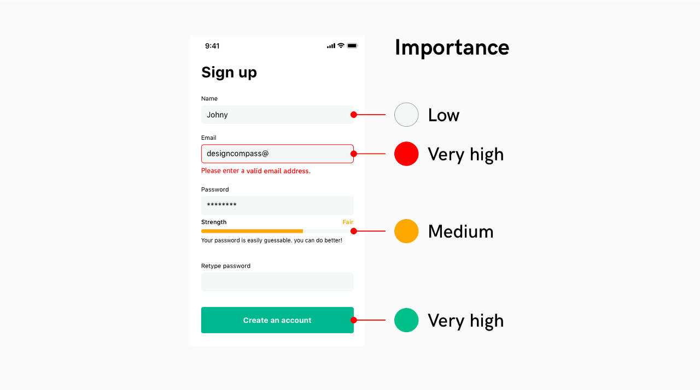

- 중요한 최종 행동 요소와 이를 위해 반드시 확인해야 하는 정보를 강조합니다.

<br>

#### 1-2-5. 색 대비

```comment
색은 다른 색과 확연하게 구분되도록 충분한 대비가 있어야 합니다. 배경색, 다른 요소 들과의 상대적인 관계를 생각하며 색을 조정합니다. 색 대비는 WCAG에서 나눈 레벨을 따르며 주로 AA 레벨이 표준으로 쓰입니다.
```

- A (최소) - 3:1
- AA (중간)- 4.5:1
- AAA (최대 - 7:1

[Color Contrast Checker](https://colourcontrast.cc/)

- 콘트라스트 체크를 할 때 유용한 툴로 배경색과 텍스트의 대비 레벨을 측정할 때 사용합니다.


<br>

#### 1-2-6. 색 조합

```comment
주색을 정한 뒤 색상환을 기준으로 미리 사용할 색을 정합니다. 단색, 유사색, 보색을 활용해 스크린을 디자인할 때 명확한 기능이 있을 때 제한적으로 사용합니다.
```

- 단색(Monochromatic): 중요한 정보에 주색을 사용하고, 회색 영역도 주색과 같은 계열의 톤을 사용합니다.
- 유사색(Analogous): 비슷한 개념이지만 구분이 필요한 상황일 때 유사색을 사용합니다.
- 보색(Complemntary): 다른 요소보다 강력하게 강조할 필요가 있을 때 사용합니다.


<br>

#### 1-2-7. 색 비율

```comment
인테리어에서 사용되는 60-30-10 법칙을 활용할 수 있습니다. 60%와 30%를 이용해서 배경 색을 배분하고, 강조하고자 하는 요소나 글 위주의 서비스일 경우 10%를 배분합니다. 전체의 량을 생각하며 배경색을 배분한 뒤 포인트 컬러를 10% 내에서 조금씩 추가하는 방식으로 색 비율을 조정합니다.
```


- 목적에 따라 인테리어 공간 디자인이 달라지듯 공간에 알맞게 배색을 응용합니다.

<br>

#### 1-2-8. 밝은 색과 어두운 색

```comment
1개의 주색으로 정보를 구분하기 어려울 경우 밝은 색과 어두운 색을 사용합니다. 이때 주색보다 밝은 색, 주색보다 어두운 색을 정의하는데, 자연에서의 색 변화 규칙에 맞춰 밝기–채도–색조 순서로 색을 변형합니다.  
```

- 색을 어둡게: RGB 계열 색조로 움직이고 채도를 늘리고 밝기가 줄인다.
- 색을 밝게: CMY 계열 색조로 움직이고 채도를 줄이고 밝기를 늘린다.


<br>

#### 1-2-8-1. Why 1 자연에서의 색 변화

```comment
실제 자연에서는 빛이 강해지면 물체의 채도가 약해집니다.(사과 바로 앞에 손전등을 댔을 때를 상상해보세요) 색은 물질에 빛이 반사돼서 보이는데 눈이 구분할 수 있는 범위를 넘어 반사량이 너무 많으면 하얗게, 반사량이 너무 적으면 어둡게 보입니다. 물체의 색이 밝아지면 채도 감소, 밝기 증가이며 어두워지면 채도 증가, 밝기 감소인 것입니다.
```


<br>

#### 1-2-8-2. Why 2 색조 자체의 밝기

```comment
노란색은 밝아서 흰색 바탕에 쓰기 힘들고 파란색은 어두워 검은 배경에 쓰기 어려운 것 정도는 관찰할 수 있지만 다른 색상 간의 밝기 차이를 상상하기는 어렵습니다. 스크린에서 보이는 색조 자체의 밝기는 어떻게 알 수 있을까요?
```


- 일러스트레이터로 HSB 중 Hue를 조정하여 12가지 색을 지정했습니다. 그대로 복사한 다음 흑백으로 전환했습니다. 노란색과 파란색을 예측이 됐는데 나머지 색깔들은 그다지 규칙적으로 보이지 않습니다. 180도와 300도에 있는 색은 왜 밝아진 걸까요?


- 각 수치별로 그래프를 비교했을 때 Red Green Blue로 갈수록 어두워지고 Cyan Magenta Yellow로 갈수록 밝아집니다. RGB와 CMY가 기준으로 스크린은 빛의 삼원색을 사용하기 때문에 색이 많이 섞일수록 흰색에 가까워지므로 원색이 가장 많이 섞인 CMY가 밝아지는 것입니다.

<br>

#### 1-2-9. 배경과 색

```comment
색은 상대적이기 때문에 주변에 어떤 색이 있느냐에 따라 성질이 달라집니다. 다크 모드를 디자인할 때, 배경 색이 반전되기 때문에 같은 색을 사용하지 않고 각 테마에 알맞은 색을 사용합니다.  
```

- 어두운 배경 + 밝은 영역 + 어두운 내부 요소
- 밝은 배경 + 어두운 영역 + 밝은 내부 요소


<br><hr><br>

### 1-3. 타이포그래피(Typograph)


```comment
문자는 다른 시각 언어보다 구체적이고 정확하게 정보를 전달하는 언어입니다. 물체나 풍경 같은 것들은 아이콘이나 이미지로 알려주는 게 좋을 수 있지만, 행동이나 개념을 알려줄 때는 문자가 더 효율적입니다. 같은 문화권이라면 의미 전달이 확실하기 때문에 가장 많이 쓰이는 시각 요소입니다.
디지털 디바이스에서 타이포그래피는 정보 전달과 행동 유도라는 큰 목적이 있습니다. 유저의 행동이 바로 비즈니스에 연결되는 디지털 프로덕트에서 전달력이 뛰어난 타이포그래피가 중요합니다.
```

<br>

#### 1-3-1. 글꼴(Font)

```comment
글꼴은 일관된 규칙으로 디자인된 모둠으로 글씨체, 폰트 패밀리, 자족 등 다양한 언어로 불립니다. 글꼴은 종류에 따라 가독성과 판독성, 읽는 방식조차 다를 수 있기 때문에 불필요하게 주의력이 흩어지지 않도록 2가지 이하의 글꼴을 사용하는 것이 좋습니다.
```


뚜렷한 목적이 없다면 1가지 글꼴을 사용합니다.

<br>

#### 1-3-2. 굵기(Weight)

```comment
다양한 시각적 위계를 표현하기 위해, 여러 굵기를 제공하는 글꼴을 사용합니다. Black, Bold, Semibold, Medium, Regular, Light 등이 있으며 서체의 무게를 이용해 표현하고자 하는 내용 중 읽는 이에게 가장 중요한 정보부터 중요하지 않은 정보까지, 중요도에 따라 계층을 표현합니다.
```

무게를 이용해 정보를 더 쉽게 구분할 수 있게 돕습니다.


<br>

#### 1-3-3. 글자색(Color)

```comment
사용자가 텍스트를 빠르고 정확하게 이해할 수 있게 충분한 대비를 주어야 합니다. 서비스에서 텍스트는 흰색 바탕의 검은 글씨와 버튼 내부에 많이 쓰이는 편이며, 최소한 WCAG 권장 4.5:1 대비가 필요하며 가능한 대비를 크게 줍니다.
```


[Color Contrast Checker](https://colourcontrast.cc/)

하얀 배경에는 까만 글씨를, 어두운 버튼에는 하얀 글씨를 씁니다.

<br>

#### 1-3-4. 행간(Line height)

```comment
행간은 글줄과 글줄 사이의 간격을 뜻합니다. 좁은 공간에 여러 정보가 섞여 있으면 사람의 눈이 정보를 식별하기 어렵기 때문에 가능한 여백을 주어야 합니다. 위아래 글줄이 서로 들러붙어 면처럼 보이지 않고 선으로 보이도록 충분한 여백을 줍니다. 보통 글자 크기 x 1.6을 권장하는 편입니다.
```


특히 여러 줄이 되는 본문의 가독성을 위해 행간을 적용합니다.

<br>

#### 1-3-5. 자간(Letter Spacing)

```comment
자간은 글자와 글자 사이의 간격을 뜻합니다. 행간과 마찬가지로 연관성이 있는 정보끼리 거리가 너무 멀거나 가까우면 정보를 식별하기 어렵기 때문에 적절한 자간을 설정해야 합니다. 글자 크기가 커질수록 자간이 멀어 보이기 때문에 자간을 줄여주어야 하며, 글자 크기가 작아질수록 식별이 어려워지기 때문에 자간을 늘려주는 편입니다. 일반적으로 16pt~17pt의 본문에는 -0.3을 부여하는 편입니다.
```


자간이 넓거나 좁으면 서비스 전체의 완성도가 떨어져 보입니다.

<br>

#### 1-3-6. 정렬(Alignment)

```comment
글줄 정렬은 다섯 가지 종류가 있습니다. 가운데, 양끝, 오른 끝, 왼끝, 엇갈리기가 있으면 그중 보통 왼끝과 가운데 정렬을 많이 사용하는 편입니다. 3~4줄 이하의 글에서는 가운데 정렬을 읽기 편하지만, 5줄 이상의 글줄은 왼끝 정렬로 표현하는 것이 더 읽기 편합니다.
```
 


가운데 정렬로 된 긴 본문은 읽기 어렵습니다.

<br>

#### 1-3-7. 서체 시스템

```comment
글꼴의 속성을 이용한 다양한 시각 기법을 이용할 수 있지만, 매번 새로운 방법을 사용하면 전체를 관리하기 어려워집니다. 일관된 규칙으로 시각 기법을 유지하고 전체의 일관성을 유지하고 사용자가 균일한 리듬감을 가질 수 있도록 돕기 위해 필요한 것이 서체 디자인 시스템입니다.
```


명칭은 다르더라도 비슷한 개념으로 나누는 편이며, 보통 Display, Headline, Body, Caption 으로 나누는 편입니다. 서체 크기는 본문을 기준으로 하며 스마트폰, 태블릿, 노트북, PC, TV, 월 스크린 등 매체에 따라 본문의 크기가 달라집니다.

#### 모바일 웹 기준 예시

- Title: 29px ~ 40px (180%~220%)
- Subtitle: 20px ~ 30px (130%~150%)
- Body: 16px~20px
- Caption: 11px ~ 16px (70–80%)
- Minimal size: iOS-11pt. Android-12sp. Web-14px


#### 1-3-8. 디지털 디바이스 글꼴

```comment
다양한 환경에 최적화된 한글 글꼴은 제한적입니다. 메이저 디지털 디바이스에서 제공하는 기본 글꼴을 사용하는 편이며, 한글은 크게 4가지를 사용합니다. iOS 환경의 한글 서체인 Apple SD gothic NEO, 삼성 갤럭시 디바이스에서 사용하는 Samsung One, 안드로이드 기반 디바이스에서 쓰이는 Source Sans, 대표적인 웹 서비스 네이버의 나눔 고딕이 있습니다.
```


<br><hr><br>

### 1-4. 아이콘(Icon)

```comment
아이콘은 대상의 특징을 강조해 만드는 기호로 다른 언어보다 보편적으로 이해할 수 있는 시각 언어입니다. UI 아이콘, 픽토그램, 사인 등으로 대표되며 좁은 영역을 차지하면서도 의미를 전달할 수 있어 다양한 영역에서 쓰이고 있습니다. 다른 요소보다 개성을 부여하기 쉽고 시각 원리에 대한 실험을 할 수 있어 많은 디자이너의 사랑을 받고 있습니다.
```


<br>

#### 1-4-1. 아이콘의 쓰임새(Icon Usage)

```comment
UI 디자인에서 아이콘은 크게 앱 아이콘과 시스템 아이콘으로 사용합니다. 브랜드를 표현하기 위한 앱 아이콘과 사용자가 빠르게 정보를 이해하고 행동하기 위한 시스템 아이콘에 사용합니다.
```


<br>

#### 1-4-2. 아이콘의 스타일(Icon Style)

```comment
아이콘을 표현하는 방식은 Line, Fill, Colored, Image가 있습니다. 아이콘을 사용하는 공간에 따라 용도가 다르며 크게 행동에 대한 피드백을 주거나, 주목도를 높이기 위해 사용합니다.  
```

- Line, Fill: 기본적인 형태로 레이아웃에 배치됩니다.
- Colored: 행동에 대한 피드백을 주거나, 주목도를 높이기 위해 많이 사용합니다.
- Image: 높은 주목도가 필요할 때 사용합니다. 이모지 혹은 개성적인 아이콘을 사용하는 편입니다.


<br>

#### 1-4-3. 아이콘의 무게(Icon Weight)

```comment
스타일을 조합해 다양한 무게감을 만들 수 있습니다. 만약 주로 이미지가 주인공인 서비스라면 아이콘의 무게감이 최소화 되야 하며, 텍스트 위주의 서비스라면 사용자에게 시각적 즐거움을 전달하기 위해 무거운 아이콘을 사용하기도 합니다.
```


<br>

#### 1-4-4. 아이콘의 속성(Icon Properties)

```comment
아이콘을 구성하는 요소로 굵기(Thickness), 끝모양(Ends), 꺾임(Join), 둥글기(Radius)가 있으며 사용자가 빠르게 아이콘을 구분할 수 있게 최소한의 변화로 표현 규칙을 통일합니다.
```

- Thickness: 디지털 스크린은 표현할 수 없는 소수점을 반올림하기 때문에 1px, 2px을 사용했습니다. 때로는 스마트폰 스펙이 좋아지면서 소수점을 사용하기도 합니다.
- End & Join: 각진 끝, 둥근 끝이 있으며 부드러운 표현을 위해 라운드가 많이 쓰입니다.
- Radius: End와 Join 과 일관성을 위해 같은 규칙을 사용하며, 마찬가지로 부드러운 표현을 위해 라운드가 많이 쓰입니다.


<br>

#### 1-4-5. 그리드(Grid)

```comment
눈은 시각적 그리드와 윤곽선으로 아이콘을 구분합니다. 시각적 그리드란 같은 크기의 영역 안의 다양한 형태의 아이콘이 같은 무게감과 무게 중심을 갖게 하기 위한 그리드를 말합니다. 기하학으로 해체한 대상을 원, 정사각형, 직사각형, 정삼각형으로 구성된 그리드에 맞춰 제작합니다.
```


<br>

#### 1-4-6. 아이콘의 크기(Icon Scale)


여러 환경 속에서 원할한 관리를 위해 8px, 16px, 24px, 32px 등 8의 배수를 베이스라인으로 사용하는 편입니다. 모바일의 좁은 영역에서 주로 사용하는 시스템 아이콘은 범용성을 위해 4px 배수로 사용하기도 합니다.


<br>

#### 1-4-7. 명확성(Clarity)

```comment
사용자가 빠르게 이해할 수 있는 최소한 요소로 디자인합니다. 가능한 사용자가 익숙한 형태로 만들며 필요하다면 간단한 은유를 적용합니다. 복잡한 아이콘은 사용자가 무슨 의미인지 이해하지 못하거나, 이해하는데 오래 걸릴 수 있습니다.
```


<br>

### 1-4-8. 디테일(Detail)

```comment
아이콘이 가장 중요한 목표인 ‘빠른 정보 전달’ 을 위해서 좁은 영역 안에 디테일을 최소화 하는 것이 좋습니다. 특히 좁은 영역에 들어가는 시스템 아이콘의 경우 어떤 내용을 전달하는지 알 수 있는 최소한의 요소만 남기고 다른 장식적인 요소는 제거하는 것이 좋습니다.
```


<br>

#### 1-4-9. 일관성 Consistency

```comment
하나의 서비스에서 같은 기능을 하는 아이콘은 같은 스타일로 표현합니다. 사용되는 맥락에 따라 Fill과 Line 을 함께 쓸 수 있지만, 동일한 맥락 속에서 사용하는 아이콘은 같은 속성으로 표현합니다.
```


<br>

#### 1-4-10. 원근법(Perspective)

```comment
가급적 원근은 정면에서 바라본 모양으로 제작합니다. 실제 디지털 디바이스는 평면이며, 주로 평면의 카드 공간 위에 쓰이는 아이콘이 공간감이 느껴지면 인지 부조화가 느껴질 수 있습니다. 특별한 주목도를 위해 제한적으로 사용되기도 하지만 권장하지 않습니다.
```


<br>

#### 1-4-11. 익숙함(Familiarity)

```comment
보통 플랫폼에 상관 없이 동일한 아이콘을 사용합니다. 하지만 OS 플랫폼 내부에서도 자주 사용하는 스타일의 경우 사용자에게 가장 익숙한 형태인 OS 기본 템플릿을 사용하면 사용자가 의미를 더 빠르게 파악할 수 있습니다.
```


<br>

#### 1-4-12. 시각 보정(Optical Correction)

```comment
그래픽 디자인 툴의 한계로 시각 보정이 필요할 때가 있습니다. 아래 재생 버튼의 경우, 그래픽 툴은 레이어의 끝을 기준으로 정렬을 맞춥니다. 하지만 실제로 삼각형은 원이나 네모와 무게 중심이 다르기 때문에 조정이 필요합니다.
```


<br>


<br><br>


### 1-5. 레이아웃(Layout)

```comment
레이아웃은 특정 영역 안에 요소를 배치하는 것입니다. 스크린에서 사용하는 레이아웃은 정적인 화면 균형뿐만 아니라 서비스의 추상적인 공간의 구조를 적절하게 표현해야 합니다. 또한 다양한 스크린에서 표시되기 때문에 어떤 환경에서도 유사한 맥락으로 사용할 수 있도록 설계합니다.
```


<br>

### 게슈탈트 이론(Gestalt Theory)

```comment
게슈탈트 이론은 색, 텍스트, 이미지, 레이어 등의 요소를 배치할 때 가장 중요한 개념 중 하나입니다. 독일어로 ‘모양’, ‘형태’를 의미하며 , ‘전체는 개별 요소의 합이 아니다’를 주창하며 여러 가지 요소들이 결합되었을 때 시각적인 효과에 대한 이론입니다.
```

#### 1-5-1. 근접성(Proximity)

```comment
연관성이 있는 요소는 다른 요소들보다 가깝게 배치합니다. 근접성 원리는 서로 가까운 요소가 서로 관련이 있는 것으로 인식하는 현상으로 여러 요소가 있더라도 서로 가까운 요소를 그룹으로 인식합니다. 모양이나 색으로 그룹핑하는 것보다 강력한 방법입니다.
```


<br>

#### 1-5-2. 유사성(Similarity)

```comment
동일한 기능을 하는 요소는 동일한 모양으로 표현하고 배치합니다. 유사성은 시각적으로 비슷한 요소를 그루핑 하는 현상으로, 주로 크기, 모양, 색상으로 구분합니다. 모양이 비슷한 요소는 동작도 비슷할 것이라 예측하기 때문에 동일한 기능은 동일한 모양으로 디자인합니다. 근접성과 함께 요소를 구분하는 강력한 방법 중 하나입니다.
```


<br>

#### 1-5-3. 연속성(Continuation)

```comment
스크롤되거나 같은 내용이 반복되는 요소를 배치할 때는 동일한 모양을 특정한 선에 맞춰 정렬합니다. 연속성은 요소들의 배치에서 방향성을 인지할 때 해당 방향에 있는 요소들을 그룹으로 인지하는 현상입니다. 시선의 흐름에 따라 직선 혹은 곡선으로 배치된 요소들을 그룹으로 인지합니다.
```


<br>

#### 1-5-4. 폐쇄성(Closure)

```comment
가급적 여백과 간격으로 전체 모양을 디자인합니다. 각 요소들이 선으로 연결되지 않았더라도 눈의 흐름을 따라 전체의 모양을 파악합니다. 선이나 네모 요소로 그룹핑하기보다 여백과 간격으로 전체 모양을 만들어 인지 부하를 줄일 수 있습니다.
```


<br>

#### 1-5-5. 공동 운명(Common Fate)

```comment
동일한 개념의 요소는 동일하게 동작하게 디자인합니다. 요소들이 같은 방향으로 움직이면 동일한 레벨의 요소로 인지합니다. 
```


<br>

#### 1-5-6. 전경과 배경(Figure and ground)

```comment
전경과 배경이 확연하게 구분되게 디자인합니다. 사람의 눈은 요소들이 겹쳐 있다고 인지했을 때 초점에 따라 전경과 배경을 구분해서 인지합니다. 이때 혼란스러움을 줄이기 위해 어둠과 그림자를 이용해 전경과 배경을 구분합니다. 
```


<br>

#### 1-5-7. 공동 영역(Common Region)

```comment
구분이 필요한 요소들은 배경이나 선으로 영역을 구분합니다. 같은 영역에 모여 있는 요소를 같은 맥락에 속한 요소로 이해하기 때문에 다른 요소들과 명확하게 구분해줍니다. 
```


<br>

#### 1-5-8. 스크린(Screen)

```comment
주로 디지털 디바이스의 화면을 디자인합니다. PC, 스마트폰, 스마트워치 등 다양한 디지털 기기들의 등장했고 서비스의 성격에 따라 지원하는 디바이스의 종류도 다양합니다. 통상적으로 사용자가 가장 많은 스마트폰을 기준으로 디자인하는 편입니다.
```


<br>

#### 1-5-9. 공간(Space)

```comment
가장 많이 디자인할 공간은 크게 2가지로 세로 직사각형인 스마트폰의 스크린 사이즈가 가로 직사각형인 데스크톱입니다. 이 네모난 공간 위에 레이어, 글자, 아이콘, 이미지 등을 이용해서 다양한 화면을 구성합니다.
```


<br>


#### 1-5-10. 단위(Unit)

```comment
효율적인 디자인을 위해 최소한의 단위를 정합니다. 1.5x 2x 등 다양한 배수의 디자인 요소를 사용하기 위해 곱하거나 나눠도 정수가 되는 짝수를 사용합니다. 그중에서도 주요 디스플레이의 전체 픽셀을 정수로 나눌 수 있는 8 포인트 그리드 시스템이 널리 쓰이고 있습니다. iOS의 375, 750 스크린과 같이 8로 나뉘지 않는 경우도 있기 때문에 모든 단위에 엄격하게 적용하지는 않습니다.
```


<br>

#### 1-5-11. 그리드(Grid)

```comment
그리드는 요소를 배치할 큰 틀을 정하는 것으로 효율적으로 디자인하기 위한 도구입니다. 요소가 배치되는 칼럼(Column)과 여백을 정의하는 거터(Gutter)를 사용합니다. 일관된 크기로 제작이 용이하며, 일관된 시각적인 리듬을 부여해 사용자가 자연스럽게 시각 요소를 훑어볼 수 있습니다.
```


<br>

#### 1-5-12. 패턴(Pattern)

```comment
레이아웃에 영향을 주는 패턴은 크게 3가지입니다. 기본적으로 레이아웃은 고정되어 스크린 사이즈에 따라 변화하며, 스크롤해도 사라지지 않고 특정 영역에 고정되는 Fixed 패턴과 좌우로 스크롤할 수 있는 Carousel이 많이 쓰입니다.
```


<br>

#### 1-5-13. 스크린 크기(Screen size)

```comment
서비스가 지원할 디바이스 중 보편적인 스마트폰 스크린 사이즈를 기준으로 디자인합니다. iOS의 경우 제작하는 디바이스가 정해져 있어 주로 플래그쉽 스마트폰을 기준으로 제작하는 편입니다. 안드로이드는 수없이 많은 디바이스가 출시되기 때문에 모든 화면을 최적화할 수 없어 구글에서 제시하는 규격을 따르는 편입니다.
```


<br>

#### 1-5-14. 고정 영역&가변 영역(Fixed&Variable)

```comment
스크린의 물리적인 사이즈가 변할 때, 각 시각 요소가 어떻게 동작하는지 정의합니다. 요소 크기를 가변적으로 정의하면 화면이 커지면 특정 비율로 단순하게 확대되며, 요소의 크기를 고정하면 요소는 그대로며 화면만 확장되어 더 많은 콘텐츠를 볼 수 있습니다. 요소를 가변적으로 설정할 경우, 과도하게 확대되어 보일 수 있기 때문에 가급적 요소를 고정하는 편입니다.
```


<br>

#### 1-5-15. 밀도(Density)

```comment
스크린이 확장될 때 동일한 크기로 표시하기 위해서는 스크린 밀도를 이해해야 합니다. 주로 사용하는 단위인 PPI는 Pixel per inch를 뜻하며, 1 인치 x 1 인치 영역에 물리적으로 표시되는 픽셀 수를 뜻합니다. 어떤 화면에서도 물리적으로 동일한 크기로 표시하기 위해 DP, PT 단위로 디자인하며, 그래픽 디자인 툴은 보통 1px = 1pt로 설정되어 따로 설정을 변경할 필요는 없습니다.
```


<br>

#### 1-5-16. 구조(Structure)

```comment
모바일과 데스크톱을 모두 지원하는 웹 서비스의 경우, 동일한 내용을 표현하기 위해 다양한 패턴을 사용합니다. 주로 반응형 웹 방식을 사용하는 편이며, 아래 일반적인 구조를 중심으로 서비스에 알맞게 커스터마이징 합니다.
```

- 내비게이션: 카테고리, 메뉴 등 최상위 탐색 메뉴 영역
- 툴: 검색, 책갈피 등 도구 영역
- 콘텐츠: 글, 이미지, 목록 등 콘텐츠 표시 영역


<br>

#### 1-5-17. 네비게이션(Navigation)

```comment
모바일 스크린에서 플랫폼마다 권장하는 네비게이션 구조가 다릅니다. 안드로이드에서는 상단에 표시하길 권장하며 iOS에서는 하단에 표시하길 권장합니다. 모바일 웹의 경우 상단에 위치하는 것이 일반적이나 최근 들어 하단에도 네비게이션이나 툴바를 배치하기도 합니다. 플랫폼별 권장사항이 있지만, 용이한 디자인을 위해 전체 플랫폼을 통일된 레이아웃으로 적용하는 것이 보편적입니다.
```


<br><br>

### 1-6. 디자인 방향성 설정

- 사용자가 디자인 의도를 자연스럽게 느끼며 쉽게 서비스를 이용할 수 있는 디자인이어야 하며, 동료들이 내 디자인 의도를 명확하게 이해하고 좋은 디자인이라고 느낄 수 있는 디자인이어야 합니다.

1. 명확성 있는 서비스 컨셉트 설정하기
2. 서비스의 핵심 기능 정의하기
3. 타 서비스와의 차별성 정의하기
4. 전체 서비스의 키워드 도출하기
5. 해당 서비스에 맞는 전체적인 아웃라인 정의하기
6. 해당 서비스에 맞는 컬러 메인 컬러/서브 컬러/포인트 컬러로 분류하여 선정하기
7. 해당 서비스에 맞는 타이포그래피 및 폰트 선정하기
8. 해당 서비스와 미디어에 맞는 레이아웃 선정하기
9. 해당 서비스의 카테고리별 아이콘 선정하기

<br>

#### 디자인 방향성 설정 프로세스

##### 1) 디자인 키워드 도출 사전 작업

1. 브레인스토밍(brain storming)을 한다.
- 리더 및 서기를 포함하는 5~10명의 그룹을 구성하여 리더를 중심으로 원탁회의를 구성
하고 40분 내·외로 자유롭게 아이디어를 도출한다.
- 아이디어는 한 사람씩 제안하고, 다른 구성원은 비판 없이 제안된 아이디어에 편승하여
좀 더 발전적인 아이디어를 제시할 수 있으면 좋다.
- 서기는 제시된 아이디어를 준비한 종이, 또는 포스트잇 한 장에 하나의 아이디어만 정
리하여 기록하고 일정 시간이 지나면 리더는 회의를 종료한다.

2. 아이디어를 정리한다.
- 발표 후에 더 새로운 아이디어가 있으면 추가하여 작성한다.
- 회의가 종료되었으면 한 장에 하나의 아이디어만 기록된 종잇조각을 모아 일람표를 만든다.

<br>

##### 2) 디자인 키워드 도출 작업

1. 아이디어를 분류한다.
- 브레인스토밍을 통해 도출된 아이디어 종잇조각들을 category 별로 분류한다.
- 구성원들 간의 회의를 통하여 공통요소를 갖는 아이디어들끼리 그룹을 만든다.
- 그룹핑된 아이디어들의 상관관계를 확인한다.

2. KJ-Map을 작성한다.
- 그룹 간의 상관관계를 고려하여 공통요소 간의 레이아웃을 하고 특징(해결안 또는 요약)
을 키워드로 도출한다.
- 상관관계를 고려하여 공통요소 간 2차 키워드 및 최종 디자인 키워드를 도출한다.

<br>

##### 3) 디자인 방향설정 작업

1. 디자인의 기본방향은 가격, 재료, 시장, 컬러(유약), 형태를 중심으로 개발 프로젝트의
성격에 적합한 유형으로 설정한다.


2. 선택된 유형의 특성에 따라 “학습 2 도자제품 분석”의 과정에서 분석된 내용을 중심
으로 디자인의 형태, 컬러(유약), 질감(재료), 기능, 트렌드 등의 개념을 설정한다.


3. 디자인 방향 설정의 유형을 선택한다.
- 선행 개발형 디자인 방향 설정
- 니즈(Needs) 주도형 디자인 방향 설정
- 도자제품의 정량적·물리적 속성 중심의 디자인 방향 설정
- 지속형 디자인 방향 설정

4. 결정된 디자인 방향을 클라이언트와 협의하여 스케줄(schedule) 표로 작성한다.
- PERT Network나 DELTA Chart를 활용할 수도 있으나 도자제품의 제조공정을 관리하기
에는 일반적 프로세스에 의한 일정표(schedule)로도 충분히 가능하다.
- 디자인 키워드는 목적에 따라 다양하게 변형하여 가능하면 시각화, 이슈화하여 적용할 수 있다.
- 디자인 방향 설정은 사회․문화적 배경을 근간으로 제조업체가 당면한 제반 여건에 따라 목표와 전략을 달리할 수 있으며, 전체적인 개발일정을 포함한다.

<br>

#### 1-6-1. UI/UX의 디자인 원칙

- 일관성이 있어야 한다.
- 정보적 피드백(시스템 상태의 시각화)
- 에러에 대응하기 쉬워야 한다.
- 작동의 효율성과 유연함이 있어야 한다.
- 기억보다 인식/직관적이어야 한다.
- 사용자의 실수에 대해 회복 가능성이 있어야 한다.
- 작업에 집중할 수 있도록 불필요한 화면은 단순화 및 투명성이 있어야 한다.
- UI 디자인은 쉽고, 쉽고, 쉬워야 한다.
- 단순하고, 한 화면에서 한 가지만을 분명하게 강조해야 한다.
- 자연스러운 사용자 행동을 유도해야 한다.
- 사용자 중심의 글쓰기가 될 수 있도록 해야 한다.
- 사용자가 버튼을 쉽게 누를 수 있어야 한다.


<br><br>

#### 1-6-2. 디자인 뱡향성과 트렌트의 적용

- 디자인 트렌드 및 사용자 조사/분석을 통해 정리된 신상품의 아이디어와 컨셉을 디자인에 잘 담아낼 수 있도록 디자인 각 요소에 대한 방향성을 명확하게 정리하는 것으로, 디자인 요소는 제품군별로 차이가 있으므로 사용자 조사 또는 관련분야 사전조사를 통해 디자인 요소에 대한 세부 조정이 필요하다.
- 타겟 유저가 공감하는 스토리와 사용자 경험, 인터페이스, 조형, 소재, 색상, 패턴 등 디자인의 차별성과 우위성을 확보하기 위한 디자인의 방향성에 대해서 클라이언트와 소통하여 프로젝트 컨셉과 정렬된 디자인에 집중함으로써 디자인 품질과 아이덴티티를 확보할 수 있다.

<br>


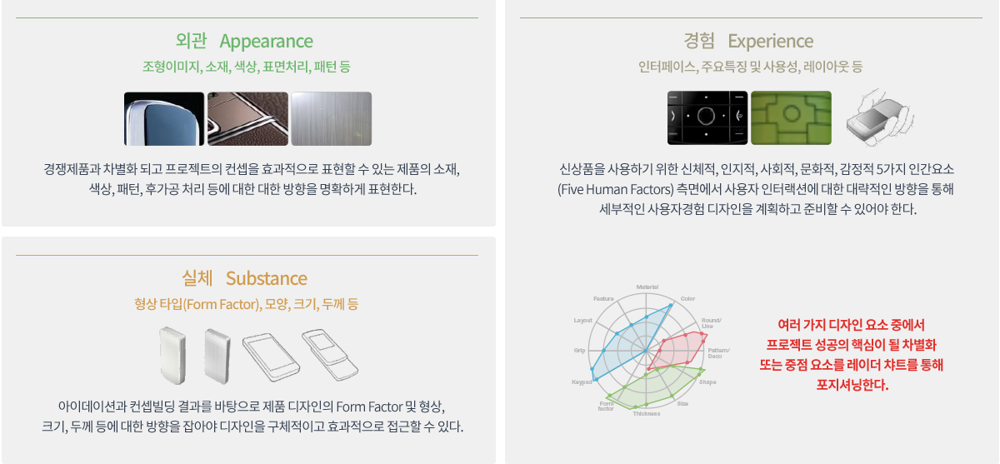


<br><br>

#### 1-6-3. 디자인 뱡향성 설정과 콘셉트 수립 실습

**(1) 진행하는 프로젝트의 시장자료를 확보한다.**


<br>

**(2) 확보한 시장자료를 바탕으로 디자인 데이터를 해석한다.**


디자인 데이터 해석 서식 ☞ [디자인 데이터 해석](1_6_3_1_analysis.xlsx)

<br>

**(3) 해석된 데이터에서 디자인 메타포를 추출한다.**


디자인 메타포 추출 서식 ☞ [디자인 메타포 추출](1_6_3_2_metaphor.xlsx)

<br>

**(4) 추출한 메타포에 따른 디자인 요소의 방향성 또는 디자인 콘셉트를 수립한다.**

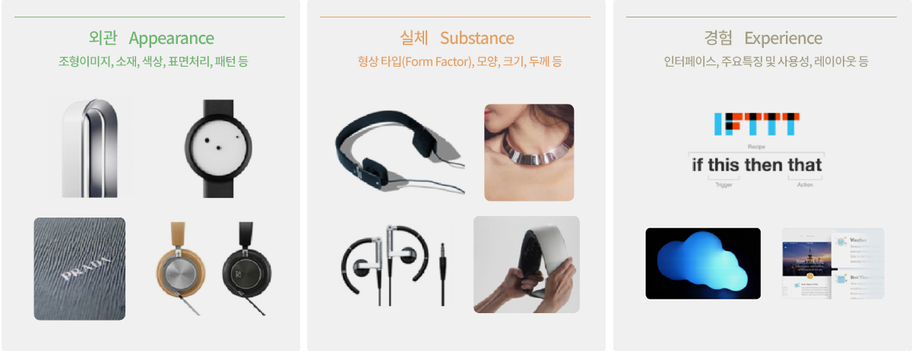

디자인 방향성 수립 서식 ☞ [디자인 방향성 수립](1_6_3_3_concept.xlsx)


<br><br>

### 1-7. 디자인 및 시각적 요소 도출

1. 디자인 요소 도출

- UX는 멋지고 Fancy한 디자인을 만드는 것이 목표가 아니라, 탁월한 사용자 경험을 제공 하는 게 목표이다. 탁월한 사용자 경험을 제공하기 위해서는 사용자를 깊이 있게 이해하 는 것이 필요하다. 비즈니스 목표와 도전과제가 정해졌다면 사용자에서 출발한다. 사용자 를 깊이 있게 이해하는 것은 특정한 컨텍스트에서 사용자들이 보이는 인지적/감성적/행위 적 특성을 발견하는 일이다. 인지적/감성적/행위적 특성은 니즈, 동기, 태도, 이용행태로 나누어서 분석될 수 있는데, 여기에서 가장 중요한 것이 사용자의 니즈이다

GUI 디자인을 위하여 비즈니스의 목표, 디자인의 원칙, 사용자에 대한 공감이라는 생각으로 다음과 같이 디자인 요소를 구분할 수 있다

(1) 누가 사용할 것인가?

- 그들을 하나로 묶어서 ‘우리 소비자들은 말이야..’하고 얘기할 수도 있겠지만, 알다 시피 그들은 물건을 쓰는 목적과 쓰는 방법에 따라 몇 가지 유형으로 분류할 수 있다. 통틀어 ‘우리 소비자 어쩌고’ 하는 이야기는 사실을 왜곡할 수 있다. 그가 얘기하는 ‘우리 소비자’는 그만이 아는 사람들일 수 있다. 자기가 아는 사실들을 전체의 일인 양 확대해석하는 아전인수(我田引水) 식의 잘못이 벌어질 수 있는 것이다

<br>

(2) 그들이 무엇을 원하는가?

- 소비자들이 뭘 원하는지를 아는 것에는 쉬운 것부터 복잡한 것까지 여러 가지 것들이 숨어 있다. 우리는 다른 사람들이 뭘 원하는지에 대해 상식적으로 알고 있다. 설문조 사를 하거나 인터넷을 통해 Word of Mouth를 수집하면 좀 더 많은 ‘니즈’를 찾아 볼 수 있다. 그러나 이 정도는 우리 말고 경쟁사들도 늘 하는 일이다. 그들과 차별화 된 ‘색다른 뭔가’를 만들어 내려면 좀 더 많은 노력이 필요하다. 상식, 설문조사, Word of Mouth를 넘어서는 뭔가를… 우리는 이것을 ‘숨겨진 니즈’라고 부른다. 어 떻게 소비자들이 원하는 바를 그들보다 잘 알아낼 수 있을까?

<br>

(3) 그들은 (물건을) 어떻게 쓰는가?

- 사람들은 물건을 어떻게 쓸까? 우리가 상식적으로 알고 있는 뻔한 대답은 사실 우리 자신의 경험을 반추한 것일 확률이 높다. 소비자들을 많이 접한 사람일수록 이런 질문 에 명확한 대답을 내리기를 꺼려한다. 워낙 다양한 사람들의 다양한 이용 행태를 접해 봤기 때문이다. 그것을 한마디로 정의하기란 매우 어려운 일이다. 그럼에도 사람들을 지속적으로 관찰하면 그들이 물건을 이용할 때 보이는 일관된 패턴을 알아낼 수 있다

<br>

(4) 좀 더 쉽고 편리하게 (물건을) 쓸 수 있게 하려면 어떻게 해야 할까?

- 인터넷에서 물건을 사거나 금융 거래를 하면서 속 터지는 경험을 누구나 한번쯤 해 본 적이 있을 것이다. 특히 우리나라에서는 액티브X에 까다로운 개인정보 보호 절차, 잘못된 프로세스 설계가 결합되어 ‘도대체 이것을 쓰라고 만든 것인가?’라는 의문이 생기는 일이 비일비재하다. 사용자들이 좀 더 쉽고 편리하게 제품을 이용하게 하는 것 은 매우 중요하다. 우리는 이것을 사용성(Usability)이라고 부른다. 사용성은 사람들의 제품 만족도에 중대한 영향을 끼친다.

<br>

(5) 그들이 쓰도록 만들려면 어떻게 해야 할까?

- 앞에서 사용성이 중요하다는 얘기를 했지만 정작 물건을 쓸 이유가 없는 사람에게는 그 물건의 사용성이 아무리 좋아 봤자 관심이 없을 것이다. 따라서 사람들이 우리 물 건을 쓰도록 동기를 부여하는 작업은 매우 중요하다. 그들의 마음을 움직여야 한다. 동기 부여는 UX 디자인에서 큰 의미를 갖는다.

<br>

2. 시각적인 콘셉트를 도출

- 사람들을 위한 시각적인 UI의 콘셉트를 도출하는 것은 UI/UX 디자인에서 가장 중요한 이 슈에 해당한다. 마케팅에서는 “사용자의 니즈를 찾아 그것을 충족시키는 것이 마케팅의 목적”이라고 얘기했지만 UI/UX 디자인도 이와 다르지 않다. 니즈(Needs)야말로 UI/UX 디 자인의 시각적인 콘셉트를 도출하기 위한 가장 중요한 핵심 명제다. 그러나 UX 디자인에 서의 니즈는 마케팅에서 이야기하는 니즈에 비해 훨씬 정교하고 세분화되어 있다.

사람들이 제품에 기대하는 ‘가치(Value)’뿐 아니라 제품을 이용할 때 나타나는 세부적 인 니즈(ex. 손가락이 좀 더 잘 닿는 위치에 메뉴 버튼이 있으면 좋겠다)까지 포착하는 것 이 UX 디자인이다.

시각적 콘셉트 도출을 위한 구분을 다음과 같이 할 수 있다.

- 시각적인 콘셉트를 도출 일반적으로 ‘문화인류학적 접근’이라 함은 문화인류학에서 사 용되는 문화, 인종, 사용언어, 종교 등에 따라 구분되는 행동특성을 이런 구분에 따른 선 입관과 영향을 최소화하거나 이로부터 중립적인 방법으로 관찰하는 방법을 따르는 것을 의미하나 사용자리서치의 계획단계에서는 이러한 관찰에 알려진 집단의 구분을 사용하는 방법이다.
- 숫자 ‘4’를 죽음과 연관 지어 금기시 하는 ‘한자 문화권’과 같은 문화권 구분, 사용 자의 종교에 따른 특성, 엄격한 존댓말과 존칭이 존재하는 특정 언어의 특성 특정지역의 역사적 배경에 따라 사용자의 경험이 다를 수 있으며 특정 색상, 기호에 대한 거부감 사 용자와의 상호작용 과정에 사용되는 단어, 문구 등의 요소에 대한 반응이 다를 수 있고, 수치, 환율, 요일, 날짜 등의 표기에 있어서도 다른 규칙이 적용될 수 있다. 사용자집단을 구분하는 특성으로 이러한 문화인류학적 구분을 적용할 수 있다.

(1) 문화인류학적 구분의 한계

- 종교적 특성과 역사적 배경을 이유로 십자가형 기호에 대해 거부감을 보이나 수학의 덧셈기호에 대해서는 거부감을 느끼지 않는 경우와 같이 유사한 조건 아래에서 이러 한 문화인류학적 특징이 발현되는 경우와 그렇지 않은 경우도 있을 수 있다. 사용자리 서치를 계획하는 단계에서 하향식으로 적용된 이러한 문화인류학적 구분이 결과에 반 영되었는지, 이러한 구분에 우선하여 영향을 준 다른 요인이 있었는지도 사용자리서치 결과 분석 시 검증되어야 할 사항일 수 있다.

<br>

3. 사용자 그룹 구분의 중복과 누락

- 사용자리서치 대상 집단의 ‘거주 지역’이라는 인구 통계적 구분이 ‘종교’라는 문화인 류학적 구분과 일치하는 경우 등이 발생할 수 있으며, ‘OO도 거주자’, ‘△△시 거주 자’와 같은 행정 구분에 따른 거주 지역 구분보다 ‘도시거주자’, ‘농촌거주자’와 같 은 구분이 UI/UX 관련사용자리서치 결과에 더 큰 영향을 줄 수도 있다. 사용자 세그멘테 이션은 이러한 중복을 고려하여 보다 높은 대표성을 보일 것으로 예상되는 요인을 선택하 는 작업과 보다 대표성 있는 구분이 누락되는 경우가 없는지 면밀히 검토하여 반영하는 과정과 사용자리서치를 통해 수집된 데이터에 기반한 구분이 적절하였는지에 대한 검증이 수반되어야 한다. 처음으로 니즈를 체계화한 에이브러햄 매슬로(Abraham Maslow)는 1940 년대 후반 욕구 단계설(Hierarchy of Needs)이라는 이론을 통해 인간들이 보편적으로 갖는 니즈를 규명하고 각 니즈 간의 상관관계를 밝혔다. 가장 기본적인 생리 욕구에서 출발해 안전 욕구, 애정/소속감 욕구, 자아만족/인정 욕구, 자아실현 욕구로 점차 발전한다는 것을 밝힌 것이다. 각 니즈는 아래에 위치할수록 근원적이다. 다시 말해 생리 욕구가 충족돼야 안전 욕구가 대두되고, 그다음으로 사랑/소속감 욕구가 나타나는 것이다. 욕구 단계설은 이후에 인지적 욕구(Cognitive Needs), 심미적 욕구(Aesthetic Needs), 자기초월의 욕구 (Transcendent Needs)가 추가되어 8단계로 늘어났다 한편으로 사람들의 니즈는 누구나 쉽게 표현할 수 있는 것(Explicit Need), 설명은 쉽게 못 하지만 누군가 얘기했을 때 기꺼이 동조하는 것(Tacit Need), 자신이 원하는지조차 알지 못하는 것(Latent Need)으로 구분하기도 한다. UX 디자인은 사용자들의 니즈를 규명하는 데 많은 노력을 할애한다. 사용자의 커다란 니즈(우리 제품에 원하는 가치는 무엇인가?)부 터 작은 니즈까지 포착해야 하는 것이 UX 전문가의 숙명이다. 문제는 숨겨진 니즈를 어 지간해서는 알기 어렵다는 데 있다. 숨겨진 니즈는 알기는 어렵지만 일단 알게 되면 막강 한 위력을 발휘한다. 경쟁사들이 아직 시도하지 못한 ‘탁월한 서비스’를 만들 가능성이 높아지기 때문이다. 남들이 다 아는 니즈를 다시 밝혀봤자 혁신을 디자인하지는 못한다. 남들이 모르는 니즈를 찾아내야 한다. 

<br><br><hr><br><br>

## 2. GUI 디자인 요소 선정 및 시안 작성

- 전반적인 일관성을 제공
- 현 상태 및 정보의 단서 표시
- 한 눈에 이해할 수 있는 화면을 제공
- 주제에 적절한 레이아웃 사용
- 주제에 맞는 배색
- 주제와 컴포넌트에 맞는 용어와 폰트 사용
- 레이아웃에서 콘텐츠 배치시 적절한 여백과 간격 사용
- 메뉴, 버튼, 탭, 목록, 테이블, 폼 요소등의 적절한 크기와 위치

<br><br>

### 2-1. GUI 디자인 요소의 종류

| 표시 종류 | 설명 |
|-----------|-------------------------------------------------------------------------------------|
| 색상(Color) | 사용자에게 상호작용 요소를 직관적으로 이해시키며, 버튼 같은 컨트롤에 고유의 색을 부여하고, <br> 애플리케이션의 전체 화면에 일관성 있게 사용하여 시선을 집중시키고, 행동을 유도할 수 있습니다.|
| 타이포(Typo) | 타이포그래피(Typograph)는 활자를 배열하여 표시하거나 인쇄할 때 언어를 읽을 수 있도록 호소력 있게<br> 만드는 기법과 기술을 의미합니다.|
| 아이콘(Icon) | 아이콘은 디스플레이에서 언어와 관계없이 누구나 쉽게 인지될 수 있도록한 작은 그림이나 이미지로서 <br> 의미나 해당 콘텐츠가 가지는 기능, 액션이나 상태, 정보 등을 쉽게 알 수 있도록한 그림문자를 포함합니다.  |
| 레이아웃(Layout) | 레이아웃이란, 특정 영역 안에 요소들을 배치하는 것을 의미하며, 정적인 화면 균형뿐만 아니라 <br> 서비스의 추상적인 공간의 구조를 적절하게 표현해야 합니다. |

<br><br>

### 2-2. GUI 디자인 레이아웃 선정 및 적용


#### ※ 참조 사이트


[디비컷 바로가기](https://www.dbcut.com/)

<br>


[GD웹 바로가기](https://www.gdweb.co.kr/main/)

<br>


[비핸스 바로가기](https://www.behance.net/)

<br>


[어워즈 바로가기](https://www.awwwards.com/)

<br><br>

#### 2-2-1. 웹페이지의 디자인 레이아웃 개념

- 디자인의 가장 기본이 되는 뼈대로 이를 주축으로 텍스트, 이미지, 버튼 등의 요소들의 배치를 돕는 가이드 시스템.


```
용어 설명
- 최대폭: 보통 퍼블리싱 구현시에 주로 설정하는 값으로 최대로 구현할 수 있는 넓이를 뜻함
- 컨테이너: 디자인 & 퍼블리싱 모두 설정하는 가이드로 실제 컨텐츠가 들어가는 공간(박스)
- 컬럼: 그리드 단의 수로 컨텐츠 배치를 위한 그리드 하나 하나를 의미함
- 여백: 단과 단사이, 그리드와 그리드 사이의 간격(여백)을 의미함
```

- 웹페이지의 뼈대 그리드 시스템을 만들 때는 크게 4가지를 고려해 제작하는데 최대폭(max-width), 컨테이너(container), 단의 수(columns), 여백(gutter) 이 그것이다.
- 반응형과 적응형 사이트 모두 PC, Tablet, Mobile 이렇게 최소 3가지 시안을 작업하지만 때에 따라 적응형의 경우 디바이스별로 최적화된 사용자 경험을 제공하기 위해 위 3가지 이외에 추가로 제작하기도 한다.

<br>

**콘텐츠의 배치**


- 위 이미지와 같이 그리드를 설정한 후에는 콘텐츠를 그리드에 맞춰 적절하게 배치한다. 다만, 유의할 점으로는, 특히 PC의 경우 그리드를 사용해 배치할 때, 단 1개에 대한 콘텐츠의 배치보다는 전체 영역과 콘텐츠의 양을 고려해 단을 3,4개씩 묶어서 사용하기 때문에 디자이너가 보유한 콘텐츠의 양과 사이트 속성에 맞는 단의 활용이 중요하다.

<br>

**그리드 제작시 고려사항**

1. 스크린 해상도 : 신입 디자이너들이 가장 많이 하는 실수 중에 하나가 스크린 해상도를 고려하지 않는 것이다.
디자이너들은 보통 1920×1080의 고 해상도의 스크린을 사용한다. 그렇기 때문에 자신의 스크린에서 콘텐츠가 구현되는 방식을 기준으로 콘텐츠 가이드를 잡기도 한다. 하지만 세상에 나와 있는 모니터는 모두 1920×1080 규격이 아니다. 사용자들이 사용하는 모니터 화면은 더 작기도 하고 더 크기도 하다. 따라서, 보통 실제 사이트를 퍼블리싱 할 때는 px단위보다는 rem이나 %를 많이 사용하기 때문에 디자이너는 이러한 구현 환경을 고려해 디자인해야 한다.

<br>

2. 애플리케이션의 성격 및 타겟 유저

- 런칭하려는 애플리케이션 브랜드의 이미지가 중요한 회사소개 페이지이거나 화보나 상품이 중요한 쇼핑몰이라면 화면 전체(1920)에 콘텐츠를 배치할 수 있는 full screen형식의 그리드 시스템을 적용하기를 추천한다.
- fullscreen 형식은 container형보다 비쥬얼이나 브랜드의 이미지를 전달하기에 더 적합한 그리드 시스템이다. 물론, fullscreen이 아니더라도 더 넓은 스크린 해상도를 고려해 내부 컨테이너 크기를 1440까지 늘려서 사용해도 좋기도 하지만 타겟 유저의 폭이 넓고(10~60) 비주얼적인 무드의 전달 보다는 내용의 가독성이 중요하다면 1920 사이즈에 컨테이너는 1240으로 좁게 설정하는 것이 모든 스크린 해상도를 고려하는 측면에서 적합하다.


<br><br>

#### 2-2-2. 미디어별 레이아웃과 그리드시스템의 중요성

**(1) PC 그리드 시스템**

- Container 형 : 1440의 기본 컨테이너 안에서 모든 요소를 배치하는 그리드 시스템


- 컨테이너형은 사이트를 디자인할 때 가장 많이 사용하는 그리드 시스템일 것이며, 어떤 시스템을 사용하거나 사용자에게 보여주고 싶은 콘텐츠가 많을 때 주로 선택하는 그리드 시스템이다. 컨테이너형은 말 그대로 가운데 컨테이너 사이즈를 1350/1440 등의 기본 사이즈를 정하고 그 안에다가 배치하는 형태인데, 이는 각기 다른 사용자의 화면에 대응할 수 있는 가장 좋은 방법이고, 예전에는 1240 사이즈를 많이 썼으나 현재는 모니터의 크기가 점점 커지는 추세에 맞춰 컨테이너 사이즈도 키우고 있다.

<br>

- Fullscreen 형 : 모니터의 전체 스크린에 꽉 차게 요소를 배치하는 그리드 시스템


- 풀스크린형은 보통 비주얼적인 이미지가 중요하거나 컨셉적인 전달을 더 강렬하게 하고 싶을 때 주로 사용하는 그리드 시스템이다. 최근에는 정보전달이나 신청 같은 기능성 사이트보다 브랜드의 아이덴티티를 강조하고 사용자들에게 각인시키는 이미지형 사이트가 늘어나면서 풀스크린형 그리드 시스템의 사용빈도도 더 늘어나고 있다.

<br>

**(2) 모바일 그리드 시스템**

- 모바일은 보통 PC처럼 세밀한 그리드 시스템을 설정하지는 않지만 사진과 같이 3/4단 그리드를 설정해서 디자인을 진행한다. 전체 레이아웃을 잡는 용도보다는 바텀 내비게이션, 탭 아이콘 배치 등 주로 하나의 콘텐츠 배치를 위해 설정한다.


<br><br>

#### 2-2-3. 그리드 시스템을 활용한 레이아웃 제작 피그마 실습

**(1) 피그마에서 레이아웃을 적용할 프레임을 선택해 제작한다.**


<br>

**(2) 새로운 프레임을 선택한 후 우측 패널 Layout grid에서 +버튼을 선택한다.**


<br>

**(3) Layout grid옆 사각형 9개 아이콘을 클릭하여 그리드의 상세 옵션 메뉴를 활성화하고 Columns을 선택한다.**


<br>

**(4) 원하는 그리드 모양대로 Columns의 그리드 옵션을 설정한다.**


<br><br>

#### 2-2-4. 미디어별 레이아웃 제작 피그마 실습

**(1) PC 그리드 시스템 :  Container형**


- Container형을 구현하기 위한 기본 옵션 값은 Count: 12, Type: Center, width: 71, Offset: 0, Gutter: 24 이다.

<br>

**(2) PC 그리드 시스템 : Fullscreen형**


- Fullscreen형을 구현하기 위한 기본 옵션 값은 Count: 12, Type: Stretch, width: auto, Margin: 24, Gutter 24 이다.

<br>

**(3) 모바일 그리드 시스템**


- 모바일 그리드 시스템을 구현하기 위한 기본 옵션값은 Count: 4, Type: Stretch, width: auto, Margin: 24, Gutter: 24 이다.

<br><br>

#### 2-2-5. 피그마에 라이브러리 추가 실습

**(1) Layout grid에서 옵션 값을 설정한 후 옵션 버튼 (사각형 4개 아이콘) 선택**


<br>

**(2) 그리드 스타일 추가 +아이콘 버튼을 클릭하여 이름을 작성**


<br><br><br>

### 2-3. GUI 디자인 컬러 선정

#### 2-3-1. 선정해야할 컬러

- 주요 색상(Primary color)
- 보조 색상(Secondary color)
- 강조 색상(Accent color)
- 상호작용 색상(Interaction color) : 성공, 실패, 에러, 취소, 삭제, 액션 등 사용자와 상호작용하는데 쓰이는 색상
- 무채색 색상 - Gray color

<br><br>

#### 2-3-2. 주요 색상 (Primary color) 선정

- 브랜드의 주요 색상으로 가장 많이, 자주 쓰여야 하는 색상이다.
- 브랜드를 대표하는 색이니만큼 사용자의 시선이 많이 머무르는 곳에 쓰이게끔 한다.


- 눈을 찌르는 느낌이 들 정도로 채도가 높은 색상일수록 한 화면에서 색상의 면적을 넓게 잡기 어렵다. 사용자의 피로도가 높아지기 때문이다. 이럴 경우에는 '프라이머리 컬러는 가장 많이 쓰여야 한다'보다 '사용자의 시선이 많이 머무르는 곳에 쓰이게끔 한다'에 집중하는 것이 좋다. 

<br><br>

#### 2-3-3. 보조 색상 (Secondary color) 및 강조 색상(Accent color) 선정

- 보조 색상은 주요 색상을 더 확실히 전달할 수 있게 보조해주는 색상으로 주요 색상을 기준으로 보았을 때, 주요 색상과 조화를 잘 이루는 색을 써야 하며 그 방법에는 유사색을 쓰는 방법과 보색을 쓰는 방법이 있다.

```
유사색 :  색상환에서 주요색 바로 옆에 있는 색들
보색 : 색상환에서 주요색 맞은편에 있는 색상
```

- 주요 색상과 보조 색상을 함께 쓸 때 주의할 사항은 주요색상이 보조색상보다 사용 비율이 높아야 한다는 것이다. 그래야 사용자가 '내가 이 페이지에서 가장 중요하게 받아들여야 하는 정보가 무엇인지' 자연스럽게 알 수 있다.
- 주요색상과 보조색상의 비율은  8:2나 7:3의 비율이 좋다.
- 물론 절대적인 규칙은 아니기에 상황에 따라 비율은 조절되어도 괜찮다. 중요한 것은 사용자가 자연스러운 서비스 경험을 하게 돕는 것이다.

<br>

**유사색을 쓰게 되면**
- 비슷하면서 다양한 색상으로 인해 화면이 부드럽고 풍부해진다.
하지만, 강조되는 색상이 없어 사용자가 꼭 필요한 경험을 하게 도와주는 힘이 약해질 수 있다. 이러한 경우에는 보조색 이외의 강조 색상(악센트 컬러)을 하나 더 잡아주어 전달력이 높아야 하는 곳에 쓰면 좋다.
- 또한, <주요색 + 유사색> 전략은 한 페이지에 보여줘야 하는 기능이나 콘텐츠가 많은 경우 쓰는 것이 좋고 커머스에서는 쓰지 않는 것이 좋다. 커머스 화면에는 각종 상품의 썸네일들이 엄청 화려하게 배치된다. 오만가지 색상이 상품 썸네일을 통해 랜덤으로 쓰이기 때문에 커머스 디자인 시에는 서비스 색상은 단조로운 것이 좋다.

<br>

**보색을 쓰게 되면**

 - 보조색을 강조색(악센트 컬러)으로 쓸 수 있어 디자인 시 주요색을 주로 쓰게 된다. 그로 인해 화면이 깔끔해지며 사용자를 헷갈리게 할 확률이 줄어든다. 하지만 색상 사용 범위가 좁아 화면이 단조로워질 수 있다. 이런 경우에는 명도와 채도가 높은 색 사용을 통해 눈에 잘 띄도록 하여 사용자에게 확실한 사용자 경험 가이드를 제공해 주는 것이 좋다.
- <주요색 + 보색> 전략은 한 페이지에 다양한 기능이나 콘텐츠를 보여줘야 하는 경우에는 화면이 지루해질 수 있으므로 쓰지 않는 것이 좋다.

<br>

**기본색과 베색 정의**

- 기본 색상을 기준으로 밝음과 어두움에 따른 변형 색을 정한다.
이것을 'Light and dark variants' 라고 하며, 색상의 이름에도 기본 색상을 기준으로 밝음과 어두움이 여러 단계로 생길 텐데 단계가 많을 경우 숫자를 붙이고 단계가 적을 경우 Light와 Dark를 붙인다.


<br><br>

#### 2-3-4. 상호작용 색상 (Interaction color) 선정

- 사용자가 앱을 쓰다 보면 다양한 상호작용의 피드백을 필요로 할 때가 많다. '내가 이 행위를 했을 때 이게 성공인 건지, 실패인 건지, 또는 뒤로 돌아가야 하는지 등' 나의 행동에 대한 피드백을 원한다. 피드백을 명확히 잘해줄수록 사용자들은 서비스에 대한 부정적 경험을 할 확률이 줄어든다.
- 상호작용에 따른 피드백은 사용자게에 혼란을 주지 않는 것이 최우선이어야 한다. 그렇기에 주로 세계적으로 쓰이는 공통 색상을 쓰는 것이 좋다.

```
액션 - 파란색 또는 주요색
성공 - 초록색 또는 주요색
에러 - 빨간색
경고 - 노란색
취소 - 회색
삭제 - 회색, 빨간색, 검은색 
- 뒤로 가기 : 검은색 바탕에 흰색, 흰색 바탕에 검은색, 회색 또는 파란색
중요 이슈 안내- 빨간 계통 색상, 또는 주요색을 쓴다.
```


<br>

#### 2-3-5. 무채색상 (Gray color)을 정한다.

- black 톤에서부터 white 톤까지 이루어지는 gray 색상을 정한다.
- 단계에 따라 뒤에 숫자를 붙여 구분한다. 숫자는 10 단위로 해도 되고 100 단위로 해도 된다.


<br>

#### 2-3-6. 기타 배색 색상

- UI를 구성하는 다양한 요소에 추가적으로 쓰이는 색을 정한다. 

```
주로 다음의 UI를 구성할 때 적합하다.
- backgrounds color (배경색)
- typography color (글자색)
- iconography (아이콘 색)
```

<br><br>

### 2-4. GUI 디자인 폰트 선정

#### 2-4-1. 애플리케이션에서 타이포그래피 및 폰트 적용 원칙

**(1) 사용하는 폰트의 수는 최소한으로 유지해라.**

- 서로 다른 폰트를 3개 이상 사용하면 웹사이트가 구조화되지 않고 아마추어처럼 보일 수 있다. 동시에 너무 많은 종류와 스타일이 배치되었을 경우에도 디자인을 망칠 수 있다는 것을 명심해야 한다.


- 일반적인 경우라면 폰트의 수를 최소로 제한하고, 대개 1~2개로 충분하다. 
– 웹 페이지 전반적으로 동일한 폰트를 유지하는 것이 좋다. 두 개 이상의 폰트를 사용하는 경우 각 폰트의 너비에 따라 상호 보완이 되는지 확인해야 한다. 아래의 예시를 보자. Georgia와 Verdana(왼쪽)의 결합은 조화를 이루지만, Baskerville와 Impact의 경우에는 Impact에 너무 많은 무게감이 실려 Baskerville가 가려지지고 만다.


<br>
 

**(2) 표준 서체를 사용해라.**

Google Web Fonts 같은 폰트 임베딩 서비스에는 새롭고, 신선하고 예상치 못한 다양하고 흥미로운 폰트들이 많이 있다. 사용하기도 매우 쉽다. 아무 서체나 선택해서, 코드를 생성해 HTML에 붙이면 끝이다. 하지만 이러한 방식에는 두 가지 문제점이 있다.

– 모든 사람이 동일한 서체를 볼 수 있지는 않다. 즉, 내가 선택한 폰트가 방문자에게는 다른 폰트로 보일 수도 있다.
– 대부분의 방문자들은 표준 서체에 익숙해져 있기 때문에 표준 서체를 사용해야 훨씬 읽기 좋다.

결국 브랜딩을 목적으로 하거나 특별한 서체를 통해 몰입감을 주려는 경우가 아니면 시스템 서체를 사용하는 것이 좋다. 가장 안전한 방법은 Arial, Calibri, Trebuchet 등과 같은 시스템 서체를 사용 하는 것이다. 좋은 타이포그라피란 폰트 자체로 유저의 눈길을 끄는 것이 아니라 내용에 관심을 갖게끔 만드는 것임을 명심해야 한다.

<br>

**(3) 글의 길이에 제한을 둬라.**

- 내용의 가독성을 높이기 위해선 각 줄마다 적절한 수의 글자가 있어야 한다. 텍스트의 너비는 디자인이 아닌 가독성에 의해 결정하는 것이 좋다는 뜻이다. Baymard Institude에서 제공하는 가이드에 따르면 한줄에 약 60자 정도가 올라가 있는 것이 가장 읽기 좋다고 한다.


- 만약, 줄이 너무 짧으면 눈이 너무 많이 왔다갔다 해야 하기 때문에 독자의 리듬이 깨질 수 있다. 그렇다고 줄이 너무 길면 독자의 눈이 텍스트에 집중하기 어려워 진다.
- 모바일 기기의 경우에는 한줄에 30~40자 정도가 들어가는 것이 적절하다. 아래는 동일한 모바일 기기에서 서로 다른 두 개의 사이트를 볼 때의 예시다. 첫 번째는 한줄에 50~75자 정도 사용한 반면, 두 번째는 한줄에 30~40자 정도 사용했다.


- 웹디자인에서는 ’em’이나 ‘pixels’를 사용해서 텍스트 블록의 너비를 제한하여 한줄에 들어가는 글자의 수를 최적화 할 수 있다.

<br> 

**(4) 다양한 사이즈에서도 잘 보이는 서체를 선택한다.**

사용자는 각각 화면 크기와 해상도가 서로 다른 다양한 디바이스에서 접속한다. 대부분의 UI에서는 다양한 크기의 텍스트 요소(버튼이름, 필드레이블 등)가 필요하다. 모든 사이즈에서 가독성과 사용성을 유지하기 위해서는 어떤 크기나 두께에서도 잘 보이는 폰트를 선택하는 것이 중요하다.


그리고 선택한 서체가 작은 화면에서도 정말 잘 읽히는지 반드시 확인해야 한다. 혹시 아래와 같은 Vivaldi 등의 필기체를 선택했다면 당장 변경하길 바란다. 아름답긴 하지만 읽기가 너무 어렵기 때문이다.


 
<br>

**(5) 글자를 구분할 수 있는 폰트를 사용해라.**

비슷한 글자를 헷갈리기 쉽게 만드는 폰트가 있다. 특히 ‘i’와 ‘l’이 비슷하게 보이는 경우나, 자간이 적절하지 않아 ‘r’과 ‘n’이 붙어서 ‘m’처럼 보이는 경우도 흔히 발생한다. 따라서 폰트를 선택할 때에는 유저가 헷갈리지 않도록 여러 맥락에서 폰트를 확인해보아야 한다.


 
<br>

**(6) 전부 대문자로 사용하는 경우를 피해라.**

내용을 읽기 위한 용도가 아니라면 상관이 없지만, 읽기와 관련이 있는 메시지의 경우에는 모든 글자를 대문자로 쓰는 것이 문제가 될 수 있다. Miles Tinker가 그의 저서 <Legibility of Print>에서 언급한 것처럼 모두 대문자로 되어 있으면 읽는 속도가 굉장히 느려지게 된다.


<br> 

**(7) 줄간격을 줄이지 말아라.**

타이포그라피에서는 줄 사이의 간격을 부르는 특별한 용어가 있다. 바로 ‘행간(leading)’ 혹은 ‘행 높이(line height)’다. 행간을 늘리면 줄 사이의 세로 여백이 늘어나게 되는데, 이 경우 보통 화면의 영역을 넓히면서 가독성을 개선할 수 있게 된다. 가독성이 좋으려면 행간이 글자의 높이보다 대략 30% 정도 더 길어야 한다.


Dmitry Fadeyev에 따르면 문단 사이의 여백을 적절히 활용하면, 독자의 이해도가 20% 올라간다고 한다. 줄 사이의 여백을 사용하는 기술은 유저에게 소화할 수 있는 양의 콘텐츠를 제공한 후에 불필요한 내용은 제거하는 효과도 줄 수 있다.


<br>

**(8) 충분히 대비되는 색상을 이용해라.**

텍스트와 배경에 비슷하거나 같은 색을 사용하면 안 된다. 텍스트가 눈에 더 잘 들어올수록 유저는 더 쉽게 훑어 보거나 읽을 수 있다. W3C에서 추천하는 본문과 이미지 텍스트의 명암비는 아래와 같다.

– 텍스트가 작은 경우 배경 대비 텍스트의 명암비는 최소 4.5:1 이어야 한다.
– 텍스트가 큰 경우 배경 대비 텍스트의 명암비는 최소 3:1 이어야 한다.


 
색상을 정하고 나면 실제 유저를 대상으로 각 기기에서 테스트 해보아야 한다. 어떤 기기에서라도 텍스트를 읽는 데 문제가 생긴다면, 다른 유저에게도 같은 문제가 발생할 수 있다는 걸 알아야 한다.

<br>

**(9) 빨간색이나 녹색 텍스트는 피하자.**

색맹이나 색약은 알게 모르게 많은 사람들이 겪고 있는 문제다. 특히 남자 중에서는 8%가 색맹이거나 색약이기 때문에 중요한 정보를 표시하고 싶다면 컬러와 함께 다른 단서도 추가저으로 제공해 주어야 한다. 또한 빨간색과 녹색만을 사용하여 정보를 전달하는 일은 최대한 피해야 한다. 적녹색약 또는 색맹이 가낭 흔한 유형의 색각 이상 증상이기 때문이다.


 
 <br>

**(10) 깜빡이는 효과는 피해라.**

민감한 사람들은 깜빡이거나 번쩍이는 글을 보고 발작을 일으키기도 한다. 그들뿐만 아니라 일반적인 유저들에게도 짜증을 유발하거나 방해가 되기 쉽다.


<br><br>

#### 2-4-2. 폰트(타이포그래피)의 요소별 적용 

**(1) 폰트 단위**

- pixel : 픽셀은 디스플레이에서 가장 기본이 되는 화면 최소단위입이며, 하나의 글꼴이 화면에 출력될 때 그 글꼴이 차지하는 화면 최소 구성요소 (픽셀)의 수를 나타낸다.
- point : 포인트는 타이포그래피에서 사용하는 가장 작은 인쇄 단위로, 1포인트는 1/72인치를 나타내며, 디스플레이가 생겨나기 전부터 사용하던 단위이다.


※ 여기서 pt는 인쇄상에서의 point를 의미.

- 웹에서의 기본 단위

```
pt와 px의 가장 큰 차이는 출력장치에서 나타낸다. 
최종 출력물이 종이일때 ppi와 상관없이(72ppi, 96ppi, 150ppi) 24pt 텍스트를 쓰면
출력된 종이에서는 항상 동일한 크기의 텍스트로 표시된다. 반면, 디스플레이 장치가
되면 ppi마다 24pt의 크기가 각각 달리 보이는 문제가 생긴다. 이때 pt가 아닌 px을
사용하여 서체를 24px로 지정하면, 모든 디스플레이에서는 텍스트 높이를 24px로 
설정하고 표시한다. 이렇게 모든 디스플레이에서 동일한 결과물을 보여줄 수 있으므로 
웹 개발시에는 pt보다 px사용을 권장한다.
```


※ 브라우저의 pt단위와 포토샵의 pt단위는 다르며, 포토샵에서 텍스트를 pt 단위로 사용시 해당 폰트의 높이가 px단위가 된다.

- css 단위별 폰트크기


※ css 폰트크기 환산 사이트 [http://pxtoem.com](http://pxtoem.com)

<br><br>

**(2) 문단크기의 선정기준**

- apple사의 문단크기(16px) 선정기준

```
초기 mac os 에서는 1point = 1/72 inch 인 것에 착안하여 72ppi 화면해상도를 가진
디스플레이를 표준으로 채택했다. (72ppi해상도에서 1pt = 1px) 이는 타자기 세대에 
쓰이던 폰트크기 12pt를 모니터상에서도 같은 12px 크기로 사용하기 위해서였다. 
즉, 실제 인쇄물과 같은 크기로 사용하기 위해서 72ppi를 사용했다.
```


<br>

- microsoft사의 문단크기(16px) 선정기준

```
반면, 마이크로소프트는 사용자와 컴퓨터 디스플레이의 거리는 책이나 문서를 읽을 때의
거리보다 4/3배 더 멀리있으므로, 가독성을 높이기 위해 해상도도 4/3배를 하여 
96ppi 를 사용한다. 보편적으로 사용되고있는 웹 브라우저 기준으로 봤을때, 96ppi의 
해상도를 가진다. 이는 css가 계획될 당시 96ppi를 기준으로 만들어졌기 때문에, 
웹에서의 폰트는 포인트에서 4/3배가 된 픽셀 값을 가지게 된다. 그 결과 인쇄상의 기본값인 12pt 크기의 글씨는 웹 브라우져에서 16px과 같으므로 16px을 기본 폰트크기로 
사용한다.
```


<br>

**(3) 폰트크기**

- 제목과 단락 가이드

```
전통적인 타이포그라피에서 폰트는 10-12px에서 +1px, 12-18px에서 +2px, 18-24px에서
+3px, 24-72px에서 +12px씩 증가하는 일정한 규칙을 볼 수 있다.
```

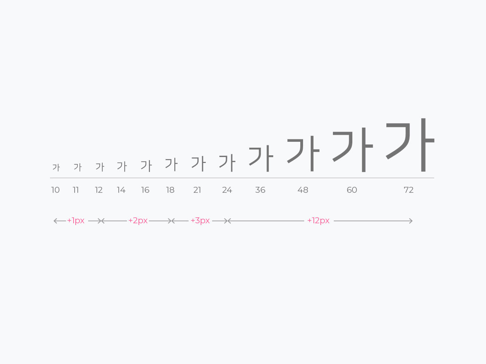


```
폰트크기 가이드에서는 이러한 일정한 규칙이 적용된다. 제목용 텍스트 크기의 기본 
설정값은 21px이며 최소12px, 본문 텍스트 크기의 기본 설정값은 16px이며 최소10px 로
규정한다.
```


- 표와 목록 가이드

```
표의 폰트크기는 14px, 제목컬러는 #000000 본문컬러는 #616161기본값으로 한다.
```


```
목록의 폰트크기는 제목16px, 본문 14px을 기본값으로 한다.
```


<br>

**(4) 폰트두께**

```
폰트는 나눔고딕, 나눔스퀘어, 노토산스 총 3개의 폰트를 기준으로 하며, 텍스트의 
두께는 웹폰트 사용시 로딩시간을 고려해 최대 4개(Light/Regural/Bold/ExtraBold)
까지 제한한다.
```


<br>

**(5) 폰트 컬러**

- 웹접근성에 의한 명도대비

```
웹접근성이란?
사용자가 장애 유무 등에 관계없이 웹 사이트에서 제공하는 모든 콘텐츠를 동등하게 
인식할 수 있도록 제공하는 것을 의미한다. 웹접근성에서 ‘적합성 수준’이란 
세부 지침들이 갖는 중요도를 3단계로 분류하는 것을 말한다.
```


※ 출처
[한국형 웹콘텐츠 접근성 지침](https://www.wah.or.kr:444/Participation/한국형웹콘텐츠접근성지침2.1.pdf)
[W3C 접근성 지침](https://www.w3.org/WAI/WCAG21/quickref/#contrast-minimum)


- 텍스트 콘텐츠의 명도 대비

```
저시력자 및 색각 이상자, 노인 등 을 위한 웹접근성 가이드에 따라 텍스트 콘텐츠와
배경간의 명도대비는 최소 4.5:1 이상이어야 합니다.
```

```
1. 텍스트 콘텐츠(텍스트 및 텍스트 이미지)와 배경 간의 명도 대비는 4.5:1 이상이어야 한다.
2. 텍스트 크기가 약 24px(18pt) 이상 또는 약 18.5px(14pt) 이상의 굵은 폰트를 사용하는 경우 명도 대비를 3:1까지 낮출 수 있다.
3. 화면 확대가 가능하도록 구현한 텍스트 콘텐츠(텍스트 및 텍스트 이미지)의 명도 대비는 3:1까지 낮출 수 있다.
```


```
그 외 텍스트는 약 24px(18pt) 이상 또는 약 18.5px(14pt) 이상의 굵은 폰트의 
경우이다. (1pt = 1.333px)
등급별 명암대비는 최소 대비 기준, 명암강도는 1에서 21까지 (1:1 에서 21:1로 작성)
이다.
```
   


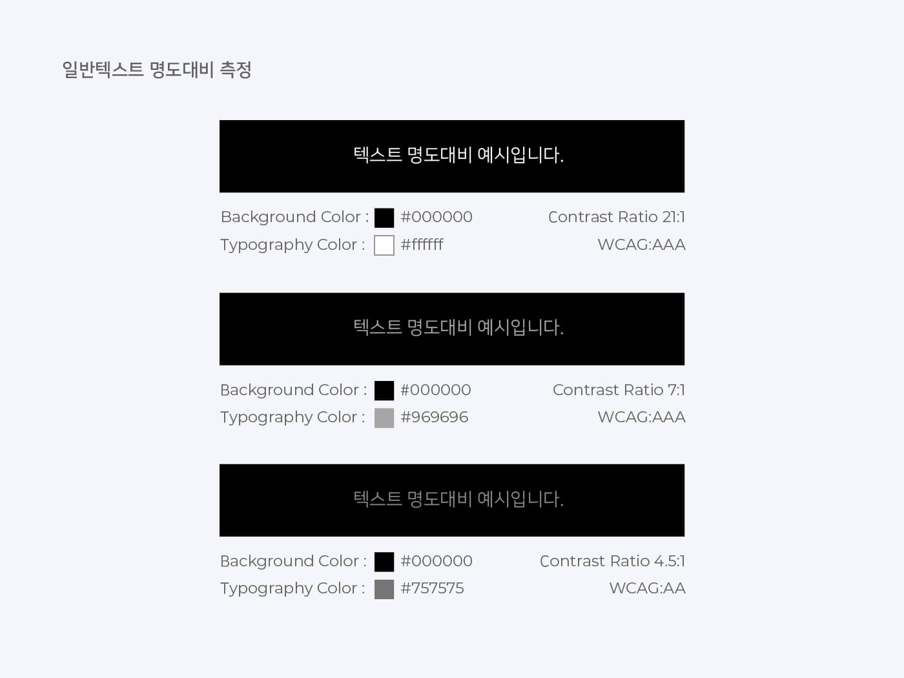


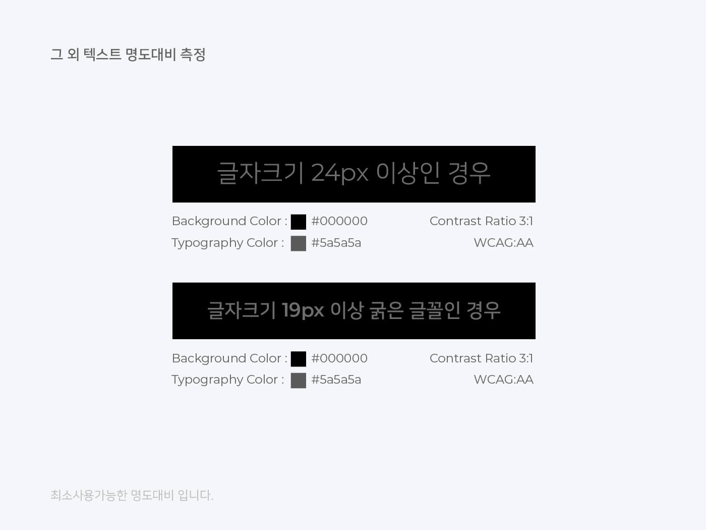

<br>

**(6) 행간**

- 제목과 단락 가이드

```
글자에는 면과 몸통이라는 개념이 있는데 이상적인 타이포그래피를 균일한 공간 설정이라
가정할 때, 글자사이 및 낱말사이는 모두 면 간격이어야 한다. 글줄사이 역시 글줄높이
(또는 글자높이)와 같은 면 간격이어야 한다.
```

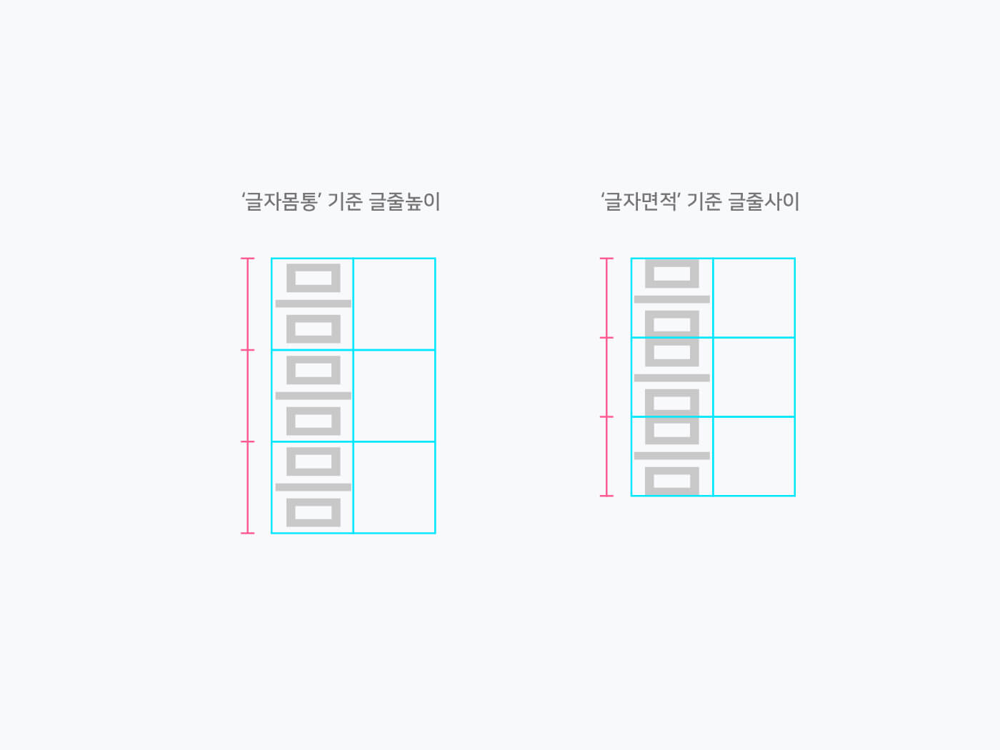

```
글자의 몸통을 기준으로 행간을 적용하면 글보다 행간이 더 넓어보이지만, 
글자의 면적을 기준으로 행간을 적용하면 글과 행간이 동일해보인다.
```


```
이러한 면적기준의 규칙을 적용하면 행간높이는 1.75배수로 계산된다. 
웹접근성 가이드 WCAG 2.1(”행간은 적어도 문단내의 띄어쓰기space는 
글자크기의 1.5배 이상이어야 한다”)에 따라 행간의 최소값은 1.5로 사용하며, 
기본값은 1.75를 권장한다. 이 때 결과값이 소수가 발생할 경우는 반올림한 수치를
적용합니다.
```


``` 
텍스트의 행 높이는 문자의 크기에 비례한다.
```


- css행간

```
글자의 면이라는 개념에서 모든 2d 프로그램은 글자 아래를 기준으로 행간을 가지지만
css에서 코딩을 할때는 위아래로 1/2씩 행간을 적용한다. 그러므로 마진이나 패딩을 
줄 때는 행간의 값이 합산되어 적용되는 점을 유의해야한다.
```

**좌)포토샵에서의 행간** &nbsp; &nbsp; &nbsp; &nbsp; &nbsp; &nbsp; &nbsp; &nbsp;**우) CSS에서의 행간**


<br><br>

**(7) 글자 길이제한**

```
한 줄의 텍스트가 너무 길면, 사용자는 글을 읽어내려 가는것에 부담감과 피로감을 
느낀다. 글줄의 길이가 어디서 시작하고 끝나는지 한눈에 알아보기 어렵기 때문입니다. 
반대로 한 글줄이 너무 짧으면, 가독성의 리듬을 깨면서 다시 앞으로 너무 자주 돌아와야 
한다. 이는 현재의 글줄을 끝내기 전에 다음을 시작하게 만듦으로써 가독성이 떨어지고 
눈을 쉽게 피로하게 만든다. 사용자의 가독성을 좋게하기 위해서는 각각의 글줄에 적절한 
글줄길이 설정이 필요하다.
```

```
본문 텍스트의 줄 길이는 일반적으로 40-60자(공백 및 기호포함) 사이가 일반적이나,
데스크탑과 같이 줄 길이가 더 긴 영역에서는 최대 120자 까지 가능하다.
```


```
텍스트의 짧은 줄에 대한 이상적인 줄 길이는 한 줄당 20~40자로 제한된다.
```


※ 글줄 길이는 콘텐츠의 성격에 따라서 달라질 수 있다.

<br>

**(8) 행바꿈 기준**

```
영문은 단어기준 행바꿈이 한글은 너비기준 행바꿈이 기본값이나, 한글은 단어기준, 
너비기준 둘 중 상황에 맞게 선택 사용이 가능하다.
```

- 한글 행바꿈

```
단어기준 : 각 줄 마지막 단어의 중간을 자르지 않고 단어의 공백을 기준으로 
줄바꿈 하는 것을 의미한다.
```


```
너비기준 : 각 줄 마지막 단어의 중간을 잘라 양쪽정렬을 기준으로 줄바꿈 하는 것을 
의미한다.
```


- 영문 행바꿈

```
단어기준 : 각 줄 마지막 단어의 중간을 자르지 않고 공백 기준으로만 줄바꿈하는 것을
의미한다.
```


<br><br>

**웹 접근성 참고자료 사이트**

[https://www.wah.or.kr:444/Participation/guide.asp](https://www.wah.or.kr:444/Participation/guide.asp)

<br>

**명도대비 확인 사이트**

[http://colorsafe.co/](http://colorsafe.co/)
[https://colorable.jxnblk.com/5a6049/d2cfba](https://colorable.jxnblk.com/5a6049/d2cfba)

<br>

**참고자료 사이트**

[https://material.io/design/typography/understanding-typography.html#readability](https://material.io/design/typography/understanding-typography.html#readability)
[http://creativemag.creative-band.co.kr/typography/](http://creativemag.creative-band.co.kr/typography/)
[http://nuli.navercorp.com/sharing/blog/post/1132886](http://nuli.navercorp.com/sharing/blog/post/1132886)
[http://yoon-talk.tistory.com/m/704](http://yoon-talk.tistory.com/m/704)
[https://www.w3.org/WAI/WCAG21/quickref/#text-spacing](https://www.w3.org/WAI/WCAG21/quickref/#text-spacing)


<br><br><br>

### 2-5. GUI 디자인 시안 작성

#### 2-5-1. 피터 모빌(Peter Morville)의 UX 기준


| 기준 특성 | 설명 |
|----------------|---------------------------------------------------------------------------|
| 유용성(Useful) | 제품이나 서비스가 목적에 맞는, 사용 가능한 기능을 제공하고 있는가에 관한 요소 |
| 사용성(Usable) | 제품이 본연의 기능을 제공하는 것을 넘어서 사용하기 쉬운가에 관한 요소 |
| 매력성(Desirable) | 제품이 사용자들에게 매력적인가에 대한 요소 |
| 신뢰성(Credible) | 사용자가 제품이나 서비스를 믿고 사용할 수 있는가에 관한 요소 |
| 접근성(Accessible) | 나이, 성별, 장애 여부를 떠나서 누구든지 제품이나 서비스에 접근할 수 있는가에 관한 요소 |
| 검색가능성(Findable) | 사용자가 원하는 기능이나 정보를 쉽게 찾을 수 있는가에 관한 요소 |
| 가치성(Valuable) | 언급된 모든 요소들을 총합하여 고객에게 가치를 제공하고 있는가에 관한 요소 |

<br><br>

#### 2-5-2. 제이콥 닐슨(Jacob Nielsen)의 10가지 사용성 평가 기준


| 평가 기준 항목 | 설명 |
|------------------------|-----------------------------------------------------------------------------|
| 시스템 상태의 시각화<br> (Visibility of system status) | 합리적인 시간 내에 적절한 피드백을 통해 사용자에게 진행 상황에 대한 정보를 항상 제공해야 한다. |
| 시스템과 현실 세계의 일치<br> (Match between system and the real world) | 내부 전문용어가 아닌 사용자에게 친숙한 단어, 구문 및 개념을 사용해야 한다. |
| 사용자 제어 및 자유<br> (User control and freedom) | 사용자는 종종 실수를 하기 때문에 현재 진행 중인 작업에서 벗어날 수 있는 방법,<br> 혹은 실수로 수행한 작업을 취소할 수 있는 방법, ’탈출구’를 명확하게<br> 제공해야 한다. |
| 일관성 및 표준<br> (Consistency and standards) | 1. 외부 일관성 : 일관적인 사용자 경험을 제공하기 위해서 플랫폼 및 업계의 관습을<br> 따라야 하며, 사용자에게 익숙한 UI를 제공하세요. 잘 알려진 UI 디자인 패턴을<br> 사용하는 것이 좋다.<br> 2. 내부 일관성 : 사용자가 혼란스럽지 않도록 제품의 인터페이스나<br> 정보 제공에 일관성이 있어야 한다. |
| 오류 방지<br> (Error prevention) | 오류가 발생하기 쉬운 상황을 제거하여 사용자의 실수를 방지해야 한다. |
| 기억보다는 직관<br> (Recognition rather than recall) | 사용자가 기억해야 하는 정보를 줄인다. |
| 사용의 유연성과 효율성<br> (Flexibility and efficiency of use) | 초보자와 전문가 모두에게 개별 맞춤 기능을 제공하도록 한다.  |
| 미학적이고 미니멀한 디자인<br> (Aesthetic and minimalist design) | 인터페이스에는 관련이 없거나 불필요한 정보가 포함되지 않도록 한다. |
| 오류의 인식, 진단, 복구를 지원<br> (Help users recognize, diagnose, and recover from errors) | 사용자가 이해할 수 있는 언어를 사용하여 문제가 무엇인지 정확하게 표시하고,<br> 해결 방법을 제안해야 한다. |
| 도움말 및 설명 문서<br> (Help and documentation) | 추가 설명이 필요 없는 것이 가장 좋지만, 상황에 따라 이해하는 데 도움이<br> 되는 문서를 제공해야 한다.  |

<br><hr><br>

### 2-6. 피그마 기본 사용법

#### 2-6-1. 피그마 시작하기**

- 피그마는 웹에서 바로 쓸 수 있고 컴퓨터에 전용 앱을 설치할 수도 있다. 언제 어디서든 브라우저를 통해 접속할 수 있으며 더 안정적으로 사용하기 위해 앱을 설치할 수도 있다. 

<br>

**(1) 피그마 홈페이지에 접속한다.**

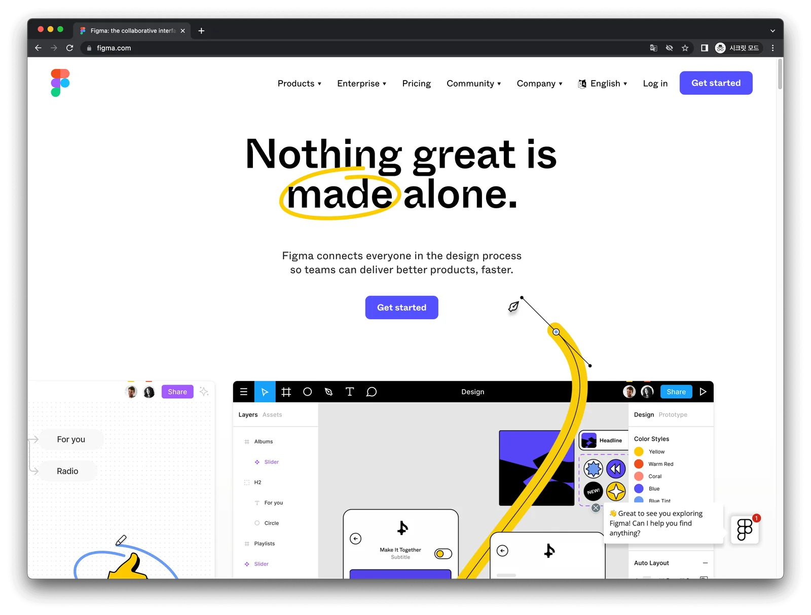

피그마 접속 : [피그마접속링크](https://www.figma.com/)

<br>

**(2) Sign up 버튼을 눌러 가입한다.**


- 이메일 혹은 구글 아이디로 가입할 수 있습니다.

<br>

**(3) 아이디를 만들고 처음 접속하면 팀을 만든다.**


- 혼자 작업을 하더라도 프로젝트를 나눠 저장할 필요가 있기 때문에 적당한 팀 이름을 작성한다.

<br>

**(4) 함께 작업할 팀원을 초대한다.** 


- 초대할 팀원이 없다면 Skip this step을 누르면 된다.

<br>

**(5) 플랜을 정하고, 첫 시작은 무료로 시작한다.**


- 피그마는 팀 > 프로젝트 > 파일 구조로 되어 있다. 
- 프로젝트에 들어가지 않는 파일은 Draft에 저장된다. 
- 무료 플랜에서는 드래프트 파일은 무제한으로 사용할 수 있지만 원하는 계층 구조로 파일을 정리할 수 있는건 3개로 제한된다.


**(6) 처음으로 만들 파일을 정한다.** 


- 우리는 주로 피그마로 디자인을 할 것이기 때문에 왼쪽을 고른다.

<br>

**(7) 프리셋과 템플릿을 고른다.** 


- 어떤 것들이 있는지 구경하지 좋다.

<br>

**(8) 내 컴퓨터에 저장된 폰트 쓰기**

- 로컬 폰트를 쉽게 사용하고 안정적으로 사용하고 싶다면 데스크탑 앱을 설치하는 것을 추천한다. 

1. 웹으로만 사용한다면 로컬 폰트를 불러올 수 있도록 별도 프로그램을 설치한다. 
2. 피그마 모바일 앱으로 피그마 내용을 확인할 수 있다. 
3. 주로 모바일 UI 디자인을 확인하는 용도로 사용한다. 
4. 단순히 피그마를 확인하기 위한 용도라면 웹으로도 접속할 수 있다.


피그마다운로드하기 : [피그마 다운로드 링크](https://www.figma.com/downloads/)

<br><br>

#### 2-6-2. 피그마 인터페이스 화면 구성

**(1) 피그마의 첫 화면**


- 피그마에 로그인을 하시면 위 화면을 만나게 된다.

<br>

**(2) 새 파일 만들기**


- 왼쪽 상단의 New design file을 눌러서 새 파일을 만들어 주면 된다.

<br>

**(3) 기본 화면 인터페이스**

 

- 기본적으로 맨 상단의 툴바, 화면의 왼쪽의 레이어 패널, 가운데 작업영역의 캔버스 영역과 마지막으로 각 툴에 따라 관련된 내용이 나오는 디자인 패널 영역으로 나누어서 볼 수 있다.

<br>


**(4) 피그마 아이콘**
 


- 툴바의 가장 왼쪽 피그마 아이콘을 클릭하면 기본 메뉴들이 나온다. 다시 피그마 기본 페이지로 돌아가려면 Back to files를 눌러주시면 된다.

<br>

**(5) 툴 영역 - Move, Scale**
 


<br>

5-1) Move Tool [ 단축키 V ]

- 오브젝트를 선택하고 이동시킬 때의 툴. 오브젝트 선택 시 Ctrl(Command)을 누른 상태에서 선택을 하면 오브젝트를 쉽게 선택할 수 있음.

<br>

5-2) Scale Tool [ 단축키 K ]

- 오브젝트를 선택하고 마우스 드래그하여 크기 조절 가능.

<br> 

**(6) 툴영역 - Frame, Section, Slice**
 
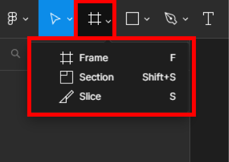

<br>

6-1) Frame Tool [ 단축키 F ]

- 피그마에서 많이 사용되는 툴 중 하나. 프레임 툴을 선택하면 오른쪽 디자인패널영역에서 피그마에서 제공해 주는 여러 가지 디바이스 해상도를 활용할 수 있으며, 다른 크기를 만들어 주고 싶다면 캔버스영역에서 마우스를 드래그하여 원하는 크기의 프레임을 생성해서 활용할 수 있음.

<br> 

6-2) Section Tool  [ 단축키 Shift  + S 맥에서는 Command + s ]

- 새로 생긴 기능으로 작업한 디자인들을 모아 관리할 때 유용하며, 일반적으로 프레임으로 디자인 작업을 한 뒤 관련된 디자인들을 섹션으로 묶어 디자인 파일들을 보다 효율적으로 관리할 수 있음.
- 즉, 이 기능을 사용하면 파일을 여러 부분으로 나누어 관리할 수 있으며, 필요한 부분만 쉽게 찾을 수 있게 됨.
- 필요한 부분에만 집중적으로 작업할 수 있기에 작업속도도 올라갈 수 있다는 장점이 있음.

<br>

6-3) Slide Tool [ 단축키 S ]

- 슬라이스를 사용하여 복잡하게 겹쳐진 이미지도 쉽게 내보낼 수 있음.
- 즉 export를 편하게 할 때 사용 가능.

<br>

툴 영역 - 도형 툴
 


**(7) Shape Tool**


- 다양한 툴을 활용하여 피그마에서 아이콘을 제작할 수 있음.
- 각 툴을 단축키는 툴의 이름 옆에 알파벳으로 표현되어 있음.

<br>

**(8) 펜툴 영역 - Pen, Pencil**


8-1) Pen Tool [ 단축키 P ]

- shape로 만들지 못하는 세밀한 아이콘을 만들 때 사용.

<br>

8-2) Pencil Tool [ 단축키 Shift + P ]

- 말 그대로 연필로 그리듯이 스케치할 때 사용.

<br>

**(9) 툴 영역 - Text**
 


9-1) Text Tool [ 단축키 T ]

- 글자를 넣고싶을때 사용. 
- 피그마는 구글폰트를 기본 폰트로 활용가능하기에 추가적인 폰트체를 설치하지 않고도 많은 웹폰트를 활용할 수 있음. 
- 구글 폰트 외의 다른 폰트를 사용하기 원한다면 개인컴퓨터(로컬)에 설치해서 피그마 폰트 도우미에서 사용 가능.
 

**(10) 툴 영역 - Resources**
 


<br>

10-1) Resources [ 단축키 Shift+I ]

- 디자인을 할 때 유용한 여러 플러그인을 관리하고 실행할 때 사용.

<br> 

**(11) 툴 영역 - Hand**

 

<br>

11-1) Hand Tool [ 단축키 H or 스페이스바 누른 상태에서 마우스 클릭 드래그 ]

- 화면을 이동할때 사용.

<br>

**(12) 툴 영역 - Add Comments**
 


<br>

12-1) Add Comments [ 단축키 C ]

- 디자인에 대한 피드백을 주고받을 때 사용. 
- 코멘트를 남기면 해당 영역에 코멘트가 표시가 되고 가입한 메일로 관련 코멘트가 보내짐. 
- 작성된 코멘트 아래에 답글도 남겨둘 수 있으며, 코멘트 이동 및 제거도 가능

<br><br>

#### 2-7. 피그마 추가 툴바

- 피그마 화면의 중앙 상단에 있는 툴 내용과 오른쪽상단의 툴바에 대해서 알아본다.


<br>

**가운데 위치한 툴바 영역**


- 피그마 화면의 가운데 부분에서는 내가 작업하고 있는 프로젝트의 이름을 변경하거나 프로젝트를 생성할 수 있는 피그마의 첫 화면으로 이동할 수 있다.
- 하지만, 이 부분은 오브젝트를 선택했을 시 다른 모양으로 바뀌게 된다.

왼쪽부터 순서대로 설명을 하도록 한다.


**(1) 개체편집 아이콘**

>Edit Object 


단일 오브젝트를 선택한 뒤 아이콘을 클릭하거나 키보드의 엔터키나 마우스 더블클릭을 하면 벡터 편집 모드로 들어갈 수 있다.

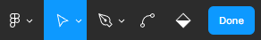

벡터 편집 모드가 활성화되면 왼쪽상단의 툴바의 모양이 바뀌게 되며 오브젝트에 빗금이 쳐진다.


이 모드에서 오브젝트에 패스 선을 긋거나, 합치거나 지워주거나 색을 넣어줄 수 있습니다.

<br><br>

**(2) 마스크 기능 아이콘**

>Use As Mask
 


- 마스크를 만드는 기능이다.

- 두 개 이상의 오브젝트를 선택한 다음 화면 상단의 마스크 버튼을 누르면 마스크 구조 생성이 된다.
- 기본적으로 제일 아래에 있는 오브젝트를 기준으로 위로 올라간 오브젝트가 잘리게 된다.

<br>


- 마스크 기능을 활용하면 이런 작업도 할 수 있다.

- 다음과 같이 두 개의 오브젝트를 준비 한 다음 마스크 작업을 하면 멋진 글씨를 만들어 줄 수 있다.


<br>


>Boolean groups

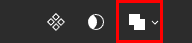

- 불리언 그룹이라고 부르며 다른 디자인 프로그램에 있는 패스파인더와 동일한 기능을 한다.

- 하나 이상의 오브젝트(도형)를 선택하여 합치거나 빼 줄 때 사용한다.

- 아이콘을 클릭하면 여러 개의 메뉴가 나오며, 위에서부터 순서대로 알아보자


<br>

1. Union selection

- 두 오브젝트를 겹친 후 적용하면 두 개의 도형이 합쳐지며, 위에 올라간 도형의 색으로 표현이 된다.


<br>

2. Subtract selection

- 두 오브젝트를 겹친 후 적용하면 위에 올라간 도형의 모양으로 구멍이 생기게 된다.


<br>

3. Intersect selection

- 두 오브젝트를 겹친 후 적용하면 겹친 부분만 남게 된다.


<br>

4. Exclude selection

- 두 오브젝트를 겹친 후 적용하면 겹친 부분이 사라지고 겹치지 않은 부분이 남는다.

(홀수로 겹친 부분은 남고 짝수로 겹친 부분은 사라진다고 보면 된다.)

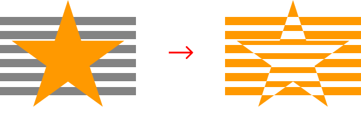

<br>

5. Flatten selection

- 기본적으로 불리언그룹을 사용하면 겹쳐진 오브젝트들은 그룹으로 표현이 된다.

- 하지만, 이 아이콘을 누르게 되면 그룹화가 만들어지는 것이 아닌 하나의 레이어로 변경이 된다.


<br>

>Create Link


- 하이퍼링크를 만들어 줄때 사용한다. 이 아이콘은 텍스트를 작성했을 때만 활성화가 된다.
- 링크를 걸고 싶은 텍스트를 클릭한 뒤 링크 아이콘을 클릭하면 url을 입력할 수 있는 창이 나온다. 그곳에 연결하고 싶은 url 주소를 입력하시면 되고, 입력이 완료되면 글자 밑에 밑줄이 생성이 된다.

<br><br><br>

**오른쪽에 위치한 툴바 영역**

>View Profile

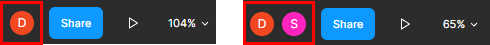

- 파일을 보고 있는 구성원이 표시된다.

- 상대방이 어떤 작업을 하고 있는지 확인 가능하기에 피그마에서의 커뮤니케이션에 매우 유용한 기능이라고 할 수 있다.

<br>

>Share


- 파일 공유를 하고 싶을 때 사용하며 이메일 입력하는 곳에 공유하고 싶은 상대의 이메일을 입력하면 파일 공유가 가능하다.

<br>

>Present


- 작업하고 있는 파일을 미리볼 수 있으며 프로토타입과 상호작용을 할 수 있다.

<br>

>Zoom / View Options


- 보고 있는 파일의 보기 비율을 조절할 수 있다.
- 또한, 픽셀 미리보기, 픽셀 그리드, 레이아웃 그리드 룰러 등을 지정 가능하며, 특히 Rulers(룰러)는 자주 사용되기에 단축키를 알고 있으면 좋습니다.
- 룰러의 단축키는 Shift + R입니다.

<br><br><br>

### 2-7. 피그마 레이어 작업 

- 먼저 프레임을 생성을 하게 되면 왼쪽 레이어 패널에 프레임레이어가 생성이 된다.


기본적으로 레이어 패널은 화면에서 보이는 상태지만, 만약에 패널창이 사라졌을 때는 단축키를 통해 다시 열어 줄 수 있으니 걱정할 필요는 없다.


**레이어 패널 단축키**

| | |
|------------|---------------------------|
| 맥 | Command + Shift + \ |
| 윈도우 | Ctrl + Shift + \ |
 
만약에 피그마 자체의 툴바, 패널 전체가 사라졌다면 이러한 단축키를 통해 다시 열어줄 수 있다.


<br>

**피그마 전체 UI 표시 여부 단축키**

|  |  |
|------------|---------------------------|
| 맥 | Command + \ |
| 윈도우 | Ctrl + \ |

<br>

**레이어의 아이콘**

- 기본적으로 캔버스 영역에 추가한 모든 오브젝트, 프레임, 그룹 등은 레이어 패널에 표시가 된다.
- 생성된 레이어 옆의 아이콘을 통해 어떤 유형인지 알아볼 수 있다.

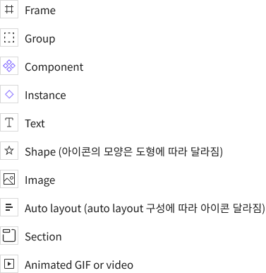

- 새 레이어를 생성할 시 레이어패널의 맨 위에 추가 됩니다. 만약 그룹 혹은 프레임 내에서 새 레이어를 생성할 시 그 프레임(그룹) 안의 가장 위에 추가된다.

- 또한, 레이어 패널의 크기가 작다면 레이어패널의 오른쪽 가장자리에 마우스 커서를 가져다 댄 후 드래그하여 너비를 조절할 수 있다.

<br>

**자산 패널(Assets Panel) 관련 단축키**

- 레이어 패널 옆에는 자산과 관련된 패널이 존재한다.


<br>

- 기본적으로 피그마에서 말하는 자산은 어떠한 콘텐츠(아이콘, 배경이미지 등)들을 구성할 때 사용되는 이미지나 동일하게 생긴 버튼모양, 아이콘 등 어떠한 재사용할 수 있는 모든 구성요소를 의미한다.

- 버튼과 화살표 컴포넌트를 생성해 보자


<br>

- 참고로 컴포넌트(구성요소)를 생성할 시 레이어패널에서는 보라색 글씨로 구성요소 레이어가 생성이 된다.

- 생성을 한 뒤 자산 패널에 가서 확인해 보면 생성된 컴포넌트를 확인할 수 있다.

- 만약, 생성한 구성요소가 많을 시 검색을 하여 찾아볼 수 있다.

<br><br><br>

### 2-8. 피그마 디자인 패널

**기본적으로 디자인 패널은 레이어를 선택해 주면 활성화가 된다.**


<br><br>

**정렬 (Align)**


- 하나의 오브젝트를 선택한 뒤 정렬을 누르면 오브젝트가 위치한 프레임 기준으로 정렬이 적용이 되고, 
- 하나 이상의 오브젝트를 선택한 다음 정렬 버튼을 누를 경우 선택된 오브젝트를 기준으로 오브젝트들의 위치가 옮겨지게 된다.
- 앞에서부터 첫 번째, 두 번째 세 번째 속성은 좌우 관련,
그 다음 네 번째, 다섯 번째 여섯 번째 속성은 위아래 관련 정렬 속성이다.

<br><br>

>정렬속성 단축키

|  |  |  |
|---------|---------|----------------------------|
|  | 좌 | Alt + A |
|  | 수평 | Alt + H |
|  | 우 | Alt + D |
|  | 위 | Alt + W |
|  | 수직 | Alt + V |
|  | 아래 | Alt + S |

```
또한, 오브젝트를 세 개 이상 선택하였을 시 오브젝트 사이 간격을 일정하게 
지정할 수도 있다.
```


```
Tidy up이라는 옵션을 사용 시, 오브젝트끼리의 행과 열을
알아서 정렬이 되도록 도와준다.
```


```
일정한 수치를 입력하여 간격을 조절해 줄 수 있다.
``` 


<br><br>

**색상 조절 (Fill)**


```
오브젝트를 선택한 뒤 오른쪽 디자인패널의 Fill을 눌러주면 색상을 조절할 수 있다.
원하는 색을 선정하여 적용시켜 주시면 된다.
기본적으로 사용한 색상은 Document colors에 저장이 되지만,
작업 시 자주 사용하는 색상은 저장을 해 놓은 다음 활용하는 것이 더 효율적이다.
```


<br><br>

**테두리 (Stroke)**


```
오브젝트를 선택하여 테두리를 적용시켜 줄 수 있다.

테두리의 색상, 오브젝트 기준으로 테두리의 생성 위치, 두께를 적용시켜 줄 수
있으며, 테두리를 도형의 일부분에만 적용시켜 줄 수 있는 속성등이 있다.
```

```
테두리는 기본적으로 inside로 생성이 되지만, 다른 속성을 선택하여
오브젝트의 모양을 기준으로 center, ouside로 바꾸어서 생성해 줄 수 있다.
```


<br>

```
또한, 오브젝트의 원하는 부분에만 테두리를 적용시켜주고 싶을 때는 이 옵션을
사용하면 된다.
```


<br>

**효과 (Effects)**

```
피그마에서의 효과의 종류는 총 4가지입니다. 크게 그림자효과(Shadow)와 흐림(Blur) 효과로 나누어서 볼 수 있다.

또한 여러 효과를 + 버튼으로 중첩 적용을 시켜줄 수 있다.
```

<br>

>Inner shadow (안쪽 그림자)


```
오브젝트의 안쪽에 그림자가 생기는 것을 확인할 수 있다. 
오브젝트의 안쪽 깊이감을 표현하고 싶을때 사용하면 된다.
```


>Inner shadow의 옵션
 
|  |  |
|-------|---------------------------------------------------------|
| X | X축을 의미하며 그림자를 좌우로 생기도록 할 수 있다. |
| Y | Y축을 의미하며 그림자를 위아래로 생기도록 할 수 있다. |
| Blur | 그림자의 흐림 정도를 조절해 줄 수 있다. |
| Spread | 그림자의 퍼지는 정도를 조절해 줄 수 있다. |
| Color | 그림자의 색상을 바꿀 수 있다. |

<br>

>Drop shadow (바깥쪽 그림자)


```
제일 자주 사용되는 효과로도 볼 수 있으며, 효과를 적용하면 기본적으로 설정이 되어 있다.

오브젝트의 바깥쪽으로 그림자를 두어 오브젝트가 떠 있는 듯한 효과를 준다.
```

<br>

>Drop Shadow의 옵션

|  |  |
|-------|---------------------------------------------------------|
| X | X축을 의미하며 그림자를 좌우로 생기도록 할 수 있다. |
| Y | Y축을 의미하며 그림자를 위아래로 생기도록 할 수 있다. |
| Blur | 그림자의 흐림 정도를 조절해 줄 수 있다. |
| Spread | 그림자의 퍼지는 정도를 조절해 줄 수 있다. |
| Color | 그림자의 색상을 바꿀 수 있다. |
 
<br>

>Layer Blur (레이어 흐림)


```
레이어에 흐림 효과를 적용시켜 아래에 위치한 오브젝트와 겹치는 경계 부분을
흐리게 만들어 준다.

옵션은 Blur 하나만 있으며, 수치를 높여주면 효과가 적용된 레이어가 더 
흐려진다.
```

<br>

>Background Blur (배경 흐림)


```
레이어에 흐림 효과를 적용시켜 아래에 위치한 오브젝트와 겹친 부분을 흐리게
만들어 준다.

적용시 주의해야할 점은 반드시 흐림 효과를 적용한 오브젝트에 투명도를 
적용해야 한다.

레이어 흐림과 동일하게 옵션은 Blur 하나만 있으며, 수치를 높여주면 효과가 
적용된 레이어가 더 흐려진다.
```

<br><br><br>

### 2-9. 피그마 오토 레이아웃

```
오토 레이아웃?
피그마의 오토레이아웃은 UI 디자인을 보다 더 쉽고 효율적으로 작업하는 것을 도와준다.

오토 레이아웃을 사용하면 반응형 작업 시 레이아웃을 편하게 조정할 수 있으며, 
반복되는 콘텐츠 작업 시에도 손쉽게 수정할 수 있다.
```

<br>

#### 2-9-1.오토 레이아웃 생성

```
1. 단축키는 Shift + A 입니다.
2. 혹은 부모와 자식요소 레이어를 선택한 다음 마우스 우클릭 후 
Add auto layout 을 눌러도 된다.
3. 부모와 자식요소 레이어를 선택한 다음 우측 디자인 패널에서 Auto layout을 클릭하면 된다.
```


<br><br>

#### 2-9-2. 오토 레이아웃 기능 패널

**1. 레이아웃 방향**


기본적으로 Vertical(수평), Horizontal(수직) 방향을 지정해 줄 수 있었는데 2023년부터 Wrap이 추가되었다.

기본적으로 오브젝트들을 가로로 배치한 다음 오토 레이아웃을 지정하면 수평방향으로, 세로로 배치한 다음 오토 레이아웃을 지정하면 수직 방향으로 오토레이아웃이 생성된다.

하지만, 배치를 어떻게 하든 수직, 수평을 바꿀 수 있으니 크게 신경 쓰지 않으셔도 된다.

그렇다면 새로 생긴 Wrap이라는 기능은 무엇일까?

이 Wrap이라는 기능은 줄 바꿈을 해주는 기능이다.


이렇게 오토 레이아웃을 지정한 다음 줄 바꿈을 지정해 주고 오토 레이어의 크기를 줄여주면 안의 오브젝트들이 자동으로 줄 바꿈이 적용되는 것을 확인할 수 있다.


크기를 줄이기 시작하니 초록색 오브젝트가 밑으로 밀려 내려갔다.


크기를 더 줄이니 보라색 오브텍트까지 밑으로 밀려 내려갔다.

이런 새로운 기능이 생김으로 인해 반응형 작업이 더 편하게 될 것 같다

<br>

**2. 레이아웃 간격**

<div>


</div>

오토 레이아웃을 생성한 뒤 오브젝트 들의 간격을 조절해 줄 수 있다.

직접 수치를 넣어 수정하거나 오브젝트 사이에 마우스 커서를 두어 드래그로 간격을 조절해 줄 수 있다.

<br>

**3. 좌우, 상하 여백(padding 패딩) 간격**

여백 간격은 글자와 사각형 오브젝트 사이의 간격을 의미한다고 보면 된다.

좌우를 동일하게, 상하를 동일하게 넣어줄 수 있으며, 각각 다른 수치를 넣고 싶다면 간격 영역의 맨 오른쪽의 모서리가 떨어진 사각형 아이콘을 눌러서 지정하면 된다.

<div>


</div>


<br>

**4. 프레임 내 정렬**

오토 레이아웃 내 자식 요소의 정렬을 바꾸어 줄 수 있다.


<div>


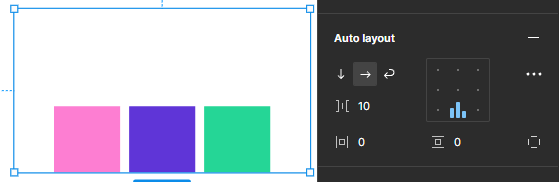

</div>

<br><br><br>


### 2-10. 피그마 단축키

#### Essential

| 단축키 | 기능 |
|-----------------|------------------------------------------|
| Ctrl + \ | 피그마 UI 보이기 / 숨기기 |
| I (대문자 i) | 색상 추출 스포이드 |
| Ctrl + / | 피그마 퀵 액션 창 (기능 검색) |
 
<br><br>
 
#### File & Properties

| 단축키 | 기능 |
|-----------------|------------------------------------------|
| Ctrl + Shift + E | export (추출, 출력) | 
| Ctrl + Alt + S | save to version history (히스토리 저장) | 
| Ctrl + Shift + K | place image (이미지 불러오기) | 

<br><br>

#### Tools

| 단축키 | 기능 |
|-----------------|------------------------------------------|
| V	| move tool (이동) | 
| F	| frame tool (프레임 생성하기) | 
| P	| pen tool (펜) | 
| Shift + P	| pencil tool (연필) | 
| T	| text tool (텍스트 작성하기) | 
| R	| rectangle tool (사각형 그리기) | 
| O	| ellipse tool (원 그리기) | 
| L	| line tool (선 그리기) | 
| Shift + L	| arrow tool (화살표 그리기) | 
| C	| add comment (코멘트 추가 또는 보기) | 
| I	| pick color (스포이드) | 
| S	| slice tool (슬라이스) | 
 
<br><br>

#### View

| 단축키 | 기능 |
|-----------------|------------------------------------------|
| Ctrl + Alt + \ | 멀티플레이어(동시 작업하는 유저) 커서 보이기/숨기기 | 
| Shift + R	| rulers (눈금자, 룰러) 보이기/숨기기 | 
| Shift + O	| outline (아웃라인) 보이기/숨기기 | 
| Shift + G	| layout grids (레이아웃 그리드) 보이기/숨기기 | 
| Alt + 1	| layer (레이어 패널) | 
| Alt + 2	| asset 창 | 
| Alt + 8	| design (디자인 패널) | 
| Alt + 9	| prototype (프로토타입 패널) | 

<br><br>

#### Zoom

| 단축키 | 기능 |
|-----------------|------------------------------------------|
| Space + 드래그	| 화면 이동 |
| Ctrl + +(플러스)	| 화면 확대 | 
| Ctrl + -(마이너스)	| 화면 축소 | 
| Ctrl + 0	| 화면 비율 100% | 
| Shift + 1	| 전체 화면 (브라우저 기준으로 맞춰줌) | 
| Shift + 2	| 선택한 요소 기준으로 화면 맞춤 | 
| N	| 선택된 프레임의 다음 프레임으로 이동 | 
| Shift + N	| 선택된 프레임의 이전 프레임으로 이동 | 
| PgUp (page up)	| 이전 페이지로 이동 | 
| PnDn (page down)	| 다음 페이지로 이동 | 
| Home	| 이전 프레임으로 이동 | 
| End | 다음 프레임으로 이동 | 
 
<br><br>

#### Text

| 단축키 | 기능 |
|-----------------|------------------------------------------|
| Ctrl + B / I | 글자 굵게 / 굴자 기울림 |
| Ctrl + U | 글자 밑줄 |
| Ctrl + K | 링크 만들기 |
| Ctrl + Alt + L / T / R | 텍스트 왼쪽 / 가운데 / 오른쪽 정렬 |
| Ctrl + Shift + < , > | 폰트 크기 조절 |
| Ctrl + Alt + < , > | 폰트 두께 조절 |
| Alt + < , > | 자간 조절 |
| Alt + Shift + < , > | 행간 조절 |
 
<br><br>

#### Shape

| 단축키 | 기능 |
|-----------------|------------------------------------------|
| Alt + / | fill (배경색) 제거 |
| Shift + /	stroke | (테두리) 제거 |
| Shift + X | fill(배경색) 과 stroke(테두리) 전환 |
| Ctrl + Shift + O | outline stroke (아웃라인 스트로크) | 
 
<br><br>

#### Selection

| 단축키 | 기능 |
|-------------------------|--------------------------------------------|
| Ctrl + A | 전체 선택 | 
| Esc | 선택 해제 | 
| Ctrl + click | 하나의 오브젝트만 선택하고 싶을때 사용 (deep select) | 
| Ctrl + G | 그룹 (group) | 
| Ctrl + Shift + G | 그룹 해제 (ungroup) | 
| Ctrl + Shift + H | 숨기기 / 나타내기 (show / hide) | 
| Ctrl + Shift + L | 잠금 / 잠금해제 (lock / unlock) | 
| Ctrl + Alt + Shift + L | 전체 잠금 해제 | 
 
<br><br>
 
#### Cursor

| 단축키 |	기능 |
|-----------------|------------------------------------------|
| Alt + 마우스커서 이동	| 오브젝트 간의 거리 측정 |
| Alt + 크기조절 | 오브젝트 중심을 기준으로 크기 조절 |
| Shift + 크기조절 | 오브젝트의 비율을 유지하며 크기 조절 |

<br> <br>

#### Edit

| 단축키 | 기능 |
|-----------------|------------------------------------------|
| Ctrl + C | 복사 |
| Ctrl + V | 붙여넣기 |
| Ctrl + X | 잘라내기 |
| Ctrl + D | 제자리 복사 붙여넣기 반복 |
| Ctrl + R | 이름변경 |
 
<br><br>

#### Edit

| 단축키 | 기능 |
|-----------------|------------------------------------------|
| Enter | 오브젝트 및 이미지 수정 완료 |
| Shift + H | 좌우반전 (가로 뒤집기) |
| Shift + V | 상하반전 (세로 뒤집기) |
| Ctrl + Alt + M | 마스크 만들기 |
| Ctrl + Shift + K | 이미지 불러오기 |
| 0 + 0	| 투명도 0% |
| 1	| 투명도 10% |
| 5	| 투명도 50% |
| 0	| 투명도 100% |
 
<br><br>

#### Arrange

| 단축키 | 기능 |
|-----------------|------------------------------------------|
| Ctrl + ] | 앞으로 이동 |
| Ctrl + [ | 뒤로 이동 |
| ]	 | 맨 앞으로 이동 |
| [	| 맨 뒤로 이동 |
| Alt + A / D | 왼쪽, 오른쪽 정렬 |
| Alt + W / S | 위, 아래 정렬 |
| Alt + H / V | 수평, 수직 정렬 |
 
<br><br><br>

## 2-11. UI 디자인 시안 제작


<br><br>

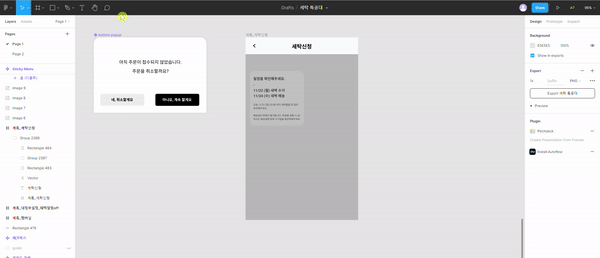

<br><br>


<br><br>

### [UI 디자인 시안 제작물 공유 링크](https://www.figma.com/file/JRnsAaMePZJ1jrqsKOHAbP/%ED%85%9C%ED%94%8C%EB%A6%BF%EC%9E%91%EC%97%85?type=design&node-id=0%3A1&mode=design&t=hPbAPu77SUziiNEj-1)

<br><hr><br>

## 참조 무료 템플릿 링크 모음

### [01 - FigmaCrush](https://www.figmacrush.com/)

### [02 - Figma Resources](https://www.figmaresources.com/)

### [03 - FreebiesUI](https://freebiesui.com/figma-freebies/)

#### [04 - Figma Finder](http://figmafinder.com/)

#### [05 - Setproduct](http://setproduct.com/)

#### [06 - Figma](https://www.figma.com/resources/)

#### [07 - Figma Themes](https://www.figmathemes.com/)

#### [08 - Freebie Supply](https://freebiesupply.com/free-figma/)

#### [09 - Figma Freebies](http://www.figmafreebies.com/)

#### [10 - Dribbble](https://dribbble.com/search?q=free+figma)

#### [11 - Bootstrap 4 GUI Components](https://www.figmaresources.com/resources/cjcf8oodrfuhpfyls)

 
#### [12 - Bootstrap V4 Grid](https://www.figmacrush.com/bootstrap-grid-v4-figma/)

 
#### [13 - UI Store Design](https://www.uistore.design/)


