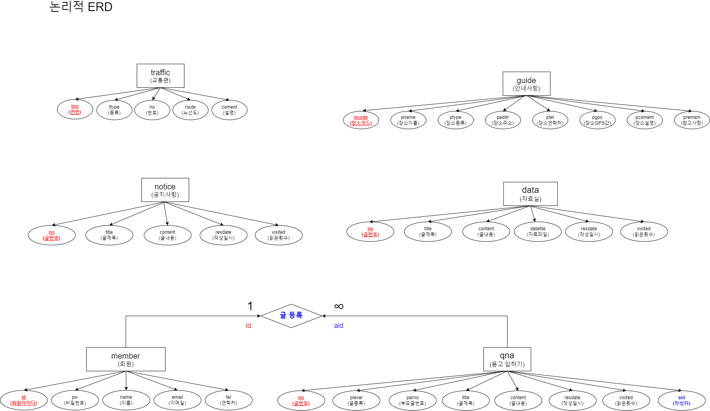
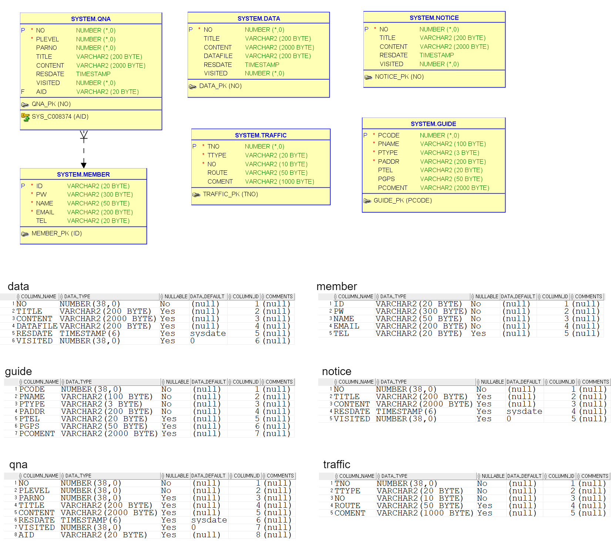

# 프로젝트 개발 보고서(Project Development Report)
-----------------------------------------------
## 1. 프로젝트 개요(Project Outline)

	서울디지털단지가 조성되어 있어 IT의 메카이면서 패션 아웃렛이 모여 있는 가산동을 소개하기 위한
	웹 애플리케이션을 자바 기반의 웹 애플리케이션으로 개발하게 되었다.

	To introduce Gasan-dong, an IT mecca where the Seoul Digital Complex is located and where fashion outlets are located.
	The web application was developed as a Java-based web application.

   

## 2. 프로젝트 목적(Project Purpose)

	가산동의 유래와 동네의 특징, 그리고, 곳곳에 산재되어 있는 각 종 기관과 
	가산동에 위치한 가산디지털단지의 빌딩, 맛집 등을 소개하고, 가산동의 소식을 전달하며,
	커뮤니티를 이루고, 정보를 공유할 목적으로 개발하게 되었다.

	The origins of Gasan-dong, the characteristics of the neighborhood, and various institutions and institutions scattered throughout the area.
	Introducing the buildings and restaurants of the Gasan Digital Complex located in Gasan-dong and delivering news about Gasan-dong.
	It was developed for the purpose of forming a community and sharing information.

   

## 3. 프로젝트 개발 환경 정보(Project Dvelopement Environment)

- Project Topic : Gasan-dong  Intro Web Application
- Develope Environment : Open JDK 11
- Language : Java 11
- Web Module : Jsp/Servlet 3.0
- Process Pattern : MVC Pattern
- Database System(DBMS) : Oracle 21C XE
- Database Design : SQL Developer 23.1.1
- Entity Relationship Design : draw.io 20.8.16
- Java Database Connector : ojdbc11
- Application Design : Object aid 1.2.4
- Back Template Language : Java/Servlet 11
- Front Template Language : Jsp(JSTL/EL) 3.0/HTML5/CSS3/Javascript ES5
- Web (Application) Server : Tomcat 9.0
- Navigation Design : WordCloud 3.7, Card Sort BoardMix

   

## 4. 프로젝트 기획 및 설계(Project Planning & Design)

### 4-1. 네비게이션 설계(Navigation Design)

| 마이페이지 | 지역소개 | 이용안내 | 커뮤니티 |
|----------|----------|----------|----------|
| 로그인 | 지명 유래 | 교통편 안내 | 공지사항 |
| 나의정보 | 지역 특징 및 시설안내 | 주요 빌딩 안내 | 묻고 답하기 |
| 회원약관 | 연혁 | 주요 협회 단체 | 자료실 |
| 개인정보처리방침 | 오시는길 | 맛집 안내 | &nbsp; |
| 회원가입 | &nbsp; | 숙박 시설 안내 | &nbsp; |

 

#### 4-1.1. 자료 수집(Data Collection And Sort) - WordCloud

 

#### 4-1.2. 콘텐츠 분류(Content Cort) - Card Sorting

 

#### 4-1-3. 서비스 흐름 설계(Service Flow Design)

 

#### 4-1-4. 서비스 시나리오(Service User Scenario)

**회원/비회원 사용자 시나리오(Member User Scenario)**
1. 지역 소개인 지명 유래와 연혁을 탐색한다.
2. 지역 소개인 지역 특징 및 시설 안내를 탐색한다.
3. 해당 지역의 지도가 궁금하여 오시는 길을 탐색한다.
4. 해당 지역의 교통편을 알아보고, 방문을 계획한다.
5. 사용자는 어디 어디에 방문할지 주요 빌딩과 주요 협회, 맛집 등을 확인한다.
6. 해당 지역의 이벤트나 특이사항을 확인하기 위하여 공지사항의 글을 확인한다.
7. 공지사항의 글을 확인하거나 질문을 위하여 회원가입을 시작한다.
8. 회원가입을 시작하게 되면, 회원 약관 및 개인정보처리 방침에 동의하도록 한다.
9. 회원가입 페이지에서 필수 정보를 입력하고, 아이디의 중복확인 거쳐 회원 가입을 완료하도록 한다.
10. 회원 가입 후 로그인을 하도록 한다.
11. 공지사항 글을 확인하고, 해당 정보가 없는 경우 궁금한 사항을 질문하기 위해 묻고 답하기로 이동한다.
12. 묻고 답하기 페이지에서 궁금한 사항에 대한 답이 있는지 검색한다.
13. 해당 정보가 있으면, 해당 묻고 답하기 글을 확인하고, 없으면, 질문을 등록하도록 한다.
14. 카다로그나 가이드가 있는지 확인하기 위해 자료실을 탐색한다.
15. 해당 자료가 있음을 확인하고, 자료를 다운로드한다.

**관리자 시나리오(Administrator Scenario)**
1. 관리자로 로그인을 하도록 한다.
2. 공지사항 목록을 확인하고, 누락된 상세 정보가 있는지 확인한다.
3. 해당 지역의 이벤트나 특이사항을 공지사항으로 등록하도록 한다.
4. 변동된 내용이 있을 경우 공지사항을 수정하도록 한다.
5. 이벤트나 특이사항 중에서 취소된 내용이 있어 공지사항 글을 삭제하도록 한다.
6. 묻고 답하기 목록으로 이동하여 등록된 질문을 확인하여 답변 글을 등록한다.
7. 만약, 스팸 글인 경우나 불필요한 질문이 있는 경우 해당 글을 삭제하도록 한다.
8. 카다로그나 가이드가 새롭게 발생한 경우 자료실에 해당 글을 쓰고, 자료를 등록하도록 한다.
9. 지역 소개에 대한 변동이 있어 해당 페이지의 내용을 수정한다.
10. 이용안내에 대한 변동사항이 있어 새로운 내용으로 변경한다.
11. 회원목록으로 이동하여 신규 회원이나 탈퇴 회원을 확인하도록 하고,
현재 제적 사유에 해당하는 회원은 강퇴시키도록 한다.

### 4-2. 데이터베이스 설계

#### 4-2-1. 개념적 설계

 

#### 4-2-2. 논리적 설계

 

#### 4-2-3. 물리적 설계

 

